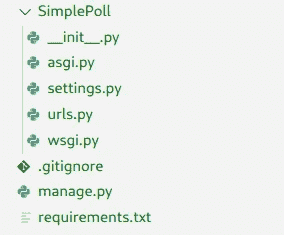
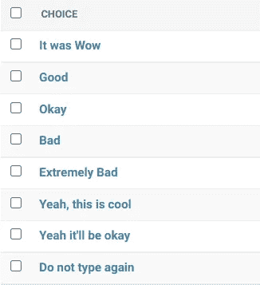
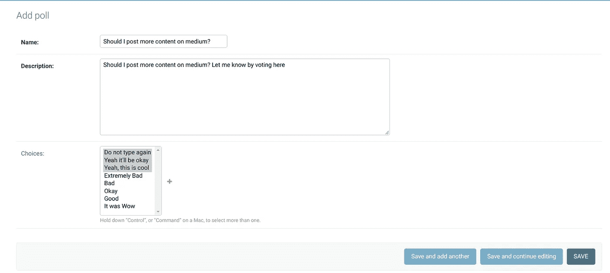
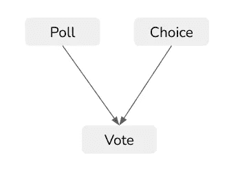
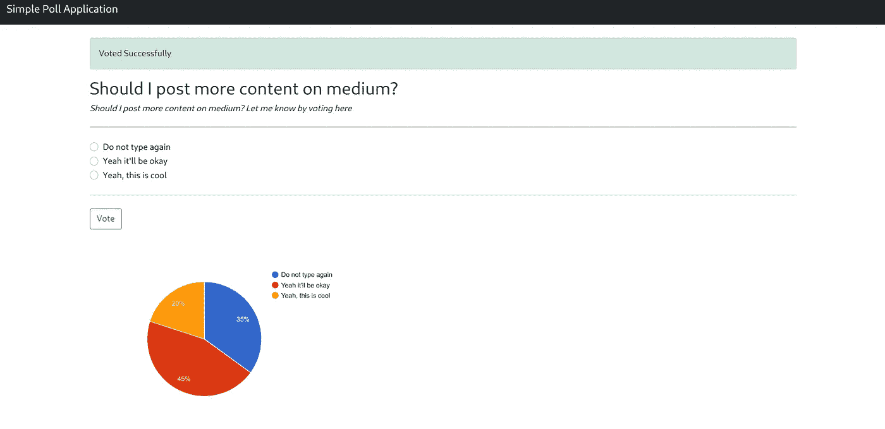

# 在 Django 构建一个简单的投票系统[第一部分]

> 原文：<https://medium.com/analytics-vidhya/building-a-simple-poll-system-in-django-part-i-a0bfb4fc3699?source=collection_archive---------0----------------------->

信用:[https://blog.sli.do/poll-types/](https://blog.sli.do/poll-types/)

是啊没错。同样的投票申请，一次又一次。也许你会把这个例子看作是 django 的一个自举。这是一个从 django 的模型、视图和 URL(任何 web 应用程序的基本覆盖)开始的完美例子。

别说了，我们走吧！

在整个项目中，我将使用 python 版本 3.9.9，其他 python 版本也基本相同。打开您想要创建项目的终端，让我们首先安装 django，运行下面的命令。

> pip3 安装 django==3.1.14

这将在您的系统中安装 django，一旦安装完毕，我们就可以创建一个名为 *SimplePoll* 的新项目了。在您的终端中运行以下命令

> django-admin 创建项目简单投票

这将在您的目录中创建一个名为 SimplePoll 的项目。在你最喜欢的文本编辑器中打开这个文件夹。您将看到下面的目录结构。

在这里你可能看不到 requirements.txt 和。gitignore 不过没关系，剩下的也行。或者你真的想把事情扯平，可以参考[这个 github repo](https://github.com/amritsaha607/SimplePoll) 从这里拉这些东西。好了，现在我们已经完成了基本设置，让我们烘焙数据库并启动我们的应用程序。运行以下命令

> python3 manage.py 迁移

Migrate 命令负责烘焙你的数据库，创建表格之类的东西。一旦您运行这个命令，您将看到一个新文件 db.sqlite3 出现在同一个目录中。是的，这是数据库文件。

让我们在项目中创建一个应用程序。这也很简单，进入您的项目目录(SimplePoll)，从这里运行下面的命令。

> python 3 manage . py startapp pol lapp

正如命令所说，它将在 SimplePoll 项目目录中创建一个应用程序。现在，继续将您的应用程序注册到您的项目中 *SimplePoll/settings.py* 。编辑如下。

现在，让我们把我们的投票系统分成几个部分，我们将一步一步地解决我们的问题。以及更多】。所以，为了让投票系统充分发挥作用，我们必须-

1.  创建投票
2.  在网站上查看包含所有选项的投票
3.  用于选择一个选项并投票的投票按钮
4.  用于查看投票计数的仪表板

让我们从步骤 1 开始——创建投票。好的，这里你需要什么(对象方面的)？对，一个**投票**，和**为那个投票选择**。两种不同类型的物体。

1.  **投票**
2.  **选择**

让我们继续创建它们。在这里，django 让事情变得更简单，您不必编写肮脏的数据库查询，或者使用相同的旧 SQL 东西在数据库中插入元素。你只需要打开你的 PollApp/models.py，稍微编辑一下，django 会处理剩下的事情。

PollApp/models.py

完成后，依次运行以下命令，让 django 反映 DB 中的变化。

> python3 manage.py 进行迁移
> 
> python3 manage.py 迁移

就这样，第一步完成了。让我们通过运行来测试您的应用程序。按如下方式运行值得等待的 runserver 命令

> python3 manage.py runserver

并转到您的本地主机:8000，它工作了吗？

耶！！！！

让我们进行第 2 步，这里您需要将实际数据添加到您的应用程序中，这样您就可以创建并使用它们做一些事情。好的，让我们让你来管理你的应用程序(就好像你还不是一样)..呜！).运行以下命令。

> python3 manage.py 创建超级用户

并提供它所要求的信息。创建完成后，进入浏览器并打开 *localhost:8000/admin。*提供相同的用户名和密码并登录网站。目前，你在那里看不到什么。只有认证标签下的一些组和用户。但是我们创建了两个模型，我们必须将它们添加到这里。转到你的 PollApp/admin.py，编辑如下。

PollApp/admin.py

现在，刷新浏览器中的 localhost:8000/admin 页面。他们出现了吗？民意调查和选择。好吧。

我会对我们现在要做的事情有一个大概的想法。我们将创建两个投票。一个是“我应该在媒体上发布更多内容吗？”，它会有选择“不要再输入”，“是的，没问题”和“是的，这很酷”。第二个问题是，“你认为我是如何描述这篇文章的？”，选项将会非常糟糕，糟糕，好吧，好吧，这是哇。因此，让我们先创建选项，因为您知道，除非您先创建选项，否则您将无法选择投票选项。好的，转到管理页面的选择选项卡。并逐个添加选择。直到它看起来像这样

选择

好的，现在让我们进入投票区并添加投票。

添加投票

这是一个添加投票的例子，当选择选项时，你必须按住 ctrl/command 键来多选。然后点击保存。并对其他投票进行同样的操作。

是时候添加我们的第一个视图了，这样我们就可以在某个地方开始查看我们的投票，这样用户就可以投票了。在我们开始编码之前，我先告诉你我们要做什么。我们将创建 2 个页面。主页->这是我们将显示所有投票列表的地方，当用户点击投票时，它会将用户带到他/她可以投票的页面。有道理？好的，让我们编辑我们的 PollApp/views.py 如下

PollApp/views.py

哦，现在，我们必须将它们添加到 URL 中，这样视图就可以映射到某个浏览器路径。我们将创建一个文件 pol lap/URLs . py，并将该文件包含在 SimplePoll/urls.py 中。将应用程序从我们的主项目中分离出来总是一个好的做法，这样事情就不会变得复杂。编辑您的 SimplePoll/urls.py 和 PollApp/urls.py，如下所示

[SimplePoll/urls.py](https://gist.github.com/amritsaha607/1e94253b4acc3105b76c148aaff3bec9?file=SimplePoll_urls.py)

PollApp/urls.py

你看到了吗？我们在 views.py 中引用的 html 文件？我们必须创造它们，对吗？好，让我们在 PollApp 中创建一个名为“templates”的目录。并创建以下文件结构。

是的，有一个额外的文件 base.html！我们将创建一个基本文件，并将该文件扩展到所有模板中。因此 base.html 将在 home.html 和 poll.html 推广。从下面复制内容

templates/base.html

templates/PollApp/home.html

templates/PollApp/poll.html

完成后，再次运行 runserver 命令，并在 localhost:8000 上运行浏览器。呼…，你看到你的投票了吗？好的，点击投票按钮，它会把你带到投票页面吗？哦耶！步骤 2 也完成了。

第 3 步是所有的投票功能。在这里，为了减轻您的痛苦，我将分享一个图表来更好地理解下面的过程。看，当你投票时，基本上你是在选择一个**选择**对象，对吗？首先你会想，好吧，那么让我们在 **Choice** 对象中添加一个整数字段，每当有人投票选择这个选项时，我们就递增它。这么容易吗？是的，但是在我们的例子中，我们把它变得更有活力了。在一次投票中，我们可以选择多个选项，但如果两次投票不能有相同的选项，则没有限制。因此，我们将创建一个投票对象，它将同时引用投票和选择对象。

继续编辑你的 models.py & admin.py，如下所示。

PollApp/models.py

PollApp/admin.py

还记得我们上次添加新型号时做了什么吗？对，迁移它，使它在数据库中得到反映。再次运行以下命令

> python3 manage.py 进行迁移
> 
> python3 manage.py 迁移

接下来，我们必须创建一个简单的功能，当用户单击投票页面中的投票按钮时，添加一个投票对象。到目前为止，我们一直使用普通的 GET 方法来访问任何 url，现在是时候探索我们的第一个 post 方法了。转到你的 poll.html 和 views.py，编辑如下。

templates/PollApp/poll.html

PollApp/views.py

好的，现在重启服务器，进入投票页面，试着投票一次。你能投票吗？哦，成功的消息来了吗？噪音。看，我们的基本功能和步骤 3 一起完成了。

我们到此为止了吗？不，现在我们需要一些可以查看投票结果的东西。基本就是个仪表盘！

因此，在第 4 步中，我们可以创建一个新页面来显示 dashboard，但我坚持使用现有页面。我们将在投票页面上显示结果。好吧，你知道是哪一页。像下面这样更新你的 poll.html 和 views.py，我们就完成了。[在 poll.html，将该代码段添加到 endblock 语句之前]

templates/PollApp/poll.html

PollApp/views.py

在这里，我们将检查投票的每一个选项，并计算那对<poll choice="">的投票数。我们将把它输入 google-chart，它会给我们一个丰富多彩的结果集面板。好吧，让我们看看。</poll>

再次重启服务器。请访问您的投票页面，尝试投票。哦，你有没有看到一旦你投了票，你的页面下面就会出现一个饼状图？应该是这样的。

好了，你刚刚成功地建立了一个投票系统。以及一个彩色仪表盘来查看结果。第二部分再见。

哦，嘿，如果你愿意，你可以在这里得到完整的代码库。[[https://github.com/amritsaha607/SimplePoll](https://github.com/amritsaha607/SimplePoll)

实际上，你可以通过投票给我——[https://simple-poll-application.herokuapp.com/](https://simple-poll-application.herokuapp.com/)【所有这些投票都是匿名的】