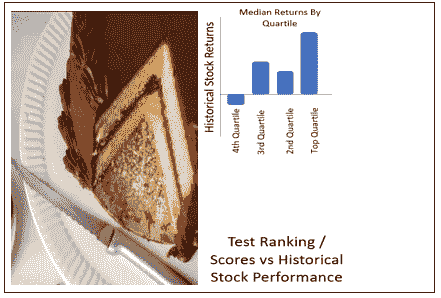

# 建立一个简单的股票排名和筛选工具

> 原文：<https://medium.com/analytics-vidhya/building-a-simple-stock-ranking-screening-tool-7bc10049e85?source=collection_archive---------2----------------------->

*配料:一杯要素投资原则；从雅虎财经网上新搜集的一些股票指数；一点你最喜欢的数据标准化和综合评分汇总方法，用大量的常识调味*


[来源:Dreamstime 股票照片](https://www.dreamstime.com/royalty-free-stock-photography-sifting-flour-image16773637)

*在本文中，我们考察了一个通用框架，该框架可用于选择、标准化和聚合决定* ***相对*** *股票表现的因素，以便构建一个股票排名/筛选工具，用于为您的股票投资组合构建提供信息。*

**警告！我不是任何类型的投资大师，所以我强烈建议你不要把这篇文章作为你投资决策的(唯一)依据。**

# 概述

*   [**简介**](#defa)
*   [**什么是要素投资？**](#aacc)
*   [**打造自己的 DIY 因子评分&排名工具**](#cfc6)
*   [**>选择‘原始’因素**](#2a8e)
*   [**>归一化数据**](#c545)
*   [**>将因素汇总成综合得分**](#a0a0)
*   [**>排名&对综合得分最高的股票进行排序**](#bd78)
*   [**>对照实际历史表现测试排名/得分**](#8075)
*   [**结论**](#5bdd)

本文引用的所有代码都以 Google Colab 工作簿的形式提供，您可以直接与之交互！

[](https://colab.research.google.com/drive/1xgpx0TP6nTb_C2b4kgKLpAWMh1wbWjXs?usp=sharing) [## 谷歌联合实验室

### 编辑描述

colab.research.google.com](https://colab.research.google.com/drive/1xgpx0TP6nTb_C2b4kgKLpAWMh1wbWjXs?usp=sharing) 

如果你不喜欢编码——你仍然可以在这里的免费网络应用上亲自试用:

[](https://www.stonksforecast.online/) [## z 的股票模拟器

### 图片来源:KnowYourMeme.com 嗨！我是 Z，这是一个简单的股票价格预测网络应用程序，我是为了好玩而开发的…

www.stonksforecast.online](https://www.stonksforecast.online/) 

# 介绍

在以前的一篇文章中，我介绍了如何使用蒙特卡罗模拟和现代投资组合理论来估计给定股票组合的“最优”投资组合权重，以实现最佳的风险回报。

[](/analytics-vidhya/how-to-estimate-optimal-stock-portfolio-weights-using-monte-carlo-simulations-modern-portfolio-d27d534e8a1a) [## 如何使用蒙特卡罗模拟和现代投资组合来估计最优股票投资组合权重

### 在本文中，我将介绍如何使用现代投资组合理论&蒙特卡洛模拟法来估计一个最优的风险回报…

medium.com](/analytics-vidhya/how-to-estimate-optimal-stock-portfolio-weights-using-monte-carlo-simulations-modern-portfolio-d27d534e8a1a) 

然而，那篇文章假定你已经知道在你的投资组合中应该包括哪些股票。在实践中，有成千上万的潜在股票可供选择，因此筛选出最佳股票的过程并不简单。

# 什么是要素投资？


一些选股策略包括利用你可能已经熟悉的行业的专业知识。另一种方法是依靠机构投资者或市场分析师的推荐。

要素投资包括"*瞄准可以解释股票回报差异的可量化公司特征*"，只选择最好的*股票

(*请注意，根据这些因素得出的“最佳”不一定会转化为实际的股票表现)

面临的挑战是准确地确定应用哪些因素，以及在更详细的层面上，如何准确地组合这些不同的因素来对股票进行排名/评分。

[](https://www.drwealth.com/factor-based-investing/) [## 基于因素的投资:完全指南

### 信不信由你，在过去的十年里，一种革命性的投资策略出现了。无论你是否相信价值…

www.drwealth.com](https://www.drwealth.com/factor-based-investing/) 

有一系列令人眼花缭乱的不同方法，其复杂程度各不相同，例如，魔术公式是一种相对著名的技术，只关注两个因素——股票价格和资本成本。

[](https://www.magicformulainvesting.com/) [## 神奇公式投资

### 在乔尔·格林布拉特的新书《常识》(Common Sense)中，纽约时报的畅销书作者击败了…

www.magicformulainvesting.com](https://www.magicformulainvesting.com/) 

另一个众所周知的例子是 **Fama 法国因素模型**，它有两种类型——一种是“原始风味” [3 因素](https://en.wikipedia.org/wiki/Fama%E2%80%93French_three-factor_model)风味，它着眼于市场风险、市值规模和市净率规模。改进的 5 因素风味增加了围绕盈利能力和投资的两个额外维度。

[](https://blog.quantinsti.com/fama-french-five-factor-asset-pricing-model/) [## Fama 法国五因素资产定价模型

### 风险和收益之间的关系一直是讨论和研究的话题。投资者和投资…

blog.quantinsti.com](https://blog.quantinsti.com/fama-french-five-factor-asset-pricing-model/) 

为了完善这些例子，一个更复杂的方法是 **Piotroski 的 F 值**看起来是 9(！)根据盈利能力、杠杆/流动性和运营效率分类的不同因素。

[](https://www.moneycrashers.com/piotroski-f-score-value-investing-model-stocks/) [## 约瑟夫 Piotroski 9 F 分数价值投资模型-挑选股票

### 玩和投资股市是一场赌博。但是，当你有一个投资组合时，你可以降低和管理投资风险

www.moneycrashers.com](https://www.moneycrashers.com/piotroski-f-score-value-investing-model-stocks/) 

不幸的是，告诉你哪种因素投资方法最有效已经超出了本文的范围。然而，我将介绍一个概念框架，它将允许您通过构建自己的一组因素进行实验，并通过利用雅虎财经上免费提供的股票价格和金融数据以及一些 Python 代码来部分自动化数据聚合/评分/排名过程。

# 构建您自己的 DIY 因素评分和排名工具


一般步骤如下:-

*   选择将使用的“原始”因子
*   通过将这些因素转换成无量纲的、类似比例的值，并定义 hi/lo 值是否首选的“极性”,对这些因素进行标准化和缩放
*   合计权重以确定单只股票的综合得分
*   对所有股票进行排名，选择得分最高的股票
*   根据实际历史表现(如股票回报)测试这些分数或排名

# 选择“原始”因素


雅虎财经提供免费的汇总统计数据，我们将从网上搜集。


[雅虎财经统计示例](https://finance.yahoo.com/quote/NFLX/key-statistics?p=NFLX)

在 Python 中，抓取每只股票的统计数据页面是一件简单的事情，因此我们可以在以后选择使用哪个统计数据/度量来生成综合得分。此外，我们还提取当前日期和一年前的调整收盘价来估计最新的年度股票收益。

下面只是一个片段——完整的代码可以在 [Google Colab 工作簿](https://colab.research.google.com/drive/1xgpx0TP6nTb_C2b4kgKLpAWMh1wbWjXs?usp=sharing)中找到。

```
symbols=['AMCR','APTV','BHGE','BKNG','CBRE','CPRI','CTVA'] # Can be amended to as many stocks as desired #Blank dict to 'store' the statistics for each stock
df_statistics = {}#Function to extract statistics for each stock
def get_key_stats(tgt_website):

# The web page is make up of several html table. By calling read_html function.
# all the tables are retrieved in dataframe format.
# Next is to append all the table and transpose it to give a nice one row data.
    df_list = pd.read_html(tgt_website)
    df_statistics = df_list[0]

    for df in df_list[1:]:
        df_statistics = df_statistics.append(df)

    # Transpose the result to make all data in single row
    return df_statistics.set_index(0).T#function to find the last recent weekday for a given date e.g. Fri if Sat or Sundef lastBusDay(enterdate):
    if enterdate.weekday()==6:
        lastBusDay = datetime(year=enterdate.year, month=enterdate.month, day=enterdate.day-2)
    elif enterdate.weekday()==5:
        lastBusDay = datetime(year=enterdate.year, month=enterdate.month, day=enterdate.day-1)
    else:
        lastBusDay = enterdate
    return lastBusDay#This part of the script extracts the statistics and the current + 1 year ago adj close price (to calculate stock returns) for the stocks defined in the variable 'symbols'current = datetime.now() - timedelta(1) #current date set a day before as data may not be avail for todaycurrentMinus1Yr=datetime(year=current.year-1, month=current.month, day=current.day)#some blank lists to store the prices and returns
prices_current=[]
prices_lastyear=[]
prices_return=[]for symbol in tqdm(symbols):
    try:
        df_statistics[symbol] = get_key_stats(r'[https://finance.yahoo.com/quote/'](https://finance.yahoo.com/quote/') + symbol + '/key-statistics?p=' + symbol)
        #time.sleep(random.randint(1,2))

        price_current=round(data.DataReader(symbol, start=lastBusDay(current), end=lastBusDay(current), data_source='yahoo')['Adj Close'][-1],4)
        price_lastyear=round(data.DataReader(symbol, start=lastBusDay(currentMinus1Yr), end=lastBusDay(currentMinus1Yr), data_source='yahoo')['Adj Close'][-1],4)
        price_return=round((price_current/price_lastyear-1)*100,1)
        time.sleep(random.randint(1,1))

    except:
        print("Unable To Extract Statistics For ",symbol)
        price_current=np.nan
        price_lastyear=np.nan
        price_return=np.nan
        print("Unable To Extract Prices For ",symbol)

    prices_current.append(price_current)
    prices_lastyear.append(price_lastyear)
    prices_return.append(price_return)

stockprice_df=pd.DataFrame(zip(prices_current,prices_lastyear,prices_return),\
                           columns=["Adj Close "+lastBusDay(current).strftime('%Y-%m-%d'),\
                                    "Adj Close "+lastBusDay(currentMinus1Yr).strftime('%Y-%m-%d'),"Stock Price Returns"],\
                            index=symbols)
```

*(注意:我把网页抓取部分做得非常简单(即没有代理 IP、旋转请求头等)，并且只在页面请求之间使用随机的“暂停”来避免被雅虎财经屏蔽。然而，如果你想加快抓取速度，请随意编辑代码)*

对于更有雄心的读者:目前代码仅使用来自统计页面的数据和 2 个价格值(当前+ 1 年前调整收盘价),但理论上可以从历史股价/成交量数据甚至财务报告中计算其他更复杂的统计数据，因为雅虎财经提供了 3 年的历史损益表、资产负债表和现金流量表。在代码中，应该是这样的:

```
df_balance_sheet[symbol]= scrape_table('[https://finance.yahoo.com/quote/'](https://finance.yahoo.com/quote/') + symbol + '/balance-sheet?p=' + symbol)df_income_statement[symbol]=scrape_table('[https://finance.yahoo.com/quote/'](https://finance.yahoo.com/quote/') + symbol + '/financials?p=' + symbol)df_cash_flow[symbol]=scrape_table('[https://finance.yahoo.com/quote/'](https://finance.yahoo.com/quote/') + symbol + '/cash-flow?p=' + symbol)OHLCV[symbol] = data.DataReader(symbol, start=start_date, end=end_date, data_source='yahoo') #OHLC = OpenHighLowCloseVolume
```

然而，在你离开并开始构建一些超级复杂的评分之前，重要的是首先要考虑:

**分析时间框架的一致性**

*   有些指标是最近一个季度的，有些是过去 12 个月的，有些是季度的(同比)。但是，根据未来的时间范围，您正在尝试预测-混合和匹配这些可能不合适，您可能需要*同期*数据(即反映同一一致时间段的统计数据)
*   类似地，一些指标是落后的，而另一些指标是领先的(例如，市盈率和股息率)。除了上面的“时间片一致性”问题，如果您选择使用前瞻性估计，您可能希望更好地了解这些预测是如何估计的，以及它们可能作为“噪音”引入评分系统的相关潜在误差。
*   此外，如果你计划预测未来**多年**的业绩，你可能需要更多的历史数据，而不仅仅是雅虎财经统计标签上的数据，来以“滚动历史窗口”的方式进行这种评分/排名分析。

**绝对指标与标准化指标**

*   根据你想要建立的投资组合类型，考虑到规模效应，绝对值有时可能比每股标准化价值更能代表业绩。例如，如果期望的最终投资组合是快速增长的小公司(无论如何你都会筛选掉大公司)，那么使用绝对利润可能比利润率更好。

# 标准化数据


为了在随后的步骤中聚合这些因子，这些因子的值应该具有相似的大小/范围，并且最好是相同的单位(或者更好的是无量纲的！).

有几个不同的选择来实现这一点

**最小-最大缩放比例**

包括将所有值转换为无量纲的 0-1 范围，方法是减去每个要素的最小值，然后除以最大最小值范围。


(注意—如果您想优先考虑低值分子，请使用 Xmax-X，而不是 X-Xmin)

*   优点:易于使用和理解
*   缺点:可能会被异常数据扭曲

**(百分位数)排名**

与最大最小缩放有点类似，只是我们不是按最大-最小范围缩放要素，而是将值转换为相对于该要素中所有其他值的等效百分位数等级。

*   优点:对异常值更稳健，对分布的基本形状没有任何假设
*   缺点:可能无法捕捉值之间的相对“分布”,需要大量的观察才有意义

**Z 值**

通过使用类别的平均值和标准偏差对类别中的每个值进行标准化来计算


结果值是无量纲的，总体上平均值为 0，标准偏差为 1。

(注意:要区分低值和高值的优先级，只需将公式转换为 Z^-1 即可)

*   优点:对极端异常值具有鲁棒性
*   缺点:假设底层数据是正态分布的

**通过克朗巴赫的阿尔法值**检查因子内部一致性

此外，在我们进入下一步之前，需要检查这些度量本身的一致性。

一种方法是估计各种特征之间的相关系数，其基本原理是，如果这些系数都很低(例如 0.3 或更低)，则这些因素的选择或标准化可能有问题，因为所有这些因素都应该测量相同的基础结构(即股票是否表现良好)。不幸的是，这可能有点复杂，尤其是如果你有多个因素正在测试。

值得庆幸的是，有一种叫做克朗巴赫阿尔法的方法可以评估一个综合分数的可靠性或内部一致性**。


来源:[https://data . library . Virginia . edu/using-and-interpreting-cronbachs-alpha/](https://data.library.virginia.edu/using-and-interpreting-cronbachs-alpha/)

[](https://www.statisticssolutions.com/cronbachs-alpha/) [## 克朗巴赫的阿尔法统计解决方案

### 统计解决方案可以帮助你的定量分析，帮助你发展你的方法和…

www.statisticssolutions.com](https://www.statisticssolutions.com/cronbachs-alpha/) 

至于解释:*理论上，克朗巴赫的阿尔法结果应该给你一个从 0 到 1 的数字，但你也可以得到负数。负数表示您的数据有问题，可能您忘记了对某些项目进行反向评分。一般的经验法则是，克朗巴赫的阿尔法值在 0.70 及以上是好的，0.80 及以上更好，0.90 及以上最好。*

(值得注意的是，一个“好”的克朗巴赫阿尔法分数并不能自动反映评估股票表现的因素的预测准确性。这是**内部一致性** ( *旨在衡量同一总体结构的几个因素是否具有相似的分数*)与**结构效度** ( *即分数实际代表其预期变量的程度)之间的区别。*)

# 将各种因素汇总成一个综合分数


**相加加权平均**


来源:[维基百科](https://en.wikipedia.org/wiki/Weighted_sum_model)

其中:

*   *wj* 表示标准重要性的相对权重
*   *Cj* 和 *aij* 是备选方案 *Ai* 按准则 *Cj* 评估时的性能值

虽然公式可能看起来很复杂，但这只是我们大多数人熟悉的“算术平均值”,它只是将所有项目相加，然后除以项目的数量，唯一的例外是项目是加权的。

*   **优点:**非常简单，适用于所有标准化/缩放方法
*   **缺点:**合成的综合分数将具有补偿性质，其中许多特征中的“差”分数可以被一个特征中的非常好的分数掩盖。(例如，假设权重相等，则(0.3，0.2，0.9，0.2) = 0.400 的“加法”平均值高于(0.4，0.3，0.4，0.3)=0.350)

**乘法加权平均**

有时也称为几何平均数，这稍微复杂一些，因为它是作为所有项目的乘积来估计的。这种方法是 [*最常用于一组数值需要相乘或者本质上是指数的数字，例如一组增长数字，如人口变化或者金融投资的利率随时间的变化* e](https://en.wikipedia.org/wiki/Geometric_mean) 。


来源:[Dummies.com](https://www.dummies.com/education/math/business-statistics/how-to-find-the-weighted-geometric-mean-of-a-data-set/)

[](https://www.dummies.com/education/math/business-statistics/how-to-find-the-weighted-geometric-mean-of-a-data-set/) [## 如何找到数据集的加权几何平均数-哑元

### 当数据集包含大量重复值时，您可以通过使用…

www.dummies.com](https://www.dummies.com/education/math/business-statistics/how-to-find-the-weighted-geometric-mean-of-a-data-set/) 

*   **优点:**没有补偿行为(即倾向于将项目的“全才”得分排在仅在单一特征中得分高的项目之前，例如(0.3，0.2，0.9，0.2)=0.322 比(0.4，0.3，0.4，0.3) = 0.346)(不相信我？[在这里自己尝试一下](http://www.alcula.com/calculators/statistics/geometric-mean/)！)

**缺点:**

*   一篇[学术研究论文](https://econpapers.repec.org/article/inmorited/v_3a14_3ay_3a2014_3ai_3a3_3ap_3a109-119.htm)建议在使用加权几何平均值时不需要归一化
*   不幸的是，如果特性值很大，这可能导致[溢出错误](https://www.educba.com/python-overflowerror/\)(由于计算中值的取幂可能导致很大的值)，并且如果特性值为零或负值，这也将不起作用(因为负值的取幂可能导致具有实部和虚部的复数！)
*   因此，在我开发的代码中，我将乘法加权平均值限制为仅使用最小最大范围归一化，以避免负值和零值，我在所有要素的所有值中添加了一个小的固定值(0.00001)。

# 对综合得分最高的股票进行排名和排序

从这一点上来说，它只是将得分的股票放入排名“烤箱”中，以列出排名靠前的股票


因此，将前面的 3 个步骤组合成一系列顺序函数看起来有点像这样:

首先有一个提取和清理所有雅虎统计信息的功能:-

```
#This code translates the string info with Trillion,Billions into equivalent Millions figure and also converts them into float variablesdef extract_statistic(metric,symbol):
    try:
        String=df_statistics.get(symbol).loc[1][metric]
    except:
        String=''
    Metric=''
    try:
        if 'T' in String:
            Metric=float(df_statistics.get(symbol).loc[1][metric].replace("T",""))*1e6
        elif 'B' in String:
            Metric=float(df_statistics.get(symbol).loc[1][metric].replace("B",""))*1e3
        elif 'M' in String:
            Metric=float(df_statistics.get(symbol).loc[1][metric].replace("M",""))
        elif '%' in String:
            Metric=float(df_statistics.get(symbol).loc[1][metric].replace("%",""))
        else :
            Metric=float(df_statistics.get(symbol).loc[1][metric])
    except:
        if String==np.nan:
            Metric=np.nan
    #print(symbol,":",metric,":",Metric)
    return metric,Metric
```

然后由下面的函数调用，该函数执行实际的重载提升…

```
#This function takes the list of stocks, list of metrics that will be used as factors, their respective weights and 'hi vs low' priority to generate a table of scored and ranked stocksdef rankstocks(symbols,listOfMetrics,select_order_by_metric,weights_by_metric,NormMethod,stockprice_df):

    raw_df=pd.DataFrame()
    for symbol in symbols:
        title=[]
        value=[]
        for item in listOfMetrics:
            itemtitle,itemvalue=extract_statistic(item,symbol)
            title.append(itemtitle)
            value.append(itemvalue)
        raw_df=raw_df.append(pd.DataFrame(value).T)
    raw_df.index=symbols
    raw_df.columns=listOfMetrics
    raw_df.replace('', np.nan, inplace=True)

    summary_df=pd.DataFrame()
    for symbol in symbols:
        title=[]
        value=[]
        for item in listOfMetrics:
            itemtitle,itemvalue=extract_statistic(item,symbol)
            title.append(itemtitle)
            value.append(itemvalue)
        summary_df=summary_df.append(pd.DataFrame(value).T)
    summary_df.index=symbols
    summary_df.columns=listOfMetrics
    summary_df.replace('', np.nan, inplace=True)
    summary_df.dropna(inplace=True)
    summary_df.replace(0.00,0.0001,inplace=True)
    summary_df=summary_df.convert_dtypes()

    if len(summary_df)<=1:

        return raw_df,pd.DataFrame(),0.0,0.0 # calculation aborted due to insufficient stocks to compare

    elif len(summary_df)>1:    
        for i in range(0,len(summary_df.columns)):
            if abs_or_rel_by_metric[i]=='abs':

        ranking_df=summary_dfif NormMethod=="Z-Score Normalization + Additive Composite":
            for i in range(0,len(summary_df.columns)):
                if select_order_by_metric[i]=='lowest':
                    ranking_df[summary_df.columns[i]]=1/ranking_df[summary_df.columns[i]]
                    ranking_df[summary_df.columns[i]]=ranking_df[[summary_df.columns[i]]].apply(zscore)
                elif select_order_by_metric[i]=='highest':
                    ranking_df[summary_df.columns[i]]=summary_df[[summary_df.columns[i]]].apply(zscore)
            ranking_df['Composite Score']=ranking_df.dot(weights_by_metric)elif NormMethod=="MinMax Normalization + Additive Composite":
            for i in range(0,len(summary_df.columns)):
                xmin=ranking_df[summary_df.columns[i]].min()
                xmax=ranking_df[summary_df.columns[i]].max()
                maxminrange=xmax-xmin
                if select_order_by_metric[i]=='lowest':
                    ranking_df[summary_df.columns[i]]=(xmax-ranking_df[summary_df.columns[i]])/maxminrange
                elif select_order_by_metric[i]=='highest':
                    ranking_df[summary_df.columns[i]]=(ranking_df[summary_df.columns[i]]-xmin)/maxminrange
            ranking_df['Composite Score']=ranking_df.dot(weights_by_metric)elif NormMethod=="Percentile Normalization + Additive Composite":
            for i in range(0,len(summary_df.columns)):
                sz = ranking_df[summary_df.columns[i]].size-1
                if select_order_by_metric[i]=='lowest':
                    ranking_df[summary_df.columns[i]] = 100-ranking_df[summary_df.columns[i]].rank(method='max').apply(lambda x: 100.0*(x-1)/sz)
                elif select_order_by_metric[i]=='highest':
                    ranking_df[summary_df.columns[i]] = ranking_df[summary_df.columns[i]].rank(method='max').apply(lambda x: 100.0*(x-1)/sz)
            ranking_df['Composite Score']=ranking_df.dot(weights_by_metric)

        elif NormMethod=="MinMax Normalization + Multiplicative Composite":
            #must normalize using min-max as Z scores will create zero and negative figures
            for i in range(0,len(summary_df.columns)):
                xmin=ranking_df[summary_df.columns[i]].min()
                xmax=ranking_df[summary_df.columns[i]].max()
                maxminrange=xmax-xmin
                if select_order_by_metric[i]=='lowest':
                    ranking_df[summary_df.columns[i]]=(xmax-ranking_df[summary_df.columns[i]])/maxminrange
                elif select_order_by_metric[i]=='highest':
                    ranking_df[summary_df.columns[i]]=(ranking_df[summary_df.columns[i]]-xmin)/maxminrangeranking_df=ranking_df.add(0.000001) # adding small value to all fields to avoid zero valuesWGMa=0
            WGMarray=[]
            for stock in ranking_df.index:
                for i in range(0,len(listOfMetrics)):
                    WGMa=WGMa+ranking_df.loc[stock][i]**weights_by_metric[i] 
                    #WGMa=WGMa+trun_n_d(ranking_df.loc[stock][i],5)**trun_n_d(weights_by_metric[i],5)
                    # Note : trun_n_d is a truncation function to 5 decimal points to avoid overflow error during expotentiation
                WGMb=WGMa**(1/sum(weights_by_metric))
                WGMarray.append(WGMb)ranking_df['Composite Score']=WGMarray        

        ranking_df['Rank By Composite Score']=ranking_df['Composite Score'].rank(ascending=False)
        ranking_df=ranking_df.sort_values(by=['Rank By Composite Score'])cronbachalpha=CronbachAlpha(ranking_df[ranking_df.columns[0:len(listOfMetrics)]])value=[]
        for symbol in ranking_df.index:
            itemtitle,itemvalue=extract_statistic('Market Cap (intraday) 5',symbol)
            value.append(itemvalue)ranking_df['Market Cap (intraday) 5']=valueranking_df=pd.merge(ranking_df,stockprice_df,left_index=True,right_index=True,how='left')    

        x=ranking_df['Composite Score'].values
        y=ranking_df['Stock Price Returns'].values
        correlcoeff=np.corrcoef(x,y)[0][1]

        value=[]
        for symbol in raw_df.index:
            itemtitle,itemvalue=extract_statistic('Market Cap (intraday) 5',symbol)
            value.append(itemvalue)raw_df['Market Cap (intraday) 5']=value
        raw_df.replace('', np.nan, inplace=True)return raw_df,ranking_df,cronbachalpha,correlcoeff
```

因此，当所有这些放在一起时，它看起来像这样


# 根据实际历史表现测试排名/评分系统



所以我们得到了一些分数，并用它们来对股票进行排序和排名。现在的问题是，这些分数是否与实际股价表现有任何关系。(这是前面讨论的“结构效度”问题)

我采取的最初方法很简单，我只是使用 pandas qcut 函数将所有排名的股票分成四分位数(即 4 组)，该函数允许您设置自定义仓位，并估计每个四分位数的当前年度股票回报中值。

```
ranking_df_w_quartiles=ranking_dfranking_df_w_quartiles['Quartiles By Composite Score'] = pd.qcut(ranking_df['Composite Score'], q=4, labels=['Bottom Quartile','3rd Quartile','2nd Quartile','Top Quartile'],precision=0)
        ranking_df_w_quartiles=ranking_df_w_quartiles[['Quartiles By Composite Score','Stock Price Returns']].groupby(['Quartiles By Composite Score']).median()ranking_df_w_quartiles.plot.bar()display(ranking_df_w_quartiles)
```

我的基本原理是——如果评分系统是有效的——我们会预计排名前四分之一的股票总体上*会比其他四分之一的股票表现更好。*

**

*排名系统似乎确实有些效果，因为最高四分之一的中值回报看起来与其他不同(假设忽略第三四分之一股票的怪异结果)*

*虽然这不是非常精确，但它确实提供了一种非常快速的方法来评估排名系统的有效性。*

*显然，即兴发挥的空间很大——假设你有多个时间段的足够大的原始数据集——你可以使用机器学习技术来选择最佳的因素组合和相应的权重，以做出最佳的绩效预测*

# *结论*

*概括地说，我们已经看到了一个构建股票排名和筛选工具的框架，以及一些关于如何选择、标准化/缩放和聚合因素，然后对结果进行感官检查的机制的细节。*

*正如上面多次提到的，这种方法有很大的探索和扩展空间。*

*我不是专家，预期可能与现实不符，但在尝试要素投资时，我的建议是:*

*   *从简单开始，即从 2-3 个不同的因素开始，这些因素的权重相等，这样更容易理解结果。*
*   *优化因子、标准化和聚集方法**迭代**和**根据真实历史数据进行回溯测试(**例如，模拟一个平均加权的顶部和底部四分位数投资组合，看看它们如何比较)*
*   *将筛选目标与您的预期投资策略(如时间范围、风险偏好、目标回报等)相结合，即您希望选择哪些股票特征？*

*无论如何，我希望这篇文章是一篇有趣的文章，并为任何想尝试要素投资的人提供一个有用的起点。*

**

*来源:[无聊熊猫——搞笑蛋糕失败](https://www.boredpanda.com/funny-cake-fails-expectations-reality)*

*如果你喜欢这篇文章，请在下面给我留下一个掌声，看看我在这个“业余投资者”系列中以前的文章:*

*   *[如何用几何布朗运动和 Bootstrap 抽样构建蒙特卡罗法股票价格模拟器](/analytics-vidhya/building-a-monte-carlo-method-stock-price-simulator-with-geometric-brownian-motion-and-bootstrap-e346ff464894)*
*   *[如何使用蒙特卡罗模拟来估计最优股票投资组合权重&现代投资组合理论](/analytics-vidhya/how-to-estimate-optimal-stock-portfolio-weights-using-monte-carlo-simulations-modern-portfolio-d27d534e8a1a)*

*接下来你想让我谈什么话题？欢迎在下面的评论中分享你自己的“烘焙灾难”或任何其他反馈…*

*下次见！*

*.*

*.*

*.*

*.*

*.*

*.*

*.*

*.*

*.*

*.*

*.*

*.*

*.*

*.*

**

*你还在这里？！结束了！回家吧！(来源:[《费里斯·布勒的休息日》(1986)](https://www.shmoop.com/study-guides/movie/ferris-buellers-day-off/analysis/whats-up-with-the-ending)——普及了[片尾字幕场景](https://www.vulture.com/2014/04/brief-history-of-movie-post-credits-sequences.html)的电影之一)*

# *具有标准化因子得分的多元线性回归*

*此外，我没有将它包含在 web 应用程序中(因为它在概念上仍然有点欠成熟)，但在 Jupyter 笔记本中，我还进一步编写了一些代码，使用归一化因子作为年度股票价格回报的预测因子来运行简单的多元线性回归。*

*如果你碰巧找到一个“好的”因素和权重配置，给你一个一致的行为，即最高季度的年股票收益中值>第二季度>第三季度>最低季度，这种方法效果最好*

```
*#Adapted from [https://financetrain.com/multivariate-linear-regression-in-python-with-scikit-learn-library/](https://financetrain.com/multivariate-linear-regression-in-python-with-scikit-learn-library/)from sklearn.linear_model import LinearRegression
from sklearn.model_selection import train_test_splitjet= plt.get_cmap('jet')
colors = iter(jet(np.linspace(0,1,10)))#function to plot in a grid the correlation between each factor and the Stock Returns
def correlation(ranking_df,listOfMetrics, n_rows, n_cols):
    fig = plt.figure(figsize=(8,6))
    #fig = plt.figure(figsize=(14,9))
    for i, var in enumerate(listOfMetrics):
        ax = fig.add_subplot(n_rows,n_cols,i+1)
        asset = ranking_df.loc[:,var]
        ax.scatter(ranking_df['Stock Price Returns'], asset, color = next(colors))
        ax.set_xlabel('Stock Price Returns')
        ax.set_ylabel("{}".format(var))
        ax.set_title(var +" vs Stock Price Returns")
    fig.tight_layout() 
    plt.show()

correlation(ranking_df,listOfMetrics, 2, 2)display("Correlation Coefficients")
display(ranking_df.corr()['Stock Price Returns'].loc[listOfMetrics])train, test = train_test_split(ranking_df, test_size=0.2)LinReg = LinearRegression()

X_train = train[listOfMetrics]

Y_train = train["Stock Price Returns"]

LinReg.fit(X_train,Y_train)X_test = test[listOfMetrics].valuesY_test = test["Stock Price Returns"].valuesclose_predictions = LinReg.predict(X_test)LinearRegressionCoeff_df=pd.DataFrame({"Feature":X_train.columns.tolist(),"Coefficients":LinReg.coef_})display("Multiple Linear Regression Coefficients & Intercept")
display(LinearRegressionCoeff_df.round(2).style.hide_index())
display("Intercept = "+str(round(LinReg.intercept_,2)))mae = sum(abs(close_predictions - test["Stock Price Returns"].values)) / test.shape[0]display('Mean Absolute Error In Stock Returns % = '+str(round(mae,1)))df = pd.DataFrame({'Symbol':test.index,'Actual': Y_test, 'Predicted': close_predictions})error = df['Actual'] - df['Predicted']

# Plot the error term between the actual and predicted values for the last 25 days

error.plot(kind='bar',figsize=(8,6))
plt.grid(which='major', linestyle='-', linewidth='0.5', color='green')
plt.grid(which='minor', linestyle=':', linewidth='0.5', color='black')
plt.xticks(range(0,len(test.index)), test.index,rotation=45)
plt.show()*
```

*不幸的是，结果似乎不太令人鼓舞*

**

*所有因素和股票回报之间的相关性都相对较低，并且不太可能有明确的线性关系。此外，大约 16%的 MAE 相对较差，对任何类型的预测都不是很有用。*

*问题在于，第一种方法只是测试不同分组四分位数之间的中位数是否存在差异，而回归分析需要更多的原始数据，其中仅来自 70-100 只股票的信息可能不会产生任何有意义的结果，根据前面关于因子选择的讨论，需要仔细考虑预测变量(即各种因子)和目标变量的时间框架。*