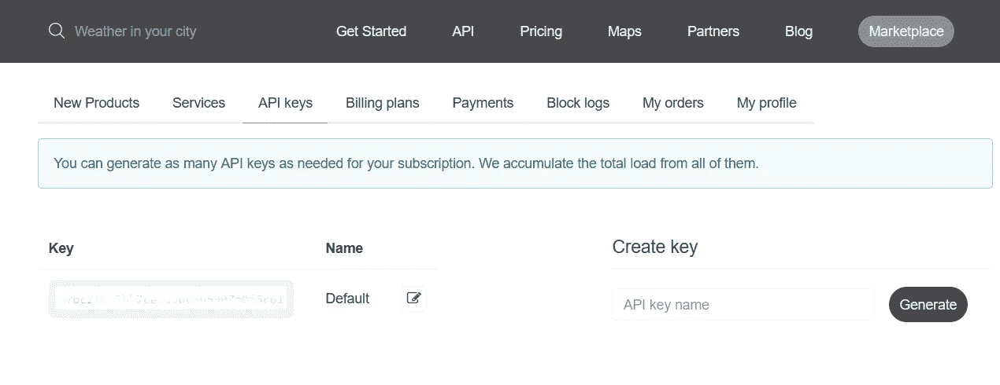
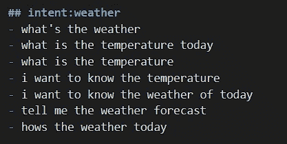
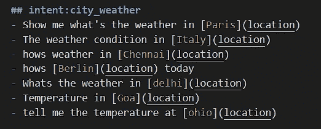
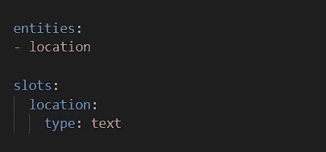
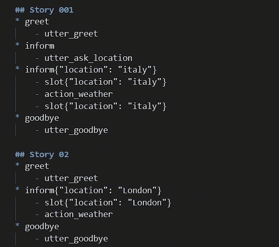
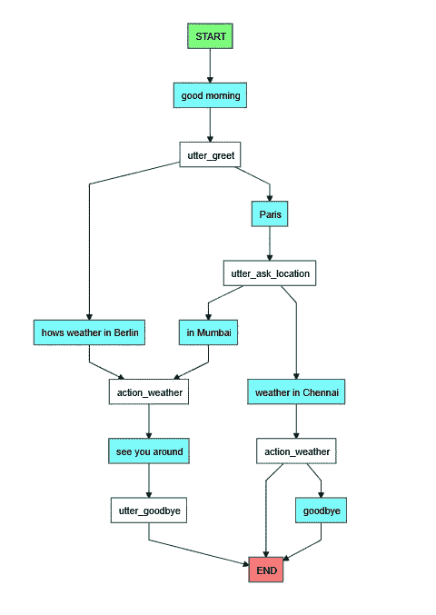

# 使用 Rasa 构建一个简单的天气聊天机器人

> 原文：<https://medium.com/analytics-vidhya/building-a-simple-weather-chatbot-using-rasa-54eaf97daa82?source=collection_archive---------1----------------------->

## 在本文中，您将学习如何使用 Rasa 框架并制作类似人类的对话聊天机器人。


> **所以..Rasa &最重要的是什么为什么是 Rasa？？**
> 
> Rasa 是一个易于定制的开源框架，这使得创建聊天机器人对于初学者来说是一项非常简单的任务。使用 Rasa 时，会提供完整的 bot 构建工具。与对话流不同，需要对任何一种编程语言有一点了解。当它以前被称为 Rasa 堆栈时(当他们开始时)，有单独的库用于 **Rasa NLU** ，框架的自然语言理解组件，和 **Rasa 核心**，它是对话引擎。现在，这两个组件在 Rasa 保护伞下共存，尽管如果您愿意，您仍然可以单独使用 Rasa NLU。

> 许多大公司和企业，如 Adobe、宝马、空客、ENGIE、HCA Healthcare 和 Orange 都使用 Rasa NLU。

现在，关于 Rasa 的*了解*已经够多了。让我们开始构建我们的天气聊天机器人。

> 我强烈建议您一步一步地仔细阅读每个部分，并阅读 Rasa 文档以更好地理解概念。

为了收集天气数据，我们必须使用 API，因为天气不是一个静态的实体，它会不断变化。所以我们可以使用任何开源的天气 API 提供者。这里，为了简单起见，我选择了 [OpenWeatherMap](https://openweathermap.org/) 。你只需登录网站，然后在 API 密匙部分提供一个 API 密匙来访问他们的数据。



**天气 API 键**

既然我们已经设置了 API，我们可以开始 Rasa 设置了。

Rasa 有太多的依赖项，因此我们可以为 Rasa 创建一个单独的虚拟环境，而不是搞乱我们的*基础环境。要创建虚拟环境，请打开命令提示符，或者如果您使用 anaconda 提示符，效果会更好。*

```
*For command prompt:* $ python3 -m venv /path/to/new/virtual/environment*For* anaconda *prompt:* $ conda create -n RasaEnv python=3.7.6
```

创建这个虚拟环境后，我们必须从基础环境切换到虚拟环境。这里，我使用 anaconda，因为它很简单。

```
$ source ./venv/bin/activate
**OR** $ conda activate RasaEnv
```

现在使用 conda 安装 ujson、tensorflow 包。到目前为止，conda 还没有 rasa 库，所以我们必须使用 pip 来安装 Rasa。我们不必担心这些库，它们只是让安装变得简单一点。

```
$ pip install rasa**After installation completes, check the version using**
$ rasa --version
```

为使用 Rasa 创建一个单独的文件夹，以便于管理。下一步是创建一个 Rasa 项目结构的模型，然后根据我们的需要从内部进行编辑。

```
$ rasa init --no-prompt
```

`rasa init`命令创建 Rasa 项目需要的所有文件，并在一些样本数据上训练一个简单的机器人。如果您忽略了`--no-prompt`标志，您将被询问一些关于您希望如何设置项目的问题。这将创建以下文件:

```
.
├── actions.py
├── config.yml
├── credentials.yml
├── data
│   ├── nlu.md
│   └── stories.md
├── domain.yml
├── endpoints.yml
└── models
    └── <timestamp>.tar.gz
```

我们主要将只使用 3 个主要文件，即 ***nlu.md、stories.md*** 和 ***domain.yml*** 。我们不需要打扰其他文件。忘了它们吧，让它们挂在那里。使用任何代码编辑器来轻松处理这些文件，我个人的偏好是 Visual Studio 代码(VS 代码)。

我们主要只使用 3 个主要文件，即 ***nlu.md、stories.md*** 和 ***domain.yml*** 。我们不需要打扰其他文件。忘了它们吧，让它们挂在那里。使用任何代码编辑器来轻松处理这些文件，我更喜欢 Visual Studio 代码(而不是代码)。



**向聊天机器人询问天气情况的对话示例**

为了从这些语句中提取城市的名称，我们必须使用另一个称为实体的特性。我们可以通过突出城市来做同样的事情。确保添加不同类型的条目，以便 NLU 能够正确地获取用户。



**【城市名称】是实体，而(位置)是给这个实体的名称**

这部分现在打开**后的*域. yml* 后的**文件。我们将看到列出的意图，在下面添加您的新意图，您添加的顺序无关紧要。添加一个名为实体和插槽的两个新组件，然后将*位置的*列为实体。



如果你有不同的实体要收集，一定要提到。

继续查看 responses 部分下的 ***domain.yml*** 文件，我们会发现`utter_greet` 在此文件下，如果用户问候意图被激活，我们应该编写我们的聊天机器人应该向用户问候的条目。同样我们也应该充满其他的意图。为了让对话更人性化，我们应该添加不同的回应，这样每次我们的机器人就不会重复同样的事情。如果你不能理解，请访问我的 GitHub 文件库。我在本文末尾提供了链接。

> *这里的* **表示** *是我们聊天机器人的输出，而* **动作** *表示当用户激活某个意图时，我们聊天机器人所做的动作。现在提及*动作*部分的所有话语和动作。*

最后，在 ***stories.md*** 文件中创建至少 5 个故事，如下所示，这将确保聊天机器人对用户进行的任何类型的对话做出有意义的回复。



用户可以提出尽可能多的请求，也就是说，用户可以一个接一个地询问不同地方的天气状况和温度，你插入的故事数量将保持这种情况。

现在是 ***动作的编码部分。py*** 这是一个 python 文件。提供了一个示例代码片段，它将是注释的一部分，仅取消注释代码和必要的库。将有两个组件，即“*调度器*”和“*跟踪器*”。跟踪器用于从对话语句中选择或提取位置(城市)实体名称。dispatcher 变量用于将来自这个 *action.py* 文件的响应返回给 **Rasa 核心**。请参考我的 Git 存储库中的文件。用这个 actions.py 文件连接天气 API。我们必须创建另一个提取数据的 python 文件。这是单独编写的，因为我们不应该不惜任何代价弄乱 actions.py 文件。

## 现在，我们已经为项目结构做好了准备。我们必须根据我们的作战需要训练 NLU 皇家陆军和核心部队。

为了训练 Rasa 核心和 NLU，使用了一个简单的命令。

```
$ rasa train
```

训练完成后，我们就可以开始和我们的聊天机器人交谈了。在我们开始使用聊天机器人之前，我们必须启动服务器，以便 *actions.py [server]* 开始工作，即 API 将获取数据并将其返回给我们的程序。

```
*Initiate the server for using API*
$ rasa run actions
```

> **注**
> 
> 动作服务器的启动应该在单独的终端中完成，Rasa 聊天机器人的激活应该在另一个终端中单独完成。

有两种方法可以做到这一点。我们可以选择经典的命令提示符风格或新的 GUI 方法。使用 GUI 方法的优点是我们可以修改故事和它们的路径，而不用再次跳到代码编辑器中。利用这一点，我们可以不断改进我们的助手聊天机器人。

```
*Start conversation in command prompt*
$ rasa shell*Start conversation in Rasa GUI*
$ rasa x
```

> 什么是 Rasa X？
> 
> Rasa X 是一个工具集，帮助您利用对话来改善您的助手。一旦你建立了一个最小可行的助手，一个可以处理最重要的快乐路径故事的助手，Rasa X 会帮助你进入下一个阶段。有关更多信息，请访问 [rasa x](https://rasa.com/docs/rasa-x/#improve-your-contextual-assistant-with-rasa-x) 文档。

最后，我们成功地完成了对机器人的训练，使它能够理解自然语言并做出相应的回答。

## Rasa 中可以尝试的一些附加功能

下面的可视化可以看到你的聊天机器人，也可以使用下面的命令来查看聊天机器人的工作结构。



**可视化经过训练的聊天机器人的对话流程**

```
$ rasa visualize
```

*感谢阅读！*😊如果你喜欢，请支持我并分享这个故事！！！ ❤

## 如果你需要源代码，这里是我的 [GitHub 库](https://github.com/GowriSankar-JG/WeatherBot-using-Rasa)。

*如果我错了，你可以随时纠正我，分享你的想法、反馈、评论和澄清。它帮助我鼓励和即兴发挥自己。*

> *更多我的资讯文章，关注我* [*中*](/@SiddharthIvan) *。干杯❤和快乐学习！！*

如果你对数据科学/机器学习有热情，欢迎在 [LinkedIn](http://linkedin.com/in/gowrisankar-jg/) 上加我。

# 参考资料:

[1] [官方文档](https://rasa.com/docs/)
【2】[如何为一个 web 搭建牛逼的 Rasa 聊天机器人](/front-end-weekly/how-to-build-awesome-rasa-chatbot-for-a-web-ce4a9acafd3b)
【3】[Rasa Python 天气聊天机器人](/coinmonks/rasa-python-weather-chatbot-51fc218d346d)
【4】获得证书: [Coursera 项目](https://www.coursera.org/projects/chatbot-rasa-python)