# 使用 Neo4j 构建 TCP 和 UDP 跟踪数据管道并可视化发送方和接收方

> 原文：<https://medium.com/analytics-vidhya/building-a-tcp-and-udp-traces-data-pipeline-and-visualizing-the-senders-and-receivers-using-neo4j-fb0fdcd7aaaa?source=collection_archive---------13----------------------->

他的项目是使用 Python 构建一个数据管道，将网络追踪从数据集移动到 Neo4J 数据存储。TCP 和 UDP 上的每个跟踪及其子跟踪(ARP 和 ICMP)都需要建模并存储在 Neo4J 中。目的是将每个发送者和接收者可视化为节点，以及作为关系使用的协议类型。

# **使用的库和包:**

**PYPCAPFILE:** Python 库，用于处理、读取和解析来自 pcap 文件的包。

SCAPY: 一个 Python 程序，可以让用户发送、读取、解析和伪造网络数据包。“scapy”将与“pypcapfile”一起使用，以获得更大的灵活性和更好的结果。

**PY2NEO:** 一个客户端库，用于在 Python 应用程序和命令行中使用 Neo4Jj。我将使用这个库的 API 与我的 Neo4j 数据库(本地托管)进行交互，而不必手动编写 Cypher SQL。相反，我将只对所有 Cypher SQL 操作使用 Python 代码。

# 实施:

我将跟踪四个协议并将其存储在我的 Neo4j 本地数据库中:

**传输控制协议:**允许一台计算机通过发送/接收数据包与另一台计算机对话。数据包地址可以是 IPv4 (32 位 IP 地址)或 IPv6 (128 位 IP 地址)类型。

**用户数据报协议:**是一种替代的通信传输协议，主要用于在互联网上的应用程序之间建立低延迟和容错连接。

**互联网控制消息协议:**是一种错误报告协议网络，用于在网络出现问题时向源 IP 地址生成错误消息。

**地址报告协议:**是互联网协议使用的协议，用于将 IP 网络地址映射到数据链路协议使用的硬件地址。

对于这个项目，我使用了 Jupyter Notebook，因为它允许更有组织的工作流，并使运行代码块和在每个步骤后可视化它们变得容易。我包括朱庇特笔记本”。ipynb“标准旁边的代码文件”。为了方便起见。

首先，我们使用“pip”安装所有的包:

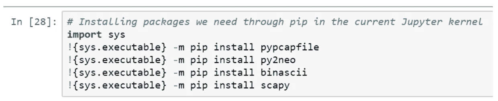

然后，我们导入不同的包:

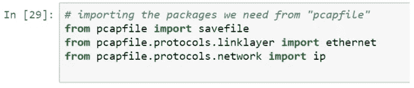

“保存文件”模块允许读取和解析 pcap 文件。“以太网”和“ip”模块是“保存文件”使用的补充模块。

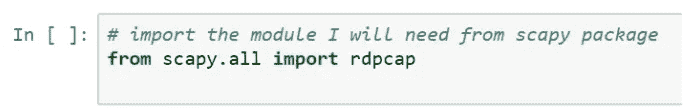

“rdpcap”代表“读取 pcap 文件”，它类似于 pcap file 包中的“savefile”模块。然而，每个命令的读取格式和结果是不同的，我们将在后面看到原因。

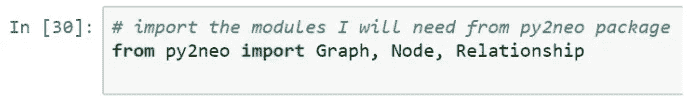

我们从“py2neo”包中导入“图形”、“节点”和“关系”模块，这将允许我们连接到 Neo4j 数据库，并创建节点以及它们之间的关系。接下来，我们读取二进制格式的 pcapfile。我们可以看到，有 1000 个数据包被读取并加载到“capfile”变量中。

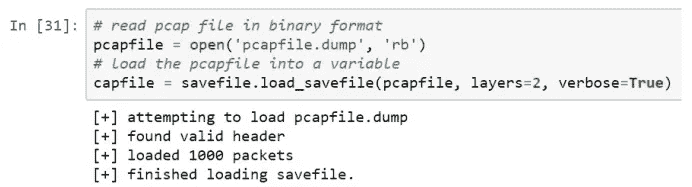

现在，让我们使用探索性数据分析(EDA)来分析我们刚刚加载的数据。我们总共有 601 个 TCP 数据包、369 个 UDP 数据包和 30 个 ICMP 数据包。

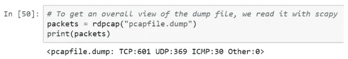

另一个命令是显示数据摘要，显示我们正在处理的数据集的稍微详细的描述:

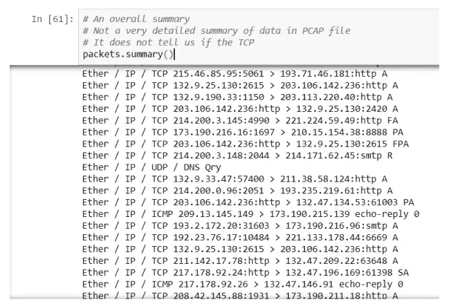

但是，它没有向我们显示 TCP 数据包下的地址类型是 IPv4 还是 IPv6。为此，我们需要更深入地了解数据包:

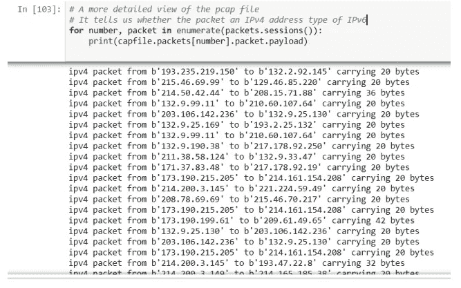

我们将需要使用上述方法来识别数据包地址类型。然后，除此之外，我们将使用下面的方法来显示所使用的协议类型:

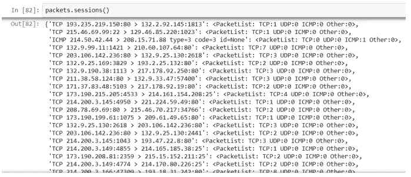

最后，在开始转换数据的代码之前，我们通过指定我创建的密码连接到我们的 Neo4j 数据库:

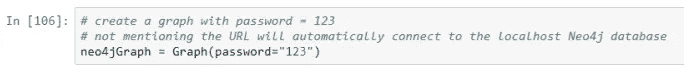

大部分代码如下:

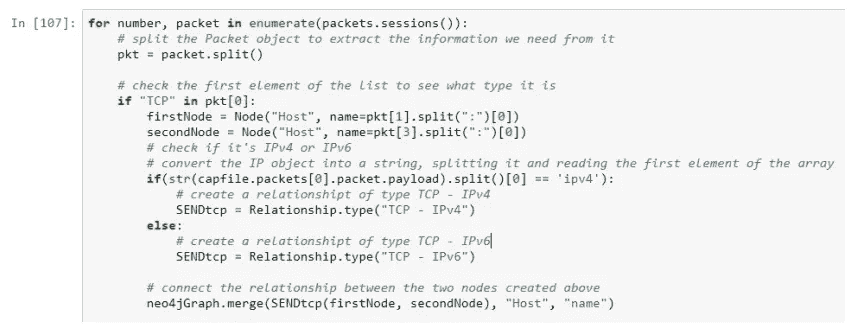

我们使用枚举遍历 packets.sessions 字典来跟踪每个键和对值。然后，我们将数据包拆分(成一个字符串列表)。如前面的屏幕截图所示，数据包的类型总是出现在字符串的第一位。因此，我们需要在字符串的第一个索引中检查协议的类型。

接下来，我们创建两个“Host”类型的节点，一个用于发送方，一个用于接收方。如果两个 IP 相似，使用相同的协议，Neo4j 不会存储。此外，节点的名称就是 IP 地址。对于 TCP 数据包，下一步是检查它是 IPv4 还是 IPv6 数据包。

为此，我们需要在数据包中更深入一层，如上面的两个截图所示。

# **结果在 Neo4j**

在运行 Jupyter 笔记本之后，我们得到了以下结果:这个截屏显示了产生的 UDP 节点和关系，限制为 25 个节点以避免延迟和滞后。使用的 Cypher SQL 语句是:

***匹配 p =()—【r:UDP】=>()返回 p 限制 25***

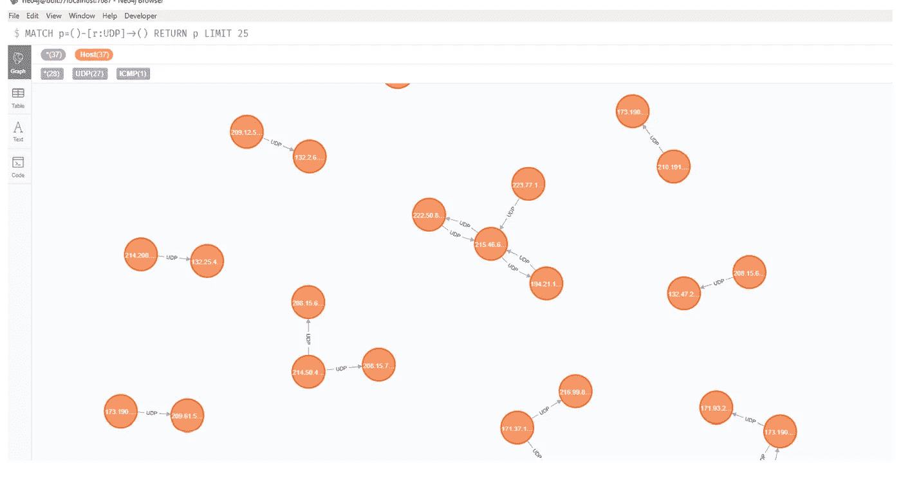

接下来，让我们看看 ICMP 节点和关系:

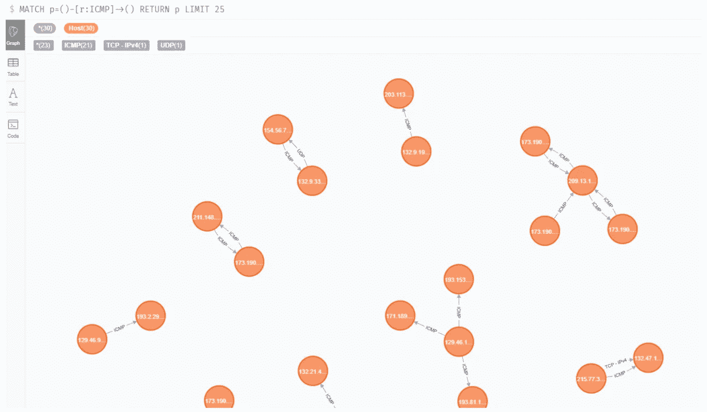

现在，TCP — IPv4 节点(我们的 PCAP 文件中没有任何 IPv6 数据包):

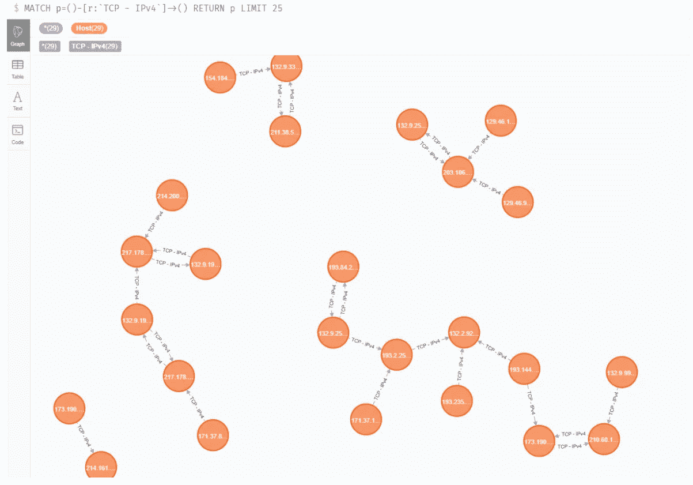

最后，让我们使用下面的 Cypher SQL 查询来查看包含所有节点、关系和无显示限制的整个数据库:

***匹配(n:主机)返回 n***

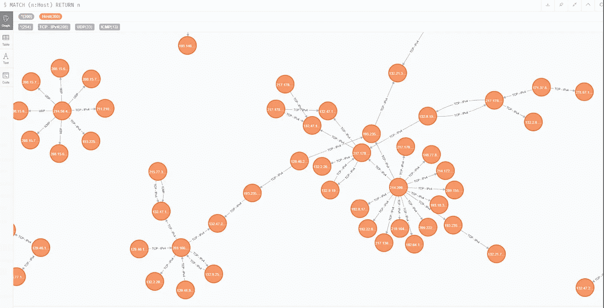

# **更多信息:**

这个项目的源代码可以在:[mouadlasri/data pipeline-TCP-UDP-neo4j](https://github.com/mouadlasri/datapipeline-TCP-UDP-neo4j)获得

项目运行的视频演示可在:[https://youtu.be/3c4H-Dagm3s](https://youtu.be/3c4H-Dagm3s)获得