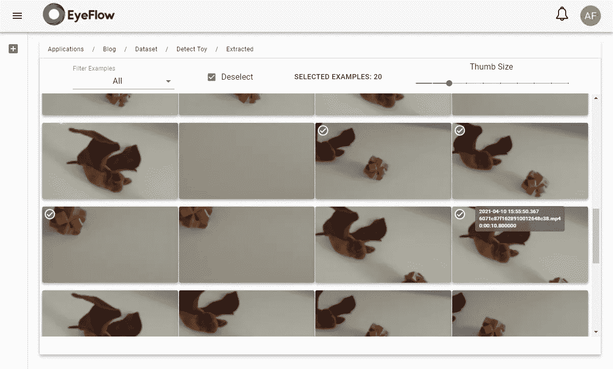

# 在 15 分钟内构建视频分析应用

> 原文：<https://medium.com/analytics-vidhya/building-a-video-analytics-application-in-15-minutes-89e3c4ac625e?source=collection_archive---------18----------------------->

或者说一个人工智能如何用很少的例子来学习

照片由 Docusign / Unsplash 提供

我经常看到很多人谈论人工智能项目是一项极其艰巨的任务，因为它需要成千上万个带注释的例子来训练好神经网络。

这对于某些范围来说可能是真实的，在这些范围中，检测的对象存在很大的可变性，例如，在 ImageNet 数据集中，在极其不同的环境中有 1000 个类。但是，在质量检查项目中，通常在 Eyeflow 这里。AI，需要的是用固定定位的摄像头检测很少的类，而在这个场景中，一个神经网络可以很快得到很好的结果，只有很少的标注例子。

我将在这里展示我们如何使用 Eyeflow.AI 建立一个神经网络，在 15 分钟的工作时间内检测视频中的一个简单对象。

首先，我用手机拍摄了一个 15 英寸的小电影，是关于我儿子的玩具的。

在眼流中。AI 我们创建了一个新的应用程序(我称之为“博客”)，然后是一个新的流(15 分钟)，以及一个用 2 个类“Bat”和“Puzzle”注释示例(Detect Toy)的数据集。

简单流程

之后，从视频中提取帧，并将随机选择的示例添加到数据集中。我只增加了 20 个例子。

从视频帧添加新示例

这些例子需要用方框标注，区分区域和类别。

注释示例

然后，我们将数据集用于训练。(仅 5 个纪元)

培训仪表板

培训结束后，我们可以放视频来测试流量，看看结果。

视频流测试过程

我们可以在带注释的视频中看到一个令人印象深刻的结果，只有 20 个带注释的例子。

结果:视频带注释

当然，我知道这是一个简单的演示。但是在我们的经验中，我们已经有了非常好的结果，生产类，有 300 ~ 500 个例子，很少我们需要超过 2000 个例子才能在真实世界的检测中获得 99.9%的准确率。

提醒我们正在讨论使用固定角度摄像机检测相似零件。当我们有一个在角度、格式、颜色等方面有许多变化的对象时，情况就不同了。

在我们的项目中，我们不断检查生产环境中的检测结果，以获得模型没有正确获得的所有示例，并仅将这些错误示例添加到数据集中，以纠正注释并训练新模型。通过这种方法，我们大大减少了数据集在生产应用中获得非常好的准确性所需的示例数量。从而减少获得高质量视频分析应用所需的工作量。

声明:整个过程我花了大约 1 个小时等待培训，流程测试，截图，写这个帖子。但是注释不到 5 分钟。；-)

来看看我们的视频分析项目工具如何帮助您提高工作效率。

 [## 眼流。人工智能

### 用于开发视频分析应用的完整平台。

eyeflow.ai](https://eyeflow.ai)