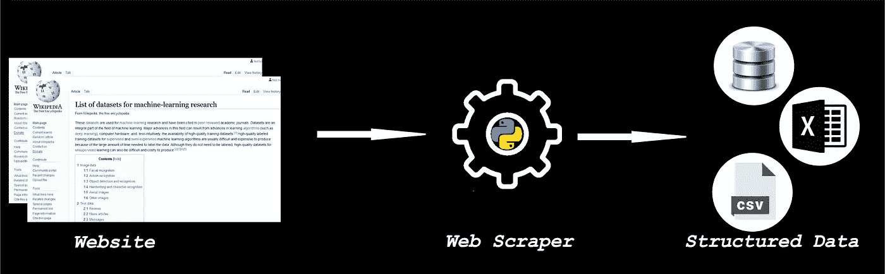

# 从头到尾构建一个 web 刮刀

> 原文：<https://medium.com/analytics-vidhya/building-a-web-scraper-from-start-to-finish-4ad567043af0?source=collection_archive---------31----------------------->

使用美丽的汤和硒。

在 [Unsplash](https://unsplash.com?utm_source=medium&utm_medium=referral) 上 [engin akyurt](https://unsplash.com/@enginakyurt?utm_source=medium&utm_medium=referral) 拍摄的照片

**什么是网络刮刀？**

web scraper 是一种从网站上抓取或提取数据的程序。从网站上简单的复制粘贴数据也被称为网络抓取。网络抓取用于在线价格比较，并通过从竞争对手的网站中提取数据来了解他们的表现，还可以用于许多其他方面。

**我们需要具备哪些先决条件来打造一个 web scraper？**

看看下面的简单工作流程:

web 抓取的基本思想是我们获取现有的 HTML 数据，使用 web scraper 来识别数据并将其转换为有用的格式。最后一步是以 JSON 或其他有用的格式存储数据。在这个例子中，我们将数据存储在一个列表中。我们将重点介绍如何使用 Python，以及它的库美汤进行抓取。这里需要注意的是，为了成功地抓取数据，我们必须具备 HTML 结构的基础知识。

**安装库**

在开始这个例子之前，让我们使用 pip 安装一些库。

> pip 安装 bs4
> 
> pip 安装硒

在这个例子中，我们将使用美丽的汤和硒来收集数据。

**Beautiful Soup** 是一个 Python 库，用于 web 抓取目的，从 HTML 和 XML 文件中提取数据。

**Selenium** 是一个用于测试自动化的开源工具。

# 所以让我们从这个例子开始吧！！！！

在本例中，我们将构建一个刮刀，从 [ICC](https://www.icc-cricket.com/) 官方网站收集数据。谁不看板球，嗯？我们将根据球员在 ODI(一日国际赛)中的表现收集他们的详细信息。

每个 web 抓取项目都需要有一个 [URL](https://www.icc-cricket.com/rankings/mens/player-rankings/odi/batting) 来抓取。点击网址打开网站并复制网址。

**导入已安装的库**

导入库后，我们将创建一个 webdriver 实例来加载 URL。

让我们分解代码。

首先，我创建了一个 URL 变量来存储 URL。然后创建了 webdriver 的一个实例，并传递了 webdriver 的下载路径。

> driver = webdriver。PhantomJS(executable _ path = r ' c:\ PhantomJS-2 . 1 . 1-windows \ PhantomJS-2 . 1 . 1-windows \ bin \ PhantomJS . exe ')

这里我用过 PhantomJS，它是一个无头浏览器，你可以从[这里](https://phantomjs.org/download.html)下载。您也可以使用自己选择的浏览器。对于 chrome，你可以使用 chrome webdriver。

*get()* 方法帮助导航到页面，或者我们可以说它打开网页，而 *page_source* 驱动程序方法获取该页面的源代码。

现在我们已经得到了网页的来源，我们可以开始刮网站。在这里，我提取了一级玩家的详细信息。

所以我创建了一个 Beautiful Soup 的实例，并传递了页面的源代码和一个解析器。这里我使用了 lxml 解析器，它是专门为解析 HTML 而设计的。您可以使用 pip 安装 lxml，

> pip 安装 lxml

现在我们将使用美汤提供的选择器来提取具体的数据。

> *table = soup.find('table '，class _ = ' table rankings-table ')*

方法搜索指定的标签。这段代码基本上是告诉 scraper 选择属性为“class”=“table rankings-table”的<表>标签。这为我们提供了包含所有玩家详细信息的表格。

*你可以通过查看网页，找出哪个标签负责某个数据。要检查，右键单击网页并从列表中选择检查工具。*

主要策略是找到负责存储我们想要的数据的标签。因此，在获得包含所有玩家的表格后，找到负责存储他们的姓名、国籍、等级和个人资料链接的标签。的。 *text* 告诉 Python，如果我们找到< div >标签，带有类“‘rankings-block _ _ banner—name-large”，我们将只选择这个标签的文本内容。由于变量名是不言自明的，这个代码片段给了我们玩家的名字，同样我们提取了玩家的其他细节。

> name = player.find('div '，class _ = ' rankings-block _ _ banner—name-large ')。文本

现在提取所有球员的数据后，我们将把它保存在一个列表中。所以我创建了一个类播放器和一个空列表。所有提取的球员数据都将存储在这个列表中。这里我只提取了一级玩家的详细信息，同样你也可以使用 for 循环提取其他玩家的数据。你可以从[这里](https://github.com/varunbelgaonkar/web-scraping/blob/main/icc_odi_ranking.py)访问整个代码。

当前版本的代码只抓取第一页，提取姓名、国籍、级别和个人资料链接等详细信息，并将它们存储在一个列表中。因为抓取在任何时候都很容易失败，所以这段代码可能会也可能不会正常工作，因为这取决于网页的结构。

记得恭恭敬敬的刮！

**感谢阅读！！！**