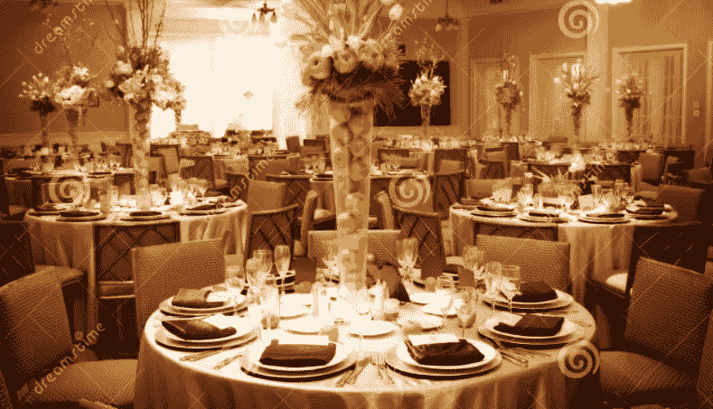
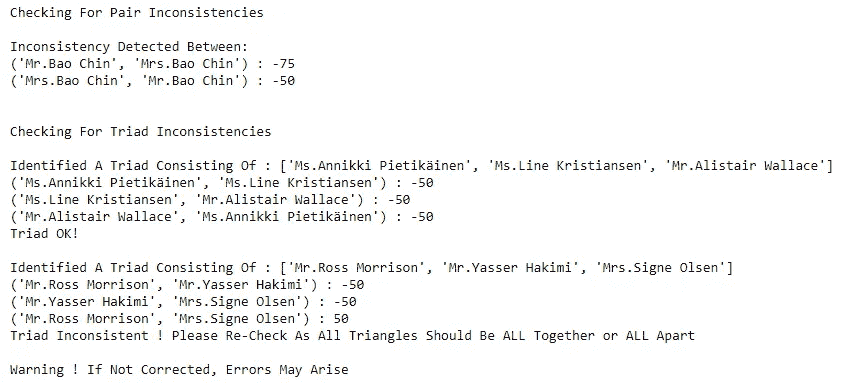

# 使用概率方法和模拟退火建立婚礼座位计划

> 原文：<https://medium.com/analytics-vidhya/building-a-wedding-seating-plan-using-probabilistic-methods-simulated-annealing-8f31d8987026?source=collection_archive---------1----------------------->

> 这篇文章介绍了婚礼座位安排问题，这是一个组合难题，考虑到客人可能不想坐在餐桌上或不想和其他客人坐在一起，如何最好地给他们分配座位。
> 
> *使用强力搜索和模拟退火以及其他典型优化方法(如遗传算法、MILP、WalkSAT 等)的概述，对两种深入的示例方法进行了检验*

婚礼往往是有压力的事件，通常是因为需要在日期、地点、餐饮等方面做出许多决定，导致配偶之间需要大量的调整。



图片来源:【Dreamstime.com】股票图片

一个特别棘手的挑战是如何正确安排座位，因为经常会有一些客人需要坐在一起(例如，可能因为他们是直系或近亲家庭成员)，但也有一些客人可能需要分开(可能因为一些远房阿姨对另一个远房叔叔怀恨在心，因为他十年前在另一个堂兄弟的婚礼上对她的头发做了一些轻率的评论)


一个有用但不太数学化的指南(来源:[Brides.com](https://www.brides.com/story/wedding-reception-seating-chart-etiquette)

大多数时候，你可以通过反复试验来“手动”调整桌子座位，但是如果你有足够多的客人和/或桌子，那么考虑到你可以选择的可能配置的绝对数量，有效地这样做可能会变得相当复杂。

令人欣慰的是，这种情况可以作为一个组合优化问题，并已研究了许多不同的方法来“解决”它。(我在‘解决’周围使用引号，因为从技术上讲，这个问题是 NP 难的,所以实际上它是关于找到‘足够好’的解决方案)

在本文中，我们将介绍两种不同的方法。第一种方法是使用电子表格工具的(天真的)暴力方法。尽管这仅适用于小规模的问题(也就是说，它的伸缩性很差)，但是为问题建立直觉是很有用的。第二种方法是通过一些 Python 代码，使用一种稍微复杂一点的技术，称为模拟退火。最后，如果您想进一步探索这个主题，我们将总结其他可能的解决方法。

完整代码(如 Python Jupyter 笔记本和 XLSM 文件等)可从 Github 链接获得:

[](https://github.com/ZhijingEu/Wedding-Seating-Problem-Simulated-Annealing) [## 织金谷/婚礼座位问题模拟退火

### 婚礼座位问题是一个组合难题，经常出现在…

github.com](https://github.com/ZhijingEu/Wedding-Seating-Problem-Simulated-Annealing) 

# 大纲:

*   [**1。将场景框架化为一个“可计算”的问题**](#c20b)
*   [2**。方法 1:用 Excel 进行朴素的蛮力搜索**](#8f48)[**2.1 定义“代价”函数**](#5e49)[**2.2 开发一种搜索算法**](#2716)[**2.3 缺点用蛮力方法**](#9822)
*   [**3。方法二:用 Python 模拟退火**](#c2f1)[**3.1 定义“代价”函数**](#19a0)[**3.2 开发一个(更好的)搜索算法:模拟退火**](#15a0)[**3.3 缺点用模拟退火方法**](#a336)
*   [**4。其他可能的解决方法**](#8d05)[**4.1 CNF+沃克萨特**](#9a65)[**4.2 禁忌搜索**](#1ef0)[**4.3 混合整数线性规划**](#8d82)
*   [**5。结论**](#8049)

对于那些懒得通读下面全部细节的人来说，这篇文章也可以通过视频浏览:

# **1。将该场景框定为一个“可计算”的问题**

在最高层次上，任何解决这个问题的方法都包括两个步骤

1.首先，需要定义什么标准使一种座位配置优于另一种。换句话说，它是关于开发一个评分方案或成本函数来评估任何给定的座位配置。


来源:[图标存档股票图片](https://iconarchive.com/show/flatastic-7-icons-by-custom-icon-design/Test-paper-icon.html)

2.下一步是高效地*搜索所有可能的配置，以找到产生最佳得分(即优化“成本函数”)的配置(可能有多个答案)*

**

*来源图片:改编自[DreamsTime.com](https://www.dreamstime.com/photos-images/person-pile-papers.html)股票图片*

*这种搜索方法的选择决定了运行该算法需要多长时间，例如，该算法是否会彻底检查所有可能的组合(提示——这通常不是一个好主意，因为它将不能很好地扩展，正如我们将在后面看到的…)或者它是否会使用一些其他类型的捷径(例如，启发式方法)来探索所有可能组合中的一部分，但仍然会提出一个足够好的解决方案(如果是这样， 假设可能有不止一个桌子座位安排满足约束条件，那么算法如何知道它找到的解决方案是否是最佳的呢？ )*

*3.还有一个*隐含的第三步*，这是一个 ***【开箱即用】*** 步骤，我们尝试**通过只对问题的一个“子集”建模来降低计算复杂性。***

**

*来源图片: [IStockPhoto](https://www.istockphoto.com/photos/think-outside-the-box)*

*例如，如果你已经知道其中一个表格**必须**由新娘/新郎和他们的直系亲属填写——将他们从等式中移除有助于(稍微)缩减潜在的搜索空间和需要考虑的约束条件等。*

*为了让你知道到底有多少，如果我们举一个例子，一个 96 人的宾客名单(*根据新加坡* [*当前的 COVID safe 指南*](https://www.gov.sg/article/how-to-keep-safe-during-weddings-and-solemnisations) *对于婚礼派对*)保持在 100 人的上限内，12 张桌子每张 8 人——这导致 1.12146933999503206 e+86(！！！)不同的可能组合。(即使我们忽略个别客人的座位，也是如此)*

**

*仅删除 8 人组(即 88 人组和 11 张 8 人组的桌子)使其数字略小，为 1.0148966011615896e+76(即比以前减少 1e10 倍)*

**

*一个相关的想法是，在 ***你如何“开始”搜索过程*** 要巧妙。以下所有技术都是从某个初始起始点开始执行搜索。通常，如果你不知道任何更好的，这将是一个完全随机的安排。然而，有时解决问题的一个简化版本(例如，可能在宽松的约束下运行问题，并看看它吐出什么)并以此为起点可能实际上使算法“更接近”真正的全局最优点。( [**暖启动**](https://or.stackexchange.com/questions/1278/how-does-a-warm-start-work-in-lp-mip) )*

# *2.方法 1:用 Excel 进行简单的强力搜索*

**

*图片来源:[BruteForceStrength.com](https://bruteforcestrength.com/tag/squat-training/)*

*这个相对简单的(*) Excel 电子表格允许用户输入客人名单、桌子大小和最多 3 对必须坐在一起或分开坐的人的名单。*

**

*(如果你想知道——客人的名字是使用[https://www.fakenamegenerator.com](https://www.fakenamegenerator.com/)生成的)*

**(*)我说这很简单，但它涉及到一些 Excel 宏(不要评价我，VBA 有时会使用它)来生成随机数和其他事情，如添加占位符座位，以确保所有的桌子都坐满了(即，一个 92 人的客人名单，选择的桌子大小为 8 人，将需要 12 张桌子，即，将有 4 个空座位)**

***2.1 定义“成本”功能***

**

*电子表格工具识别出 2 个违规(参考黄色和蓝色表示应该在一起但没有在一起的人)*

*通过数据透视表和查找公式的组合，电子表格通过将每张桌子上的每个客人与他们的其他共桌客人相对于所需的在一起/分开条件进行比较来评估任何给定的配置。然后，电子表格计算出“违规”的次数(例如，应该呆在一起的一对被分配到不同的桌子，或者相反，应该分开的人被分配到不同的桌子)。理想的目标是零违规。*

***2.2 开发搜索算法***

**

*电子表格工具在 32 人桌和 8 人桌的各种解决方案选项中循环，寻找解决方案*

*电子表格生成然后使用宏随机生成表分配，并通过多次迭代循环，直到它达到预定义的最大迭代次数，或者它偶然发现满足所有约束的座位安排。*

*这本质上是一种蛮力方法，因为不涉及真正的技术，纯粹依赖于循环通过足够多的组合，并希望足够“幸运”找到一个赢家(可能不止一个！).如您所料，当条件数量增加时，这种方法的伸缩性很差。*

**

*啊哦。模拟结果为 96 人，每桌 8 人*

*然而，我们知道，当数量增加时，该工具可能无法找到解决方案，有一种手动调整模式，允许用户单步执行单个迭代，然后对座位分配进行更改。*

*在 Github 链接中，我还包含了相同“逻辑”的 Python 笔记本实现，只是为了比较 Excel 和 Python 之间的计算速度差异。好消息是因为 Python 使用了大量的 numpy 计算——它比 Excel VBA 快了大约 20 倍。*

*这段代码也可以作为任何想将它应用到本文后面讨论的任何其他技术的人的起始代码；)*

***2.3 强力方法的缺点***

*   *当你扩大规模时，这种方法就失败了。如果你只有几对牌和足够多的牌桌，那么“分开”的条件很容易偶然满足，但是随着牌桌数量的增加,“在一起”就变得非常困难，因为我们真的是依靠偶然发现一个解决方案*
*   *与强力方法关系不大，但问题的框架是约束公式使得难以识别不一致的约束，例如，当 A & B 必须在一起时，B & C 必须分开，但 A & C 必须仍然在一起(这是不可能的，因为如果 A & C 坐在一起，那么 B & C 最终也会坐在同一张桌子上)*
*   *关于问题表述的同一点——在一起/分开的座位限制可能过于严格，因为它们只是“开/关”,无法处理我们可能不介意放松限制以找到“足够好”的解决方案的情况，例如，我们可能希望绝对让一些人在一起(例如配偶),但对其他人群不那么大惊小怪(例如，高中朋友应该坐在同一张桌子上，但如果做不到这一点——分开的桌子也可以)*

# *3.方法 2:用 Python 模拟退火*

**

*图片来源:【SciencePhoto.com 股票图片*

*以下内容主要基于邱临安的这篇文章。我添加了一些我自己的代码*

*1.提供生成“虚拟”测试数据的选项，或者允许用户从早期的 Excel 工具中导入客人列表/条件*

*2.检查座位约束的逻辑一致性*

*3.以更加用户友好的方式查看结果。*

 *[## 婚礼座位优化

### 或者我回新加坡参加一个朋友的婚礼时会做什么(祝贺 Crystalbel 和 Kenneth！)并找到…

linanqiu.github.io](http://linanqiu.github.io/2018/03/05/Wedding-Seat-Optimization/)* 

*如果你真的对它的工作原理感兴趣，请阅读上面的整篇文章，因为我不会在这里重复所有的细节。*

***3.1 定义“成本”功能***

*这种改进的公式化问题的方法的关键区别在于，现在可以更好地细化“约束的强度”。不是只列出需要聚在一起(负数)或分开(正数)的游客对，而是给每个约束分配数值，其中-ve 表示聚在一起，+ve 表示分开，分数越大，影响越大。*

*使用与前面相同的 92 人桌、每桌 8 人桌场景的示例，将数据导入 Jupyter 笔记本。*

```
*import pandas as pd
import numpy as npInputFileName="Example_Guests96pax_TableSize8pax.xls"table_size = pd.read_excel(InputFileName, 'TableSize').columns[1]GuestListRaw = pd.read_excel(InputFileName, 'GuestList')guest_list=GuestListRaw["Guest"].values.tolist()RelMatrixRaw=GuestListRaw.dropna(thresh=2)RelMatrixRaw
relationships_edges={}
Together1=RelMatrixRaw[["Guest","Together1"]].dropna(thresh=2)
Together2=RelMatrixRaw[["Guest","Together2"]].dropna(thresh=2)
Together3=RelMatrixRaw[["Guest","Together3"]].dropna(thresh=2)
Together1.columns=["Guest","Together"]
Together2.columns=["Guest","Together"]
Together3.columns=["Guest","Together"]
Together=pd.concat([Together1,Together2,Together3])
Apart1=RelMatrixRaw[["Guest","Apart1"]].dropna(thresh=2)
Apart2=RelMatrixRaw[["Guest","Apart2"]].dropna(thresh=2)
Apart3=RelMatrixRaw[["Guest","Apart3"]].dropna(thresh=2)
Apart1.columns=["Guest","Apart"]
Apart2.columns=["Guest","Apart"]
Apart3.columns=["Guest","Apart"]
Apart=pd.concat([Apart1,Apart2,Apart3])
for element in list(zip(Together["Guest"], Together["Together"])):
        relationships_edges.update({element:-50})
for element in list(zip(Apart["Guest"], Apart["Apart"])):
        relationships_edges.update({element:50})*
```

*接下来，关系(这是一个包含元组对的字典)被一个叫做 Networkx 的漂亮的库转换，然后总结成一个矩阵，如下所示:*

```
*import networkx as nx#Generate Relationship Matrixtemp_graph = nx.Graph()
for k, v in relationships_edges.items():
    temp_graph.add_edge(k[0], k[1], weight=v)
relationships_mat_unnormed = nx.to_numpy_matrix(temp_graph.to_undirected(), nodelist=guest_list)
relationships_mat = relationships_mat_unnormed / 100# View Relationship Matrix
RelationshipMatrix=pd.DataFrame(relationships_mat)
RelationshipMatrix.index=guest_list
RelationshipMatrix.columns=guest_list
RelationshipMatrix = RelationshipMatrix[(RelationshipMatrix.T != 0).any()]
RelationshipMatrix = RelationshipMatrix.loc[:, (RelationshipMatrix != 0).any(axis=0)]
RelationshipMatrix*
```

**

*由于矩阵是对称的，这使得一下子看到所有的关系更加容易。*

*这种重新表述的真正好处是，给定一些有用的矩阵属性，而不仅仅是违反次数的 X 的分数——可以获取所产生的座位安排矩阵*关系矩阵的[轨迹](https://en.wikipedia.org/wiki/Trace_(linear_algebra))(有点——阅读 Linan Qiu 的[完整文章进行数学计算)并返回反映座位安排有多“好”的**单值**(数字越低越好)](http://linanqiu.github.io/2018/03/05/Wedding-Seat-Optimization)*

**

*座位安排的“成本函数”评估，算法将使用该评估来判断“良好度”并将其最小化(越低=越好)*

*此外，矩阵视图中的关系允许用户更好地识别不一致*

*用一些“非法”值修改早期导入的输入，其中(A，B)加在一起是-50，但(B，A)加在一起是-75(如鲍进先生和夫人的情况),以及不可能的循环逻辑，其中(A，B)加在一起是-50，加在一起(B，C)是-50，但分开(B，C)是+50(如 Morrison 先生、Yasser 先生和 Olsen 夫人的情况),使用代码如下…*

**

```
*#CHECKS FOR INCONSISTENCIES BETWEEN RELATIONSHIPSpairs=[]
rel_values=[]
for pair, rel_value in relationships_edges.items():
    pairs.append(pair)
    rel_values.append(rel_value)pairsprint("Checking For Pair Inconsistencies")
print(" ")sorted(pairs[0])==sorted(pairs[0])
rel_values[0]!=rel_values[0]indicesWithIssues=[]for i in range(0,len(pairs)):
    for j in range(0,len(pairs)):
        if sorted(pairs[i])==sorted(pairs[j]) and rel_values[i]!=rel_values[j]:
            if i not in indicesWithIssues and j not in indicesWithIssues:
                print("Inconsistency Detected Between:")
                print(pairs[i],":",rel_values[i])
                print(pairs[j],":",rel_values[j])
                print(" ")
                indicesWithIssues.append(i)
                indicesWithIssues.append(j)            
        else:
            passprint(" ")
print("Checking For Triad Inconsistencies")
print(" ")all_cliques= nx.enumerate_all_cliques(temp_graph)
triad_cliques=[x for x in all_cliques if len(x)==3 ]
checkSignForTriad=[]
for triad in triad_cliques:
    print("Identified A Triad Consisting Of :",triad)
    for i in range(0,len(pairs)):
        if sorted(triad[1:])==sorted(pairs[i]) or sorted(triad[:2])==sorted(pairs[i]) or sorted([triad[0],triad[2]])==sorted(pairs[i]):
            print(pairs[i],":",rel_values[i])
            checkSignForTriad.append(rel_values[i])
    if (checkSignForTriad[0]<0 and checkSignForTriad[1]<0 and checkSignForTriad[2]<0) or (checkSignForTriad[0]>=0 and checkSignForTriad[1]>=0 and checkSignForTriad[2]>=0):
        print("Triad OK!")
    else:
        print("Triad Inconsistent ! Please Re-Check As All Triangles Should Be ALL Together or ALL Apart")
        indicesWithIssues.append(i)
    checkSignForTriad=[]
    print(" ")if indicesWithIssues!=[]:
    print("Warning ! If Not Corrected, Errors May Arise")
else:
    print("OK! No Inconsistencies Found")*
```

*运行上述“一致性检查”脚本会产生以下结果:*

**

*代码自动检测不一致*

*现在我们已经“修复”了非法/不一致的约束，我们准备好解决问题了。*

***3.2 开发(更好的)搜索算法:模拟退火***

*模拟退火是一种“*概率元启发式技术，用于在大搜索空间中逼近给定函数的全局最优值**

*[](https://machinelearningmastery.com/simulated-annealing-from-scratch-in-python/) [## Python 中从头开始的模拟退火-机器学习掌握

### 模拟退火是一种随机全局搜索优化算法。这意味着它利用随机性作为…

machinelearningmastery.com](https://machinelearningmastery.com/simulated-annealing-from-scratch-in-python/) 

在冶金学中，退火是将金属加热到高温，然后慢慢冷却的过程。这种缓慢的逐渐冷却过程是至关重要的，因为如果冷却太快，当金属变热时，原子会突然停止在它们所在的位置，导致随机排列和低质量的结果。逐渐冷却的过程使原子排列成“最佳”方向，使金属更具延展性和强度。

模拟退火并不是在所有可能的组合中随机地寻找出路，而是使用了一种更细致的方法，如下所示(大量摘自邱林安的文章):-

1.  *首先，生成一个随机解*
2.  *使用你定义的成本函数计算它的成本*
3.  *生成随机邻近解*
4.  *计算新解决方案的成本*
5.  *对比一下:*

*   *如果*`*c_new*`*<*`*c_old*`*:移动到新的解决方案*
*   *如果*`*c_new*`*>*`*c_old*`*:也许会挪到新的方案*

重复上面的步骤 3-5，直到找到一个可接受的解决方案或者达到最大迭代次数。

核心思想是当前迭代的温度——基于预定的温度降低尺度(例如，简单的线性降低或更复杂的几何降低)和当前温度——算法倾向于在早期迭代中更“宽容”坏解(即，允许它“跳出”局部最小陷阱并到达“真正的”全局最优)


来源:[人工网络中的优化技术综述(Ghasemalizadeh 等人)，2016](https://www.researchgate.net/figure/Simulated-Annealing-optimization-of-a-one-dimensional-objective-function_fig1_308786233)

就性能而言，当我们使用 Excel 电子表格工具(甚至是 Python 对 Excel 电子表格工具的“模仿”,迭代次数更高，达到 10，000 次)运行时，它所能达到的最好成绩是 4 次违规(目标为 0)

基于模拟退火法，处理时间为 1 分钟以上


将结果导出回电子表格工具并交叉检查，仍有 1 个条件 未满足 ***。***

然而，通过“放松”对精确解决方案的要求，我们已经设法达成了一个解决方案，它仍然比随机尝试不同桌子排列的强力方法好得多…


**3.3 模拟退火方法的缺点**

*   虽然它比随机搜索快得多，但当客人/条件的数量增加时，它仍然需要时间运行。
*   生成的解决方案可能无法保证完全满足所有座位约束(假设它们仍然是“非此即彼”而不仅仅是偏好)
*   模拟退火更复杂，需要更好地理解算法的实际机制，以**调整设置**，例如，初始温度设置什么，温度冷却时间表使用什么。
*   虽然它有更好的机会找到“真正的”全局最优解，但算法**不能确定它找到的解是真正的最优解还是仅仅是局部最优解…**

# **4。其他可能的解决方法**

我们只讨论了上面的两种方法，但是还有许多其他的方法来构建问题(根据成本函数)和不同的解决方案搜索过程。下面是一些例子，其中前两个是强力随机行走和模拟退火方法的近亲，还有一些更远的亲戚。

## 4.1 CNF +步行卫星


图片来源: [WalkSAT 主页](https://www.cs.rochester.edu/u/kautz/walksat/)

在下面的例子中，作者用 Python 代码将所有约束翻译成 CNF 的合取范式，这是和或与或的乘积。

 [## RishabhTyagiHub/约束-满意-问题—-婚礼-座位-安排

### 你需要为 n 位客人设计一个婚礼座位安排。两对客人中有些是朋友，有些是…

github.com](https://github.com/RishabhTyagiHub/Constraint-Satisfaction-Problem---Wedding-Seating-Arrangement) 

如果这听起来令人困惑——不要担心，因为如果你遵循上面的 Excel 示例，你可能已经有了它的要点——基本上它是关于检查客人 X 是否满足与谁坐在一起/分开的所有标准。这通常会为每张桌子上检查的每对客人生成许多真/假，但 CNF 中的 ***关键思想是 ***将前面所有检查的最终结果简化为一个真/假语句******

 [## WalkSAT —维基百科

### 在计算机科学中，GSAT 和 WalkSAT 是解决布尔可满足性问题的局部搜索算法。两者都…

en.wikipedia.org](https://en.wikipedia.org/wiki/WalkSAT) 

然而，由于数学公式更加形式化，因此可以使用称为 walks at(SAT =可满足性)的局部搜索算法来求解。

WalkSAT 有点像随机漫步，但是在每一步的第一阶段，被当前赋值违反的约束将被随机选择

然后，该算法随机尝试“翻转”出现在先前选择的约束**中的一个变量，该约束导致最少的先前满足的子句变得不满足，随机选择一个变量**

如果长时间无法找到解决方案(即探索解决方案空间的死胡同部分)，该算法将重新开始新的随机分配。

因此，作为一个粗略的类比，这有点像一个醉汉的散步，只是他有一只导盲犬，当他偏离轨道时，它知道回家的路，并以正确的方式“纠正”他。

# 4.2 禁忌搜索


来源图片:【BoardgameGeek.com 

下面的文章是这个网站使用的方法的详细记录【WeddingSeatPlanner.com 

[](http://weddingseatplanner.com/) [## 婚礼座位策划

### 请注意，婚礼座位计划工具需要 Adobe Flash player 才能运行。如果您在以下情况下看不到该工具…

weddingseatplanner.com](http://weddingseatplanner.com/) 

来源:[创建座位计划:实际应用 R.Lewis & F.Caroll 2016](https://pure.southwales.ac.uk/files/274133/RLewis.pdf)

禁忌搜索与模拟退火非常相似，但它加入了一种“记忆”功能，可以避免再次遇到不好的解决方案。

从[维基百科页面](https://en.wikipedia.org/wiki/Tabu_search) : *本地(邻居)搜索获取问题的潜在解决方案，并检查其直接邻居(即，除了非常少的小细节之外相似的解决方案)，希望找到改进的解决方案。局部搜索方法有陷入次优区域或停滞不前的趋势，在那里许多解决方案同样适用。*

*禁忌搜索通过放宽基本规则来提高局部搜索的性能。首先，在每一步，如果没有改进的走法可用，则可以接受恶化的走法(例如当搜索停留在严格的* [*局部最小值*](https://en.wikipedia.org/wiki/Local_minimum) *)。此外，引入“禁忌”是为了阻止搜索返回到以前访问过的解决方案。*

非常可悲的是，尽管该网站提供免费服务，但界面仅通过 Flash 代码，自 2020 年 12 月以来，任何主要浏览器都不再支持 Flash 代码。

## **4.3 混合整数线性规划**


图片来源:[VectorStock.com](https://www.vectorstock.com/royalty-free-vectors/salad-cartoon-vectors)股票图片

该问题的另一种表述是作为一个多重整数线性规划。关键是*使用一个* ***二进制决策变量*** *来表示一个客人是否被分配到某一桌*，**c*onstrain****它使得每个客人都被* ***只分配到一个单桌*** 和一个最大桌位

一个简单的案例实现可以在 [PuLP](https://pypi.org/project/PuLP/) 的帮助文档中找到(这是一个 Python 的线性编程库，实际上我在以前的一篇文章中提到过)

 [## 集合划分问题—纸浆 2.4 文档

### 集合划分问题决定了如何将一个集合中的项目划分成更小的子集。所有项目…

coin-or.github.io](https://coin-or.github.io/pulp/CaseStudies/a_set_partitioning_problem.html) 

这里还有上面的[演示版](https://cupdf.com/document/operations-research-and-optimization-in-python-using-pulp.html)。不过，公平的警告是，这只是一个 ***玩具示例*** ，是 ***而不是*** 针对它如何搜索最佳配置的过程进行了优化，并且只使用默认的 [CBC 解算器](https://github.com/coin-or/Cbc)。如果您查看代码，这一行是使它组合失败的一行:

```
*#create list of all possible tables*
possible_tables = [tuple(c) **for** c **in** pulp.allcombinations(guests, 
                                        max_table_size)]
```

当我在 96 人、8 人/桌的场景下运行这个程序时——不出所料(考虑到它可能试图生成一万亿个组合并将其存储在内存中)——它挂起了我的笔记本电脑:/

在下面这篇 SAS 文章中可以找到使用相同的一般方法的更复杂的方法。

[](https://blogs.sas.com/content/operations/2014/11/10/do-you-have-an-uncle-louie-optimal-wedding-seat-assignments/) [## 你有路易叔叔吗？最佳婚礼座位分配

### 你有路易叔叔吗？是的——我们都是！你知道我的意思——这个人:当我和我妻子打算…

blogs.sas.com](https://blogs.sas.com/content/operations/2014/11/10/do-you-have-an-uncle-louie-optimal-wedding-seat-assignments/) 

这个例子以类似的方式“计算”了不愉快水平，但是使用了 SAS 的专有解算器之一，称为 [DECOMP(它是定制设计的，用于处理在某些约束条件下将集合划分为更小的子集的情况](http://support.sas.com/documentation/cdl/en/ormpug/67517/HTML/default/viewer.htm#ormpug_decomp_details06.htm)，以更好地搜索解决方案空间，找到**最佳**解决方案。

最后一个例子是下一篇论文，作者是普林斯顿的一对夫妻，他们实际上在自己的婚礼上使用了它(我认为它超级怪异，但令人难以置信的甜蜜)

[](https://www.improbable.com/2012/02/12/finding-an-optimal-seating-chart-for-a-wedding/) [## 为婚礼寻找最佳座位表

### 编者按:作者在婚礼前很久就提交了这篇文章。不知何故，我们设法没有看到它，直到…

www.improbable.com](https://www.improbable.com/2012/02/12/finding-an-optimal-seating-chart-for-a-wedding/) 

与 SAS/OR 版本形成对比——该解决方案通过 [GAMS/CPLEX](https://www.gams.com/34/docs/S_CPLEX.html) (另一个优化求解程序)实施，其公式略有不同，试图最大限度地增加每位客人在餐桌上认识的人数，即这次没有“讨厌/保持分开”的座位限制；)

不考虑具体的实现细节，MILP 方法家族的好处在于，由于求解方法通常使用“回溯搜索”策略(例如，[分支&界限方法](https://en.wikipedia.org/wiki/Branch_and_bound))，假设你不着急*，这种方法最终保证找到的[解将是全局最优解](https://math.stackexchange.com/questions/2915145/does-branch-and-bound-always-achieve-a-globally-optimal-solution)，或者将证明没有解。

* *如果你读了普林斯顿夫妇的文章，他们的婚宴有 107 人，10 张桌子，花了 36 个小时来梳理 2.69e+111 个可能的组合——然而这篇文章是在 2012 年写的，所以今天的硬件改进可能会有更好的性能*

## **4.4 遗传算法**


图片来源:[VectorStock.com](https://www.vectorstock.com/royalty-free-vector/genetics-concept-cartoon-icon-vector-7197466)股票图片

与模拟退火不同，模拟退火只“跟踪”单个状态，并在每次迭代中决定是否“移动”到邻近的解决方案，[遗传算法](https://towardsdatascience.com/introduction-to-genetic-algorithms-including-example-code-e396e98d8bf3)生成一群可能的解决方案，挑选最佳方案(基于成本分数)进行组合(交叉)，并应用一些随机变化(突变)

下面这个 Github 链接是一个用 R 写的解决婚礼座位问题的遗传算法方法的例子，用作者自己的话说:*它使用一个二进制染色体(每个客人要么是为给定的桌子选择的，要么不是)，一次选择一张桌子，从矩阵中删除这些客人，减少染色体的大小，然后选择下一张桌子。*

[](https://github.com/meganstiles/Seating_Chart) [## Megan stiles/Seating _ 图表

### 这个代码使用遗传算法来优化婚宴座位表的基础上密切相关的…

github.com](https://github.com/meganstiles/Seating_Chart) 

如果你不介意支付一点，这另一家公司的餐桌计划提供了一个软件服务，生成座位安排解决方案，也使用遗传算法。

[](https://www.perfecttableplan.com/) [## 餐桌计划软件-婚礼和活动的完美餐桌座位

### 完美的桌面计划-桌面计划软件。在您的…上为您的婚礼或活动设计并打印餐桌座位计划

www.perfecttableplan.com](https://www.perfecttableplan.com/) 

基于一些在线搜索([这里](https://www.researchgate.net/post/Simulated_Annealing_vs_genetic_algorithm)和[这里](https://arxiv.org/pdf/1001.3920.pdf))看起来这是相当领域特定的，但是一般来说，如果问题有一个以上的最优解(这是经常发生的情况)，那么遗传算法会比模拟退火算法更快地找到更好的解。

## 4.5 K 均值聚类

(*编辑——在我已经发表了这篇文章的第一稿之后，我偶然发现了这一点，但还是决定把它包括进来，因为它对有趣的问题有一个完全不同的框架*

**[](/@brandonsegal/data-science-for-wedding-planning-d1e8e23c43fe) [## 婚礼策划的数据科学

### 我如何使用 KMeans 和排名来帮助找出我的婚礼的一部分

medium.com](/@brandonsegal/data-science-for-wedding-planning-d1e8e23c43fe) 

与所有其他方法不同，本文作者并没有将这一问题描述为优化/集合划分类型的问题，而是采用了一种新颖的方法，他使用了 [K-Means 算法](https://towardsdatascience.com/k-means-clustering-from-a-to-z-f6242a314e9a)来识别应该坐在一起的客人集群。

基本的想法是根据一些二元特征来描述每个客人(例如，作者使用了类似于“同一所学校 y/n？家庭 y/n？同样的俱乐部？等等)，然后 ***使用 K-Means 算法，基于他们想要为*** 计划的桌数，将最相似的人聚类在一起。

## 4.6 其他更复杂的公式——如果座位顺序很重要呢？！

最后一个例子……上面所有的解决方案都假设桌子内座位的“排序”是不相关的。一张 A，B，C，D，E 的桌子和 A，C，B，E，D 是一样的(如果你能想象他们坐成一圈的话)

我还没有找到一个例子，但我认为实际上有可能将问题重新表述为不仅要看哪些客人必须分开/坐在一起，还要结合一组“第二级”约束，即他们是否需要并排坐着。

数学可能需要利用第一类斯特灵数，这是我在研究这篇文章时偶然发现的一个有趣的概念。它基本上是一种计算围绕一个有序“圆”排列多个元素的方法，如下所示。


[资料来源:Wolfram Alpha](https://mathworld.wolfram.com/StirlingNumberoftheFirstKind.html)

# 5.结论


图片来源:【KnowYourMeme.com】数学/糊涂女士 Meme

总之——希望通过浏览所有这些不同的方法，我已经成功地证明了有许多不同的方法可以将问题“翻译”成算法优化方案**这取决于我们试图解决的问题。

我还希望我已经为您提供了一些工作代码(和一个供非编码人员使用的 Excel 方法)，您可以亲自使用它们来解决座位安排问题，如果您想更深入地研究这个主题并构建自己的定制解决方案，我还提供了一些入门资源。

最后，我给你一个“跳出框框”的视角...我给一个朋友看了这篇文章的草稿，她的反应是— *omg 这太复杂了！把它设置成自助餐，让人们随意坐，这不是更简单的方法吗？不要低估了大多数人倾向于很好地避开他们不想和他们在一起的人，坚持和他们想亲近的人在一起…*

下次见！

.

.

.

.

.

.

***如果你喜欢这篇文章，你可以做一些额外的事情来获得额外的学分*wink*wink* :*

1.  *上面的例子大多都是通过定义某种“快乐”分数，然后尝试优化所有表格的“总体”快乐。*因此，作为一项挑战，您可以尝试修改现有的 [***模拟退火示例***](#c2f1) *的代码，以使用替代优化目标来确保“幸福”在所有表格中更公平的分布(例如，可能通过基尼系数分数来估计？)*
2.  [***如果桌子周围的座位顺序也很重要呢？***](#a633) *场景:我在网上找不到任何东西，但如果你知道一个很好的例子，概述了概念方法或实现它的实际工作代码，请在评论中留下链接……*
3.  *对于那些走在事物前沿的硬核极客来说——你可以探索* ***量子解算器****——我推荐尝试一下*[*Qiskit*](https://qiskit.org/)*，IBM 的 SDK 允许用户创建自己的量子算法，并在 IBM 的量子体验上的量子模拟器或原型量子设备上运行。Qiskit 相对容易掌握，因为它运行在 Python 上。我在网上快速搜索了一下，找到了两个例子，一个是*[*3 sat CNF*](https://qiskit.org/textbook/ch-applications/satisfiability-grover.html)*和* [*MILP 车辆路径问题*](https://qiskit.org/documentation/tutorials/optimization/7_examples_vehicle_routing.html) *但是看起来* ***没有人专门为婚礼座位问题制定解决方案***

[](/qiskit/towards-quantum-advantage-for-optimization-with-qiskit-9a564339ef26) [## Qiskit 新优化模块的演练

### 一个新的 Qiskit 模块，以促进量子优化算法的研究，开发和基准测试的近期…

medium.com](/qiskit/towards-quantum-advantage-for-optimization-with-qiskit-9a564339ef26)***