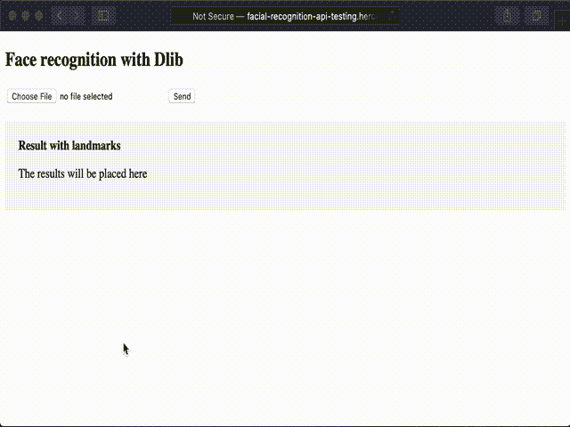

# 用 Dlib + Python + Heroku 构建 API

> 原文：<https://medium.com/analytics-vidhya/building-an-api-with-dlib-python-heroku-2d25687e66f0?source=collection_archive---------3----------------------->

本文旨在使用 Python 的 Dlib 库构建一个用于人脸识别的 API。为了创建 API，我们将使用 Python 3 的 Flask 框架。为了简单起见，我们将把这个 API 部署到 Heroku 环境中，它提供了简单的步骤，即使我们不是这个领域的专家，也可以很容易地遵循。Docker 将帮助我们解决最大的依赖性。我们可以开始了吗？

# Dlib

Dlib 是一个用 C++构建的库，它提供了多种机器学习算法，其中一些算法与图像处理相关。该库为 python 提供了一个 API。在本文中，我们将使用 Dlib 来识别人脸内部的点。我们还将使用 OpenCV，这是另一个用于人脸识别的库，Dlib 将帮助收集检测到的人脸中的点。

# 瓶

Flask 是用 Python 构建 web 应用程序的微框架。它非常容易安装和使用，不需要像我们在更完整的框架中那样进行大量的配置。

对于人脸检测，我们需要一个*face _ recognition _ service . py*文件。我们可以使用类似这样的结构:

```
*import* cv2
*import* dlib
*import* base64
*from* imutils *import* resize, face_utils
*from* urllib.parse *import* quotedetector = dlib.get_frontal_face_detector()
predictor = dlib.shape_predictor("shape_predictor_68_face_landmarks.dat")*def* get_image_with_landmarks(file_path: str):
    rects = *None* gray = *None* clone = *None

    try*:
        image = cv2.imread(file_path, 1)
        image = resize(image, height=240)
        gray = cv2.cvtColor(image, cv2.COLOR_BGR2GRAY)
        clone = image.copy()
        rects = detector(gray, 1)

    *except* Exception:
        *return* {'error': 'Error while reading the image'}

    any_face_was_found = len(rects) > 0
    *if* any_face_was_found:
        *for* (i, rect) *in* enumerate(rects):
            shape = predictor(gray, rect)
            shape = face_utils.shape_to_np(shape)

            *for* point *in* range(1, 68):
                coords = shape.tolist()[point]
                cv2.circle(clone, (coords[0], coords[1]), 1, (0, 0, 255), thickness=2)
    *else*:
        *return* {'error': 'No face was detected in the image provided'}

    retval, buffer = cv2.imencode('.jpg', clone)
    image_as_text = base64.b64encode(buffer)

    *return* {'image_with_landmarks': 'data:image/png;base64,{}'.format(quote(image_as_text))}
```

为了使用 Dlib 进行人脸地标识别，我们需要提供一个名为***shape _ predictor _ 68 _ face _ landmarks . dat***的训练模型。我们可以从[网站](http://dlib.net/files/shape_predictor_68_face_landmarks.dat.bz2)或者存储库中获得这个文件。

对于 Flask 框架，我们需要定义一个控制器 *app.py* 文件，如下所示:

```
*import* os
*from* flask *import* Flask, render_template, request
*from* face_recognition_service *import* get_image_with_landmarks

app = Flask(__name__)
app.config['UPLOAD_FOLDER'] = './'

@app.route('/', methods=["GET", "POST"])
*def* index():
    *if* request.method == "GET":
        *return* render_template("index.html", result={})
    *else*:
        image = request.files["image"]
        path = os.path.join(app.config['UPLOAD_FOLDER'], image.filename)
        image.save(path)
        result_from_landmarks = get_image_with_landmarks(path)os.remove(path)

        *return* render_template("index.html", result=result_from_landmarks)

*if* __name__ == '__main__':
    port = int(os.environ.get("PORT", 5000))
    app.run(host='0.0.0.0', port=port)
```

对于 UI，我们可以提供一个简单的 HTML。这个文件应该在一个*模板*文件夹中，我们使用*index.html*作为文件名。对于我们在 HTML 中使用的注释，我们可以寻找 [Jinja](https://jinja.palletsprojects.com/en/2.11.x/) 文档。

```
<!DOCTYPE *html*>
<html *lang*="en">
<head>
    <meta *charset*="UTF-8">
    <meta *name*="viewport" *content*="width=device-width, initial-scale=1.0">
    <title>Testing API with Dlib</title>
</head>
<body>
    <h2>Face recognition with Dlib</h2>
    <form *method*="post" *enctype*="multipart/form-data">
        <input *type*="file" *name*="image" *placeholder*="Upload an image">
        <button>Send</button>
    </form>
    <div *style*="background: #f6f6f6; padding: 20px; margin-top: 20px;">
        <strong>Result with landmarks</strong>
        
            <p>{{ result.error }}</p>
        
            <p></p>
        
            <p>The results will be placed here</p>
        
    </div>
</body>
</html>
```

# **Heroku**

Heroku 是一个云平台，它帮助我们部署、为不同的环境创建管道、监控我们的应用程序以及其他许多事情。它易于使用和配置。

对于这个配置，我们需要提供一个 *requirements.txt* 文件。在这个文件中，我们可以添加项目中的任何依赖项。我们可以看到 Flask 是我们案例中的主要依赖项。

```
click==6.7
Flask==1.1.2
numpy==1.20.1
Dlib==19.21.1
opencv-python==4.5.1.48
itsdangerous==0.24
Jinja2>=2.10.1
MarkupSafe==1.0
Werkzeug>=0.15
imutils==0.5.3
```

对于 Heroku，我们通常提供一个 [Procfile](https://devcenter.heroku.com/articles/procfile) 来定义启动应用程序的例程。在我们的例子中，不需要 Procfile，因为我们将使用另一个配置文件来构建 Docker。

我们不只是简单地将它作为一个普通的 git 仓库部署在 Heroku 上的原因是，由于大量的子依赖项，Dlib 需要相当长的时间才能安装在云环境中。Dlib 使用 c++依赖项，如 Cmake、Boost 和 XQuartz。事实上，当 Heroku 试图使用 Procfile 安装 Dlib 时，它会花费大量时间来尝试安装，并且根本不会完成。这是一个机器学习库，所以可以期待这一点。

# 码头工人

我们使用 [Docker](https://www.docker.com/) 构建独立的容器，其中包含操作系统和应用程序中需要的软件。这些组件是独立的、强大的、轻量级的，我们可以受益于不需要手动在云中设置虚拟机，就像我们以前做的那样。

为此，我们需要在项目中设置一个 Dockerfile，如下所示:

```
FROM jhonatans01/python-dlib-opencv
COPY . /app
WORKDIR /app
RUN pip3 install -r requirements.txt
CMD ["python3", "app.py"]
```

在这个文件中，我们从 DockerHub 中提取一个名为[jhonatans 01/python-DLI b-opencv](https://hub.docker.com/r/jhonatans01/python-dlib-opencv)的图像。此图包含使用 Python 3.6 的 Dlib + OpenCV 依赖项。基本上，在这 5 行代码中，我们:

1.  提取这个图像
2.  将项目中的所有内容复制到 *app* 文件夹中
3.  将这个 *app* 文件夹设置为我们的工作空间
4.  用 pip 安装我们的依赖项(除了 Dlib 或 OpenCV)
5.  为 Flask 运行我们的 python 主文件，它是 *app.py* 。

对于 Heroku 配置，我们仍然需要一个 *heroku.yml* 文件，以便定义这是一个在您每次提交和推送您的更改到 git 存储库时要用 Docker 部署的应用程序。

```
build:
  docker:
    web: Dockerfile
```

这非常简单，对于这个项目，我们只需要设置 docker 文件的路径。

# 部署 API

到目前为止，我们假设您已经有了一个 Heroku 帐户。如果您还没有，请继续注册。此外，您需要安装 [Heroku CLI](https://devcenter.heroku.com/articles/heroku-cli) 来运行以下命令。

要构建将要部署的映像，您需要在本地机器上安装 Docker。

安装好所有东西后，您需要创建一个项目。Heroku UI 平台可以帮助你做到这一点。让我们在终端登录 heroku，构建并推送 docker 容器。

```
$ heroku login
$ heroku container:login
$ heroku container:push web -a name_of_your_app
$ heroku container:release web -a name_of_your_app
```

完成这些步骤后，您应该能够在线打开应用程序并看到类似于以下内容的内容:



Heroku 环境中运行的应用程序

如果您使用的是链接到 Heroku 应用程序的 git 存储库，那么您提交的任何新更改都将自动触发 Docker 构建，并在以后进行部署。你只需要在第一次需要部署这个应用的时候担心上面提到的 *heroku container* 命令。

这个代码存在于我的 [github](https://github.com/jhonatans01/face_recognition_api_heroku_example) 中。在资源库中有一个 *docker-compose.yml* 文件，允许你用一个命令在本地运行这个应用程序。

```
docker-compose up --build
```

希望这对你有所帮助:)