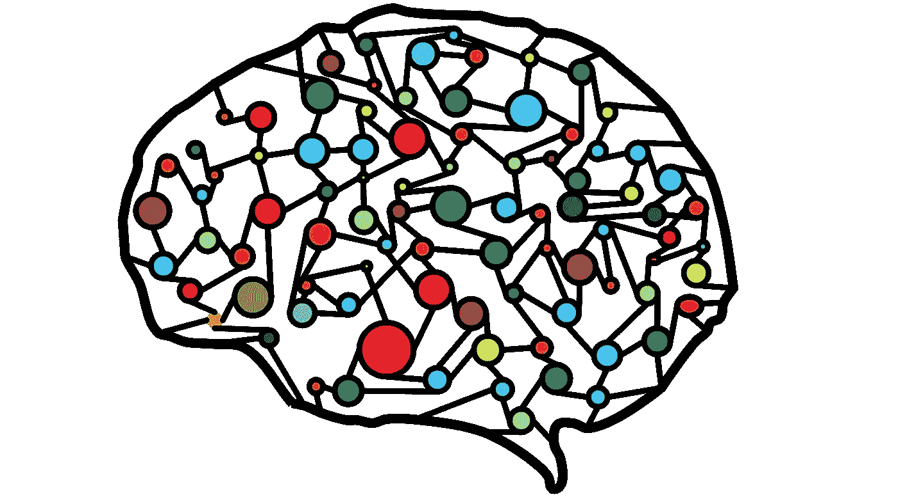

# 使用 Tensorflow 2.0 构建人工神经网络

> 原文：<https://medium.com/analytics-vidhya/building-an-artificial-neural-network-in-tensorflow2-0-77b7dea80bd4?source=collection_archive---------16----------------------->



图片来自 Pixabay 的 Ahmed Gad

在这本笔记本中，我们将看到如何使用 Tensorflow 2.0 实现一个人工神经网络。我们将使用从 Tensorflow 数据集直接导入的时尚 MNIST 数据集

# 导入库

```
import numpy as np
import datetime
import tensorflow as tf
from tensorflow.keras.datasets import fashion_mnisttf.__version__'2.3.0'
```

# 数据预处理

## 加载数据集

```
(X_train, y_train),(X_test, y_test)=fashion_mnist.load_data()Downloading data from https://storage.googleapis.com/tensorflow/tf-keras-datasets/train-labels-idx1-ubyte.gz
32768/29515 [=================================] - 0s 3us/step
Downloading data from https://storage.googleapis.com/tensorflow/tf-keras-datasets/train-images-idx3-ubyte.gz
26427392/26421880 [==============================] - 12s 0us/step
Downloading data from https://storage.googleapis.com/tensorflow/tf-keras-datasets/t10k-labels-idx1-ubyte.gz
8192/5148 [===============================================] - 0s 0us/step
Downloading data from https://storage.googleapis.com/tensorflow/tf-keras-datasets/t10k-images-idx3-ubyte.gz
4423680/4422102 [==============================] - 2s 0us/step
```

## 标准化图像

规范化的目标是将数据集中数值列的值更改为一个通用的比例，而不会扭曲值范围的差异。对于机器学习来说，并不是每个数据集都需要归一化。仅当要素具有不同的范围时才需要。

这里，我们将训练集和测试集中图像的每个像素除以最大像素数(255)，这样每个像素将在范围[0，1]内。通过标准化图像，我们的模型训练得更快

```
X_train=X_train/255
X_test=X_test/255
```

## 重塑数据

我们正在建立一个完全连接的网络，我们将训练集和测试集改造成矢量格式

由于每个图像的尺寸是 28x28，我们将整个数据集的形状调整为(-1，高 x 宽)

```
X_train.shape(60000, 28, 28)X_train=X_train.reshape(-1,28*28)X_train.shape(60000, 784)# Also reshape the X_test
X_test=X_test.reshape(-1,28*28)
X_test.shape(10000, 784)
```

# 构建人工神经网络

## 定义模型

让我们从一个序列模型开始。顺序模型适用于简单的层堆叠，其中每层都有一个输入张量和一个输出张量。顺序 API 允许您为大多数问题逐层创建模型。它的局限性在于它不允许您创建共享层或具有多个输入或输出的模型。

```
model=tf.keras.models.Sequential()
```

## 添加第一个完全连接的隐藏层

层超参数

```
1) number of units/neurons: 128
2) activation function: ReLU
3) input_shape: (784,)model.add(tf.keras.layers.Dense(units=128, activation='relu',input_shape=(784,)))
```

## 添加第二层，并去掉

对于用相对较小的数据集训练深度网络来说，辍学是一种简单但有用的技术。丢弃的想法是在每次训练迭代中随机停用网络中的一部分单元，例如 50%(图 1.10B)。这有助于防止单元之间复杂的共同适应，即，对特定其他单元的存在的不期望的依赖。通过防止复杂的共同适应与退出，它自然有助于避免过度拟合，从而使训练模型更好地推广。dropout 的另一个值得注意的影响是提供了一种有效地将许多不同的网络架构指数级地结合起来的方法。训练中单元的随机和临时移除导致不同的网络架构，因此在每次迭代中，可以认为训练了不同的网络，但是它们的连接权重是共享的。在测试中，网络中的所有单元都应该打开，即没有丢失，但权重减半以保持相同的输出范围。

```
model.add(tf.keras.layers.Dropout(0.2))
```

## 添加输出图层

```
1) units: number of classes (10 in Fashion MNIST dataset)
2) activation: softmaxmodel.add(tf.keras.layers.Dense(units=10, activation='softmax'))
```

## 编译模型

```
1) Optimizer: Adam
2) Loss: Sparse softmax (categorical) crossentropy
```

Adam 优化算法是随机梯度下降的扩展，最近在计算机视觉和自然语言处理的深度学习应用中得到了更广泛的采用。Adam 不同于经典的随机梯度下降。随机梯度下降为所有权重更新保持单一学习率(称为 alpha ),并且学习率在训练期间不变。为每个网络权重(参数)保持一个学习速率，并随着学习的展开而单独调整。Adam 意识到 AdaGrad 和 RMSProp 的优势。与 RMSProp 中基于平均一阶矩(平均值)调整参数学习率不同，Adam 还利用了梯度二阶矩的平均值(无中心方差)。

稀疏分类交叉熵和分类交叉熵之间的唯一区别是真实标签的格式。当我们有一个单标签、多类分类问题时，标签对于每个数据是互斥的，这意味着每个数据条目只能属于一个类。然后我们可以用一键嵌入来表示 y_true。

```
model.compile(optimizer='adam', loss='sparse_categorical_crossentropy', metrics=['sparse_categorical_accuracy'])model.summary()Model: "sequential"
_________________________________________________________________
Layer (type)                 Output Shape              Param #   
=================================================================
dense (Dense)                (None, 128)               100480    
_________________________________________________________________
dropout (Dropout)            (None, 128)               0         
_________________________________________________________________
dense_1 (Dense)              (None, 10)                1290      
=================================================================
Total params: 101,770
Trainable params: 101,770
Non-trainable params: 0
_________________________________________________________________
```

## 训练模型

```
model.fit(X_train, y_train, epochs=10)Epoch 1/10
1875/1875 [==============================] - 4s 2ms/step - loss: 0.5286 - sparse_categorical_accuracy: 0.8122
Epoch 2/10
1875/1875 [==============================] - 5s 3ms/step - loss: 0.3987 - sparse_categorical_accuracy: 0.8558
Epoch 3/10
1875/1875 [==============================] - 4s 2ms/step - loss: 0.3625 - sparse_categorical_accuracy: 0.8688
Epoch 4/10
1875/1875 [==============================] - 4s 2ms/step - loss: 0.3433 - sparse_categorical_accuracy: 0.8730
Epoch 5/10
1875/1875 [==============================] - 4s 2ms/step - loss: 0.3284 - sparse_categorical_accuracy: 0.8804
Epoch 6/10
1875/1875 [==============================] - 5s 2ms/step - loss: 0.3183 - sparse_categorical_accuracy: 0.8833
Epoch 7/10
1875/1875 [==============================] - 4s 2ms/step - loss: 0.3081 - sparse_categorical_accuracy: 0.8849
Epoch 8/10
1875/1875 [==============================] - 5s 3ms/step - loss: 0.2960 - sparse_categorical_accuracy: 0.8903
Epoch 9/10
1875/1875 [==============================] - 4s 2ms/step - loss: 0.2888 - sparse_categorical_accuracy: 0.8917
Epoch 10/10
1875/1875 [==============================] - 4s 2ms/step - loss: 0.2831 - sparse_categorical_accuracy: 0.8944

<tensorflow.python.keras.callbacks.History at 0x7ffa570fd130>
```

## 模型评估和预测

```
test_loss, test_accuracy=model.evaluate(X_test, y_test)313/313 [==============================] - 0s 777us/step - loss: 0.3337 - sparse_categorical_accuracy: 0.8796print("Test accuracy: {}".format(test_accuracy))Test accuracy: 0.8795999884605408
```

# 参考

[https://machinelingmastery . com/Adam-optimization-algorithm-for-deep-learning/](https://machinelearningmastery.com/adam-optimization-algorithm-for-deep-learning/)
[https://towardsai . net/p/data-science/how-when-and-why-should-you-normalize-rescale-your-data-3f 083 def 38 ff](https://towardsai.net/p/data-science/how-when-and-why-should-you-normalize-standardize-rescale-your-data-3f083def38ff)
[https://machinelingmastery . com/dropout-for-regulating-deep-neural-networks/](https://machinelearningmastery.com/dropout-for-regularizing-deep-neural-networks/)
[https://keras.io/guides/sequential_model/](https://keras.io/guides/sequential_model/)