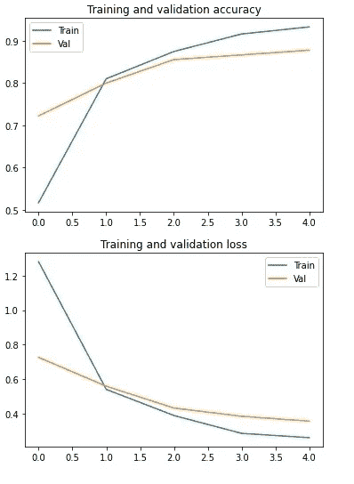
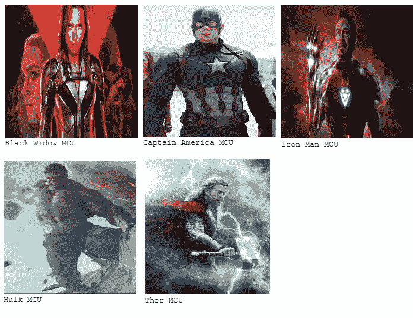

# 使用 Keras 构建图像分类器

> 原文：<https://medium.com/analytics-vidhya/building-an-image-classifier-using-keras-70f3be2ac44c?source=collection_archive---------14----------------------->

机器学习(ML)是一项颠覆性技术，席卷了整个世界。它是计算机在观察一些给定数据后学习做出预测的过程。仅举几个例子，它被用于计算机视觉、自然语言处理和股票价格预测。ML 的领域非常广阔，而且只会越来越大。为了演示这种技术的一种用途，本文将讨论如何对复仇者联盟(即黑寡妇、钢铁侠、美国队长、绿巨人和雷神)的图片进行分类。


图片来源:谷歌

首先，我们必须为我们的模型收集一些数据。为此，我们将从互联网上收集图片。我们将使用 bing-image-downloader 刮刀工具。要安装它，使用以下命令(所有代码都用 Python 3 编写) :

```
pip install bing-image-downloader
```

然后导入库:

```
from bing_image_downloader import downloader
```

我们的数据中有五个职业，即黑寡妇、钢铁侠、美国队长、绿巨人和雷神。我们将下载每个班级的 200 张图片。

```
downloader.download('Iron Man MCU', limit = 200, output = 'datasets/Marvel Heroes/train', adult_filter_off = False, force_replace = False, timeout = 60)
```

我们可以按照上面的代码，替换英雄名字，得到不同的图像。

现在我们有了图像，我们将把图像分成三组:训练(85 %的数据)、验证(10 %的数据)和测试(5 %的数据)。

```
train_dir = 'datasets/Marvel Heroes/train/'
validation_dir = 'datasets/Marvel Heroes/validation/'
test_dir = 'datasets/Marvel Heroes/test/'
```

训练集将用于训练我们的数据，验证集将用于指导测量我们的模型在训练期间的性能。最后，我们将输入看不见的图像，即测试集，看看我们的模型表现如何。下载的图像存储在。jpg 格式，并遵循命名约定 image_ <number>.jpg。我们创建各自的目录如下:</number>

```
import os
import random #for splitting the data randomly
classes = os.listdir('datasets/Marvel Heroes/train/')for hero in classes:
   j=0
   for i in random.randint(0,200):
       os.replace(train_dir + 'image_' + i + '.jpg', validation_dir + 'image_' + i + '.jpg')
       j=j+1
       if(j==20): #10 % of the images
          breakfor hero in classes:
   j=0
   for i in random.randint(0,200):
       os.replace(train_dir + 'image_' + i + '.jpg', test_dir + 'image_' + i + '.jpg')
       j=j+1
       if(j==10): #5 % of the images
          break
```

在这一步之后，我们将开始对我们的数据建模。为了节省时间，我们将使用一种叫做迁移学习的技术。这是一种技术，我们利用预训练机器学习模型的学习，并将其用于我们的目的。这是计算机视觉领域的常用技术。我们将在 Tensorflow 之上使用 Keras 来完成这个任务。Keras 是一个漂亮的 API，在机器学习社区中被大量使用。我们将使用的预训练模型是 ResNet50。

```
from tensorflow.keras.layers import Dense
from tensorflow.keras.models import Sequential
from tensorflow.keras.applications.resnet50 import preprocess_input
from tensorflow.keras.applications import RestNet50
```

让我们创建我们的模型:

```
num_classes = 5
model = Sequential()
model.add(ResNet50(include_top = False, pooling='avg', weights = 'imagenet'))
model.add(Dense(num_classes, activation = 'softmax'))
model.layers[0].trainable=False 
#Don't train the top layer as this is we where will add our own classes 
```

我们可以看看我们的模型参数。

```
model.summary()
```

它将给出以下输出:

```
Model: "sequential_1"
_________________________________________________________________
Layer (type)                 Output Shape              Param #   
=================================================================
resnet50 (Functional)        (None, 2048)              23587712  
_________________________________________________________________
dense (Dense)                (None, 5)                 10245     
=================================================================
Total params: 23,597,957
Trainable params: 10,245
Non-trainable params: 23,587,712
_________________________________________________________________
```

我们现在将使用 Adam 优化器编译我们的模型，使用分类交叉熵计算损失，并使用准确性度量。

```
model.compile(optimizer='adam',loss='categorical_crossentropy',metrics=['accuracy'])
```

我们已经完成了模型的创建。现在我们必须输入模型数据。为此，我们将使用 ImageDataGenerator，它也将帮助我们增加数据(向图像添加像水平翻转和旋转这样的噪声)。

```
from tensorflow.keras.preprocessing.image import ImageDataGeneratortrain_datagen = ImageDataGenerator(preprocessing_function = preprocess_input, horizontal_flip = True, width_shift_range = 0.2 ,height_shift_range = 0.2)
)
val_datagen=ImageDataGenerator(preprocessing_function = preprocess_input)train_generator = train_datagen.flow_from_directory(train_dir, target_size=(224,224), batch_size=32, class_mode='categorical')validation_generator = val_datagen.flow_from_directory( validation_dir, target_size=(224,224), batch_size=5, class_mode='categorical')
```

它将生成以下输出:

```
Found 850 images belonging to 5 classes.
Found 100 images belonging to 5 classes.
```

让我们安装模型。

```
history = model.fit(train_generator, epochs = 5, validation_data = validation_generator, verbose = 1)
```

该模型将生成类似于以下内容的输出(可能不相同):

```
Epoch 1/5
25/25 [==============================] - 322s 13s/step - loss: 1.7210 - accuracy: 0.3485 - val_loss: 0.7263 - val_accuracy: 0.7222
Epoch 2/5
25/25 [==============================] - 185s 7s/step - loss: 0.6220 - accuracy: 0.7889 - val_loss: 0.5590 - val_accuracy: 0.8000
Epoch 3/5
25/25 [==============================] - 177s 7s/step - loss: 0.4306 - accuracy: 0.8484 - val_loss: 0.4328 - val_accuracy: 0.8556
Epoch 4/5
25/25 [==============================] - 172s 7s/step - loss: 0.2794 - accuracy: 0.9271 - val_loss: 0.3850 - val_accuracy: 0.8667
Epoch 5/5
25/25 [==============================] - 167s 7s/step - loss: 0.2736 - accuracy: 0.9281 - val_loss: 0.3570 - val_accuracy: 0.8778
```

瞧啊。看起来我们在验证集上获得了大约 88 %的准确率，在训练集上获得了大约 93 %的准确率。还不错！让我们画出我们的结果。

```
import matplotlib.pyplot as plt
acc = history.history['accuracy']
val_acc = history.history['val_accuracy']loss = history.history['loss']
val_loss = history.history['val_loss']epochs = range(len(acc))plt.plot(epochs, acc)
plt.plot(epochs, val_acc)
plt.title('Training and validation accuracy')
plt.legend(['Train','Val'])
plt.figure() #Train accuracyplt.plot(epochs, loss)
plt.plot(epochs, val_loss)
plt.title('Training and validation loss')
plt.legend(['Train','Val']) #Train Loss
```

它将生成以下图:



情节

我们可以按如下方式保存模型:

```
model.save('/Created Models/')
```

现在来做一些预测吧。导入下列库。

```
from keras.preprocessing.image import load_img
from keras.preprocessing.image import img_to_array
from keras.preprocessing.image import array_to_img
```

现在来预测一下。

```
for im in os.listdir(test_dir):
      image = load_img(os.path.join(test_dir,im),target_size=(224,224))
      input_arr = img_to_array(image)
      input_arr = np.expand_dims(input_arr,axis=0)
      input_arr = preprocess_input(input_arr)
      pred = model.predict(input_arr)
      maxPosition = np.argmax(pred)
      pred_label = classes[maxPosition]
      display(image)
      print(pred_label)
      print()
      print()
```

一些预测如下:



一些测试集。

文章到此结束。希望你喜欢。回头见！