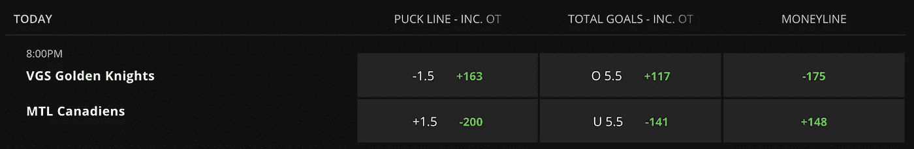

# 构建 NHL 游戏预测模型，第 1 部分

> 原文：<https://medium.com/analytics-vidhya/building-an-nhl-game-prediction-model-part-1-1ee7596ff91b?source=collection_archive---------5----------------------->

鸣谢:克里斯·利维拉尼，Unsplash

为了我在熨斗学校的数据科学顶点项目，我建立了一个 NHL 游戏预测模型。在我接下来的几篇博客文章中，我将讲述我为了建立这个模型而采取的各种步骤和吸取的教训。现在，事不宜迟…

# **动机**

我一直是一个超级曲棍球迷，最近也成了一个大数据迷。但即使在跳入数据世界并将其作为职业道路之前，我也一直对阅读那些深入研究游戏分析的记者很感兴趣。在过去的十年里，我看到人们越来越接受使用高级统计数据作为更有意义的方法来评估游戏。因此，当选择我的顶点项目时，使用 NHL 数据感觉很自然。受 Dom Luszczyszyn 的启发，我决定着手构建自己的游戏预测模型。Dom Luszczyszyn 是《The Athletic》的一名作家，他创建了一个游戏预测模型，如果不是最好的公开发布的模型，也是其中之一。

# **商业问题**

试图解决一些数据问题是任何数据科学项目的核心。NHL 比赛预测模型解决的问题可以归结为一个简单的想法:我能比直觉更聪明地押注曲棍球比赛吗？

不像在足球或篮球中，对价差下注是最受欢迎的下注类型，由于得分较低的游戏，moneyline 在 NHL 中是国王。所以你只是在赌谁会赢，而不管一个队赢了多少。赌输和赌赢有不同的成本，这个成本就是金钱线。当下注货币线时，获得优势的方法是，如果你知道游戏结果的真实概率，那么你就知道货币线隐含的概率。在整个赛季中，如果你的内部衍生游戏概率优于庄家，你就可以盈利。

## **计算隐含概率**

让我们来看看这个例子:

游戏线由 DraftKings 提供

今晚维加斯黄金骑士队将对阵蒙特利尔加拿大队。我们可以从 moneyline 列中看到，拉斯维加斯受到青睐，因为他们的 moneyline 数字是负的。-175 意味着你要冒 175 美元的风险才能赢得 100 美元的利润。对于不被看好的加拿大人来说，+148 的数字表明你只需要冒 100 美元的风险就能赚到 148 美元。

要计算维加斯(最受欢迎的)获胜的隐含概率，公式是:

175 / (100+175) = 63.6%.

要计算蒙特利尔队(失败者)获胜的隐含概率，公式是:

100 / (148+100) = 40.3%.

你可能已经注意到，这些概率加起来超过 100%。这是因为账簿在下注双方都收取佣金(又名 Vig)。他们要求你冒更大的风险(或获得更少的回报，这取决于你如何看待它)来进行你的“投资”。

## **将模型输出应用于下注策略**

考虑到以上所有因素，我需要创建一个模型来输出比赛中每个队获胜的概率。如果模型输出的某个团队获胜的概率高于货币线的隐含概率，您将会在该团队上下赌注。当然，你总是可以在你的决策中引入一些定性分析，但这是你如何使用模型的一般要点。

当我进入项目的建模阶段时，我需要使用能够输出概率的机器算法。为此，我尝试了逻辑回归、AdaBoost、梯度推进和神经网络，看看哪一个得分最高。我用来判断模型的评分标准是对数损失。对数损失表示预测概率与相应的实际/真实值(在二元分类的情况下为 0 或 1)有多接近。预测概率偏离实际值越多，对数损失值越高，[源](https://towardsdatascience.com/intuition-behind-log-loss-score-4e0c9979680a)。

# **结论**

在这篇文章中，我回顾了我建立 NHL 游戏预测模型的动机和用途。在后面的帖子中，我将讨论我是如何获取数据、清理数据、设计特征、选择特征、完成建模过程的，并提供一些从数据中获得的见解以及我在这个过程中所学到的经验。你可以在这里查看这个项目[的 Github 库。在撰写本文时，我正在不断地对模型进行微调，并使代码更加动态，以便为 2021-2022 赛季做好准备。](https://github.com/gschwaeb/NHL_Game_Prediction)