# 用 Python 构建分类模型

> 原文：<https://medium.com/analytics-vidhya/building-classification-model-with-python-9bdfc13faa4b?source=collection_archive---------1----------------------->

嗨！在这篇文章中，我将讲述用 Python 创建自己的分类模型的基础。我将尝试从准备数据、训练模型、优化模型以及如何保存数据以备后用，一步步向您解释和演示。这篇文章是我一直在做的一个迷你系列的第二部分，如果你没有读过我以前的关于使用 Python 进行多元线性回归的文章，一定要去看看。

你可以试着用笔记本[跟随这里的](https://colab.research.google.com/github/rafiag/DTI2020/blob/main/004_Classification_Bank_Marketing_Dataset_(Assignment).ipynb)，祝你好运，玩得开心！

# 介绍

在机器学习中，分类是基于包含类别成员已知的观察值(或实例)的训练数据集，识别新观察值属于一组类别(子群体)中的哪一个的问题。分类问题的几个例子是:(a)决定接收的电子邮件是垃圾邮件还是有机电子邮件；(b)基于观察到的患者特征(年龄、血压、某些症状的存在或不存在等)指定对患者的诊断。)

在本文中，我们将使用来自 Kaggle 的[银行营销数据集](https://www.kaggle.com/janiobachmann/bank-marketing-dataset)建立一个模型，根据一些属性来预测某人是否会存款。我们将尝试使用不同的算法决策树、随机森林、朴素贝叶斯和 K 近邻来构建 4 个不同的模型。在建立每个模型后，我们将对它们进行评估，并比较哪个模型最适合我们的情况。然后，我们将尝试通过使用 GridSearch 调整模型的超参数来优化我们的模型。最后，我们将保存来自数据集的预测结果，然后保存我们的模型以供重用。

首先，我们将加载一些基本库，如 Pandas 和 NumPy，然后对其中一些库进行一些配置。

# 数据预处理

在我们开始创建第一个模型之前，我们首先需要加载和预处理。这一步确保了我们模型将会得到一个好的数据来学习，正如他们所说的“一个模型只有当它的数据好的时候才是好的”。如下所述，数据预处理将被分成几个步骤。

## 加载数据

在第一步中，我们将加载已经上传到我的 GitHub 上的数据集，以便于处理。从数据集文档中找到[这里](https://archive.ics.uci.edu/ml/datasets/Bank+Marketing)我们可以看到下面是我们数据中的列列表:

输入变量:

1.  年龄(数字)
2.  作业:作业类型(分类:“管理。”、'蓝领'、'企业家'、'女佣'、'管理'、'退休'、'自雇'、'服务'、'学生'、'技术员'、'失业'、'未知')
3.  婚姻:婚姻状况(分类:“离婚”、“已婚”、“单身”、“未知”)；注意:“离婚”是指离婚或丧偶)
4.  教育(分类:'基础. 4y '，'基础. 6y '，'基础. 9y '，'高中'，'文盲'，'专业.课程'，'大学.学位'，'未知')
5.  违约:有信用违约？(分类:“否”、“是”、“未知”)
6.  住房:有住房贷款吗？(分类:“否”、“是”、“未知”)
7.  贷款:有个人贷款？(分类:“否”、“是”、“未知”)
8.  联系人:联系人通信类型(分类:“手机”、“电话”)
9.  月份:一年中的最后一个联系月份(分类:'一月'，'二月'，'三月'，…，'十一月'，'十二月')
10.  星期几:一周的最后一个联系日(分类:“星期一”、“星期二”、“星期三”、“星期四”、“星期五”)
11.  duration:上次联系持续时间，以秒为单位(数字)。重要注意事项:该属性对输出目标有很大影响(例如，如果 duration=0，则 y='no ')。然而，在执行呼叫之前，持续时间是未知的。还有，结束通话后 y 显然是已知的。因此，该输入应仅用于基准测试目的，如果目的是获得现实的预测模型，则应丢弃。
12.  活动:在此活动期间为此客户执行的联系次数(数字，包括最后一次联系)
13.  pdays:从上一个活动中最后一次联系客户后经过的天数(数字；999 表示之前没有联系过客户)
14.  上一次:在此活动之前为此客户执行的联系次数(数字)
15.  poutcome:之前营销活动的结果(分类:“失败”、“不存在”、“成功”)

输出变量(期望目标):

*   y:客户有没有订定期存款？(二进制:“是”、“否”)

根据数据集文档，我们需要删除“持续时间”列，因为在实际情况下，持续时间只有在标签列已知后才是已知的。这个问题可以被认为是“数据泄漏”,其中预测因子包括在你进行预测时不可用的数据。

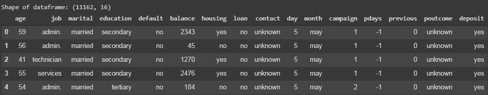

我们将要处理的数据样本

## 阶级分布

在将我们的数据输入模型之前，要确保的另一件重要事情是数据的类别分布。在我们的例子中，期望类被分成两种结果，“是”和“否”，50:50 的类分布可以被认为是理想的。

```
no     5873
yes    5289
Name: deposit, dtype: int64
```

正如我们所看到的，我们的班级分布或多或少是相似的，不完全是 50:50 的分布，但仍然足够好。

## 缺少值

在继续之前，最后要检查的是缺少的值。在某些情况下，我们的数据可能在某些列中有丢失的值，这可能是由一些原因造成的，如人为错误。我们可以使用 Pandas 的`is_null()`函数来检查任何缺失的数据，然后使用`sum()`函数来查看每一列中缺失值的总数。

```
age          0
job          0
marital      0
education    0
default      0
balance      0
housing      0
loan         0
contact      0
day          0
month        0
campaign     0
pdays        0
previous     0
poutcome     0
deposit      0
dtype: int64
```

从结果来看，我们可以确信我们的数据没有丢失值，并且是完好的。如果您的数据中确实有缺失值，您可以通过插补来解决，或者根据您的具体情况完全删除该列。[这里的](https://www.kaggle.com/dansbecker/handling-missing-values)是一个关于如何处理数据集中缺失值的 Kaggle 课程的链接。

## 缩放数字数据

接下来，我们将缩放我们的数字数据，以避免可能严重影响我们模型的异常值。使用 sklearn 的`StandardScaler()`函数，我们可以缩放包含数字数据的每个列。将使用以下公式进行缩放:

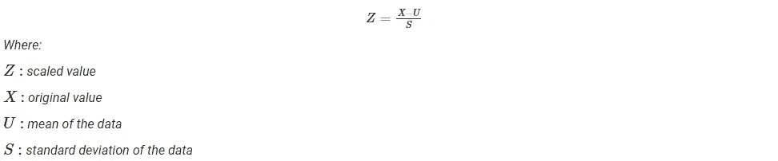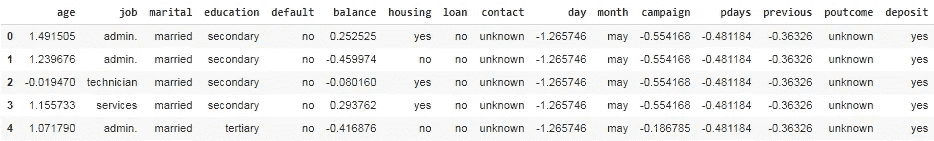

我们的数据在缩放数字列后

## 编码分类数据

与数字数据一样，我们也需要对我们的分类数据进行预处理，从单词到数字，使其更容易被计算机理解。为此，我们将使用 sklearn 提供的`OneHotEncoder()`。基本上，它将从以下内容转换一个分类列:

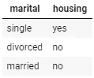

*…变成这样…*

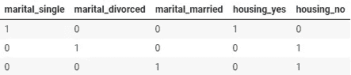

在这个代码单元中，我们还将通过分别用 1 和 0 替换“是”和“否”来对标签列进行编码。我们可以通过对`deposit`列应用简单的 lambda/in-line 函数来做到这一点。

## 为训练和测试拆分数据集

为了完成我们的数据预处理步骤，我们将把数据分成两个数据集，训练和测试。在这种情况下，因为我们有足够的数据，我们将按照 80:20 的比例分割数据，分别用于训练和测试。这将导致我们的训练数据有 8929 行，测试数据有 2233 行。

```
Shape of training feature: (8929, 50) 
Shape of testing feature: (2233, 50)
Shape of training label: (8929,) 
Shape of testing feature: (2233,)
```

# 系统模型化

在确保我们的数据是好的和准备好的之后，我们可以继续建立我们的模型。在这本笔记本中，我们将尝试用不同的算法构建 4 个不同的模型。在这一步中，我们将使用 sklearn 设置的默认参数为每个算法创建一个基线模型，在构建完所有 4 个模型后，我们将对它们进行比较，看哪一个最适合我们的情况。

为了评估我们的模型，我们将使用混淆矩阵作为评估的基础。


来源:[你的多类机器学习模型的混淆矩阵(面向数据科学)](https://towardsdatascience.com/confusion-matrix-for-your-multi-class-machine-learning-model-ff9aa3bf7826)

其中:TP =真正；FP =假阳性；TN =真阴性；FN =假阴性。

我们将使用以下 6 个指标来评估模型:

*   准确性:真实结果占检查案例总数的比例。


*   精度:用于计算所有预测为正的数据中有多少比例的数据实际上是正的。


*   召回:用于计算有多少比例的实际阳性被正确分类。


*   F1 分数:介于 0 和 1 之间的数字，是精确度和召回率的调和平均值。


*   Cohen Kappa 评分:Cohen 的 Kappa 评分衡量两个评分者之间的一致程度，他们各自将 N 个项目分为 C 个互斥的类别。


其中，Po 是分配给任何样本的标签一致的经验概率(观察到的一致率)，Pe 是当两个注释者随机分配标签时的预期一致。Pe 是使用每个标注者在类标签上的经验先验来估计的。

*   曲线下面积(AUC):表示正类概率与负类概率的分离程度

在这种情况下，我们希望将重点放在我们模型的回忆值上，因为在我们的问题中，我们应该尽可能多地预测实际的正面结果。因为对**实际上**想要存款的客户的错误分类可能意味着机会/收入的损失。

下面我们将定义一个辅助函数来评估每个训练好的模型，并使用上面提到的指标，将分数保存到一个变量中。

正如我在本文前面说过的，我将尝试建立 4 种不同的模型:决策树、随机森林、朴素贝叶斯和 K 近邻。在我们开始之前，下面是每个算法的简单定义和它们是如何工作的。如果你不熟悉上述任何一种算法，在继续之前，你一定要试着阅读更多关于它们的深入解释。

## 决策图表

决策树是一种树形图，用于确定行动方案。树的每个分支代表一个可能的决定、事件或反应。

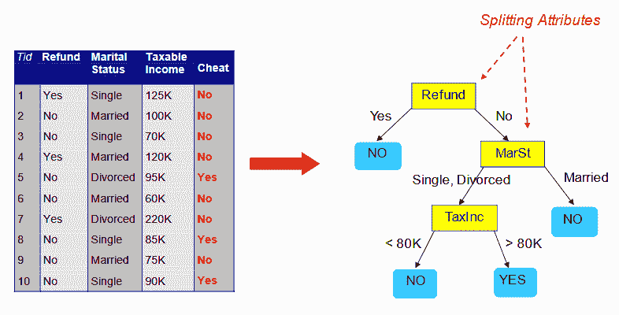

来源:Telkom 数字人才孵化器—数据科学家模块 5(分类)

优势:

*   它可用于回归和分类任务，并且很容易查看它赋予输入要素的相对重要性。
*   它也被认为是一种非常方便和易于使用的算法，因为它的默认超参数通常会产生良好的预测结果。

缺点:

*   许多树会使算法变慢并且对于实时预测无效。更准确的预测需要更多的树，这导致模型更慢。
*   它是一个预测性的建模工具，而不是描述性的工具。

## 随机森林

随机森林或随机决策森林是一种通过在训练阶段构建多个决策树来运行的方法。大多数树的决定被选为最终决定。

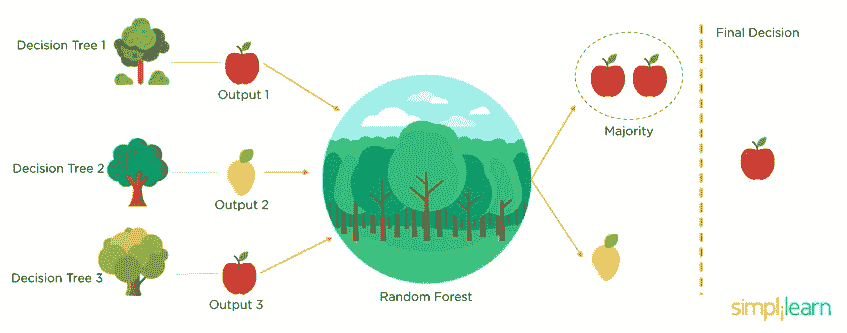

来源:[随机森林算法(Simplilearn)](https://www.simplilearn.com/tutorials/machine-learning-tutorial/random-forest-algorithm)

优势:

*   它可用于回归和分类任务，并且很容易查看它赋予输入要素的相对重要性。
*   它也被认为是一种非常方便和易于使用的算法，因为它的默认超参数通常会产生良好的预测结果。

缺点:

*   许多树会使算法变慢并且对于实时预测无效。更准确的预测需要更多的树，这导致模型更慢。
*   它是一个预测性的建模工具，而不是描述性的工具。

## **朴素贝叶斯**

朴素贝叶斯是一种构造分类器的简单技术:将类别标签分配给问题实例的模型，表示为特征值的向量，其中类别标签是从一些有限集中提取的。不存在用于训练这种分类器的单一算法，而是基于共同原则的一系列算法:所有朴素贝叶斯分类器假定给定类变量，特定特征的值独立于任何其他特征的值。下面是贝叶斯定理公式:


例如，假设:

*   医生知道 50%的情况下脑膜炎会导致颈部僵硬
*   任何患者先前患脑膜炎的概率是 1/50，000
*   任何患者颈部僵硬的先验概率为 1/20

那么颈部僵硬的患者同时患有脑膜炎的概率是:

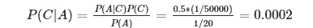

## k-最近邻

k-最近邻(KNN)通过从训练数据中找到 k 个最近邻来对新数据进行分类，然后根据其大多数邻居来决定类别。例如，在下图中，k=3 时，它的大多数邻居被分类为 B，但当 k=7 时，大多数将变为 a。

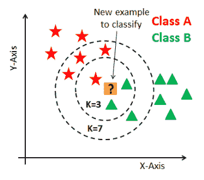

来源:Telkom 数字人才孵化器—数据科学家模块 5(分类)

优势:

*   易于实施的简单技术
*   建筑模型很便宜
*   极其灵活的分类方案

缺点:

*   对未知记录进行分类相对昂贵
*   需要计算 k 个最近邻的距离
*   计算量大，尤其是当训练集变大时
*   噪声或不相关特征的存在会严重降低精确度

## 建筑模型

在了解了每个模型的工作原理之后，让我们尝试使用之前的训练数据集来训练我们的模型。下面是示例代码，使用决策树来拟合我们的模型，并使用我们之前创建的帮助函数来评估模型。每个算法的完整代码可以在笔记本[这里](https://colab.research.google.com/github/rafiag/DTI2020/blob/main/004_Classification_Bank_Marketing_Dataset_(Assignment).ipynb)找到。

```
Accuracy: 0.6336766681594268
Precision: 0.6215953307392996
Recall: 0.598314606741573
F1 Score: 0.6097328244274809
Cohens Kappa Score: 0.2648219403033133
Area Under Curve: 0.6322045136712157Confusion Matrix:
[[776 389]
[429 639]]
```

## 模型比较

在构建了所有的模型之后，我们现在可以比较每个模型的表现了。为此，我们将创建两个图表，第一个是分组条形图，显示我们模型的准确度、精确度、召回率、f1 值和 kappa 值，第二个是折线图，显示我们所有模型的 AUC。

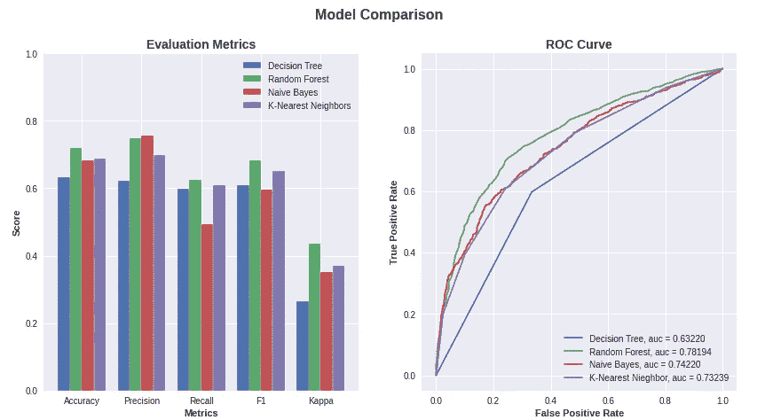

从上面的图中我们可以看到，我们的随机森林模型在我们评估的 6 个指标中的 5 个指标上领先于其他模型，除了精度。所以我们可以假设随机森林是解决我们问题的正确选择。

# 模型优化

在本笔记本的下一部分，我们将通过调整 scikit-learn 库中的 hyper 参数来优化我们的 RandomForest 模型。找到最佳参数后，我们将通过与之前的基线模型进行比较来评估我们的新模型。

## 使用 GridSearchCV 调整超参数

我们将使用 sklearn 的`GridSearchCV`功能来为我们的模型找到最佳参数。我们将提供我们的基线模型(名为`rf_grids`)、评分方法(在我们的例子中，我们将使用前面解释过的 recall)，以及我们希望用我们的模型尝试的各种参数值。然后，`GridSearchCV`函数将遍历每个参数组合，找到最佳评分参数。

该功能还允许我们使用交叉验证来训练我们的模型，其中在每次迭代中，我们的数据将被分成 5 个(数量可以从参数中调整)折叠。然后，模型将在 4/5 折叠的数据上进行训练，留下最终折叠作为验证数据，该过程将重复 5 次，直到我们的所有折叠都被用作验证数据。

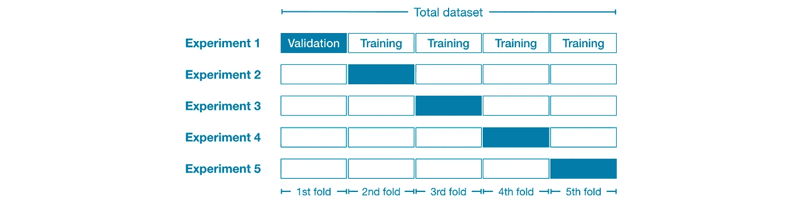

来源:[交叉验证(Kaggle)](https://www.kaggle.com/alexisbcook/cross-validation)

要查看哪个参数组合效果最好，我们可以从网格搜索对象中访问`best_params_`属性。

*注意:提供的组合越多，过程需要的时间就越长。或者，您也可以尝试* `*RandomizedSearchCV*` *来随机选择指定数量的参数，这样可以加快运行时间。*

```
{'max_depth': 50,
 'max_features': 2,
 'min_samples_leaf': 3,
 'min_samples_split': 8,
 'n_estimators': 100}
```

## 评估优化模型

找到模型的最佳参数后，我们可以访问 GridSearchCV 对象的`best_estimator_`属性，将优化后的模型保存到名为`best_grid`的变量中。在下一步中，我们将使用助手函数计算 6 个评估指标，并将其与基础模型进行比较。

```
Accuracy: 0.7174205105239588
Precision: 0.7635705669481303
Recall: 0.5926966292134831
F1 Score: 0.6673695308381655
Cohens Kappa Score: 0.42844782511519086
Area Under Curve: 0.7785737249039559Confusion Matrix:
[[969 196]
[435 633]]
```

## 模型比较

下面的代码将绘制与之前相同的图，只是使用了我们最初的随机森林模型和它的优化版本。它还将打印每个评估指标的变化，以帮助我们了解我们的优化模型是否比原始模型工作得更好。

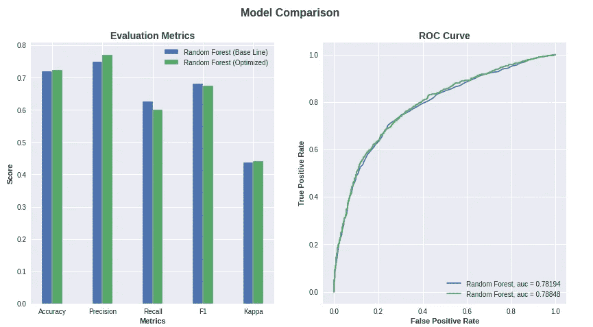

```
Change of 0.37% on accuracy.
Change of 2.79% on precision.
Change of -3.89% on recall.
Change of -0.96% on F1 score.
Change of 0.95% on Kappa score.
Change of 0.84% on AUC.
```

结果表明，优化后的模型性能比原始模型稍好。优化后的模型在 6 个指标中有 4 个指标有所提高，但在其他指标上表现较差，尤其是召回率下降了-3.89%。因为我们希望专注于预测尽可能多的实际正值，所以我们应该坚持使用我们的原始预测模型，因为它具有更高的召回分数。

# 输出

我们有了模型，接下来呢？作为数据科学家，能够开发具有良好可重用性的模型是非常重要的。在这最后一部分，我将解释如何基于新数据创建预测，以及如何使用`joblib` 保存(和加载)您的模型，这样您就可以在生产中使用它，或者保存它供以后使用，而不必重复整个过程。

## 做预测

在此步骤中，我们将使用随机森林模型预测原始数据集中所有行的预期结果，然后将其保存到 csv 文件中，以便于将来访问。

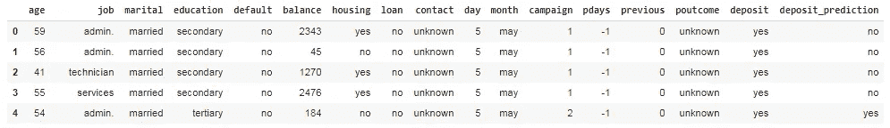

具有预测结果的新数据集

## 保存模型

我们可以保存我们的模型，以便进一步的模型重用。然后可以将该模型加载到另一台机器上进行新的预测，而无需再次进行整个训练过程。

# 结论

对于一个简单的模型，我们可以看到我们的模型在分类数据方面做得很好。但是我们的模型仍然有一些弱点，特别是在召回指标上，我们只得到大约 60%。这意味着我们的模型只能检测到 60%的潜在客户，而漏掉另外 40%。使用`GridSearchCV`优化模型后，结果并没有太大的不同，这意味着我们已经达到了这个模型的极限。为了提高我们的性能，我们可以尝试研究另一种算法，如`GradientBoostingClassifier`。

感谢您的阅读，希望对您有所帮助！如果你有任何建议或问题，请随时留下评论(鼓掌肯定会被赞赏！)

# 参考

1.  Telkom 数字人才孵化器—数据科学家模块 5(分类)
2.  [Scikit-learn 文档](https://scikit-learn.org/stable/index.html)
3.  [每个数据科学家都必须知道的 5 个分类评估指标](https://towardsdatascience.com/the-5-classification-evaluation-metrics-you-must-know-aa97784ff226)
4.  [Python 图形库—分组条形图](https://python-graph-gallery.com/11-grouped-barplot/)
5.  [你的多类机器学习模型的混淆矩阵](https://towardsdatascience.com/confusion-matrix-for-your-multi-class-machine-learning-model-ff9aa3bf7826)
6.  [随机森林算法](https://www.simplilearn.com/tutorials/machine-learning-tutorial/random-forest-algorithm)
7.  [交叉验证](https://www.kaggle.com/alexisbcook/cross-validation)