# 构建、容器化和部署新闻分类应用程序

> 原文：<https://medium.com/analytics-vidhya/building-containerizing-and-deploying-a-news-classifier-app-e5eb09dfbb3e?source=collection_archive---------11----------------------->


他的文章是关于新闻分类器的端到端项目。
App 已经使用 **streamlit** 构建，使用 **Docker** 容器化，使用【Fargate 部署在 **AWS 上。本文旨在给出一个完整的流程演示。**

为此，我们将使用来自 Kaggle 的数据。 [**链接**](https://www.kaggle.com/rmisra/news-category-dataset)

# 创建一个. IPYNB 文件

为此，您可以使用 jupyter 笔记本或 Colab。
我个人推荐 Colab，因为大部分包都已经安装了。

## →安装库

```
!pip install autocorrect
import sys 
!{sys.executable} -m pip install contractions
!pip install zeugma
```

## →导入库

```
import re
# --------------------------------------------------------------
import pandas as pd
import numpy as np
import matplotlib.pyplot as plt
import seaborn as sns
# --------------------------------------------------------------
import nltk
from nltk.stem import WordNetLemmatizer,PorterStemmer
from nltk.tokenize import word_tokenize
from nltk.corpus import stopwords
nltk.download('wordnet')
nltk.download('punkt')
nltk.download("stopwords")
# --------------------------------------------------------------
import contractions
from autocorrect import Speller
# --------------------------------------------------------------
import pickle 
# --------------------------------------------------------------
from sklearn.feature_extraction.text import TfidfVectorizer
from sklearn.model_selection import train_test_split
from sklearn.linear_model import LogisticRegression
from sklearn.metrics import accuracy_score,matthews_corrcoef
from sklearn.metrics import plot_confusion_matrix
```

## →读取数据

```
data = pd.read_json("/Data/News_Category_Dataset_v2.json", 
                    lines = True)data.head()
```

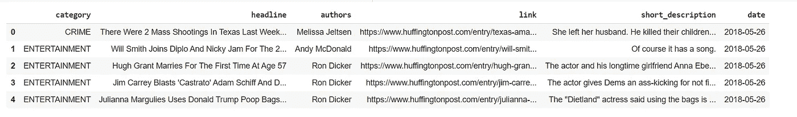

## →数据清理

```
new_data = data.drop(['date','link'],axis = 1).copy()
```

**检查类的分布:**

```
plt.figure(figsize = (10,5))
plt.xticks(rotation=90)
sns.countplot(new_data.category, 
              order=new_data.category.value_counts().index)
```

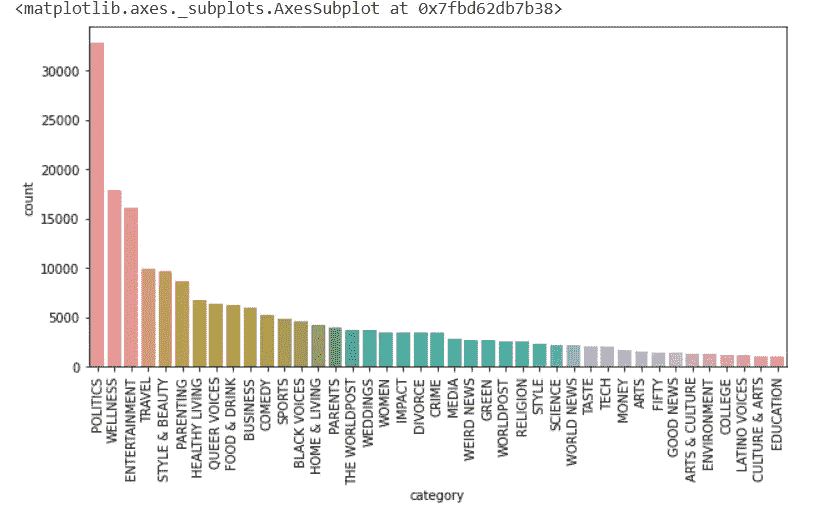

**将相似的类别映射在一起:**

```
new_data.category = new_data.category.map(lambda x: "WORLDPOST" if x
                                          == "THE WORLDPOST" else x)new_data.category = new_data.category.map(lambda x: "EDUCATION" if x
                                          == "COLLEGE" else x)new_data.category = new_data.category.map(lambda x: "ARTS & CULTURE" 
                                          if x == "ARTS" else x)new_data.category = new_data.category.map(lambda x: "FOOD & DRINK"
                                          if x == "TASTE" else x)new_data.category = new_data.category.map(lambda x: "PARENTING" if x
                                          == "PARENTS" else x)new_data.category = new_data.category.map(lambda x: "STYLE & BEAUTY"
                                          if x == "STYLE" else x)new_data.category = new_data.category.map(lambda x: "WORLDPOST" if x
                                          == "WORLD NEWS" else x)print(new_data.category.nunique())
print(new_data.category.value_counts())
```

**处理空值:**

```
for i in new_data.columns:
  print(i)
  print(len(new_data[new_data[i] == ""]))
  print("--------------------")
```

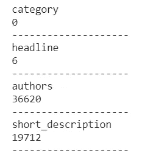

```
new_data[new_data['headline'] == ""]
```

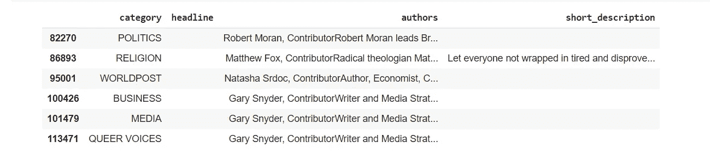

```
new_data = new_data[new_data['headline'] != ""]
new_data = new_data[new_data['short_description'] != ""]
```

*   既然我们已经移除了空值，我们可以创建一个新的数据框继续前进。

```
df = new_data[['headline','short_description','category']]
df.reset_index(drop=True)
df.head()
```

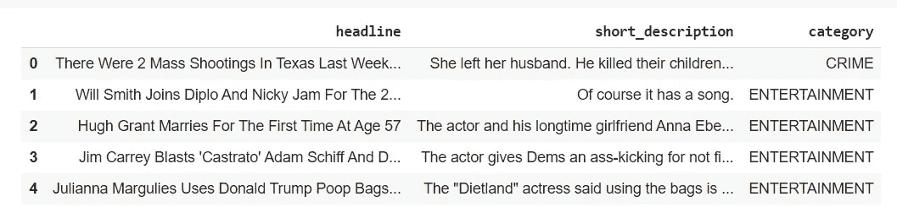

## →特征工程

```
df['total'] = df['headline'] + " " + df['short_description']
df.head(2)
```

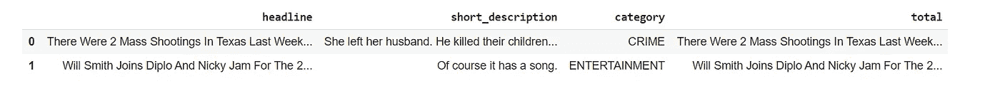

## →数据预处理

```
df_cleaned = df[['total','category']]
```

**定义函数展开收缩:**

```
def expand_contractions(text):
  sent = ""
  for word in text.split():
    sent = sent + " " + contractions.fix(word)
  return sent.lower()
```

**定义纠正单词拼写的功能:**

```
def spell_check(text):
  spell = Speller()
  sent = " "
  spells = [spell(w) for w in (nltk.word_tokenize(text))]  
  return sent.join(spells)spell_check(expand_contractions(df_cleaned.total[20]))
```

**定义函数对整个数据集进行预处理:**

```
def text_preprocess(data,x):
  lemmatizer = WordNetLemmatizer()
  for i,row in data.iterrows():
      filter_Sentence = '' sentence = row[x]
      sentence = expand_contractions(sentence)
      #sentence = spell_check(sentence)
      sentence = re.sub(r'[^\w\s]',' ',sentence)
      #removing extra space
      sentence = re.sub(r"\s+"," ", sentence, flags = re.I)
      sentence = re.sub(r"\d", " ", sentence)#removing digits
      #removing single characters
      sentence = re.sub(r"\s+[a-zA-Z]\s+", " ", sentence)
      #removing multiple characters
      sentence = re.sub(r"[,@\'?\.$%_]", "", sentence, flags=re.I) words = nltk.word_tokenize(sentence) #words = [w for w in words if not w in stop_words] for word in words:
          #filter_Sentence = filter_Sentence + ' ' + str(word)
          filter_Sentence = filter_Sentence + ' ' +
                            str(lemmatizer.lemmatize(word)) data.loc[i,x] = sentence
  return datatext_preprocess(df_cleaned,'total').head()
```

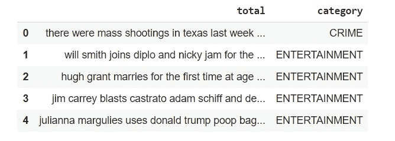

```
df_cleaned.to_csv('clean.csv', index = False)
```

## →建模和评估

**读取清理后的数据:**

```
df_cleaned = pd.read_csv("/content/clean.csv")
df_cleaned.head()
```


**使用 TFIDF 矢量器生成单词矢量:**

```
tfidf = TfidfVectorizer()
X = tfidf.fit_transform(df_cleaned['total'])
X.shape
```

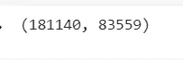

**将 TFIDF 向量转储到 pickle 文件中，以用于不可见的文本:**

```
pickle.dump(tfidf, open("tfidf.pkl","wb"))
```

**将数据分为训练集和测试集:**

```
y = df_cleaned['category']
x_train,x_test,y_train,y_test = train_test_split(X, y,
                                                 test_size = 0.2)
```

**建立物流回收模型:**

```
Lg = LogisticRegression(max_iter = 1000).fit(x_train,y_train)
```

**模型评估:**

```
pred = Lg.predict(x_test)
print(accuracy_score(y_test,pred))
print(matthews_corrcoef(y_test, pred))
```

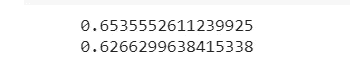

**绘制混乱矩阵:**

```
plot_confusion_matrix(Lg, x_test, 
                      y_test,xticks_rotation='vertical', 
                      include_values=False)
```

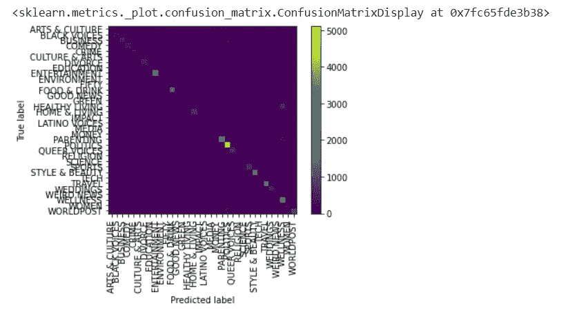

## →保存模型

```
pickle.dump(Lg,open("LogisticRegression_model.pkl","wb"))
```

# 创建 Streamlit WebApp

*   为此，我们将创建一个. py 文件，您可以使用 PyCharm、Spyder 或您选择的任何 IDE。
*   **创建一个文件夹，并将所有的腌制文件添加到其中。**
*   在同一文件夹中为 streamlit 代码创建一个. py 文件。
*   通过单击地址栏并键入 cmd，然后回车，打开 cmd。

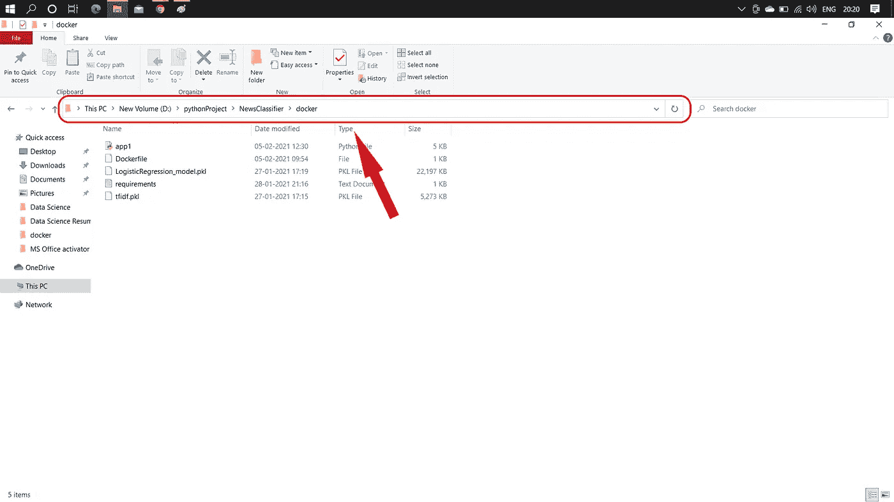

*   在 CLI 中写下:
    streamlit 运行<名称>。py 文件

## →导入库

```
import streamlit as st
import pandas as pd
import pickle
import requests
import numpy as np
import re
import nltk
from nltk.stem import WordNetLemmatizer
from sklearn.feature_extraction.text import TfidfVectorizer
#from nltk.corpus import stopwords
#import contractions
nltk.download('wordnet')
nltk.download('punkt')
nltk.download("stopwords")
```

## →加载腌制文件

```
model = "LogisticRegression_model.pkl"
vocab = "tfidf.pkl"
```

## →定义预处理文本的函数

```
def text_preprocess(text):
  lemmatizer = WordNetLemmatizer()
  filter_Sentence = '' sentence = text.lower()
  #sentence = expand_contractions(sentence)
  #sentence = spell_check(sentence)
  sentence = re.sub(r'[^\w\s]',' ',sentence)
  sentence = re.sub(r"\d", " ", sentence)#removing digits
  sentence = re.sub(r"\s+[a-zA-Z]\s+", " ", sentence)
  sentence = re.sub(r"\s+", " ", sentence, flags=re.I)
  sentence = re.sub(r"[,@\'?\.$%_]", "", sentence, flags=re.I) words = nltk.word_tokenize(sentence) words = [w for w in words if not w in stop_words] for word in words:
      #filter_Sentence = filter_Sentence + ' ' + str(word)
      filter_Sentence = filter_Sentence + ' ' + 
                        str(lemmatizer.lemmatize(word)) return [filter_Sentence]
```

## →定义向量化干净文本的函数

```
def vectorize(vocab, text):
    vec = pickle.load(open(vocab, "rb"))
    tf_new_1 = TfidfVectorizer(vocabulary = vec.vocabulary_)
    return tf_new_1.fit_transform(text)
```

## →定义预测类别的函数

```
def predict(text, model):
    Lg = pickle.load(open(model, "rb"))
    return Lg.predict(text)
```

## →定义在线获取新闻的功能

```
def retriev_news(secret, url, category, top_news):
  parameters = {
    'q': category, # query phrase
    'pageSize': top_news,  # maximum is 100
    'apiKey': secret # your own API key
  }# Make the request
  response = requests.get(url, params=parameters)# Convert the response to JSON format and pretty print it
  response_json = response.json()
  df = pd.DataFrame(response_json['articles'])
  for i in range(len(df)):
      st.title(df['title'][i])
      st.image(df['urlToImage'][i], width=750)
      st.subheader(df['description'][i])
      st.write(df['content'][i])
      #st.text(df['url'][i])
      link = df['url'][i] + "/"
      st.subheader("Watch full Story at:")
      st.markdown(link)
```

## →定义使用所有已创建功能的主功能

```
def main():
    st.title("News Classifier and Online News Fetcher")
st.image("[https://raw.githubusercontent.com/AbhigyanSingh97/NewsClassifier_And_Online_news_fetcher/main/GIF/newspaper-clipart-black-and-white-8.jpg](https://raw.githubusercontent.com/AbhigyanSingh97/NewsClassifier_And_Online_news_fetcher/main/GIF/newspaper-clipart-black-and-white-8.jpg)", width = 150, use_column_width=True, clamp = True) secret = 'SecretAPI_KEY'
    url = '[https://newsapi.org/v2/everything?'](https://newsapi.org/v2/everything?') category = [] options = ['Only Predict', 'Predict and Search the Internet', 
               'Use Manual Input']
    us_ip = st.radio("Check News online by", options) if us_ip == 'Only Predict':
           text = st.text_area("Enter your news here")
           if st.checkbox("Predict"):
              if text != "":
                  clean_text = text_preprocess(text)
                  pred = predict(vectorize(vocab, clean_text),
                                 model)
                  st.success(pred[0])
              else:
                st.subheader("Enter News to Classify in the Text
                             Area!") if us_ip == 'Predict and Search the Internet':
        text = st.text_area("Enter your news here")
        if st.checkbox("Predict"):
            if text != "":
                clean_text = text_preprocess(text)
                pred = predict(vectorize(vocab, clean_text), model)
                st.success(pred[0])
                st.write("More online news for the", pred[0])
                top_news = st.slider("Select Number of News to be 
                                    Displayed", 1, 20, 1)
                retriev_news(secret, url, pred[0], 
                             top_news=top_news)
            else:
                st.subheader("Enter News to Classify in the Text
                              Area!") if us_ip == 'Use Manual Input':
        user_ip = st.text_input("Enter the category you wanna see.")
        if st.checkbox("Search Internet"):
            if user_ip != "":
                top_news = st.slider("Select Number of News to be
                                     Displayed", 1, 20, 1)
                retriev_news(secret, url, user_ip,
                             top_news=top_news)
            else:
                st.subheader("Please Enter the Category first!")if __name__ == '__main__':
    main()
```

## →一次完成所有事情

```
import streamlit as st
import pandas as pd
import pickle
import requests
import numpy as np
import re
import nltk
from nltk.stem import WordNetLemmatizer
from sklearn.feature_extraction.text import TfidfVectorizer
#from nltk.corpus import stopwords
#import contractions
nltk.download('wordnet')
nltk.download('punkt')
nltk.download("stopwords")#-------------------------------------------------------
model = "LogisticRegression_model.pkl"
vocab = "tfidf.pkl"#-------------------------------------------------------
def text_preprocess(text):
  lemmatizer = WordNetLemmatizer()
  filter_Sentence = ''
  sentence = text.lower()
  #sentence = expand_contractions(sentence)
  #sentence = spell_check(sentence)
  sentence = re.sub(r'[^\w\s]',' ',sentence)
  sentence = re.sub(r"\d", " ", sentence)#removing digits
  sentence = re.sub(r"\s+[a-zA-Z]\s+", " ", sentence)
  sentence = re.sub(r"\s+", " ", sentence, flags=re.I)
  sentence = re.sub(r"[,@\'?\.$%_]", "", sentence, flags=re.I)
  words = nltk.word_tokenize(sentence)
  words = [w for w in words if not w in stop_words]
  for word in words:
      #filter_Sentence = filter_Sentence + ' ' + str(word)
      filter_Sentence = filter_Sentence + ' ' + 
                        str(lemmatizer.lemmatize(word))
  return [filter_Sentence]#-------------------------------------------------------
def vectorize(vocab, text):
    vec = pickle.load(open(vocab, "rb"))
    tf_new_1 = TfidfVectorizer(vocabulary = vec.vocabulary_)
    return tf_new_1.fit_transform(text)#-------------------------------------------------------
def predict(text, model):
    Lg = pickle.load(open(model, "rb"))
    return Lg.predict(text)#-------------------------------------------------------
def retriev_news(secret, url, category, top_news):
  parameters = {
    'q': category, # query phrase
    'pageSize': top_news,  # maximum is 100
    'apiKey': secret # your own API key
  }
# Make the request
  response = requests.get(url, params=parameters)
# Convert the response to JSON format and pretty print it
  response_json = response.json()
  df = pd.DataFrame(response_json['articles'])
  for i in range(len(df)):
      st.title(df['title'][i])
      st.image(df['urlToImage'][i], width=750)
      st.subheader(df['description'][i])
      st.write(df['content'][i])
      #st.text(df['url'][i])
      link = df['url'][i] + "/"
      st.subheader("Watch full Story at:")
      st.markdown(link)#-------------------------------------------------------
def main():
    st.title("News Classifier and Online News Fetcher")
st.image("[https://raw.githubusercontent.com/AbhigyanSingh97/NewsClassifier_And_Online_news_fetcher/main/GIF/newspaper-clipart-black-and-white-8.jpg](https://raw.githubusercontent.com/AbhigyanSingh97/NewsClassifier_And_Online_news_fetcher/main/GIF/newspaper-clipart-black-and-white-8.jpg)", width = 150, use_column_width=True, clamp = True)
    secret = 'SecretAPI_KEY'
    url = '[https://newsapi.org/v2/everything?'](https://newsapi.org/v2/everything?')
    category = []
    options = ['Only Predict', 'Predict and Search the Internet', 
               'Use Manual Input']
    us_ip = st.radio("Check News online by", options)
    if us_ip == 'Only Predict':
           text = st.text_area("Enter your news here")
           if st.checkbox("Predict"):
              if text != "":
                  clean_text = text_preprocess(text)
                  pred = predict(vectorize(vocab, clean_text),
                                 model)
                  st.success(pred[0])
              else:
                st.subheader("Enter News to Classify in the Text
                             Area!")
    if us_ip == 'Predict and Search the Internet':
        text = st.text_area("Enter your news here")
        if st.checkbox("Predict"):
            if text != "":
                clean_text = text_preprocess(text)
                pred = predict(vectorize(vocab, clean_text), model)
                st.success(pred[0])
                st.write("More online news for the", pred[0])
                top_news = st.slider("Select Number of News to be 
                                    Displayed", 1, 20, 1)
                retriev_news(secret, url, pred[0], 
                             top_news=top_news)
            else:
                st.subheader("Enter News to Classify in the Text
                              Area!")
   if us_ip == 'Use Manual Input':
        user_ip = st.text_input("Enter the category you wanna see.")
        if st.checkbox("Search Internet"):
            if user_ip != "":
                top_news = st.slider("Select Number of News to be
                                     Displayed", 1, 20, 1)
                retriev_news(secret, url, user_ip,
                             top_news=top_news)
            else:
                st.subheader("Please Enter the Category first!")if __name__ == '__main__':
    main()
```

# 使用 Docker 将应用容器化

> 如果您使用的是 windows，请按照此[链接](https://subhankarsarkar.com/wsl2-for-containerised-dot-net-core-development-using-docker/)在系统中安装 docker。

*   首先，创建一个 requirements.txt 文件，其中包含您已经使用过的所有包的名称，并将它保存到您创建的文件夹中，并将 app 文件与 pickled 模型一起保存。

## →创建 Dockerfile 文件

*   打开系统中的记事本，键入以下命令。

```
FROM ubuntuRUN apt-get update &&\
    apt-get install python3.7 -y &&\
    apt-get install python3-pip -yWORKDIR /streamlit-dockerCOPY requirements.txt ./requirements.txtRUN pip3 install -r requirements.txtCOPY . .EXPOSE 8501CMD streamlit run app1.py# streamlit-specific commands for config
ENV LC_ALL=C.UTF-8
ENV LANG=C.UTF-8
RUN mkdir -p /root/.streamlit
RUN bash -c 'echo -e "\
[general]\n\
email = \"\"\n\
" > /root/.streamlit/credentials.toml'RUN bash -c 'echo -e "\
[server]\n\
enableCORS = false\n\
" > /root/.streamlit/config.toml'
```

*   确保将其命名为**“docker file”**，不要有任何扩展名。

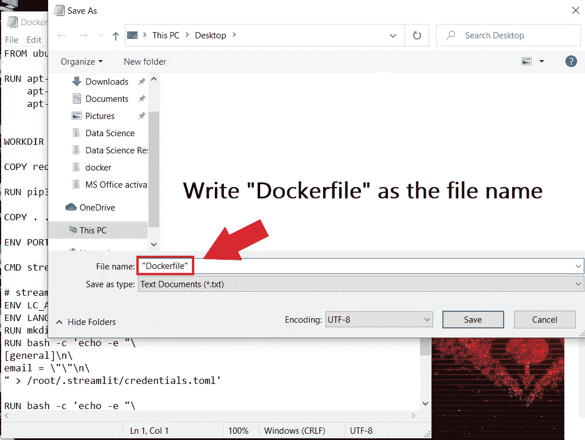

*   然后在保存类型中选择所有文件，并将文件保存在所有文件所在的位置。

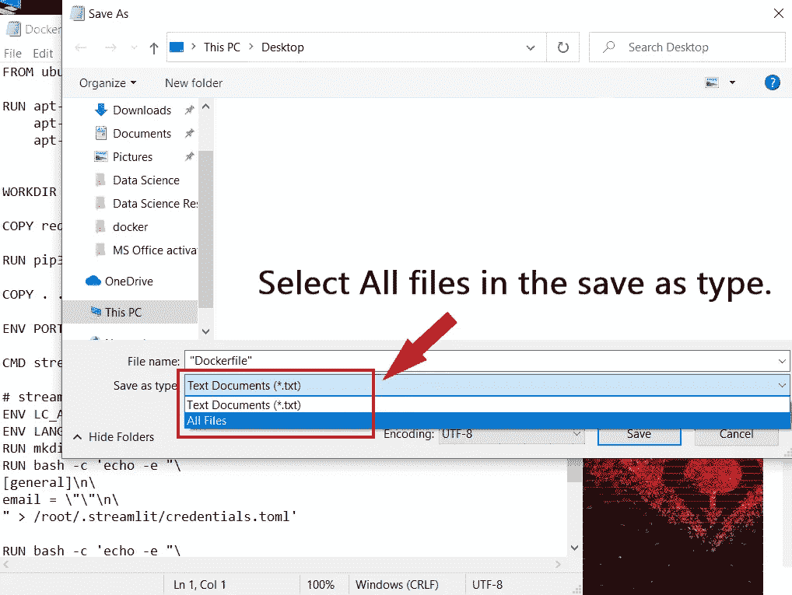

## →建立形象

*   进入保存所有文件的文件夹。
*   单击地址选项卡并键入 cmd


*   登录 docker
*   使用以下命令构建映像

```
docker build . -f Dockerfile -t <name-of-the-image>
```

## →运行容器

*   使用以下命令运行容器

```
docker run -d --rm -p 8080:8501 <image-id>
```

*   -d —告诉 docker 在附加模式下运行它，使 cmd 可以用于其他命令
*   — rm —告诉 docker 一旦停止就删除容器。
*   -p —它用于端口映射，在我的例子中，我告诉容器在本地主机 8080 端口的设备中运行。

## →从浏览器访问 Docker 容器

*   转到您的浏览器。
*   在顶部写下 **localhost:8080** 并按回车键。

## →将 Docker 图像推送到 DockerHub

*   首先，我们需要用 docker hub 帐户的名称标记图像

```
docker tag <name-of-image> <dockerhub-username>/ 
                                              <name-of-image>:latest
```

# 使用 AWS Fargate 部署映像

*   首先创建一个免费的 AWS 帐户。
*   点击此 [**链接**](https://us-east-2.console.aws.amazon.com/ecs/home?region=us-east-2#/firstRun) 进入 ECS 控制台。

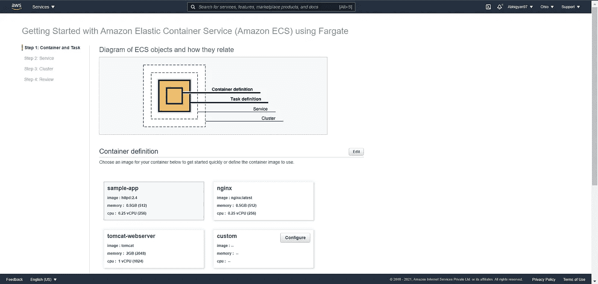

## →配置定制容器

*   单击自定义容器中的配置

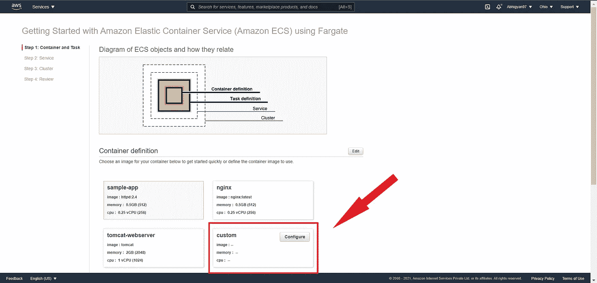

*   给出容器名称
*   在图像 URI 中，您可以直接提供 dockerhub 的存储库名称，AWS ECS 将从 DockerHub 中为您提取图像
*   在容器端口中给出 8501，因为这是我们在 docker 文件中为容器公开的端口。
*   填写完所有内容后，点击右下角的**更新**按钮。

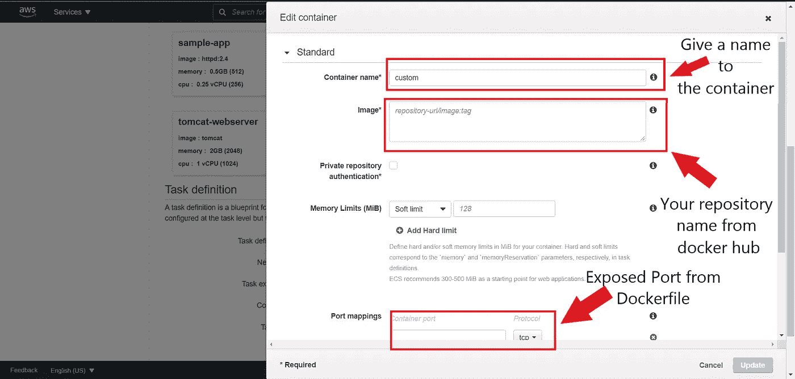

## →编辑任务定义

*   一旦您点击了**更新**按钮，您现在必须向下滚动并点击**编辑**按钮。

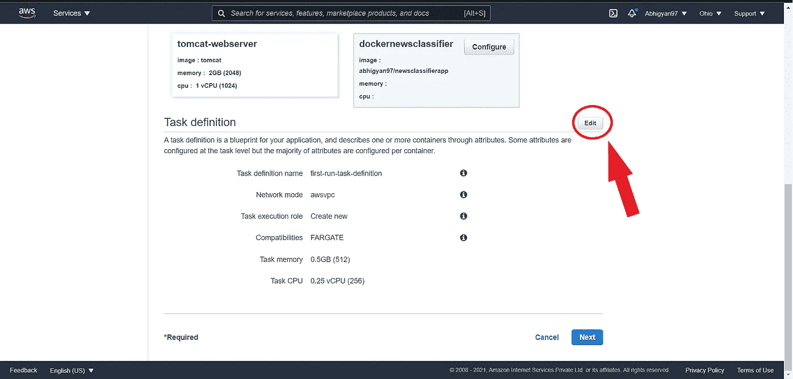

*   在这里你可以为任务定义输入你想要的名字，否则，如果你不想的话，点击保存。
*   如果你愿意，就让其余的保持原样。

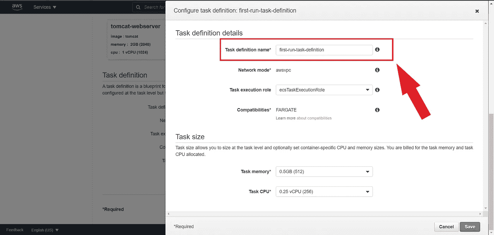

*   点击出现在右下角的 S **ave** 。
*   然后点击页面右下角出现的**下一个**按钮。

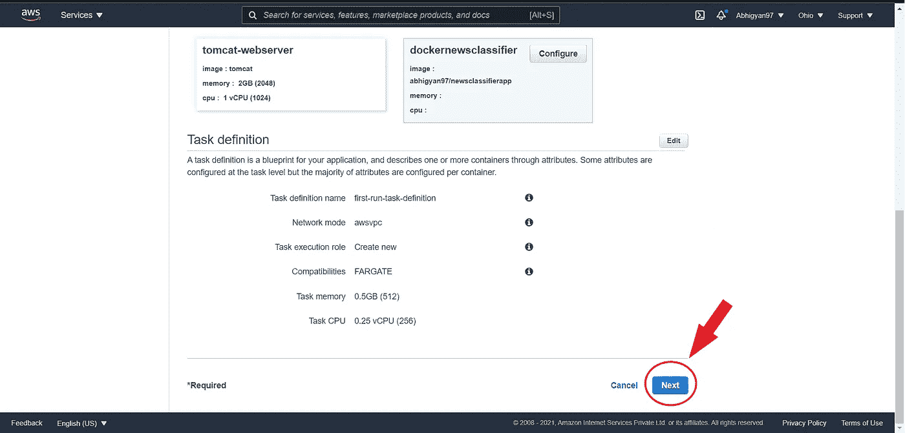

*   然后点击**应用负载平衡器**，
    这是部署容器时的一个好习惯。应用程序负载平衡器将允许拥有一个在多个服务实例之间进行负载平衡的单一端点。
*   点击右下角出现的下一个的**。**

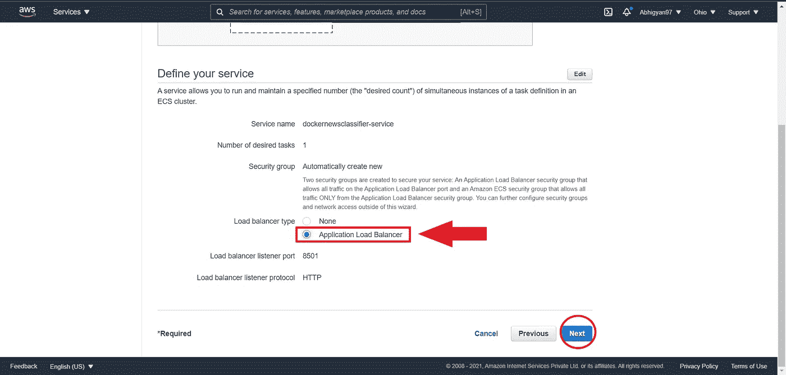

*   现在，给你的集群命名。
*   AWS 将自动为您创建 VPC ID 和子网。
*   点击右下角出现的下一个按钮**。**

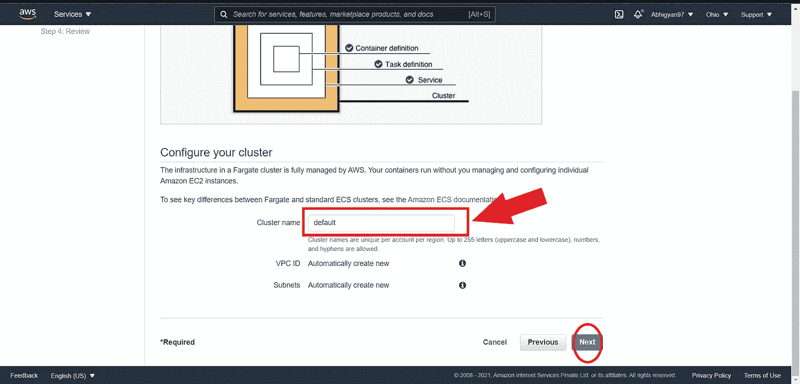

*   现在，检查您的输入并单击创建。

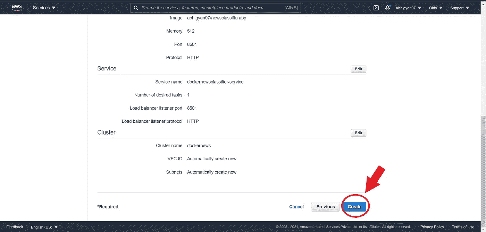

*   现在只需等待为您创建服务。

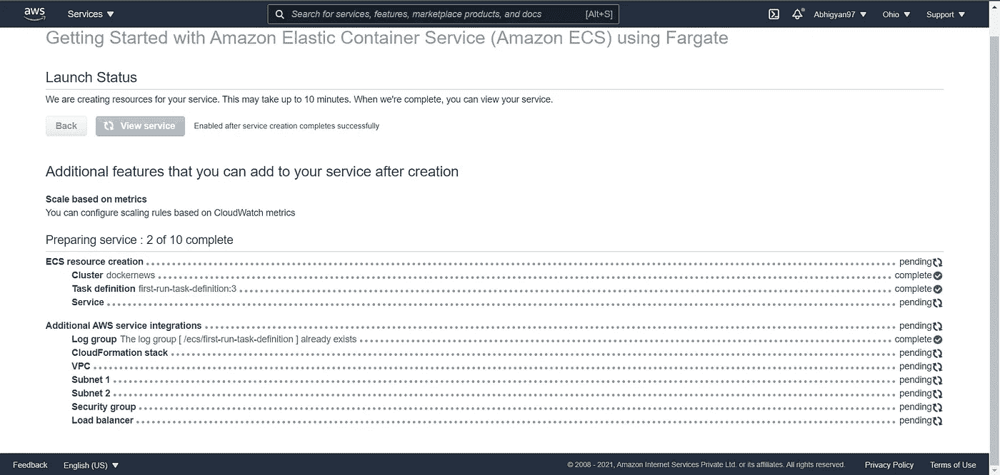

*   创建服务后，单击顶部的**查看服务**按钮。

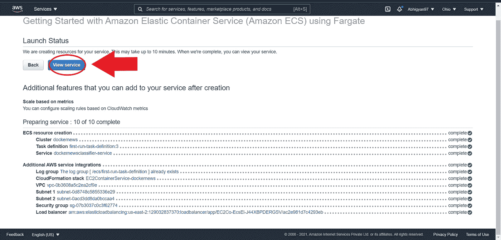

*   在服务上，向下滚动页面，点击**负载均衡**下的**目标组名称**。

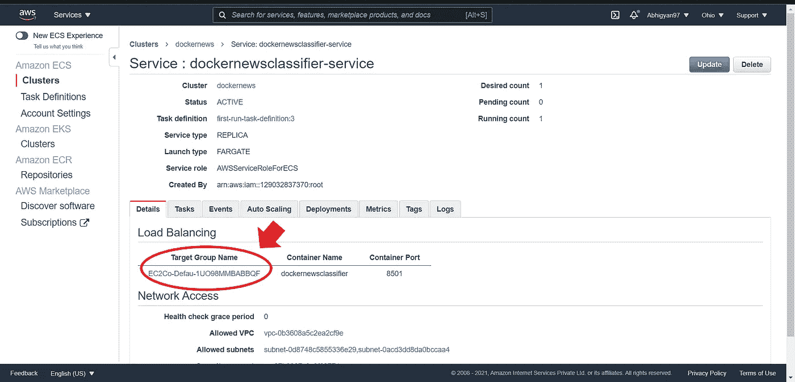

*   然后点击**负载平衡器**的链接。

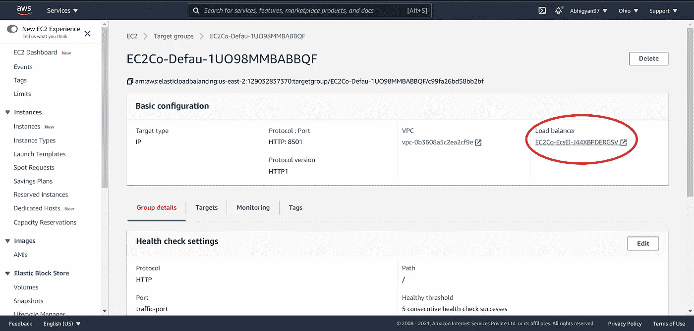

*   复制公共 DNS。

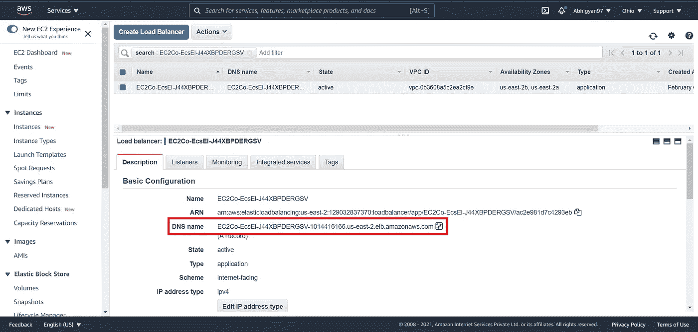

*   在浏览器中粘贴 DNS，后跟带冒号的端口。


*   给你，去吧！应用程序已成功部署在 AWS 上。

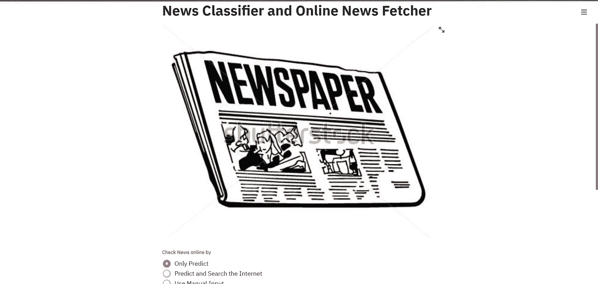

# 快乐学习！！！

检查我的 GitHub 存储库中的所有内容。

[](https://github.com/AbhigyanSingh97/NewsClassifier_And_Online_news_fetcher) [## abhigyansingh 97/新闻分类器 _ 和 _ 在线 _ 新闻 _ 提取器

### 在 GitHub 上创建一个帐户，为 abhigyansingh 97/news classifier _ And _ Online _ news _ fetcher 开发做贡献。

github.com](https://github.com/AbhigyanSingh97/NewsClassifier_And_Online_news_fetcher) 

喜欢我的文章？请为我鼓掌并分享它，因为这将增强我的信心。
此外，请查看我的另一篇文章，并与未来关于数据科学和机器学习基础系列的文章保持联系。

此外，请务必通过 LinkedIn 与我联系。


由 [Markus Spiske](https://unsplash.com/@markusspiske?utm_source=medium&utm_medium=referral) 在 [Unsplash](https://unsplash.com?utm_source=medium&utm_medium=referral) 上拍摄的照片