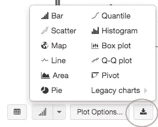
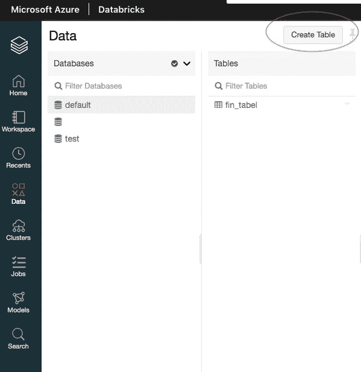
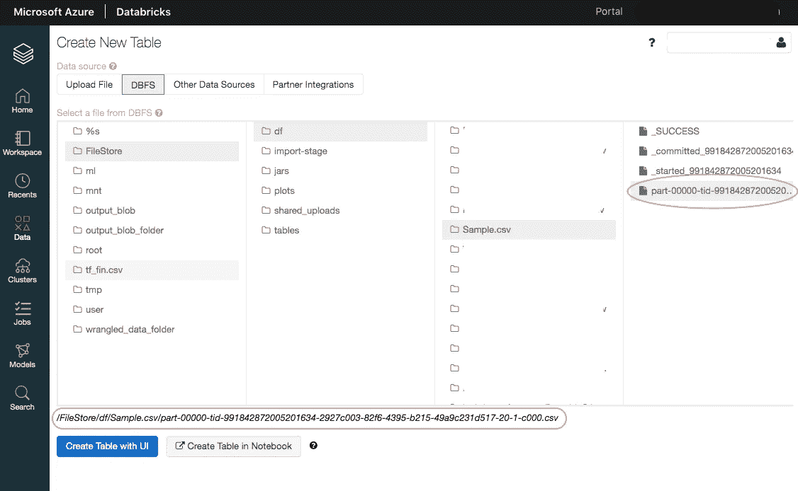

# 用砖块构建数据:微软 Azure 数据砖块

> 原文：<https://medium.com/analytics-vidhya/building-data-with-bricks-microsoft-azure-databricks-e4ed685b63c8?source=collection_archive---------14----------------------->

## 从 Synapse Analytics 迁移到 Databricks

我们与 Azure Synapse 的爱情突然走到了尽头。今天我们将学习微软提供的另一项伟大的服务。 [Databricks](https://docs.microsoft.com/en-us/azure/databricks/scenarios/what-is-azure-databricks) 有它的优势。因为它处理存储在诸如 Azure Blob 存储、Azure 数据湖存储、数据仓库和数据库之类的存储库中的数据。它还支持数据流。

从 Synapse 过渡到 Databricks 应该没什么大不了的。它提供了类似的基本功能，如接收数据、转换数据和导出完成的数据。在本文中，我们将像在 [Synapse](https://asantechild.medium.com/building-an-etl-using-azure-synapse-analytics-and-sql-pool-1-2-63da6fcf07d4) 中一样，在 Databricks 中完成一个基本的 ETL 过程。

在 Databricks 中，我们使用笔记本。Databricks 在 Quickstart 笔记本下提供教程，为您提供应用程序的入门课程。你可以使用不同的编程语言；r，Python，Scala，Java，Spark SQL，在一个笔记本里但是在不同的单元格里。你可以通过使用[魔法命令](https://towardsdatascience.com/top-8-magic-commands-in-jupyter-notebook-c1582e813560)在这些语言之间变戏法。

要开始 Databricks 中的任务，您需要在创建新笔记本后将笔记本连接到集群。要使用的集群类型取决于您的任务要求有多高。用于机器学习的 [Databricks 运行时](https://docs.databricks.com/runtime/mlruntime.html#mlruntime) (DBR 7.4ML)是一个用于为机器学习任务创建 GPU 集群的环境。24 核 168.00 GB 的集群适合大数据集上的机器学习任务。其他[选项](https://docs.databricks.com/runtime/index.html)适用于不同类型的作业。

马特·W·纽曼在 [Unsplash](https://unsplash.com?utm_source=medium&utm_medium=referral) 上拍摄的照片

要开始处理数据，您需要从数据源获取数据。这是 [ETL 过程](https://asantechild.medium.com/building-an-etl-using-azure-synapse-analytics-and-sql-pool-1-2-63da6fcf07d4#39c0)的第一部分——抽取。

在本文中，我们将使用 JDBC 驱动程序查询数据库。JDBC 的全称是 Java 数据库连接，Java API 允许我们连接到数据库并发出查询。另一种选择是基于 C 的 OBDC(开放式数据库连接)API。

要进行查询，请使用适当的凭据定义以下内容:

我们的数据存储在数据库中。尤其涉及一种 blob 存储器。因此，要访问这个数据库，请登录到您的 Azure 门户，并从您的资源中找到您的 Synapse 工作区。在 Overview 选项卡中，找到您的专用 SQL 端点，并将其复制为您的 jdbcHostname。其余的字段应该非常简单。

接下来，您需要指定访问您的数据湖存储帐户的访问密钥。将箭头启用设置为真。默认情况下是禁用的。

在笔记本中运行上述程序后，您的数据将作为 Spark 数据帧导入到 Databricks 中。阅读它的不同选项如下:

将“Spark_dataframe”替换为要读取的 Spark 表的名称。

从 blob 存储中加载表的另一种方法是:

此方法显示您可以从中选择的可用文件列表。

> 不要与数据帧和表格这两个术语混淆。它们可以互换使用。然而，数据帧通常与熊猫联系在一起。

数据的转换将使用 Python 来完成。因此，有必要将你的 Spark 数据框架转换成 Pandas 数据框架。注意我们是如何用不同的语言操作数据的。

从这里开始，在转换之后，你可以自由地使用 Pandas 来操作你的数据，以产生你想要的结果。

通过转换，任何派生表都可以保存为 CSV 文件。我们现在开始装货。我知道两种方法。我带你去看。

1.

我们需要将我们的熊猫数据帧转换成 pyspark 数据帧。

其中，desired_csv 是要转换为 csv 的熊猫数据帧。这将显示该表和一个用于下载所有行的导出按钮。

2.

替代方案:

对于这种方法，获取 csv 文件需要比前者多几个步骤。要检索文件，请选择浏览窗口左侧的数据选项卡。在打开窗口的右上角，单击创建表格。

在数据源部分，选择 DBFS 选项。选择“文件存储”，然后选择“df”，选择您生成的 csv 文件，然后单击第四个“零件…”文件，如下图所示。注意，我们指定的保存文件的路径向我们展示了在数据块中定位文件的位置。".save(" dbfs:/file store/df/Name _ to _ be _ savedas . CSV ")"。

点击您的文件后，从页面底部复制文件的路径名。

棘手的部分来了。振作起来。

将复制文本中的“/FileStore”替换为“/files”。复制新文本，并将其粘贴在浏览器搜索栏中的反斜杠之后。按回车键，你的文件会自动下载。维奥拉。

要删除 csv 文件，请在笔记本单元格中键入以下内容:

所需的输出应该是“True”，表示文件已被成功删除。如果您收到一个“假”输出，这意味着该文件没有被删除。交叉检查要删除的文件的拼写，确保它存在，然后重试。在加载到 blob 存储时，不要保存以数值开头的表名。

这篇[文章](https://towardsdatascience.com/databricks-how-to-save-files-in-csv-on-your-local-computer-3d0c70e6a9ab)帮助我学会了如何保存和删除 csv 文件。去看看另一个新鲜的视角。

## 数据块的不好之处在于:

*   在 Synapse Analytics 中，您可以在一个 Synapse 浏览器选项卡中打开多个笔记本选项卡。然而，在 Databricks 中，要同时打开多个笔记本，你必须在浏览窗口中打开多个浏览器标签。
*   如上所述，根据所使用的方法，在 Databricks 中下载 csv 文件可能会很繁琐。
*   Databricks 对笔记本中运行的单元数量有限制。超过 100 个电池会影响笔记本电脑的性能。
*   没有互联网接入，数据块就无法运行。

你看到我是如何直接从我的 [GitHub](https://github.com/OtemaY) 中整合代码的了吗，我最近学会了怎么做。我学会了如何[嵌入代码](/@aryamurali/embed-code-in-medium-e95b839cfdda)。我还学会了如何跳转到一个网页的特定部分。耶我！