# 使用 python 从头开始构建深度神经网络

> 原文：<https://medium.com/analytics-vidhya/building-deep-neural-network-from-scratch-using-python-b6256a60879?source=collection_archive---------3----------------------->

这篇文章是关于不使用 Tensorflow、keras 或 Pytorch 等库，从头开始构建深度神经网络。它由两部分组成。在第一部分中，我们将看到什么是深度神经网络，它如何从数据中学习，它背后的数学，在第二部分中，我们将谈论使用 python 从头构建一个。

> 如果你熟悉神经网络的概念，可以跳过第一部分，直接跳到“建立一个识别手写数字的网络”一节。

# 什么是深度神经网络？

在我们真正跳到什么是人工神经元和神经网络之前，让我们看看我们的生物神经网络是如何工作的。

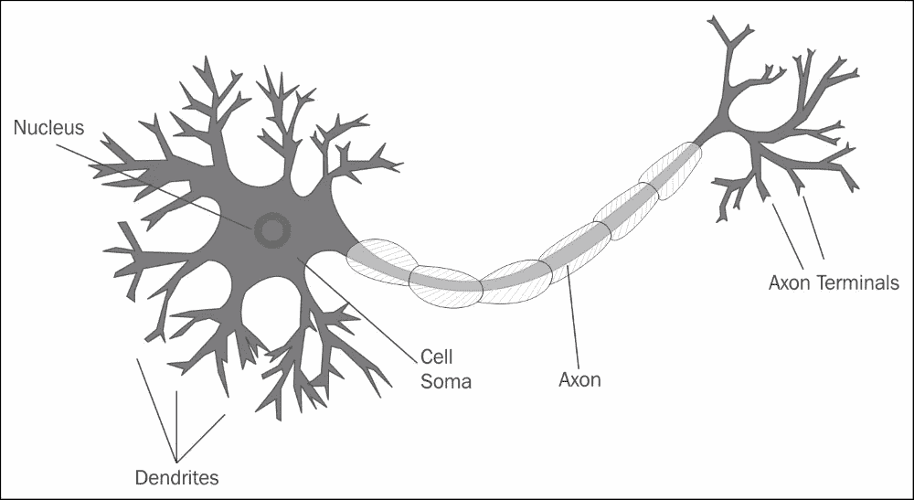

生物神经元。我[图像来源](https://www.google.com/imgres?imgurl=https%3A%2F%2Fstatic.packt-cdn.com%2Fproducts%2F9781787121393%2Fgraphics%2FB06139_05_01.jpg&imgrefurl=https%3A%2F%2Fsubscription.packtpub.com%2Fbook%2Fbig_data_and_business_intelligence%2F9781787121393%2F5%2Fch05lvl1sec38%2Fthe-biological-neuron&tbnid=ldstlSPfn1kFyM&vet=12ahUKEwjZnbjE3YXwAhVJ0FMKHbelCjgQMygCegUIARDJAQ..i&docid=lk9j8uP5HqsJ7M&w=1000&h=547&q=biological%20neuron%20image&ved=2ahUKEwjZnbjE3YXwAhVJ0FMKHbelCjgQMygCegUIARDJAQ)

生物神经网络是相互连接神经元的网络。每个神经元都有一种名为 ***的树突*** 从周围环境中收集信息。信息以电/化学信号的形式到达神经元。一旦一个神经元收到信号，它就会处理信号，如果信号达到一定的阈值，它就会通过连接到下一个神经元的 ***轴突*** 发出输出信号。下一个神经元在接收到信号时做同样的事情，并且该过程继续。

***人工神经网络*** 是隐约受到生物神经网络的启发。它是连接的人工神经元的集合。就像生物神经元一样，人工神经元也从一个神经元获得输入，进行一些计算，并将信号传输到与之相连的另一个神经元。

***深度神经网络(DNN)*** 是一种输入输出层之间有多层的人工神经网络。一层中的每个神经元都连接到下一层中的所有神经元。输入层和输出层之间的一层或多层称为隐藏层。

将一层神经元连接到前一层神经元的每个连接都有一个称为权重 **w** 的东西，它告诉我们当前神经元的激活对前一层神经元的激活有多敏感。给定层中的每个神经元都有一种叫做 bias **b.** 如果你熟悉线性回归，那么 bias 项就像是**y = MX+c中的拦截器“c”。如果 sum(mx)没有越过阈值，但神经元需要触发，则将调整 bias 以降低该神经元的阈值，使其触发。**

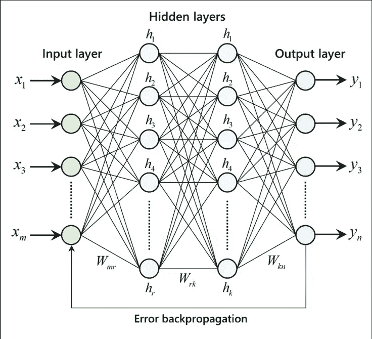

深度神经网络。[图像来源](https://www.researchgate.net/publication/329216193/figure/fig3/AS:697582816870406@1543328112943/Architecture-of-multilayer-artificial-neural-network-with-error-backpropagation.png)

整个网络看起来很复杂吧！但事实并非如此。把它想象成一个巨型函数 ***y = f(x)*** ，其中 x 是你的输入，y 是输出。在函数 *f(x)* 内部，它调用一系列函数，其中一个函数的输出传递给另一个函数。这些内部函数不过是隐藏层。

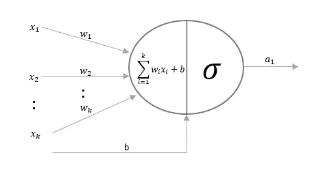

单个人工神经元

现在让我们放大到单个人工神经元。人工神经元有两个部分。在第一部分中，它接受来自前一层的输入、相应的权重、偏差，然后对它们进行线性变换。线性变换只不过是加权输入和偏差的总和。

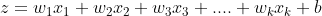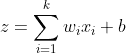

输入的线性变换

在第二部分中，它通过使用类似于 ***sigmoid*** *的激活函数将该线性变换转换为非线性变换，并发出激活函数*的输出。还有类似 ***ReLu*** 的其他各种激活函数，但我们在本帖中使用的是 sigmoid。因为这种线性和非线性变换以及多层的组合使得深度神经网络如此强大，以至于它可以拟合任何复杂的数据。


激活功能

sigmoid 函数采用加权和，并在 0 和 1 之间转换值。它将 **-infinity** 转换为 0，将 **+infinity** 转换为 1。0 到 1 之间的值表示特定神经元的激活强度。

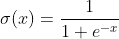

Sigmoid 函数

给定层的神经元的激活可以写成如下

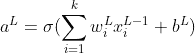

L 层单个神经元的激活函数

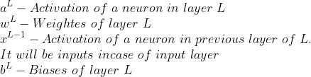

在一个典型的神经网络中，我们在一个给定的层中会有一个以上的神经元。上述等式可以用矩阵形式表示，以包括所有神经元。

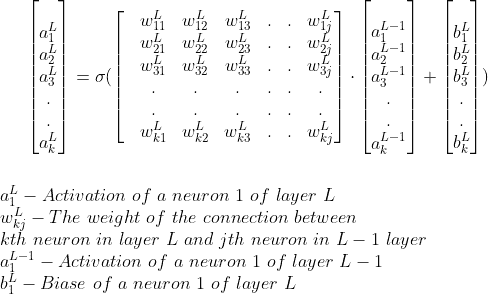

L 层激活的矩阵形式

# 训练深度神经网络

深度神经网络将从给定的数据中自我学习，并用于预测未知的数据。 ***但是我们所说的从数据中学习是什么意思呢？***

正如我们已经讨论过的，DNN 在每一层都有一组权重和偏好。神经元的激活依赖于相应的权重和偏置。因此，从数据中学习意味着找出网络的最佳权重和偏差。 ***但是我们如何找到权重和偏差呢？***

为了找到权重和偏差，深度神经网络执行以下操作:

1.  为权重和偏差分配一些随机值
2.  使用这些随机分配的权重和偏差在网络上运行训练数据(具有输入和实际输出)。在此期间，一层中激活函数的输出将作为输入传递到下一层，直到我们从输出层获得输出。这个过程叫做 ***正向传播*** 。
3.  网络的初始输出总是很糟糕，因为我们使用了随机权重和偏差。我们通过使用某种成本或误差函数来计算误差(网络预测和实际输出之间的差异)。在这篇文章中，我们将使用 ***误差平方和*** 。

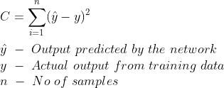

误差平方和

4.由于网络中的所有神经元都对上述误差有贡献，误差比例(误差梯度)将从输出层传递回除输入层之外的所有层，以便可以调整权重和偏差。这个传播误差以调整权重和偏差的过程被称为 ***反向传播。***

由于成本函数是权重和偏差的函数，因此将使用成本函数相对于权重和偏差的偏导数来计算误差梯度。

为了更好地理解，我们来看一个简单的网络，它有一个输入层、一个隐藏层和一个输出层。在前向传播的第一遍之后，我们将有错误。现在我们需要将误差比例传回给所有层中的所有神经元。

首先，让我们计算输出层权重和偏差的微小变化的误差梯度。为了简单起见，让我们把激活函数写成函数的函数。

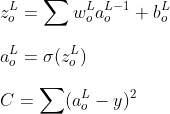

是时候刷新我们高中/大学的多元微积分了，求成本函数 C 关于权重和偏倚的偏导数。利用 ***链式法则*** ，C w.r.t w 和 b 的偏导数可以写成如下。

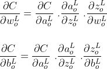

链式法则

上式中每个分量的偏导数为

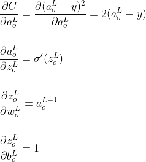

将上述偏导数的值代入链式法则方程，输出层的误差梯度 w.r.t .权重和偏差为

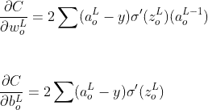

现在，让我们计算隐藏层

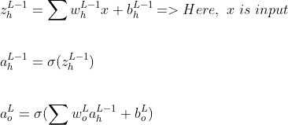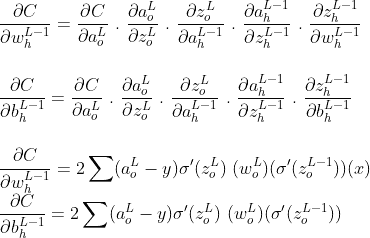

> 注意:虽然 L 和 L-1 分别代表输出层和隐藏层，为了更清楚起见，我使用了输出为 o，隐藏层为 h 的子符号

类似地，如果我们有多个隐藏层，我们可以计算所有隐藏层的误差梯度。由于我们只有一个隐藏层，反向传播到此为止。

5.上述前向和后向传播将迭代进行，权重和偏差将被调整，直到我们找到最佳值。我们将使用 ***梯度下降*** 算法，而不是使用蛮力方法。

## 梯度下降

梯度下降是一种迭代优化技术，可以找到函数的*最小值*。当很难通过代数方法找到函数参数的最优值时，可以使用它。

***直觉:*** 想象一个人站在一个陡峭的山谷上。这个人想要到达谷底，但是他不知道哪个方向会把他带到谷底。他走一步，根据当前位置决定下一个位置。如果他朝底部走，他会继续朝那个方向走，否则他会改变方向。当山谷的坡度很陡时，他会迈较大的步子，当到达谷底时，他会迈较小的步子。最终在到达谷底时停止。

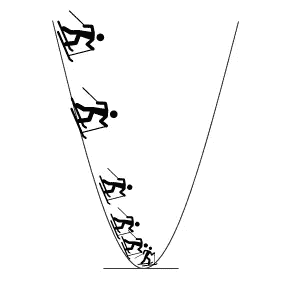

梯度下降

我们的目标是找到权重和偏差的最佳值，使得成本函数最小。梯度下降算法包括以下步骤

1.  为权重 ***w*** 和偏差 ***b*** *分配随机值，并为学习率分配常量*值
2.  通过使用梯度(我们使用偏导数计算)和学习率来更新权重和偏差。

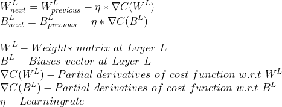

3.重复步骤 2，直到找到最小值或达到最大迭代次数

## 培训总结

让我们通过为具有 1 个输入、1 个隐藏和 1 个输出层的网络编写伪代码来总结整个训练过程

```
**initialize_weights_and_biases()**:
  output_w = initialize_random_w
  output_b = initialize_random_b
  hidden_w = initialize_random_w
  hidden_b = initialize_random_b**train(x_train, y_train, no_of_iterations, learning_rate):**
   ***# 1\. initialize network weights and biases***
   initialize_weights_and_biases() for iteration in range(no_of_iterations): **#*Run gradient descent algorithm no_of_iterations times*** ***#initialize delta of weights and biases***
       wo_delta = initialize_random_w_delta
       bo_delta = initialize_random_b_delta
       wh_delta = initialize_random_w_delta
       wh_delta = initialize_random_b_delta for x, y in zip (x_train, x_train): ***#Iterate through each sample in the training data*****# 2.forward propagation** *z_h =* hidden_w * x + hidden_b
           a_h = sigmoid(z_h ) z_o = output_w * a+ output_b
           predicted = sigmoid(z_o) ***# 3.find the error***
           error = (predicted - y) ***# 4.Back propagate the error***
           delta = 2 error * sigmoid_prime(z_o)
           wo_delta+= delta * a_h
           bo_delta+= delta 
           wh_delta+= delta * output_w * sigmoid_prime(z_h) * x
           bh_delta+= delta * output_w * sigmoid_prime(z_h)

       ***# 5\. after 1 pass of all the inputs, update the network weights***
       output_w = output_w - learning_rate * wo_delta
       output_b = output_b - learning_rate * bo_delta
       hidden_w = hidden_w - learning_rate * wh_delta
       hidden_b = hidden_b - learning_rate * bh_delta
```

# 预言；预测；预告

在训练神经网络之后，我们将得到每一层的权重和偏差的最优值。预测只不过是对测试数据执行一遍前向传播。

# 建立识别手写数字的网络

理论讲够了，让我们通过编写一个 python 程序来构建一个深度神经网络。我们将使用 **mnist** 数据集，构建一个识别手写数字的网络，深度神经网络 的 ***hello world 程序。***

mnist 数据由大小为 28 x 28 像素的扫描手写图像组成。

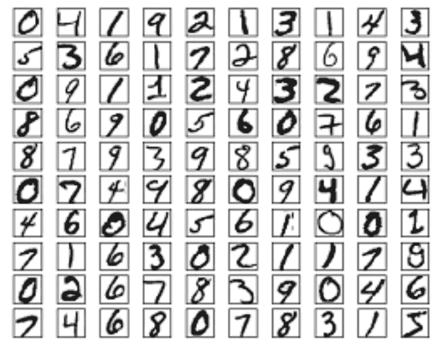

mnist 数据。[图像来源](http://neuralnetworksanddeeplearning.com/images/mnist_100_digits.png)

我们将再次考虑建立一个具有 **1 个输入层、1 个隐藏层和 1 个输出层**的网络。

下面的程序是我们上面讨论的伪代码的 python 版本。唯一的区别是我们引入了 batch，因为 mnist 数据有 60000 行数据。每次迭代都将全部 60000 行加载到内存中会耗尽内存。

***__init__*** 为输出层和隐藏层随机初始化权重和偏差。

***正向传播*** 对给定的输入执行正向传播

***update _ mini _ batch***为给定批次中的每条记录运行向前和向后传播。我们做误差增量之和是因为我们使用误差平方和，偏导数是所有样本的误差梯度之和。

```
 o_del_b, h_del_b, o_del_w, h_del_w = self.backprop(x,y)

            o_b = o_b + o_del_b
            h_b = h_b + h_del_b
            o_w = o_w + o_del_w
            h_w = h_w + h_del_w
```

每次批量运行后，它都会更新网络权重和偏差

```
 self.o_weights = self.o_weights — (l_rate/len(batch))*o_w
 self.h_weights = self.h_weights — (l_rate/len(batch))*h_w
 self.o_biases = self.o_biases — (l_rate/len(batch))*o_b
 self.h_biases = self.h_biases — (l_rate/len(batch))*h_b
```

***反向投影*** 将误差梯度传播回除输入层以外的所有层。它是神经网络的核心。正如我们前面讨论的，我们将计算误差函数相对于每一层的权重和偏差的偏导数。在代码中我们使用了 ***。transpose()*** 方法，使其遵循矩阵乘法法则( *A X B 只有在 A 是 mXn 的矩阵，B 是 nXp 的矩阵时才有可能。结果矩阵将是 mXp* 。

```
 delta = (predicted - y) * sigmoid_prime(z_o)

        o_del_b = delta
        o_del_w = np.dot(delta, a_h.transpose())

        delta = np.dot(self.o_weights.transpose(), delta) * sigmoid_prime(z_h)

        h_del_b = delta
        h_del_w = np.dot(delta, x.transpose())
```

***契合*** 方法训练网络。它接受输入，随机打乱，把数据分成几批。为每个批处理调用 update_mini_batch 函数。它为每个时期执行这些步骤。

为了读取 mnist 数据，我们将从***sk learn . datasets***包中使用 ***fetch_openml*** 。我们将使用 sklearn 将数据拆分成训练和测试

mnist 数据具有手写数字的数字化图像，因此它将具有从 0 到 255 的值。要归一化数据，请将输入除以 255，使图像分布介于 0 和 1 之间

```
X = (X/255).astype('float32')
```

由于每个图像都是 28 x 28 像素，并且深度神经网络期望输入为矢量格式，因此输入被转换为(784，1)形状，因为 28 * 28 = 784。

```
X = [np.reshape(x, (784, 1)) for x in X]
```

我们要建立的网络在输出层有 10 个神经元，因为我们需要识别从 0 到 9 的数字。如果网络将给定的数字识别为 3，那么意味着 3 的输出神经元将具有值 1，而所有其他神经元将具有值 0。

```
[0, 0, 0, 1, 0, 0, 0, 0, 0, 0]
```

由于 mnist 数据集有数字形式的 y 值，我们需要对其进行矢量化，使其具有上述形式。

让我们通过指定每层神经元的数量来创建一个网络对象，并用训练数据来训练网络

这里我们有一个网络，输入层有 784 个神经元，隐藏层有 100 个神经元(为什么是 100 个神经元？这是一个选择，我们可以使用任何数量的神经元，看看网络如何表现)和 10 个神经元的输出层

```
network.fit(train_data, 30, 10, 3.0)
```

上面的语句将输入分成 10 批，以 3 的学习率运行 30 次迭代。迭代次数、批次和学习率是网络的超参数。我们需要做超参数调整，找出最佳组合。

## 准确(性)

为了找到模型相对于测试数据的准确性，对每个数据执行正向传播，获得最大值。如果该值与 y 测试匹配，则表明模型预测正确。总测试数据的正确预测总和给出了准确度

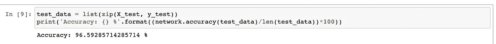

对于我们搭建的网络，测试准确率为 ***96.59 %*** 非常好。

完整的程序可以在我的 git 存储库中获得

 [## nagakedari/机器学习

### 在 GitHub 上创建一个帐户，为 nagakedari/机器学习开发做贡献。

github.com](https://github.com/nagakedari/Machine-Learning/tree/main/Deep%20Learning) 

> **注意:**这篇文章的灵感来自于[迈克尔·尼尔森](http://michaelnielsen.org/)的《神经网络和深度学习

我希望你喜欢这篇文章。快乐学习！！