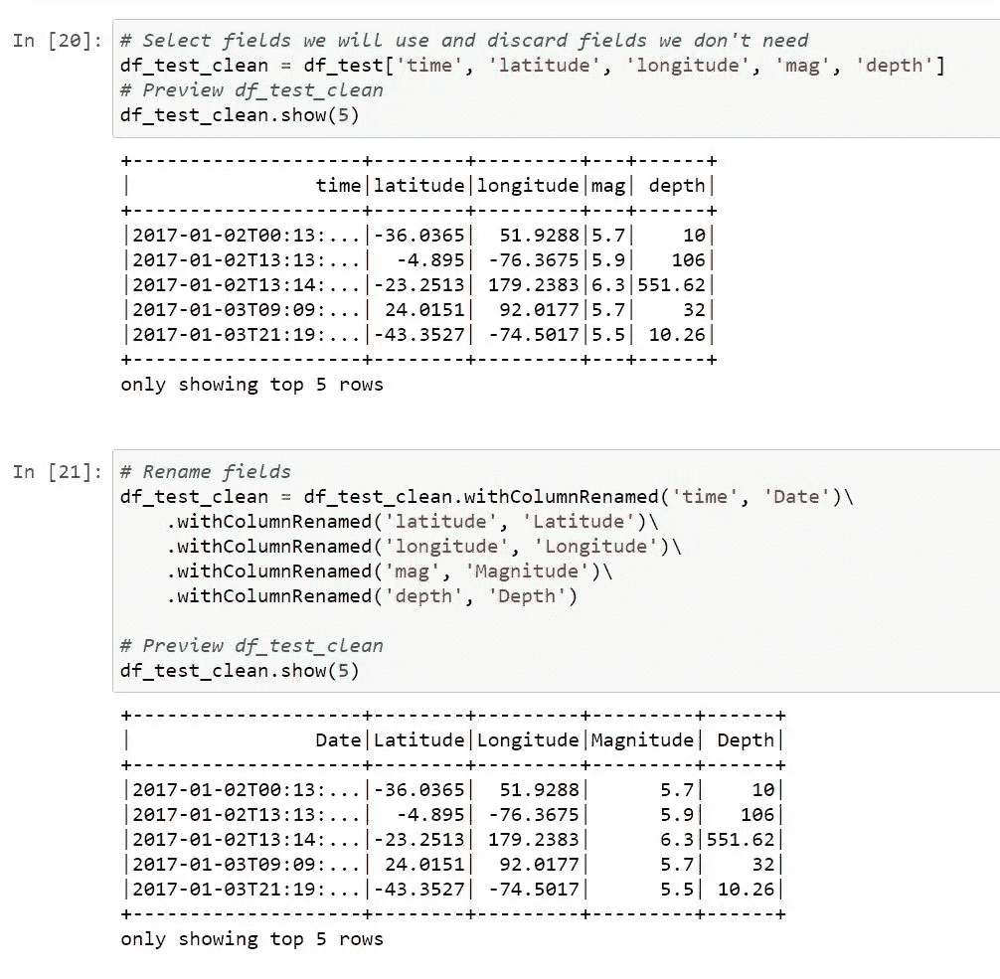
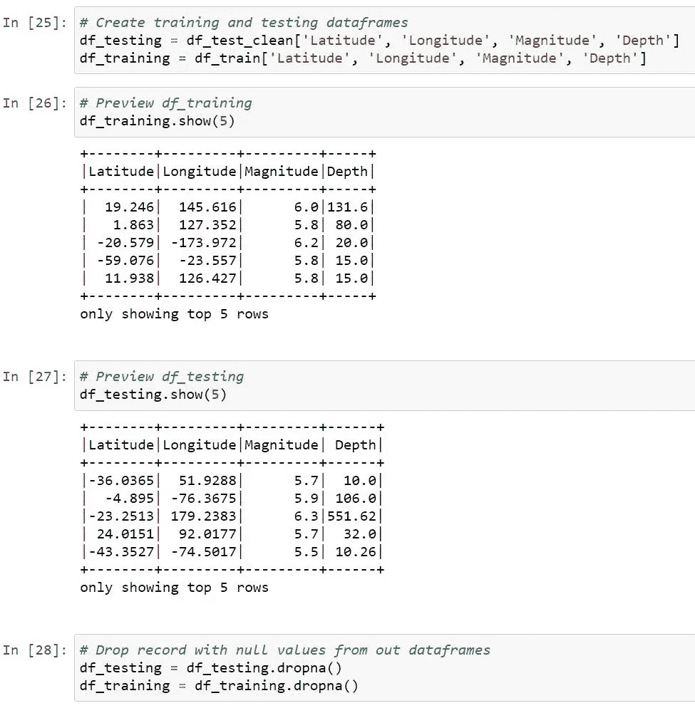
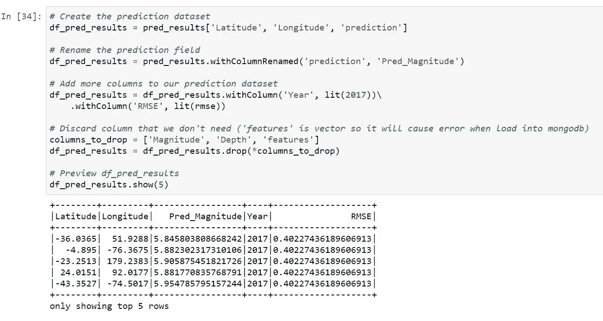
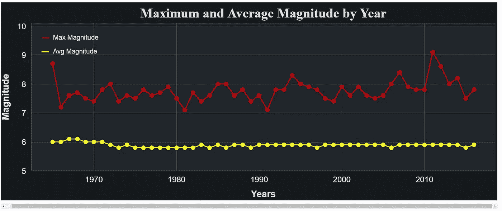

# 用 PySpark 和 Bokeh 建立地震预测模型

> 原文：<https://medium.com/analytics-vidhya/building-earthquake-prediction-model-with-pyspark-and-bokeh-3b4577dc5a26?source=collection_archive---------0----------------------->

**概述**

在本文中，我将使用 PySpark 库、用于存储数据库的 MongoDB 和用于数据可视化的 Bokeh 构建一个预测地震的模型。该数据集包含数以千计的地震，按照时间、日期、纬度、经度、深度、震级等进行分类。数据集可以在这里[下载。在这个项目中，我用的是 Jupyter 笔记本。](https://github.com/EBISYS/WaterWatch/blob/master/database.csv)


图 1 地震预测图

**目的**

该项目旨在帮助地球科学家根据 1965 年至 2016 年的历史数据预测即将发生的地震。我们用来创建模型的算法是 RandomForestRegressor。为了测试模型的准确性，我使用 1965 年至 2016 年的数据集作为训练数据，使用 2017 年的数据集作为测试数据，然后用 RMSE 进行测量。如果 RMSE 是<0.5 the model can be categorized as a good fit and reliable for predicting earthquakes.

**设置和安装**

1.  首先，我们需要使用 PySpark 和 MongoDB 建立一个数据管道架构，你可以在[我之前的文章](/@vandanylubis/how-to-setup-pyspark-and-mongodb-for-building-data-pipeline-b528f56b30aa)中找到完整的教程。
2.  安装第三方库，如 FindSpark、PySpark、pandas、NumPy、Bokeh、PyMongo 和 math。您可以使用命令 pip install library-name 或 conda install library-name(如果您使用的是 Anaconda 提示符)来安装库。

**会议 1:将 PYSPARK 与 JUPYTER 笔记本集成**

在我们完成所有的设置和安装之后，现在我们需要将 PySpark 与 Jupyter 笔记本集成，在这一步中我们需要 findspark 库。要做到这一点，我们可以简单地这样做:


图 2 集成 PySpark 和 Jupyter 笔记本

如果没有错误消息，我们可以转到 ETL 会话。

**会议 2:提取、转换、加载(ETL)**

一旦我们在 Jupyter Notebook 中成功运行 PySpark，现在我们就可以从本地目录加载数据集了。


图 3 加载数据集

加载数据集后，我们可以使用 df.take()预览列，这个函数有助于显示特定的行。在输出中，我们可以看到数据集包含许多列，因此我们不需要使用所有的列。所以我们使用 df.drop()删除不需要的列


图 4 下降柱

现在我们只能看到我们需要操作的列，数据集现在更清晰了。在我们对列进行排序之后，现在我们需要做的事情是将“Year”列追加到数据帧中。在我们将它添加到 dataframe 之前，我们需要将“日期”列的类型转换为“时间戳”,因为“日期”的原始类型是“对象”,而“对象”类型是无法提取的。所以我们可以简单地这样做:


图 5 添加年份字段

在我们将“年”列加入数据框后，现在我们可以计算每年发生多少次地震。我们可以使用 groupBy()和 count():


图 6 统计每年发生的地震

根据数据框架，我们可以看到 year 列没有按顺序排序，稍后我们可以处理这个问题。

在我们统计了一年的地震后，现在我们可以检查列中每个数据的类型，如下所示:


图 7 检查数据列类型

正如我们从输出中看到的，列的大部分类型是一个不能连接的字符串。为此，我们需要使用 cast()将一些列从字符串转换成数字类型。


图 8 将字符串列转换为数字列

在我们将字符串列转换为数字之后，现在我们可以将 df_max 和 df_avg 连接到一个名为 df_quake_freq 的新变量中。


图 9 将 df_max 和 df_avg 加入 df_quake_freq

如果这些列已经成功连接，接下来我们可以做的就是从数据帧中删除所有缺失的值。我们可以使用 dropna()。


图 10 移除空值

在我们移除了空值之后，现在数据已经可以使用了，接下来我们需要做的是将数据保存到 MongoDB 中。


图 11 将清理后的数据保存到 MongoDB 中

为了确保数据帧被正确地保存到 MongoDB 中，我们可以打开 NoSQLBooster 并扩展 Quake 数据库，如果您看到这一点，这意味着数据已经被成功存储，在这一步中忽略 pred_results。


图 12 quake.freq 和 quakes 保存成功

在训练数据已经保存之后，我们可以做的下一件事是加载测试数据。你可以从[这里](https://github.com/EBISYS/WaterWatch/blob/master/query.csv)下载测试数据。文件名为 query.csv，其内容与训练数据相同，但不同之处在于其范围仅为 2017 年。

好了，一旦你下载了文件，你现在可以用 Jupyter 笔记本加载测试和训练数据了。


图 13 加载测试和训练数据

在加载了测试和训练数据之后，接下来我们可以做的事情是选择我们想要的列并重命名它们。



图 14 从测试数据中选择并重命名我们需要的字段

如您所见，我们正在执行与之前对训练数据所做的相同的一组过程，因此现在我们检查测试数据中的字段类型，并将其从字符串转换为数字。


图 15 将字符串数据转换成数字

在我们需要的所有列都转换成数字之后，现在我们可以创建一个训练和测试数据帧，并使用 dropna()删除其中所有缺失的值。



图 16 移除空值

一旦我们移除了所有的空值，数据帧变得整洁，我们就可以进入机器学习阶段了。

**第三场:机器学习**

现在我们转移到机器学习会话，在这个过程中，我们将导入一些必要的库来创建模型。


图 17 导入 ML 库

导入我们需要的库后，我们可以创建模型。


图 18 预测模型

从上面的语法中我们可以看出，为了进行预测，我们需要将纬度、经度和深度数据聚集到一个向量中，并将其存储到一个名为 features 的新列中。之后，预测的结果会自动存储在预测列中。我们可以将预测值与测试数据中的值进行比较，两者之间的差异是可以接受的。为了验证该模型的可靠性，我们需要使用 RMSE 来测试其准确性。如果 RMSE 低于 0.5，这意味着模型是一个很好的拟合，我们可以用它来预测。


图 19 RMSE

在我们计算 RMSE 之后，结果是 0.402274，这意味着该模型是很好的拟合和可靠的。

现在，我们可以做的下一件事是创建一个预测数据集，删除我们不需要的列，并重命名一些列。



图 20 预测数据集

**会议 4:数据可视化**

现在是有趣的部分，因为我们可以通过图看到我们的模型。在我们开始创建图之前，我们需要导入一些库。其中一个库是散景，它是可视化模型的重要部分。


图 21 导入库以可视化数据

在库被导入后，我们可以做的下一件事是创建一个定制的 read 函数。这部分对于从 MongoDB 读取数据很重要。


图 22 从 MongoDB 读取数据的自定义读取函数

然后，我们提取 2016 年的数据。


图 23 2016 年的数据

然后输入 output_notebook 来验证 BokehJS 是否加载到 Jupyter Notebook 中。

好了，在我们创建了 2016 年的数据集之后，我们现在可以做的下一件事是创建一个函数来设计我们的绘图。要设置绘图样式，只需执行以下操作:


图 24 造型图

在我们创建了一个自定义样式函数之后，现在我们可以创建 Geo Map plot。使用 Geo Map，我们可以看到我们的模型应用在地球地图上。语法很长，所以我引用下面的代码:

```
# Create the Geo Map plot
def plotMap():
 lat = df_quakes_2016[‘Latitude’].values.tolist()
 lon = df_quakes_2016[‘Longitude’].values.tolist()

 pred_lat = df_quake_pred[‘Latitude’].values.tolist()
 pred_lon = df_quake_pred[‘Longitude’].values.tolist()

 lst_lat = []
 lst_lon = []
 lst_pred_lat = []
 lst_pred_lon = []

 i=0
 j=0

 # Convert lat and lon values into merc_projection format
 for i in range (len(lon)):
 r_major = 6378137.000
 x = r_major * math.radians(lon[i])
 scale = x/lon[i]
 y = 180.0/math.pi * math.log(math.tan(math.pi/4.0 +
 lat[i] * (math.pi/180.0)/2.0)) * scale

 lst_lon.append(x)
 lst_lat.append(y)
 i += 1

 # Convert predicted lat and long values into merc_projection format
 for j in range (len(pred_lon)):
 r_major = 6378137.000
 x = r_major * math.radians(pred_lon[j])
 scale = x/pred_lon[j]
 y = 180.0/math.pi * math.log(math.tan(math.pi/4.0 +
 pred_lat[j] * (math.pi/180.0)/2.0)) * scale

 lst_pred_lon.append(x)
 lst_pred_lat.append(y)
 j += 1

 df_quakes_2016[‘coords_x’] = lst_lat
 df_quakes_2016[‘coords_y’] = lst_lon
 df_quake_pred[‘coords_x’] = lst_pred_lat
 df_quake_pred[‘coords_y’] = lst_pred_lon

 # Scale the circles
 df_quakes_2016[‘Mag_Size’] = df_quakes_2016[‘Magnitude’] * 4
 df_quake_pred[‘Mag_Size’] = df_quake_pred[‘Pred_Magnitude’] * 4

 # Create datasources for our ColumnDataSource object
 lats = df_quakes_2016[‘coords_x’].tolist()
 longs = df_quakes_2016[‘coords_y’].tolist()
 mags = df_quakes_2016[‘Magnitude’].tolist()
 years = df_quakes_2016[‘Year’].tolist()
 mag_size = df_quakes_2016[‘Mag_Size’].tolist()

 pred_lats = df_quake_pred[‘coords_x’].tolist()
 pred_longs = df_quake_pred[‘coords_y’].tolist()
 pred_mags = df_quake_pred[‘Pred_Magnitude’].tolist()
 pred_year = df_quake_pred[‘Year’].tolist()
 pred_mag_size = df_quake_pred[‘Mag_Size’].tolist()

 # Create column datasource
 cds = ColumnDataSource(
 data=dict(
 lat=lats,
 lon=longs,
 mag=mags,
 year=years,
 mag_s=mag_size
 )
 )

 pred_cds = ColumnDataSource(
 data=dict(
 pred_lat=pred_lats,
 pred_long=pred_longs,
 pred_mag=pred_mags,
 year=pred_year,
 pred_mag_s=pred_mag_size
 )
 )

 # Tooltips
 TOOLTIPS = [
 (“Year”, “ [@year](http://twitter.com/year)”),
 (“Magnitude”, “ [@mag](http://twitter.com/mag)”),
 (“Predicted Magnitude”, “ [@pred_mag](http://twitter.com/pred_mag)”)
 ]

 # Create figure
 p = figure(title = ‘Earthquake Map’,
 plot_width=2300, plot_height=450,
 x_range=(-2000000, 6000000),
 y_range=(-1000000, 7000000),
 tooltips=TOOLTIPS)

 p.circle(x=’lon’, y=’lat’, size=’mag_s’, fill_color=’#cc0000', fill_alpha=0.7,
 source=cds, legend=’Quakes 2016')

 # Add circles for our predicted earthquakes
 p.circle(x=’pred_long’, y=’pred_lat’, size=’pred_mag_s’, fill_color=’#ccff33', fill_alpha=7.0,
 source=pred_cds, legend=’Predicted Quakes 2017')

 tile_provider = get_provider(Vendors.CARTODBPOSITRON)
 p.add_tile(tile_provider)

 # Style the map plot
 # Title
 p.title.align=’center’
 p.title.text_font_size=’20pt’
 p.title.text_font=’serif’

 # Legend
 p.legend.location=’bottom_right’
 p.legend.background_fill_color=’black’
 p.legend.background_fill_alpha=0.8
 p.legend.click_policy=’hide’
 p.legend.label_text_color=’white’
 p.xaxis.visible=False
 p.yaxis.visible=False
 p.axis.axis_label=None
 p.axis.visible=False
 p.grid.grid_line_color=None

 show(p)

plotMap()
```

运行语法后，现在您会看到带有圆点的地图输出。绿点代表 2017 年预测的地震，红点代表 2016 年的地震。


图 25 地震地图


图 26 2017 年印度洋预测震级预览


图 27 2016 年日本地震前瞻

好了，在我们创建了地理图之后，接下来我们可以做的是创建一个条形图。在这个柱状图中，我们可以看到每年地震的频率。


图 28 创建条形图


图 29 按年份划分的地震频率

柱状图告诉我们每年地震的趋势，根据图表我们可以看到 2010 年是地震发生次数最多的一年。

在我们创建了地震频率的条形图之后，现在我们将创建一个折线图来了解每年的震级趋势。


图 30 创建幅度图



图 31 各年最大和平均震级趋势


图 32 按年份划分的最高震级

从线图中我们可以看出，如果我们调查 2011 年发生的里氏 9.1 级地震与 1965 年至 2016 年间最高震级的 [2011 年北府地震和海啸](https://en.wikipedia.org/wiki/2011_T%C5%8Dhoku_earthquake_and_tsunami)有关，我们就可以知道。

好了，这就是我们如何预测地震和了解每年地震趋势的教程。

我希望这篇文章有助于增加我们的知识，特别是在使用数据预测和查看趋势方面。

感谢您的阅读！

编制人:Vandany Lubis

指导: [EBISYS](https://github.com/EBISYS)