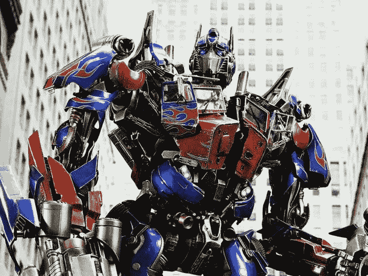

# 机器学习，构建 Flutter UI widgets 生成器

> 原文：<https://medium.com/analytics-vidhya/building-flutter-ui-widgets-generator-with-ml-8af0c1008f22?source=collection_archive---------13----------------------->

通过使用 Transformers & PyTorch 将自然英语句子转换成 Flutter widgets 代码

能不能把我们简单的英文句子转换成一些 UI 代码？在没有一定知识的情况下，我们真的能得到一个工作代码吗？



在这个博客中，我们将做一个简单的实验。我们将使用 **PyTorch** 和 **Transformers** 架构来构建一个序列到序列模型，该模型将一个英语句子作为输入，并将其转换为 Flutter UI 小部件代码作为输出。

如果你想了解更多关于变形金刚和 Seq2sqe 的内容，可以看看 [**【关注就是你所需要的】**](https://arxiv.org/abs/1706.03762) 和这篇好听的 [**文章**](/inside-machine-learning/what-is-a-transformer-d07dd1fbec04) 。

**在我们开始**之前，这个实验的目标完全是为了研究目的，我们不会在当前阶段支持所有的 Flutter 小部件，而且我们使用一些定制的小部件而不是内置的小部件来使事情变得更容易。

# 培训用数据

我们有大约 175000 对句子和 Flutter 部件代码。该训练数据完全是自动生成的。它涵盖了一些 Flutter 的主要部件。

## 样本对:

*英语句子:“*创建一个有宽度值的容器”

*颤振代码:*

```
Container(width:value,)
```

句子将是我们模型的输入，而颤振代码将是输出。

但是，既然属性是“宽度”，为什么我们有“值”而不是数字？
由于我们有许多动态属性值，如颜色、宽度、高度、填充、对齐等……
我们将对输入进行一些预处理，用关键字“Value”更改所有这些值，并将对模型的输出进行后处理，以获得真实值。
所以会是这样的:
*“*创建一个宽度为 24.0 的容器”=>*“*创建一个宽度值的容器”。

# 标记化

对于英语句子，我们将使用" *Spacy* "作为输出标记器的输入标记器，我们将构建自己的自定义标记器。我们没有为 Dart/Flutter 找到合适的记号赋予器，所以我们现在将使用 Python 的默认[记号赋予器](https://docs.python.org/3/library/tokenize.html)，它将在以后被改变。

我们将使用 PyTorch 的[torch text . data . field](https://torchtext.readthedocs.io/en/latest/data.html#torchtext.data.Field):
进行输入，我们将使用前面提到的 Spacy，它默认在 data 中实现。田

```
Input = Field(tokenize = 'spacy',
            init_token = '<sos>', 
            eos_token = '<eos>', 
            lower = True)
```

对于输出，我们应该首先创建 Python tokenize 方法。

```
from tokenize import tokenize, untokenize
import iodef tokenize_flutter_code(str_code):
    tokens = list(tokenize(io.BytesIO(str_code.encode('utf-8')).readline))
    return [it.string for it in flutter_tokens]
```

我们称之为“投掷输出场”:

```
Output = Field(tokeniz = tokenize_flutter_code ,
               init_token = '<sos>',
               eos_token = '<eos>',
               lower = False)
```

## 使用 torchtext 创建词汇

```
fields = [('Input', Input),('Output', Output)]Input.build_vocab(train_data, max_size=10000, min_freq=2)Output.build_vocab(train_data, max_size=10000, min_freq=2)
```

# 变压器模型

# 培训前流程

我们将使用[**PytorchText****bucket operator**](https://torchtext.readthedocs.io/en/latest/data.html#torchtext.data.BucketIterator)**从我们的数据集创建批处理。使用它将确保我们的输入具有相似的长度。具有相似长度输入的批次为变压器模型提供了大量增益。**

**我们将把数据集分成训练、验证和测试数据，**

**所有组件准备就绪后，我们可以开始我们的培训过程。**

**您可以查看我的[笔记本](https://github.com/TahaDouaji/English-to-Flutter-widget/blob/main/transformer_flutter.ipynb)中完整的培训流程和代码，也可以查看我的 [Github 资源库](https://github.com/TahaDouaji/English-to-Flutter-widget)中完整的项目。**

**经过大约 40 个时代后，我们有了非常好的结果，我相信随着更大的数据集和更多的训练，我们可以有一个有趣的生成器。**

# **查看样本结果:**

**输入:*“构建一个宽 33、高 44 的容器”* 输出:**

```
Container(width:33,height:44)
```

**输入:*"写*一个带有" Hello "的文本，文本大小 22 *在一行内"* 输出:**

```
Row(children:[ CustomText("Hello", textSize: 22)],)
```

**输入:*“用“my_img.jpg”和 fit BoxFit 创建*一个图像。*填充
输出*:**

```
Image.asset(**"**my_img.jpg**"**, fit: BoxFit.fill)
```

**你可以在我的 [Github 库](https://github.com/TahaDouaji/English-to-Flutter-widget)中找到更多的例子。**

**我们已经从一个有限的数据集中构建了一个简单的英文到 Flutter UI widgets 代码转换器。我们得到了非常好的结果。**

# **参考**

**[](https://github.com/TahaDouaji/ML-English-to-Flutter-widget) [## GitHub-TahaDouaji/ML-English-to-Flutter-widget:一个表示变形金刚的机器学习项目…

### 在这个库中，我们将训练 Seq2seq Transformer 机器学习模型将自然英语句子转换成…

github.com](https://github.com/TahaDouaji/ML-English-to-Flutter-widget) [](https://github.com/aladdinpersson/Machine-Learning-Collection) [## GitHub-aladdinpersson/Machine-Learning-Collection:学习 ML、DL、PyTorch 的资源…

### 在这个资源库中，您可以找到与机器学习相关的教程和项目。我试着让代码尽可能的清晰…

github.com](https://github.com/aladdinpersson/Machine-Learning-Collection) [](https://towardsdatascience.com/building-a-python-code-generator-4b476eec5804) [## 构建 Python 代码生成器

### 使用 Transformers 将英文问题语句转换成 Python 代码。

towardsdatascience.com](https://towardsdatascience.com/building-a-python-code-generator-4b476eec5804)**