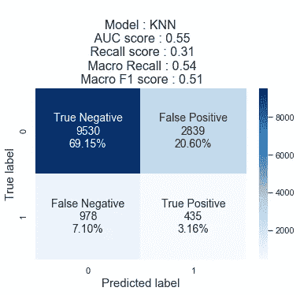

# 建立机器学习模型来预测患者是否会在 30 天内再次入院

> 原文：<https://medium.com/analytics-vidhya/building-machine-learning-model-to-predict-if-the-patient-will-be-readmitted-within-30-days-2eaed2d3669d?source=collection_archive---------10----------------------->

在美国，大约 10%的病人在出院后 30 天内再次入院。如果我们事先知道自己是否会成为那 10%中的一员，那该有多好？；)

在这篇博客中，我解释了我建立的机器学习模型，以预测完全相同的情况，即给定患者的病史，患者是否需要再次入院。

**目录:**

1.  **机器学习问题公式化**

*—* 1.1 简介
— 1.2 业务问题
— 1.3 业务约束
— 1.4 数据集分析
— 1.5 绩效指标

**2。数据清理和预处理**

— 2.1 数据清理
— 2.2 数据预处理

**3。探索性数据分析**

*—*3.1 A1C 试验结果的单变量分析
— 3.2 实验室程序数量的单变量分析
— 3.3 程序数量的单变量分析
— 3.4 住院史数量的单变量分析
— 3.5 处方药物数量的单变量分析
— 3.6 年龄的单变量分析
— 3.7 性别的单变量分析
— 3.8 年龄和住院时间的双变量分析【3.8 性别和诊断数量
— 3.10 种族和诊断数量的双变量分析
— 3.11 年龄和性别的双变量分析

**4。特征工程**

— 4.1 检查数据不平衡
— 4.2 正向特征选择
— 4.3 实施 SMOTE 进行过采样以补偿数据不平衡

**5。实现 ML 算法并查找和比较它们的性能**
— 5.1 实现 Boosting 算法
— 5.2 创建定制集成模型
— 5.3 比较所有 ML 模型

**6。最终模型培训和保存相同的**
— 6.1 模型部署
— 6.2 进一步改进的范围
— 6.3 参考资料

# **1。机器学习问题公式化**

## **1.1 简介:**

利用从 1999 年到 2008 年的 10 年间从美国 130 家医院收集的数据，我试图建立一个预测性 ML 模型，该模型将预测患者再次入院的可能性。为了做出这一预测，我考虑了住院人数、诊断人数、急诊人数以及患者病史的类似属性等因素。除此之外，我还考虑了进行的医疗检查、检查结果和开出的药物。利用这些数据，我能够建立一个 ML 模型来预测患者是否会在出院后 30 天内再次入院。

## **1.2 业务问题:**

作为医疗保险和医疗补助服务中心(CMD)-减少医院再入院计划(HRRP)的一部分，考虑到医院再入院率，医院为患者提供的医疗护理可获得报销。也就是说，再入院率高于预期(平均水平)的医院会受到惩罚，减少给予它们的财政补偿。

但是，对于这种受到处罚的医院来说，保持患者的低再入院率是一个挑战，因为没有办法确定哪个患者将被再入院或其他。因此，那些在 HRRP 下受到处罚的医院需要一种预测模型来帮助他们确定哪个患者可能会再次入院，从而相应地，他们可以提供额外的保健设施和修改的处方来防止患者再次入院，从而保持较低的再次入院率。在本案例研究中，我们将使用数据科学创建一个模型来做同样的事情，即预测患者再次入院的可能性。

## **1.3 业务约束:**

1.  **可解释性:**由于业务问题来自医疗领域，因此对错误的容忍度几乎为零，因此在某些情况下，建立的模型可能需要人工干预或手动审查。
2.  **需要类别概率:**类别概率将使我们能够确定模型能够在多大程度上区分需要再次入院的患者和其他患者。
3.  **无延迟需求:**由于模型将离线运行，并将有充足的时间来执行和提供结果，因此不需要极低的延迟。

**目的:**确定患者在确诊后的前 30 天内再次入院的概率，以便医生能够额外照顾患者，防止再次入院。

## **1.4 数据集分析:**

数据收集者:弗吉尼亚联邦大学临床和转化研究中心

**描述:**

*来源:*此数据集可用 [*此处*](https://archive.ics.uci.edu/ml/datasets/diabetes+130-us+hospitals+for+years+1999-2008) 。

该数据集代表了 130 家美国医院和综合交付网络 10 年(1999-2008)的临床护理。它包括 50 多个代表患者和医院结果的特征。从数据库中提取满足以下条件的信息。

(1)是住院患者遭遇(住院)。

(2)它是糖尿病患者，也就是说，在此期间，任何种类的糖尿病作为诊断被输入到系统中。

(3)停留时间至少为 1 天，最多为 14 天。

(4)在遭遇期间进行了实验室测试。

(5)在遭遇期间给予药物治疗。

该数据包含诸如患者编号、种族、性别、年龄、入院类型、住院时间、入院医生的医学专业、执行的实验室测试次数、HbA1c 测试结果、诊断、药物治疗次数、糖尿病药物治疗、住院前一年的门诊、住院和急诊次数等属性。

## **特征信息:**

**遭遇 ID:** 遭遇的唯一标识符

**患者编号:**患者的唯一标识符

**种族值:**白种人、亚洲人、非裔美国人、西班牙人和其他

**性别值:**男性、女性、未知/无效

**年龄:以 10 年为间隔分组:** [0，10]，[10，20]，…，[90，100)

**重量:**以磅为单位的重量，以 25 磅为间隔分组[0–25]，[25–50)，…，> 200

**入院类型:**对应于 8 个不同值的整数标识符，例如，急诊、紧急、择期、新生儿和不可用

**出院处置:**对应 26 个不同值的整数标识，例如出院回家、过期、不可用

**入院来源:**对应于 17 个不同值的整数标识符，例如，医生转诊、急诊室和转院

**住院时间:**从入院到出院的整数天，范围为[1–14]

**付款人代码:**对应 18 个不同值的整数标识符，例如，蓝十字/蓝盾、医疗保险和自费医疗保险

**医学专业:**入院医生专业的整数标识符，对应 73 个不同的值，例如，心脏病学、内科、家庭/全科和外科医生

**实验室程序的数量:**遭遇期间进行的实验室测试的数量

**程序数量:**在[0–6]范围内的遭遇期间执行的程序(除实验室测试之外)的数字数量

**药物数量:**遭遇期间使用的不同通用名的数量

**门诊人次:**患者在就诊前一年的门诊人次

**急诊次数:**患者在就诊前一年的急诊次数

**住院人次:**患者在就诊前一年的住院人次

**诊断 1:** 主要诊断(编码为 ICD9 的前三位)；717 种不同的价值观

**诊断二:**二级诊断(编码为 ICD9 的前三位)；749 种不同的价值观

**诊断 3:** 附加二级诊断(编码为 ICD9 的前三位)；790 种不同的价值观

**诊断数量:**输入系统的诊断数量，范围为[1–16]

**葡萄糖血清测试:**结果表示结果的范围或是否未进行测试。值:"> 200 "、" 300 "、"正常"和"无"，如果没有测量

**A1c 测试结果:**表示结果的范围或是否未进行测试。值:如果结果大于 8%，则为“>8”；如果结果大于 7%但小于 8%，则为“>7”；如果结果小于 7%，则为“正常”；如果未测量，则为“无”。

**药物变更:**表示糖尿病药物(剂量或通用名)是否有变更。值:“Ch”和“No”

**糖尿病药物:**表示是否开有任何糖尿病药物。值:通用名称药物的“是”和“否”24 个特征:

**用药:**'二甲双胍'，'瑞格列奈'，'那格列奈'，'氯丙胺'，'格列美脲'，'乙酰己胺'，'格列本脲'，'甲苯磺丁脲'，'吡格列酮'，'罗格列酮'，'阿卡波糖'，'米格列醇'，'曲格列酮'，'妥拉酰胺'，'甲明达'，'西托格列酮'，'胰岛素'，'格列本脲-二甲双胍'，'格列美脲-吡格列酮'，'二甲双胍-罗格列酮'，'二甲双胍-吡格列酮'。这些药物用一列表示，每一列的值为“上升”、“稳定”、“否”或“下降”，分别表示药物是否增加、保持不变、停止或减少。

**再次入院:**住院患者再次入院的天数。值:如果患者在 30 天以内再次入院，则为“0”；如果患者在 30 天以上再次入院，则为“30”；如果没有再次入院记录，则为“否”

## 1.5 绩效指标:

1.  主要绩效指标: **AUC**
2.  次要绩效指标:**混淆矩阵和召回**

**为什么是 AUC？**

由于我们的模型输出概率分数，AUC 帮助我们确定模型能够区分目标标签的程度，特别是当目标标签是概率值时。

**为什么回忆和混淆矩阵？**

我们的目标是预测患者是否会再次入院。如果模型预测不会再次入院的患者会再次入院，也就是说，如果假阳性率很高，也是可以的。然而，FN 率必须很低，这是因为，将再次入院的患者不应被忽视，因为这将最终导致医院受到处罚。我们的目标是防止医院受到处罚。召回指标正确地总结了我们的目标，因为它基于真阳性和假阴性。因此，高召回率是意料之中的。另一方面，混淆矩阵帮助我们检查高 FN 率和 FP 率之间的权衡。

# 2.数据清理和预处理

## **2.1 数据清理:**

在使用数据之前，有必要清理数据以去除冗余数据。功能“就诊 id”和“患者 id”分别对应于医疗就诊 id 和患者 id 的 id。同一个患者可能已经多次访问医院，因此，每次遇到的 id 都是唯一的，但是患者 id 可以出现多次。无论如何，我们将删除这两列，因为它们仅仅是个人信息的标识符，没有其他用途。但是，在此之前，我们将检查 patient_id 以相同的重新入院状态重复出现的行，我们将删除这样的行。因为这些行在大多数方面是相同的，因此是多余的。

使用 encounter _ id 和 patient_nbr 检查冗余行

列“examide”、“格列美脲-吡格列酮”和“citogliption”只有一个唯一值，这意味着这些列中的所有值都相同，且方差为 0，因此对发现数据中任何有意义的模式没有任何作用。所以我们会放弃他们。在类似的行中，列“二甲双胍-罗格列酮”、“二甲双胍-吡格列酮”和“乙酰己胺”各有 2 个值，但少数值只有 1 或 2 行，这不足以让 ML 模型找到任何有用的模式。因此，这些列也将被删除。

检查要素的值计数

出院处置 ids、19、20、21 表示患者已经过期，不用说，这些患者将永远不会再次入院，因此最好从数据集中删除。

性别特征有 3 个值，即男性、女性和未知/无效，第三个值只有 3 行，因此我们将删除性别未知或无效的这 3 行。

特征‘出院 _ 处置 _ 标识’、‘入院 _ 来源 _ 标识’和‘入院 _ 类型 _ 标识’有几个不同的值，它们实际上代表‘不可用’、‘空’或‘无效’数据，所以我们将它们组合在一起。

## **2.2 数据预处理:**

特征年龄表示为分类特征值，每个桶的大小为 10。这些可以更好地用每个组的年龄中值来表示。

年龄分布——以 10 个为一组，表示为分类特征

目标特征“再次入院”有 3 个值，即 30 天后、30 天前再次入院的患者和根本没有再次入院的患者。因为我们的目标是确定患者是否在 30 天内再次入院，所以让我们将其转换为具有 2 个值的二元特征，即在 30 天之前是否再次入院。

目标变量“重新接纳”的值计数条形图

数据预处理阶段的代码实现

# 3.探索性数据分析

## 3.1 试验结果的单变量分析:

一篇关于 A1C 试验的研究论文发表在《[》上，结论是接受 A1C 试验结果的患者不太可能再次入院。让我们检查相同的。](https://www.hindawi.com/journals/bmri/2014/781670/)

分析 A1C 试验结果分布及其与目标变量“再入院”的关系

**查询:** *接受 A1C 试验的患者更不容易再次入院，这是真的吗？*

从上图可以看出，进行了检测的患者和未进行检测的患者的分布几乎相同。因此，我们不能断定进行 A1C 试验意味着更少的再入院机会。

## 3.2 实验室程序数量的单变量分析

实验室程序数量的单变量分析

**查询:** *平均来说，一名患者要经历多少次实验室检查？*

从上面的 pdf 曲线可以看出，大多数患者进行了 40 到 70 次实验室检查，平均为 43 次，中位数为 44 次。对于 number_lab_procedures，再次入院和未再次入院患者的图表遵循类似的正态分布。

## 3.3 程序数量的单变量分析

**询问:** *手术数量多是否预示着更容易再次入院？*

这种关系并不存在，因为几乎一半再次入院的患者都经历了许多医疗程序。那些没有被重新接纳的人也是如此。

## 3.4 住院病历数量的单变量分析

住院人次的单变量分析

**查询:** *是住院患者的就诊史(住院！= 0)更容易再次住院，因为住院频率高表示健康状况不佳？*

计算有住院史和再次入院的患者百分比

是的，从上述图表和百分比计算中可以明显看出，15%之前入院的患者(住院患者> 0)再次入院，高于无住院史患者的百分比(8%)。因此，我们可以得出结论，有住院史的患者更有可能再次入院。

## 3.5 处方药物数量的单变量分析

**查询:** *药物数量多是否意味着患者再次入院的机会更大，因为药物数量多意味着健康状况不佳？*

如我们所见，再次入院和未再次入院患者的药物数量分布是相同的。药物的数量大多在 1-30 之间。这对于再次入院和未再次入院的患者都是一样的。因此，我们可以得出结论，大量的药物并不一定意味着健康状况不佳或有更多的机会再次入院。

## 3.6 年龄的单变量分析

年龄的单变量分析

**查询:** *有没有哪个年龄段的人更容易患病，更容易被重新接纳？*

我们可以看到，年龄在 60-80 岁之间的患者更有可能生病住院。然而，我们不能对再入院状态做出任何结论，因为再入院和其他情况下的患者分布是相同的。

## 3.7 性别的单变量分析

性别的单变量分析

**查询:** *有没有哪个性别更容易被重新接纳？*

不，如我们所见，这里男女患者的分布几乎相同。此外，10%的男性再次入院，与女性相同，即 10%的女性再次入院。

## 3.8 年龄和住院时间的双变量分析

年龄和住院时间(天数)的双变量分析

**查询:** *年龄和医疗停留之间有什么有意义的规律吗？*

对于 50-70 岁年龄组(以“55”和“65”为代表)的人，我们可以清楚地看到一种模式，即住院时间越长的患者越有可能再次入院。这一点从 violin 图中箱线图内白点代表的停留值中可以明显看出。

同样，55 岁以上的人停留时间越长，就越有可能再次入院。

**查询:** *老年患者是否需要更多的关注和更长的治疗时间？*

从上图可以明显看出，35 岁以下的患者入院时间几乎不到 4-5 天，年龄大于或等于 35 岁的老年患者往往需要 6-7 天的较长住院时间，在极少数情况下甚至需要 12-13 天。

## 3.9 性别和诊断数量的双变量分析

性别和诊断数量的双变量分析

**查询:** *性别与患者患病数量有关系吗？如果是，哪种性别更健康？*

不。正如这里看到的，男性和女性被诊断患有几乎相同数量的疾病/障碍，没有任何特定的模式会让我们得出一种性别比另一种性别更健康的结论。然而，我们可以看到，再次入院的男性大多经历了 7-9 次诊断，而女性则经历了 6-9 次诊断。

男性和女性再入院患者的诊断中值高于非再入院患者。因此，无论性别如何，有更多诊断的患者更有可能再次入院。

## 3.10 种族和诊断数量的双变量分析

种族和诊断数量的双变量分析

**查询:** *种族和患者患病数量有关系吗？如果是，哪个种族更健康？*

不。正如这里看到的，不同种族的人被诊断患有几乎相同数量的疾病/障碍，没有任何特定的模式会让我们得出一个种族比另一个种族更健康的结论。

## 3.11 年龄和性别的双变量分析

年龄和性别的双变量分析

**查询:** *从年龄的单变量分析，我们知道年纪大的人更容易被重新接纳。男女都一样吗？*

从上面的方框图可以看出，年龄大于 70 岁的老年女性更有可能再次入院，而男性则不是这样。因此，我们可以得出结论，老年女性需要更多的照顾，以防止她们再次入院。

# **4。特征工程**

数据集中缺少值

列“diag_1”、“diag_2”和“diag_3”中，缺失值的百分比小于 1%,因此这些值可以很容易地使用模式插补进行插补，因为它们是分类特征。此外，我们可以观察到这些列中不同值的数量大约为 700。如果行数对于不同值的每个组合来说都不够大，那么由于维数灾难，这肯定会导致低性能模型。然而，在这里，大多数值具有小于 100 的值计数，许多具有一位数的值计数。因此，所有计数小于 100 的值将被归入一个类别。

特征“诊断 1”、“诊断 2”和“诊断 3”中唯一值的数量

对于特征竞赛，总值的 2%缺失。由于‘高加索人’是美国和我们数据集中最大的种族，让我们用同样的方法估算那些缺失值，让我们执行模式估算。

患者种族分布

对于功能“付款人代码”，缺少 41%的数据。让我们将所有缺失值命名为“UK ”,这是“unknown”的缩写。那些丢失的值背后一定有某种模式。也许保险公司或基金提供商不愿意透露他们的细节。特征值' OT '，' MP '，' SI '和' FR '计数小于 100，ML 模型无法找到具有这些值有意义模式，因为它们计数太低。让我们用“MN”代替“minor”作为值。

付款人代码的分配

对于“权重”列，97%的数据缺失，因此我们无法执行模式插补或模型插补，也无法实施任何其他常规缺失值插补方法。丢失数据背后可能有某种原因。让我们尝试通过将其转换为二进制特征来捕获该值，这样缺失的值将被赋予值“0 ”,而存在该值的值将被赋予值“1”

对于“医疗专业”功能，49%的数据丢失。让我们为这些缺失值创建一个单独的类别，并将它们归入“未知”标签下。医学专业的许多分类值的计数小于 100。让我们将它们的分类值改为“少数”

对于诊断数量、住院患者就诊数量、急诊就诊数量、入院来源 ID 和出院来源 ID 等特征，存在数量非常少的异常值。对于所有这些特性，让我们将这些小的计数值分组在一起，并将其标记为另一个类别。

## 4.1 检查数据不平衡

让我们检查一下数据不平衡。

目标变量“重新允许”的值计数条形图

只有 1/10 的患者在 30 天内再次入院，因此，我们的数据非常不平衡。我们将在训练测试分割后处理数据集中的不平衡，因为我们只需要对训练数据而不是测试数据执行过采样。

## **4.2 正向特征选择:**

大约有 41 列，但是，我们不确定它们是否都有用。因此，让我们执行正向特征选择，并且只选择那些实际上有助于提高模型性能的特征。

正向特征选择的代码

在验证数据上打印获得的 8 个最佳特征以及可能的最高 AUC 分数

因此，我们得到了 8 个实际上有用的特征，它们将有助于确定目标变量。

## 4.3 为过采样实现 SMOTE 以补偿数据不平衡

正如我们所看到的，数据是高度不平衡的，对于像逻辑回归、决策树和随机森林分类器这样的模型，我们可以使用参数“class_weight”(由 sklearn 提供)并将其设置为“balanced”来处理数据不平衡。然而，对于朴素贝叶斯和 KNN，我们没有这个参数。因此，我们将使用 SMOTE 技术执行过采样，以补偿数据集中的不平衡

# **5。实施 ML 算法并比较其性能**

既然我们已经准备好了数据并选择了最佳特征，让我们实现满足我们业务约束的经典机器学习算法。我们将实现逻辑回归，决策树分类器，随机森林分类器，朴素贝叶斯和 K-最近邻。

实现经典的 ML 模型

下面是混淆矩阵以及训练的 ML 模型的 AUC 和回忆分数。

逻辑回归的性能度量

逻辑回归似乎表现得相当好，因为 TP 的数量高于其他模型，同时，FN 的数量也低于其他模型。

决策树(左)和 K 近邻(右)的性能指标

决策树似乎也表现得很好。然而，KNN 表现不佳。

朴素贝叶斯和随机森林分类器模型的性能度量

随机森林和朴素贝叶斯具有几乎相同的 auc 分数，但在回忆分数上有所不同，从回忆分数的角度来看，先验似乎表现得更好。

## **5.1 实现升压算法**

使用 boosting 的算法往往比简单的 ML 算法执行得更好。让我们实现 XGBoost 分类器和 AdaBoost 分类器，以检查它们是否能比其他模型执行得更好。

XGBoost 和 AdaBoost 分类器的代码实现

让我们来看看他们的表现。

XGBoost 分类器和 AdaBoost 分类器的性能指标

AdaBoost 表现不佳，但 XGBoost 表现似乎与逻辑回归模型一样好。

## **5.2 创建定制集合模型**

让我们更进一步，创建如下定制集合模型:

1.  将数据集分为训练集和测试集。
2.  将训练数据集分成两个相等不相交的子集- D1 和 D2
3.  创建 D1 的 k 个子样本，并为每个子样本数据集构建基础模型。根据 D1 相应的二次抽样数据训练这些基本模型。
4.  将 D2 数据作为测试数据集，对所有基础模型进行预测。水平连接所有这些 k 基础模型的预测，以创建一个新的数据集，比如说元数据集。使用 D2 的标签作为其目标变量。
5.  在此元数据集上训练元模型
6.  通过将测试数据集提供给基础模型，然后堆叠基础模型的预测以创建将作为元模型输入的元数据集，来检查此元模型在测试数据集上的性能。
7.  这种基础模型和元模型的组合就是我们的定制集合模型。

实现自定义集成模型

这是定制合奏模型的分数。

集合模型的性能度量

定制的集合模型表现良好，但未能超过 XGBoost 或逻辑回归的性能。

## 5.3 比较所有 ML 模型

比较迄今为止构建的所有 ML 模型

XGBoost 分类器和逻辑回归都表现良好，让我们选择逻辑回归，因为它的召回分数明显高于 AUC 在逻辑回归相同范围内的任何其他模型。

打印最佳参数以及选定的特征，以训练最终模型

# 6.最终模型训练和保存

现在，我们已经完成了模型，即逻辑回归和最佳选择特征。让我们继续训练我们的最终模型，在测试数据集上测试它的性能，并保存它以供将来评估。

由逻辑回归模型对测试数据给出的 AUC 分数是. 65，回忆分数是 0.61。让我们继续部署模型。

## **6.1 车型部署**

我已经在 AWS EC2 实例上部署了该模型。你可以在这里使用它。我已经使用 Flask API 部署了模型。目前注册在免费层下，但可以扩展到付费层进行大规模生产的层面。

Web 应用程序—再入院状态预测器

如何使用再入院状态预测器？

1.  为 8 个下拉字段输入所有值。
2.  点击“提交”按钮。页面将在几秒钟内自动重新加载。
3.  按下“获取报告”按钮。一个弹出框将向您显示报告。

再入院状态预测器给出的输出

## **6.2 进一步改进的范围:**

目前，该模型是在大约 50，000 个观察值的非常有限的数据上训练的。为了进一步改善模型性能，我们可以在数据收集方面投入精力，以尽量减少数据的不平衡。这肯定会导致更好的执行模型。如果我们获得了大量的数据，我们可以使用更先进的深度学习算法来进一步提高分类器的 AUC 分数。

## **6.3 参考文献:**

1.  [混乱矩阵可视化博客](/@dtuk81/confusion-matrix-visualization-fc31e3f30fea)
2.  [使用 SMOTE 进行过采样](https://machinelearningmastery.com/smote-oversampling-for-imbalanced-classification/)
3.  [Kaggle 数据集描述](https://www.kaggle.com/iabhishekofficial/prediction-on-hospital-readmission)
4.  [应用人工智能课程](http://www.appliedroots.com)

完整的代码和模型实现可以在我的 GitHub 库中找到。你可以在这里查看[。](https://github.com/rishikeshF/Diabetic_patient_readmission_rate_predictor/blob/main/Model_construction.ipynb)

你可以在 LinkedIn [这里和我联系。](https://www.linkedin.com/in/rishikesh-fulari-277002129/)