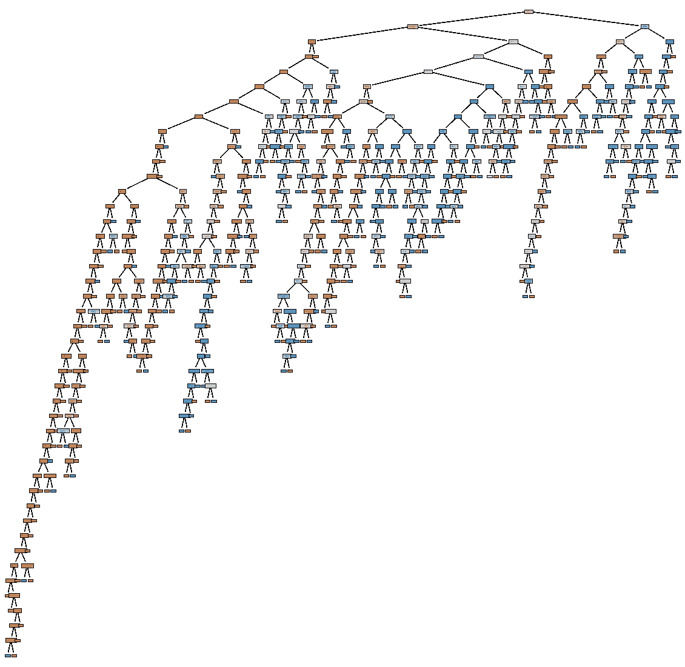
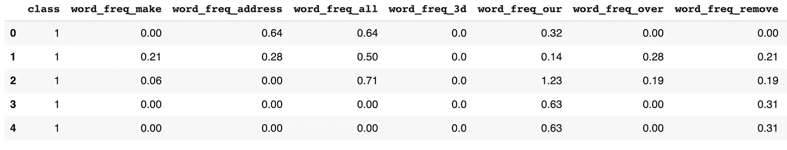
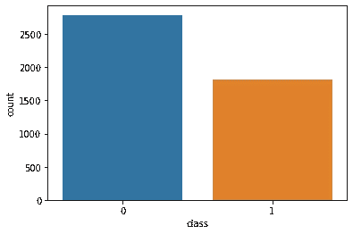
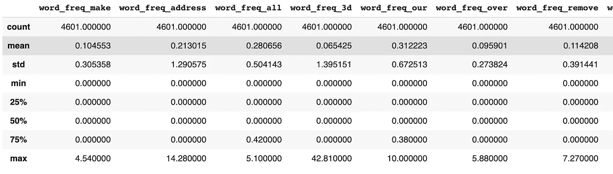
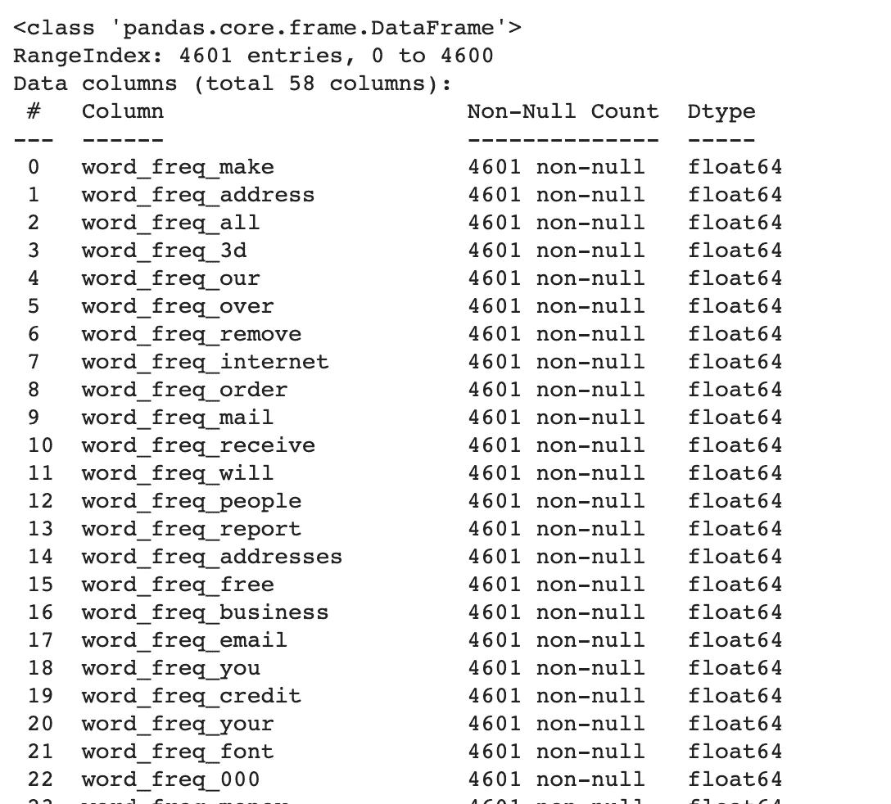
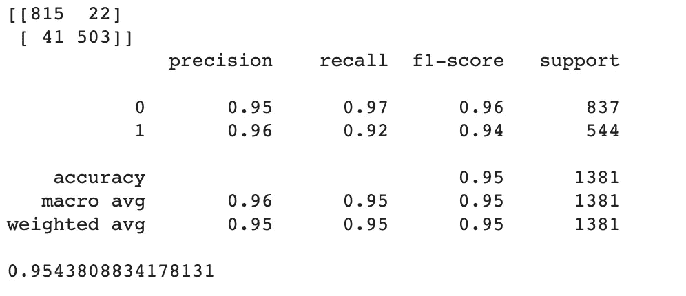
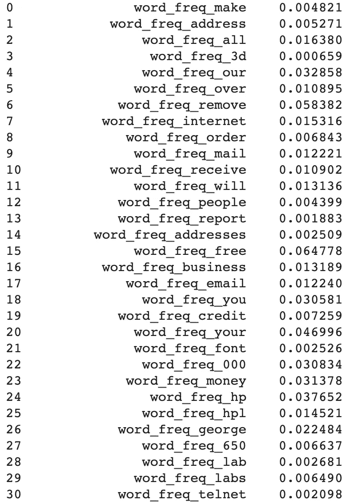
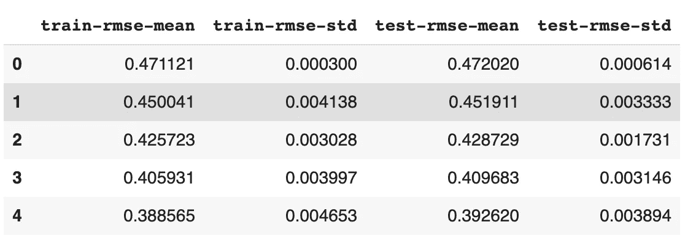
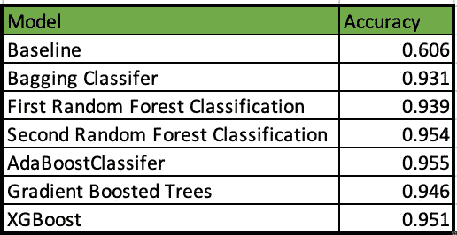

# 建立机器学习模型来检测电子邮件中的诈骗

> 原文：<https://medium.com/analytics-vidhya/building-machine-learning-models-to-detect-scams-in-email-41ef3bd86bdb?source=collection_archive---------4----------------------->



这是我们将要构建的随机森林算法中的一棵决策树。决策树对电子邮件是否是骗局进行分类。如你所见，决策树会变得非常复杂。

你曾经想学习如何检测电子邮件中的骗局吗？在这篇文章中，我深入研究了如何构建不同的机器学习模型来实现这一点。本文要求具备 Python 和 Pandas 的基础知识，以便能够构建模型。我们将使用 Sci-kit Learn 的机器学习库来构建算法，以检测该电子邮件是否是一个骗局。我们将使用 UCI 的 [Scambase 数据集](https://archive.ics.uci.edu/ml/datasets/spambase)，它包括一个特征列表和一个分类，如果它是一个骗局(1)或不是(0)。你可以通过 Scambase 网站看到数据和数据定义。让我们首先探索数据以了解更多信息。

```
# importing some packagesimport pandas as pdimport matplotlib.pyplot as pltimport seaborn as snsfrom sklearn.metrics import accuracy_score
```

好的，亲爱的。我们来看看数据框。

```
df = pd.read_csv('spambase.csv')print(df)
```



接下来，看看有多少诈骗邮件(1)对非诈骗邮件(0)。

```
# finding how many spam vs non-spam emails there aresns.countplot(x = 'class', data = df)
```



如你所见，非诈骗邮件比诈骗邮件多。我们必须在以后对我们的数据集进行分层，以确保一个好的结果。接下来，让我们看一些关于数据集的统计数据。

```
print(df.describe())
print(df.info())
```



注:共有 4601 个条目和 51 列。

好极了。我们准备开始使用机器学习。让我们建立我们的训练和测试集。出于再现性目的，我将继续将“random_set”设置为 42。

```
X = df.iloc[:,1:]y = df.iloc[:,0]# partition data into training and testing setsX_train, X_test, y_train, y_test = train_test_split(X,y,test_size=0.3,stratify=y,random_state=42)
```

现在让我们来计算基线预测。这仅仅是基于最频繁发生的预测。

```
# computing baseline accuracyfrom sklearn.dummy import DummyClassifierdummy_classifier = DummyClassifier(strategy='most_frequent')dummy_classifier.fit(X_train,y_train)baseline_acc = dummy_classifier.score(X_test,y_test)### For verifying answer:print("Baseline Accuracy = ", baseline_acc)**Baseline Accuracy =  0.6060825488776249**
```

**先试试什么机器学习方法？**让我们试试自助抽样方法。这是一个随机的替换样本。这意味着我们实际上可以对同一个样本进行两次采样。我们可以试试 Skikit Learn 的“装袋分类器”。这种方法根据数据的随机子集拟合基本分类器，然后聚合它们各自的预测。

```
from sklearn.ensemble import BaggingClassifier
from sklearn.metrics import accuracy_score baggingclassifer = BaggingClassifier(random_state= 42)
baggingclassifer.fit(X_train,y_train)predict_bagging_score = baggingclassifer.predict(X_test)accuracy_score_baggingclassifer = accuracy_score(y_test,predict_bagging_score)print(accuracy_score_baggingclassifer)**0.9312092686459088**
```

哇，对于我们的第一个模型来说，这已经很不错了！**接下来，让我们试试随机森林分类。**这也是另一种套袋方式。这个方法很棒，因为算法中的树是*去相关的*。通过在算法中去相关树，我们减少了方差。这是因为集成方法中的高相关树可能具有权重非常大的特征，从而导致低偏差和高方差。在随机决策森林中，每棵树都会吐出一个预测，得票最多的类成为输出。

```
from sklearn.ensemble import RandomForestClassifierrandomForestClassifer = RandomForestClassifier(n_estimators=10,max_features=10, random_state= 42)randomForestClassifer.fit(X_train,y_train)predict_randomforest_score = randomForestClassifer.predict(X_test)accuracy_score_randomforest = accuracy_score(y_test,predict_randomforest_score)print(accuracy_score_randomforest)**0.939174511223751**
```

如果我们决定增加树的数量，减少特征的数量会怎么样？

```
randomForestClassifer = RandomForestClassifier(n_estimators=100,max_features =5, random_state= 42)randomForestClassifer.fit(X_train,y_train)predict_randomforest_score = randomForestClassifer.predict(X_test)accuracy_score_randomforest = accuracy_score(y_test,predict_randomforest_score)print(accuracy_score_randomforest)**0.9543808834178131**
```

让我们看看我们的随机森林决策树的报告。

```
from sklearn.metrics import classification_report, confusion_matrix, accuracy_scoreprint(confusion_matrix(y_test,predict_randomforest_score))print(classification_report(y_test,predict_randomforest_score))print(accuracy_score(y_test, predict_randomforest_score))
```



让我们想象一下随机森林中的一棵决策树是什么样子的。

```
from sklearn import treefrom matplotlib import pyplot as pltplt.figure(figsize=(20,20))# plotting the second Decision Tree_ = tree.plot_tree(randomForestClassifer.estimators_[1], feature_names=X.columns, filled=True)
```


接下来，让我们看看随机森林分类器的特征重要性。

```
feature_importances = randomForestClassifer.feature_importances_features = X_train.columnsdf1 = pd.DataFrame({'features': features, 'importance': feature_importances}).nlargestprint(df1)
```



注意:此屏幕截图没有显示所有功能。#1 预测因子是要素#51，即 char_freq_%21。

**接下来让我们尝试一些助推方法。** Boosting 仍然用替换进行采样；然而，仍然有一些根本的不同。Boosting 允许我们选择在后续包中建模不佳的数据实例，并根据这个错误对它们进行加权。我们先来试试 Ada boost 算法。该算法在开始时对所有数据点具有相等的权重。当 Adaboost 通过每个包时，它将增加错误分类观察的权重。

```
from sklearn.ensemble import AdaBoostClassifierfrom sklearn.tree import DecisionTreeClassifierbase_est = DecisionTreeClassifier (max_depth =2)ada_boost = AdaBoostClassifier(base_est, n_estimators=500, random_state=42, learning_rate=.05)ada_boost.fit(X_train, y_train)predict_adaboost_score = ada_boost.predict(X_test)accuracy_score_adaboost = accuracy_score(y_test,predict_adaboost_score)print(accuracy_score_adaboost)**0.9551049963794352**
```

**让我们试试渐变助推树(GBT)。**这也是一种 bagging 方法，试图修复前面模型的错误。

```
from sklearn.ensemble import GradientBoostingClassifiergradientBoostingClassifier = GradientBoostingClassifier()
gradientBoostingClassifier.fit(X_train,y_train)predict_gradientBoostingClassifier = gradientBoostingClassifier.predict(X_test)accuracy_score_gradientBoostingClassifier = accuracy_score(y_test,predict_gradientBoostingClassifier)print(accuracy_score_gradientBoostingClassifier)**0.946415640839971**
```

**最后，我们来看看 XGBoost。**这是另一个很棒的 boosting 算法，因为它的出色表现而广为人知。它允许简单的交叉验证和规范化。

```
import xgboost as xgb# create an optimized structure for xgb
data_dmatrix = xgb.DMatrix(data=X,label=y)xg_reg = xgb.XGBClassifier(objective ='reg:linear', colsample_bytree = 0.3, learning_rate = 0.1,max_depth = 5, alpha = 10, n_estimators = 100)xg_reg.fit(X_train,y_train)
xgb_predict = xg_reg.predict(X_test)xgb_accuracy_score = accuracy_score(y_test,xgb_predict)print(xgb_accuracy_score)**0.9507603186097031**
```

太好了。现在我们可以使用 XGBoost 进行 k 重交叉验证。这导致偏差较小的结果。我们可以通过将数据集分成 k 个组，细分一个测试数据组，并将剩余的组用于训练来实现这一点。让我们建立五重交叉验证。

```
params = {"objective":"reg:linear",'colsample_bytree': 0.3,'learning_rate': 0.1,'max_depth': 5, 'alpha': 10}cv_results = xgb.cv(dtrain=data_dmatrix, params=params, nfold=5,num_boost_round=50,early_stopping_rounds=10,metrics="rmse", as_pandas=True, seed=42)print(cv_results.head())
```



现在总结一下:



如您所见，第二个随机森林分类 XGBoost 和 AdaBoost 分类器非常接近，准确率为 95%。我们发现，将电子邮件分类为垃圾邮件的第一预测指标是“char_freq_%21”。

**想了解更多代码吗？这里是** [**Github 库**](https://github.com/drewm8080/Detecting-Scam-Emails-Using-Machine-Learning-) **。**

**请关注我的**[**Linkedin**](http://www.linkedin.com/in/andrewlmoore2020)**。**