# 建立 ML 模型对交通标志进行分类

> 原文：<https://medium.com/analytics-vidhya/building-ml-models-to-classify-traffic-signs-37534e1c53e5?source=collection_archive---------6----------------------->

# **概述**

> 我的项目旨在建立一个高精度的 ML 模型，根据某些输入变量来检测交通标志的类型。
> 
> 对于自动化和自动驾驶汽车的未来来说，这是一个至关重要的项目。为了确保道路上行人和乘客的最高安全水平，自动驾驶汽车需要能够预测交通标志的最先进技术。
> 
> 因此，我的交通标志检测项目可以让自动驾驶汽车准确预测交通标志，让我们离更安全的道路和高速公路更近一步。

# 探索性数据分析

**检查缺失值**

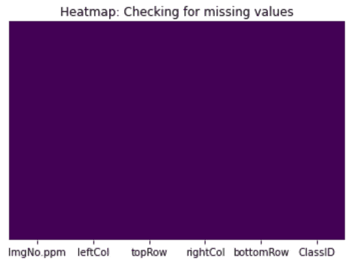

图 1:检查缺失值的热图

我从检查数据集的形状和结构开始。然后，继续检查我的数据集中是否有任何丢失的值。

由于左侧的热图颜色一致，我们知道数据集中没有缺失值。

如图 2 所示，有四个显示感兴趣区域的**输入变量**，这有助于我们对代表交通标志类型的离散输出变量——classID——进行分类:

*   顶行(顶行)
*   底部行(底部行)
*   左栏(左栏)
*   右栏(右栏)

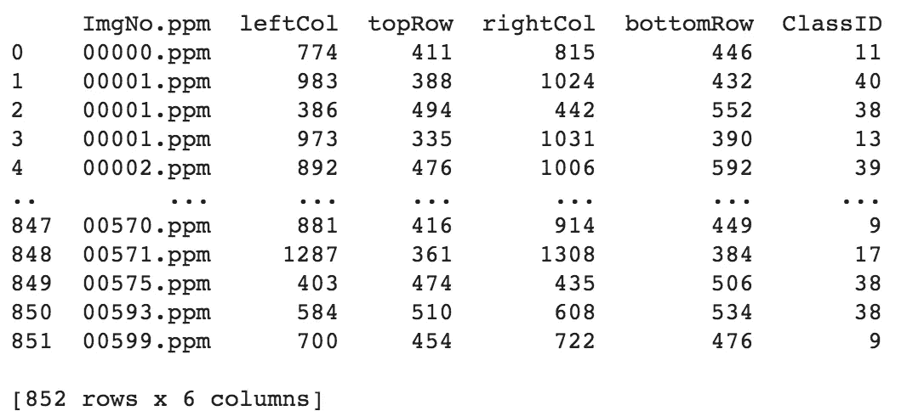

图 2:交通标志数据框

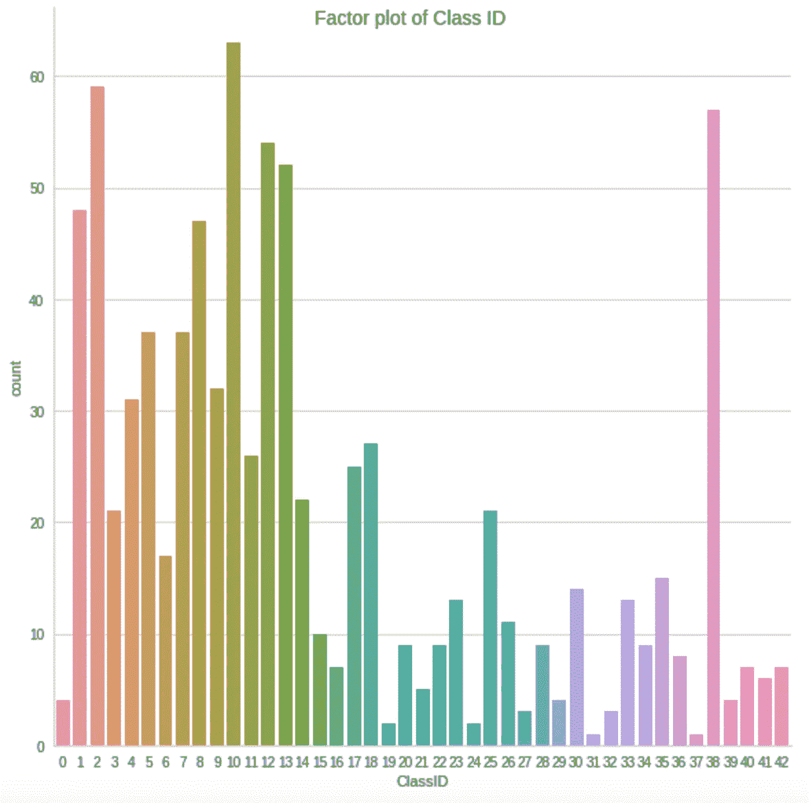

图 ClassID 的因子图

左侧的因子图显示了代表不同交通标志的每个 classID 的数量。

显然，这是一个多类分类问题，因为输出变量可以是从 0 到 42 的任何离散数字。因此，我不能使用回归，因为我不想根据某些独立变量和控制变量来预测连续的产量。

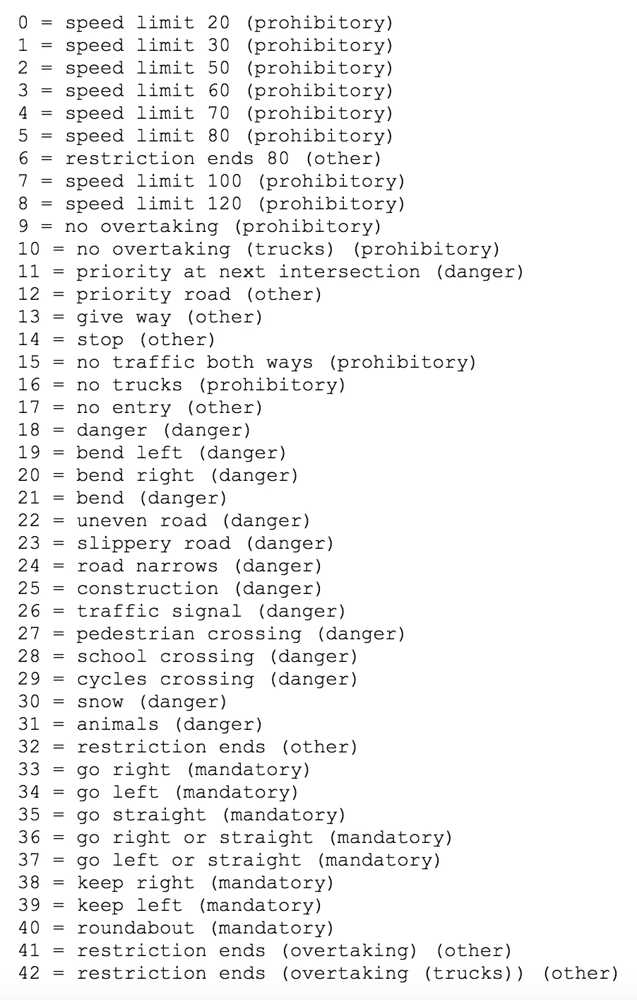

图 4:显示对应于交通标志类型的 ClassID 的类的键

我既不能使用逻辑回归，也不能使用任何其他二元分类器，因为这属于多类分类的范畴。

因此，我使用分类预测模型来逼近从 4 个输入变量到离散输出变量 classID 的映射函数(fx)。这个输出变量也称为标签或类别。

在下面的散点图中，彩色图例显示了 classID，气泡的大小根据左列(leftCol)值而变化。最小的黄色气泡中似乎有某种模式，这些气泡集中在最高水平的顶行和底行。除此之外，在 classIDs 中看不到多少簇，我可以根据这些簇来对它们进行分类。这可以通过减少输出变量/标签的数量来简化模型。

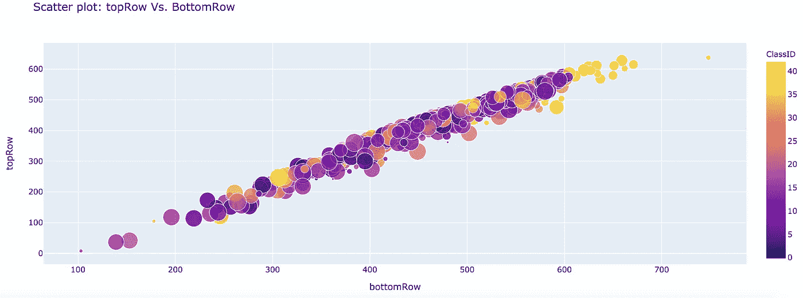

图 5:散点图

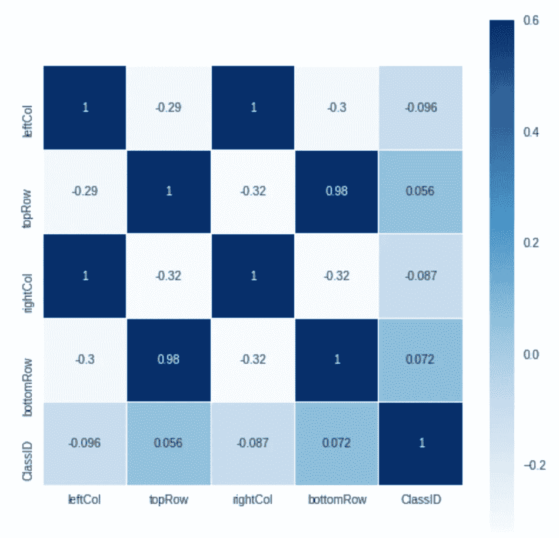

图 6:相关矩阵

然而，由于没有明显的模式将单个的 ClassIDs 分类以减少类的数量，所以我在我的模型中使用了所有 43 个独立的类。

似乎顶行和底行也具有正的强线性关系(如在相关矩阵中所重申的)，这可以通过假设检验来进一步探索，并且可能与交通标志的检测相关。

在我的分析中，我使用了 3 个模型:

*   决策树分类
*   随机森林分类
*   Ada 增强分类

# 决策树模型

在决策树建模中，数据基于某些条件被连续分割，帮助我们对观察结果进行分类。在下图中，标准为“gini”，最大深度为 2，拆分器为“最佳”。图表中显示的“基尼”分数是计算节点纯度的一种方法。叶节点涂上粉红色，节点涂上白色。粉红色叶子的“基尼”值为 0.0，意味着在该叶子中只存在一类样本，而“基尼”值大于 0.0 意味着该叶子/节点包含不同类的样本。

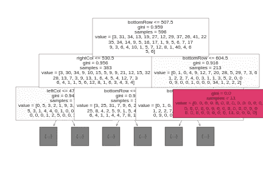

图 7:可视化分类树(叶子涂上粉红色，节点涂上白色)

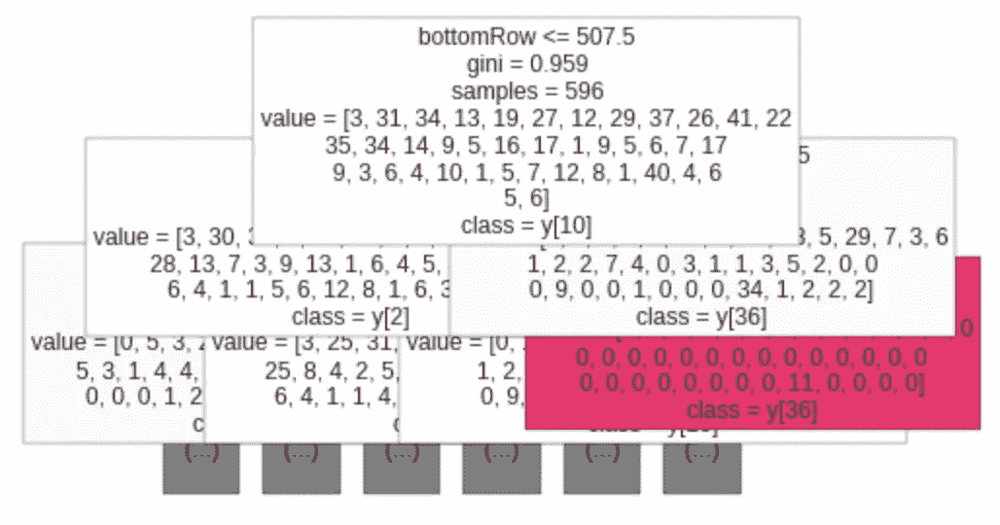

图 8:带有类名的分类树

。如左图所示，粉色树叶的 class = y[36]，表示 classID=13。图 4 中的钥匙告诉我们，班级编号 13 代表“让路”标志。因此，根据分类树图，我们知道所有 bottomRow > 604.5 的观测值都是 classID = 13 或“让路”交通标志的样本。

为了提高模型的准确性，我使用不同的参数值(如标准和最大深度)运行了各种决策树分类模型。

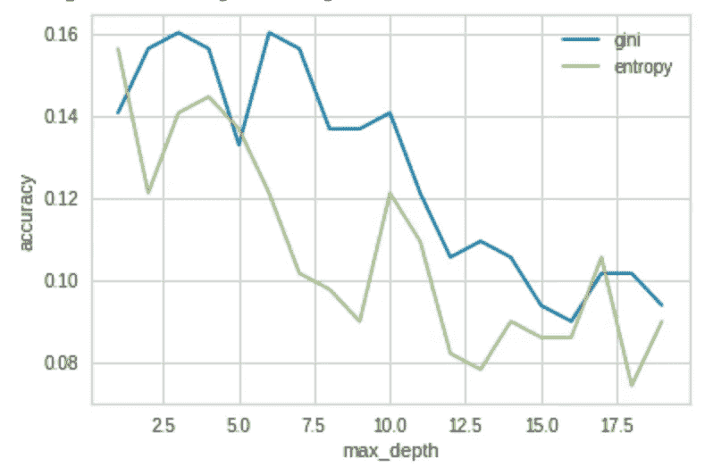

图 9:决策树分类的最大深度与准确度

正如我们在图 9 中看到的，使用“基尼”作为标准比使用“熵”给出了更好的准确度分数。此外，似乎在修剪树到最大深度= 4 或最大深度= 6(大约)时，精确度最高。此图中显示的最佳准确度得分为 0.16015625。

# 随机森林模型

随机森林是一种分类的集成学习方法，由过多的个体决策树组成。

为了提高模型的准确性，我使用不同的参数值运行了各种随机森林分类模型，例如 criterion、n_estimators 和 max depth。

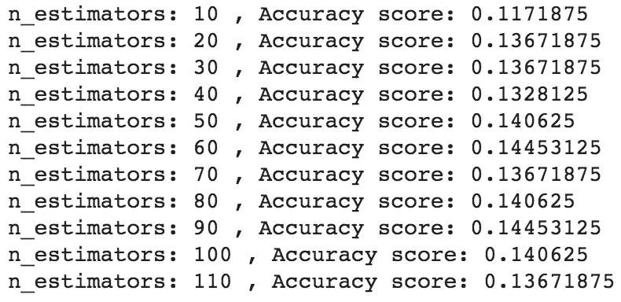

图 10:显示不同 n 估计量的准确度分数的输出

从上面的图 10 中，我们可以看到 n_estimator: 60 和 n_estimator: 90 给出了最高的精度分数。

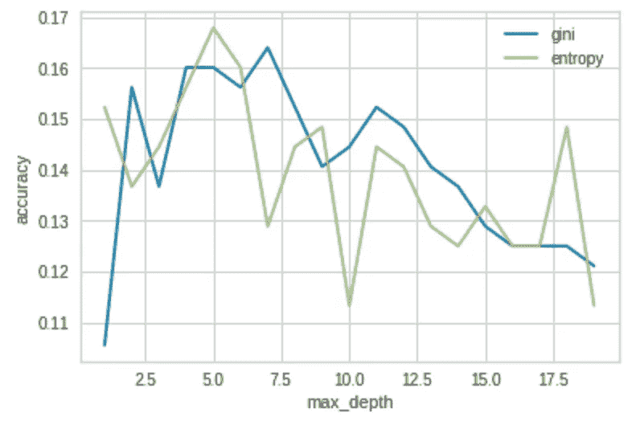

图 11:随机森林分类的最大深度与精确度

正如我们在图 11 中看到的，使用“熵”作为标准比使用 n_estimators = 90 的“熵”给出了更好的准确度分数。此外，似乎在最大深度= 5(大约)时，精确度最高。此图中显示的最佳准确度得分为 0.1640625。

# 自适应增强(AdaBoost)模型

Adaboost 试图通过将各种弱分类器组合成一个来建立强预测模型。增强用于最小化模型中的偏差误差，这些偏差误差不能识别基于观察的有意义的模式。

为了提高模型的准确性，我使用不同的参数值运行了各种 Adaboost 分类模型:n 估计量和学习率。

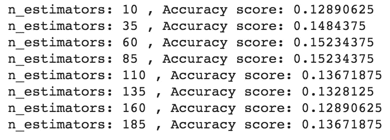

图 12:显示 AdaBoost 的不同 n 估计量的准确度分数的输出

从上面的图 11 中，我们可以看到 n_estimator: 60 和 n_estimator: 85 给出了最高的相同精度分数，所以我在我的模型中使用了 60 到 85 之间的 n_estimator。

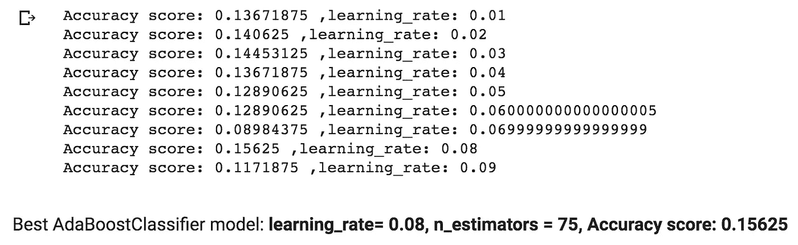

图 13:循环寻找最佳学习率

学习率是在每次提升迭代中给予每个分类器的权重。学习率越高，每个分类器的贡献越大。**根据图 13，我们可以看到，在 n_estimators = 75 的情况下，AdaBoost 模型获得最高精度的学习率为 0.08。**然而，即使以最佳学习率获得的 0.15625 的准确度分数低于随机森林和决策树的准确度分数。

# 最佳模特

如图 12 所示，随机森林分类是最好的模型，精度得分为 0.164。该模型击败了 Ada Boost 和决策树分类模型，因为它具有最高的准确性得分。准确度分数是评估 ML 模型的关键指标，因为它告诉我们测试数据集中所有正确预测的输出变量的度量。

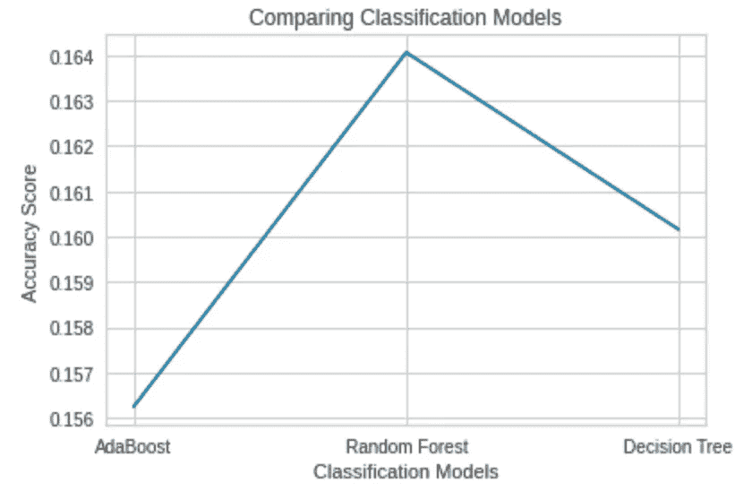

图 12:比较不同分类模型的准确度分数的线图

# 限制

*   需要更多的观察来提高准确性，因为这是一个 43 类(多类)分类问题。
*   交叉验证来微调模型的超参数(如 lasso 中的 alpha)不是很有用，因为这是一个只有四个输入要素的分类问题。尽管如此，它仍能给我们一些关于特性重要性的相关信息，如图 13 所示，rightCol 似乎是最不重要的。学习率为 0.0001(最佳 alpha)的 lasso 模型的系数为:

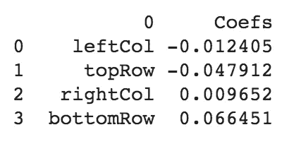

图 13:套索模型系数

# 参考

1.  Hideo，G. (2020)。*决策树:使用 Python* 构建、修剪并可视化决策树。【在线】中等。可从以下网址获得:[https://towards data science . com/decision-tree-build-prune-and-visualize-it-using-python-12 CEE 9 af 752](https://towardsdatascience.com/decision-tree-build-prune-and-visualize-it-using-python-12ceee9af752)
2.  托尼，你好。(2019).*了解随机森林*。【在线】中等。可从以下网址获得:[https://towards data science . com/understanding-random-forest-58381 e 0602d 2](https://towardsdatascience.com/understanding-random-forest-58381e0602d2)
3.  [https://sci kit-learn . org/stable/modules/generated/sk learn . ensemble . adaboostclassifier . html](https://scikit-learn.org/stable/modules/generated/sklearn.ensemble.AdaBoostClassifier.html)