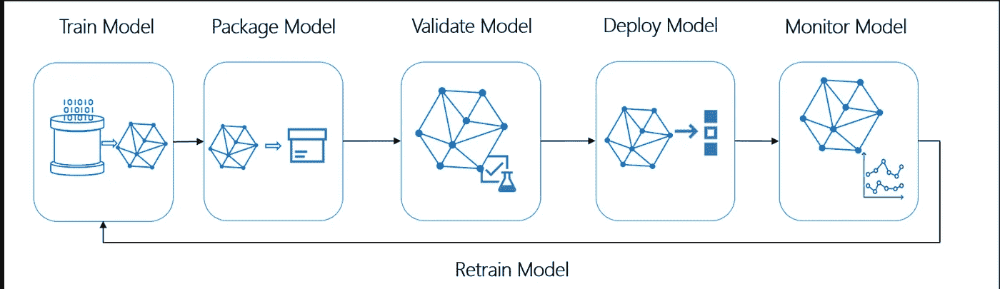
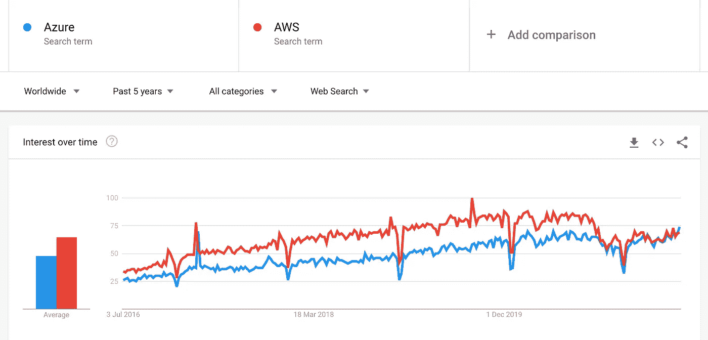
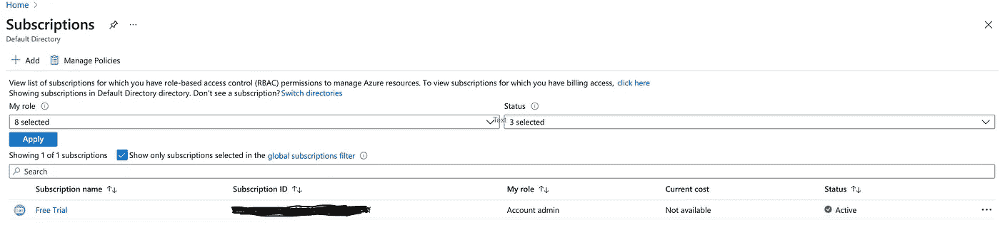
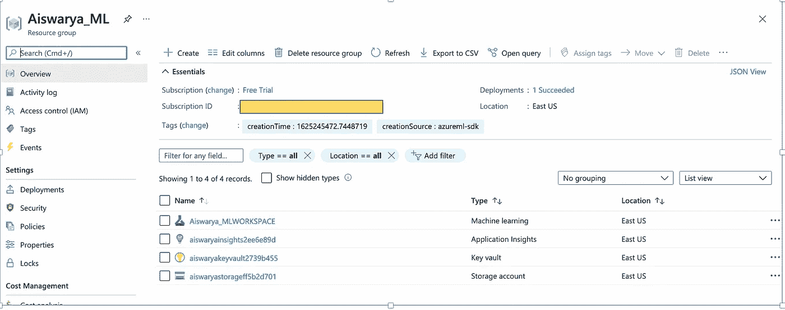
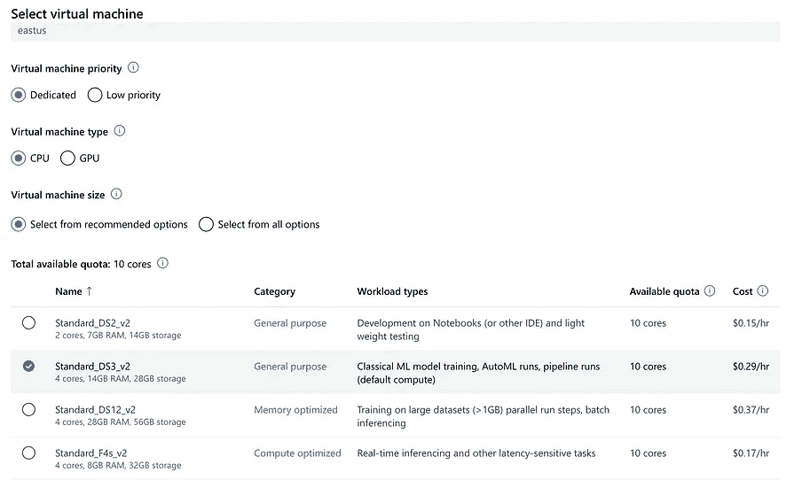
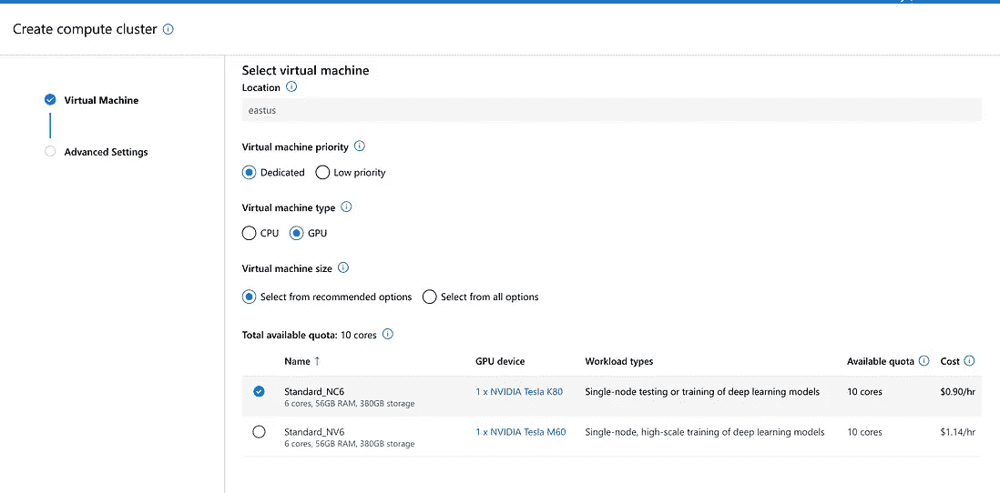
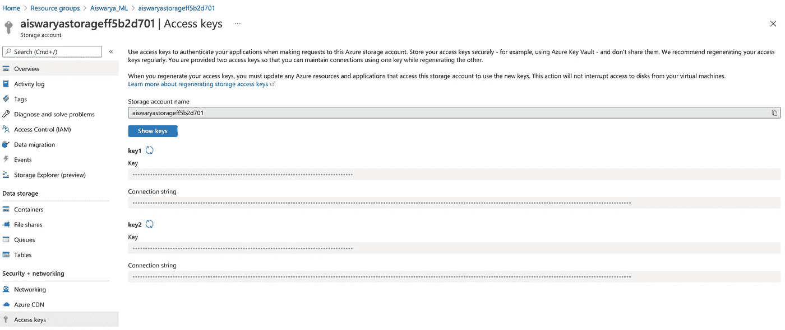
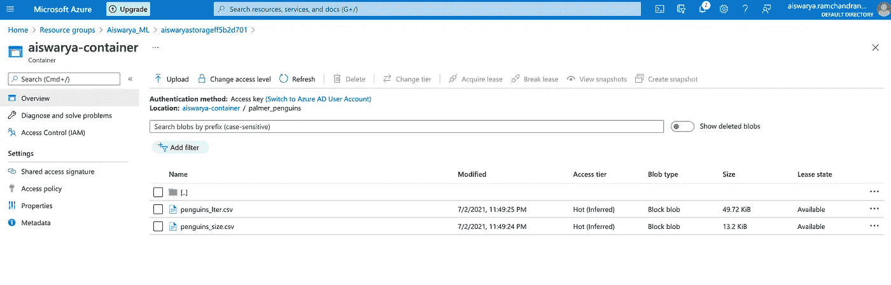
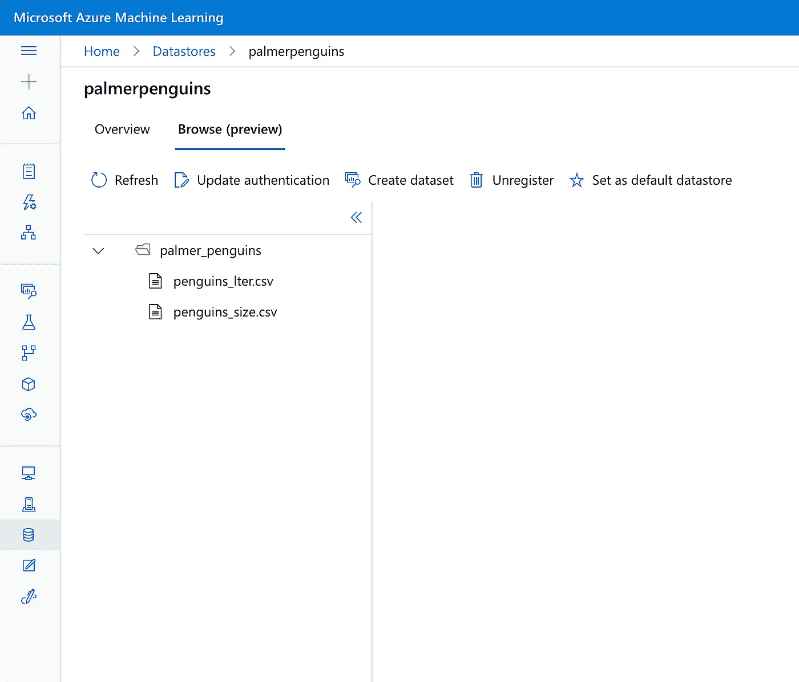

# 使用 Python SDK 在 Azure 中执行 MLOps 第 1 部分

> 原文：<https://medium.com/analytics-vidhya/building-ml-pipelines-in-azure-using-python-sdk-part-1-448d241d3a7c?source=collection_archive---------4----------------------->

## 使用 AzureML SDK 的 MLOps 简介


来源:[https://www.freepik.com/vectors/design'](’<a)>宏向量创建的设计向量——[www.freepik.com](http://www.freepik.com)</a>

将机器学习项目投入生产涉及多个组件——数据工程、DevOps 和机器学习。这些组件的交集是 MLOps。 **MLOps(机器学习+ DevOps)是将机器学习项目投入生产的过程——目标是自动化和提高生产模型的质量，同时也关注业务和监管要求。**

# MLOps 中的关键阶段

1.  数据采集
2.  数据分析
3.  数据转换/清理
4.  模型培训和开发
5.  模型验证
6.  部署模型
7.  将模型作为 web 应用程序或 API
8.  模型再训练



MLOps 管道(图片提供:[微软 Azure 文档](https://docs.microsoft.com/en-us/samples/microsoft/mlopspython/mlops-with-azure-ml/))

MLOps 的另一个关键特性是，我们还希望跨实验跟踪指标，例如，需要跨各种超参数跟踪模型的表现，以便我们可以选择最佳模型。

在 MLOps 中，除了 DevOps 中常见的测试实践(如单元测试、集成测试)之外，我们还必须测试数据模式、模型并验证数据。此外，作为持续部署的一部分，在 MLOps 中，培训渠道的变化也应反映在模型的部署或服务上。

# Azure 和一些术语的介绍

[Azure 是一个云计算平台](https://www.simplilearn.com/putting-the-cloud-to-work-for-your-business-with-microsoft-azure-article)和一个在线门户，允许您访问和管理微软提供的云服务和资源。这些服务和资源包括存储数据和转换数据，具体取决于您的需求。

比较 AWS 和 Azure(全球)的 Google Trends 向我们展示了两个云平台之间的差距正在缩小，了解至少一个云平台已经变得势在必行。



Azure 和 AWS 之间的 Google 趋势比较

虽然 Azure ML Studio 有一个设计工具来使用拖放组件构建 ML 管道，但在本文中，我们将了解如何创建工作区，连接到计算机并将数据从您的机器上传到 Azure 中的存储帐户。在我们深入挖掘之前，有必要看一下 Azure 中常用的几个关键术语

1.  **资源组:** Azure 资源组是虚拟机、存储帐户、虚拟网络、web 应用、数据库和/或数据库服务器的逻辑集合。**例如**:当你为机器学习创建一个资源组时，你会看到像 KeyVault、App Insights、一个存储账户和 ML Studio 这样的资源被创建为资源组的一部分。
2.  **工作区:**工作区是 Azure 机器学习的顶级资源，提供了一个集中的地方来处理您在使用 Azure 机器学习时创建的所有工件。工作区保存了所有训练运行的历史，包括日志、指标、输出和脚本的快照。
3.  计算实例:Azure 机器学习计算实例是面向数据科学家的托管的基于云的工作站。Azure 为我们提供了各种类型的计算实例，用于训练和推理。计算集群用于培训，而对于部署，我们可以使用 Kubernetes 推理集群。
4.  **存储帐户:**Azure 存储帐户包含所有 Azure 存储数据对象:blobs、文件共享、队列、表和磁盘。存储帐户为您的 Azure 存储数据提供了一个唯一的命名空间，您可以通过 HTTP 或 HTTPS 从世界任何地方访问该命名空间。您的存储帐户中的数据是持久的、高度可用的、安全的和可大规模扩展的。

# 正在安装 Azure Python SDK

**注意:**你可以创建一个免费的 Azure 帐户，并获得一个月 200 美元的免费点数

**创建新的 Conda 环境:**

```
*conda create -n azure_ml python=3.6*
```

**安装 azureml-sdk:**

```
*conda activate azure_ml**pip install azureml-sdk[notebooks,tensorboard,interpret,automl]*
```

要检查 azureml-sdk 是否已正确安装，可以使用以下代码:

正在检查 azureml sdk 是否已正确安装

**创建 ML 工作空间**

为了使用 Azure 进行机器学习，我们需要创建一个 ML 工作空间——这意味着，我们需要创建一个包含存储帐户的资源组(用于存储日志、模型、数据等。)、一个密钥库、App Insights 和 ML Studio。在此之前，我们需要获得 Azure 的订阅 id。这是机密的，最好保存为环境变量(我已经保存在配置文件中)。



从 Azure 获取订阅 ID

要创建工作区，您需要现有资源组的名称或者您可以创建新的资源组、您的订阅 id、需要创建服务器和虚拟机的位置、您的工作区的名称。要创建一个不存在的资源组，必须设置 create_resource_group=True

创建新的工作空间

如果你运行上面的代码——你会在 Azure 门户上看到下面创建的资源



在 Azure 上创建的 ML 工作空间

一旦我们创建了工作区，我们就可以在工作区上保存详细信息，并在以后加载它。**如果没有提供路径，保存工作区配置会在当前目录下创建一个. azureml 文件夹**

保存和加载 Azure 工作区

# **创建一个计算实例**

在 Azure 上，我们可以创建一台在 CPU 或 GPU 上运行计算机。对于机器学习训练，我们使用计算集群。要创建计算目标，我们需要传递以下内容:

**vm_size** —描述集群中使用的虚拟机类型和大小。集群中的所有机器都是同一类型。您可以从 ML Studio Workspace 获得 CPU 或 GPU 的虚拟机名称



为 GPU 和 CPU 选择虚拟机名称

**节点** —设置集群的最小大小。如果将最小值设置为 0，群集将在不使用时关闭所有节点。将该数字设置为大于 0 的值将允许更快的启动时间，但是当群集未被使用时，您也将被计费

**max_nodes** —设置集群的最大大小。将此值设置为一个较大的值，可以实现更高的并发性和对扩展作业更大的分布式处理。

创建 CPU 计算集群(将 vm_size 参数更改为 GPU 实例名称，以便使用 GPU)

# 将数据推送到存储帐户— Azure Blob 存储

Azure 提供了一些样本数据集，但大多数情况下，我们需要处理自己的数据——这意味着我们需要将数据上传到存储帐户，然后对其进行处理。您可以创建不属于 ML 资源组的存储帐户，也可以使用在 ML 资源组中创建的存储帐户。这里，我使用在创建工作区时创建的存储帐户。

**要将数据上传到存储帐户，我们需要创建一个容器并在其中上传数据——为此，您需要连接字符串**(这是机密的，最好将其保存为环境变量)



获取连接字符串—您可以通过单击 Show Keys 来选择任一连接字符串

我们可以使用 BlobServiceClient 对象来创建容器客户端。

创建容器

出于本教程的目的，让我们使用来自 Kaggle 的[帕尔默企鹅数据集。下载数据集并将其添加到文件夹中。现在，您可以使用 blob_service_client 对象将数据集上传到存储帐户](https://www.kaggle.com/parulpandey/palmer-archipelago-antarctica-penguin-data)

将 Palmer 数据集上传到存储帐户

成功上传数据后，您可以在 Azure 门户上看到数据。



帕尔默企鹅数据上传到 Azure 门户网站的容器内创建

# 访问 ML 工作区中的存储帐户数据

要访问 Azure Blob 存储中上传的数据集，您需要将文件添加到一个**数据存储库**。

数据存储附加到工作区，用于存储 Azure 存储帐户的连接信息，以便您可以通过名称引用它们，而不必记住用于连接到存储帐户的连接信息和密钥。

要将 Azure Blob 存储注册到数据存储中，我们需要来自存储帐户的“密钥”(这是机密的)。此外，在创建数据存储之前，请连接到工作区。

在数据存储上注册存储帐户



帕尔默企鹅数据更新到数据存储

由于它是一个 CSV 文件，我们可以将其作为表格数据集读取，并将其转换为 pandas 数据框

从数据存储中读取企鹅大小数据

**注意:*一旦您使用完工作区和您创建的任何其他资源，请将其删除，否则您将被收取相同的费用***

至此，我们已经了解了如何访问 Azure 上的数据以及如何连接到 Compute。这是在 Azure 中构建 ML 管道的基本设置。在本文的下一部分，我们将研究如何构建培训和部署管道。

***希望这篇文章有用，非常感谢任何反馈***