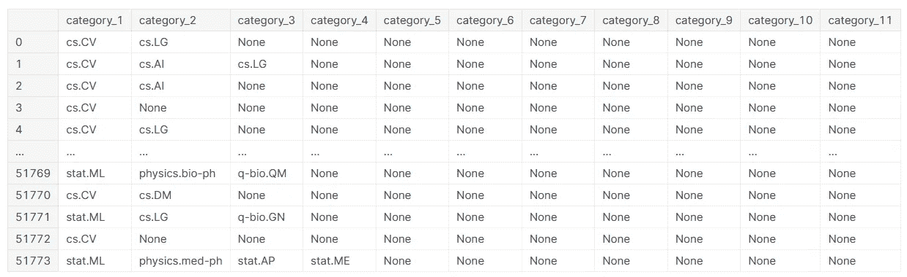

# 为 arXiv 论文摘要数据集构建多标签文本分类器

> 原文：<https://medium.com/analytics-vidhya/building-multi-label-text-classifiers-for-arxiv-paper-abstract-dataset-1cc5353b3e96?source=collection_archive---------6----------------------->

## 改进论文提交系统


安妮·斯普拉特在 [Unsplash](https://unsplash.com?utm_source=medium&utm_medium=referral) 上的照片

论文提交系统( [CMT](https://cmt3.research.microsoft.com/) 、 [OpenReview](https://openreview.net/) 等)。)要求用户上传他们的论文标题和论文摘要，然后指定他们的论文最适合的主题领域。arXiv 是一项免费分发服务，是 1，950，165 篇学术文章的开放访问档案，涉及*物理、数学、计算机科学、定量生物学、定量金融学、统计学、电气工程和系统科学以及经济学*等领域。多用于院士上传论文。 [Kaggle arXiv 论文摘要数据集](https://www.kaggle.com/spsayakpaul/arxiv-paper-abstracts)提供了超过 38000 篇独特的论文标题及其摘要和主题领域。数据集是几天前上传的(截至撰写这篇博客时)，收集过程可在[本笔记本](https://github.com/soumik12345/multi-label-text-classification/blob/master/arxiv_scrape.ipynb)中找到。

如果像 arXiv 这样的提交系统能够提供可行的主题领域建议，比如相应的论文可以与哪里最好地相关联，这将是非常有趣的。我们的任务是建立一个文本分类器模型，它可以预测给定论文摘要和标题的主题领域。

你可以从 [Github](https://github.com/Adeelzafar/Kaggle/blob/main/predictions-using-ml-and-dl-methods.ipynb) 或者 [Kaggle](https://www.kaggle.com/adizafar/predictions-using-ml-and-dl-methods) 下载完整的代码。

说够了，让我们开始编码吧…

# 数据争论

首先，让我们导入必要的库和数据集。

```
import numpy as np # linear algebra
import pandas as pd # data processing, CSV file I/O (e.g. pd.read_csv)
import seaborn as sns
import ast
import matplotlib.pyplot as plt
import nltk
from nltk.corpus import stopwords
from nltk.stem.snowball import SnowballStemmer
import re
import sys
import warnings
from sklearn.model_selection import train_test_split
from sklearn.feature_extraction.text import TfidfVectorizer
```

```
papers = pd.read_csv('/kaggle/input/arxiv-paper-abstracts/arxiv_data.csv')
papers.head()
```


图 1:数据集的前五列

标题和摘要是自变量，术语是因变量。这是一个多标签分类问题，因此术语有多个值，即 cs、AI 等。我们将首先删除每个术语的单引号。为此，我们将使用**literal _ eval 函数**。 **literal_eval** 安全地计算包含 Python 文本或容器显示的表达式节点或字符串。

```
description_category = papers[['terms','summaries','titles']]
description_category['terms'] = description_category['terms'].apply(lambda x: ast.literal_eval(x))
#description_category['terms'] =  description_category['terms'].apply(lambda x: re.sub(r'([^)]*)', '',x)
description_category.head()
```


图 2:数据集视图

经过初步探索，我们得出结论，在我们的数据集中有 11 个标签/术语。我们将把每个标签转换成一个单独的列。

```
columns = ['category_1', 'category_2', 'category_3',
          'category_4', 'category_5', 'category_6',
          'category_7', 'category_8', 'category_9',
          'category_10', 'category_11']
cat = pd.DataFrame(description_category['terms'].to_list(), columns = columns)
cat
```



图 3:将标签转换成列

现在让我们将这些值转换成数值。我们将为所有无值插入 0，为所有标签插入 1。

```
category_1_genres = cat.category_1.unique()
category_2_genres = cat.category_2.unique()
category_3_genres = cat.category_3.unique()
category_4_genres = cat.category_4.unique()
category_5_genres = cat.category_5.unique()
category_6_genres = cat.category_6.unique()
category_7_genres = cat.category_7.unique()
category_8_genres = cat.category_8.unique()
category_9_genres = cat.category_9.unique()
category_10_genres = cat.category_10.unique()
category_11_genres = cat.category_11.unique()

genres = np.concatenate([category_1_genres, category_2_genres, category_3_genres,
                         category_4_genres, category_5_genres, category_6_genres,
                         category_7_genres, category_8_genres, category_9_genres,
                         category_10_genres, category_11_genres
                        ])
genres = list(dict.fromkeys(genres))
genres = [x for x in genres if x is not None]

cat = pd.concat([cat,pd.DataFrame(columns = list(genres))])
cat.fillna(0, inplace = True)
cat.head()
```


图 4:标签转换为零

下面的代码应该为所有类别/标签。你可以从 [Github](https://github.com/Adeelzafar/Kaggle/blob/main/predictions-using-ml-and-dl-methods.ipynb) 或者 [Kaggle](https://www.kaggle.com/adizafar/predictions-using-ml-and-dl-methods) 下载完整的代码。

```
row = 0
for genre in cat['category_1']:
    if genre != 0:
        cat.loc[row, genre] = 1
    row = row + 1
```

```
description_category_new = pd.concat([description_category['titles'],description_category['summaries'],  
                                     cat.loc[:,"cs.CV":]],
                                    axis=1)
description_category_new.head()
```


图 5:转换为零和一的标签

# 数据可视化

在最初的数据争论之后，我们继续进行数据可视化。

```
bar_plot = pd.DataFrame()
bar_plot['cat'] = description_category_new.columns[2:]
bar_plot['count'] = description_category_new.iloc[:,2:].sum().values
bar_plot.sort_values(['count'], inplace=True, ascending=False)
bar_plot.reset_index(inplace=True, drop=True)
bar_plot.head()
```


图 6:类别与计数

```
threshold = 1000
main_categories = pd.DataFrame()
main_categories = bar_plot[bar_plot['count']>1000]
categories = main_categories['cat'].values
categories = np.append(categories,'Others')
not_category = []
description_category_new['Others'] = 0

for i in description_category_new.columns[2:]:
    if i not in categories:
        description_category_new['Others'][description_category_new[i] == 1] = 1
        not_category.append(i)

description_category_new.drop(not_category, axis=1, inplace=True)
```

我们将保留前四个类别或标签，并将所有其他标签放在 ***其他*** 计数中。

```
most_common_cat = pd.DataFrame()
most_common_cat['cat'] = description_category_new.columns[2:]
most_common_cat['count'] = description_category_new.iloc[:,2:].sum().values
most_common_cat.sort_values(['count'], inplace=True, ascending=False)
most_common_cat.reset_index(inplace=True, drop=True)
most_common_cat.head()
```


图 7:类别与计数

```
plt.figure(figsize=(15,8))
sns.set(font_scale = 1.5)
sns.set_style('whitegrid') 

pal = sns.color_palette("Blues_r", len(most_common_cat))
rank = most_common_cat['count'].argsort().argsort()  

sns.barplot(most_common_cat['cat'], most_common_cat['count'], palette=np.array(pal[::-1])[rank])
plt.axhline(threshold, ls='--', c='red')
plt.title("Most commons categories", fontsize=24)
plt.ylabel('Number of papers', fontsize=18)
plt.xlabel('terms', fontsize=18)
plt.xticks(rotation='vertical')

plt.show()
```

该图显示了最常见的论文类别以及论文数量。我们可以看到 cs。CV 在类别中占主导地位。


图 8:最常见的类别

```
rowSums = description_category_new.iloc[:,2:].sum(axis=1)
multiLabel_counts = rowSums.value_counts()
sns.set(font_scale = 1.5)
sns.set_style('whitegrid') 
plt.figure(figsize=(10,6))

sns.barplot(multiLabel_counts.index, multiLabel_counts.values)
plt.title("Number of terms per paper", fontsize=24)
plt.ylabel('Number of terms', fontsize=18)
plt.xlabel('Number of categories', fontsize=18)

plt.show()
```


图 9:每篇论文的术语数量

# 数据预处理

在这一步中，我们将把摘要/摘要转换成小写字母，删除其中的停用词，并进一步对它们进行词干处理。每个函数的细节可以在完整代码部分找到。

```
description_category_new['summaries'] = description_category_new['summaries'].str.lower()
description_category_new['summaries'] = description_category_new['summaries'].apply(decontract)
description_category_new['summaries'] = description_category_new['summaries'].apply(cleanPunc)
description_category_new['summaries'] = description_category_new['summaries'].apply(keepAlpha)
description_category_new['summaries'] = description_category_new['summaries'].apply(removeStopWords)
description_category_new['summaries'] = description_category_new['summaries'].apply(stemming)
description_category_new.head()
```


图 10:数据集视图

# **深度学习模型**

我们现在将应用基本的深度学习模型。机器学习部分不在本博客讨论。不过在 [Github](https://github.com/Adeelzafar/Kaggle/blob/main/predictions-using-ml-and-dl-methods.ipynb) 或者 [Kaggle](https://www.kaggle.com/adizafar/predictions-using-ml-and-dl-methods) 上传的完整代码中可以看到。

```
from tensorflow.keras.preprocessing.text import Tokenizer
from tensorflow.keras.preprocessing.sequence import pad_sequences

tokenizer = Tokenizer(num_words=5000, lower=True)
tokenizer.fit_on_texts(description_category_new['summaries'])
sequences = tokenizer.texts_to_sequences(description_category_new['summaries'])
x = pad_sequences(sequences, maxlen=200) 
```

在导入深度学习所需的库并标记我们的抽象之后。我们将把数据分成训练集和测试集。

```
X_train, X_test, y_train, y_test = train_test_split(x, 
                                                    description_category_new[description_category_new.columns[2:]], 
                                                    test_size=0.3, 
                                                    random_state=seeds[4])
```

我们应用了一个基本的深度神经网络模型和一个卷积神经网络模型。下表列出了 AUC 和验证准确性。


图 11: AUC 和验证准确性

最初的结果是相当压倒性的。这个数据集在几天前刚刚上传(在我写这篇博客的时候)，为学习 NLP 技能提供了一个很好的机会。

我希望你能从这篇博客中学到一些有价值的东西。
下次见，编码快乐…