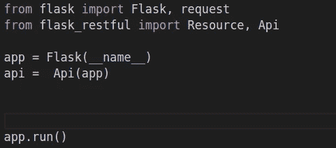
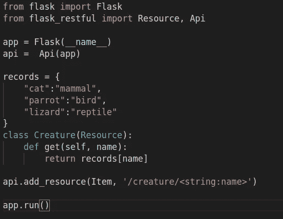
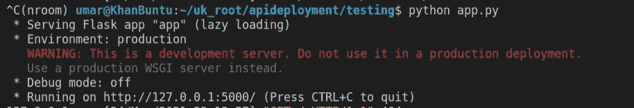
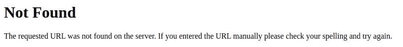
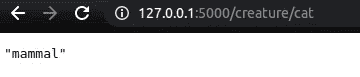

# [第 1 部分]为完全初学者构建 RESTful API。

> 原文：<https://medium.com/analytics-vidhya/building-restful-apis-for-complete-beginners-e1dfda170677?source=collection_archive---------9----------------------->

如果你曾经做过任何类型的数据分析或工程工作，那么你很可能使用过 API 来获取数据。今天我想探讨 API 是如何实际构建和部署的，以及它们设计背后的一些原则，尤其是在 REST 范式下。

你可能知道，API 代表应用程序编程接口。API 的全部目的是通过创建一个易于使用的界面来简化软件系统的使用。通过这种方式，我们可以依赖软件的功能，而不必了解其代码和数据的具体细节。API 几乎可以被认为是一种终端用户产品，除了它们更多的是面向开发者而不是消费者。API 是特定软件应用程序和领域的高级抽象，因此它们的使用无处不在。

通常，API 的使用模式如下:用户向 API 提交一些数据，API 使用这些输入数据来生成/检索一些其他数据，并将结果数据输出回用户。如果你仔细想想，这真的是大多数计算归结为什么。你把数据输入电脑，就能得到结果。您将数据提供给一个函数，它在执行代码后返回一些值。如果您曾经使用过 API，您可以看到相同的原理:您指定一些端点和查询，API 为您提供一些数据。

但是你想做你自己的 API！也许你开发了一个擅长预测的机器学习模型。现在您希望在线部署它，以便其他人可以向您的模型提交一些数据并检索预测。或者，您可能希望以一种便于人们访问、搜索和过滤的方式共享数据。这些是构建 API 的典型用例。

API 运行在客户机-服务器模型上。客户端(即用户)通过互联网(HTTP)向运行我们的 API 程序的服务器发送请求，服务器处理请求，生成输出，并将其发送回用户。有许多框架用于构建 web 应用程序，但我将重点介绍如何使用 Flask。Flask 是一个基于 python 的 web 框架，相对轻量级且易于学习，同时功能强大且特性丰富。我们还将使用 Flask-RESTful 库，这是一个 Flask 扩展，专门用于构建 RESTful 应用程序。

要开始制作 Flask powered API，请使用一个干净的 virtualenv 启动一个干净的存储库。然后，运行“pip 安装 flask”和“pip 安装 flask-RESTful”。然后，在您的根文件夹中创建一个名为 app.py 的文件。这是我们将为 API 本身编写代码的地方。

下面是您的代码开始时的样子:

首先，我们进口烧瓶。在第 3 行中，我们必须包含 app = Flask(__name__)行。这是所有 Flask 应用程序中都包含的标准行。它实例化为 Flask 对象，这就是我们的应用程序的实际情况。然后，它将模块的 __name__ 变量传递给 Flask 对象。回想一下，在运行时分配给我们的模块的 __name__ 可能是不同的，这取决于该模块是直接从命令行执行的还是导入的。对于 Flask 来说，以这种方式指定模块来正确地创建模板、静态文件等等是很重要的。

然后从 Flask_restful 导入 Api 和资源。Api 是 Flask-RESTful 用来实现 API 的核心类。我们在 Flask 之后实例化它，并向它传递我们实例化前一行的 Flask 应用程序(“app”)。通过这种方式，我们向 Flask 应用程序添加了一种层，使我们能够更好地将其构建为 API。虽然理论上单独使用 Flask 实现 API 是可能的，但是 Flask-RESTful API 使我们更容易，同时更好地符合 REST 范式下的最佳实践。

我们实际构建 API 的方式是定义“端点”并告诉 Flask 如何路由和处理对这些端点的请求。这主要是通过向我们的 API 添加“资源”来完成的，然后可以通过访问端点来访问这些资源。资源是一段代码，它可以响应对我们的 API 的请求，并作为响应提供新的数据。为了创建这些资源，我们必须创建从 flask_restful 导入的“resource”类的子类，并定义 get、post 和类似的对应于 HTTP 请求类型的方法。然后，我们必须将资源添加到 API 的资源集合中。

让我们来看看如何对此进行编码:

首先，我们创建了一个记录字典，它将作为我们的测试数据库，以确保我们的 API 是否正常工作。关键字代表动物，值代表动物的类型。

然后我们创建了一个名为 Creature 的新类，并传入了 Resource 类，让 python 知道我们的类是继承 Resource 类的所有方法和属性。我们需要这样做，以便让 Flask-RESTful 将我们的逻辑集成到它的框架中，并将我们的子类转换成可由服务器和库处理的资源。

Creatures 接受一个名为“name”的变量，它实现了一个方法。这是 get 方法。我们将在后面的文章中深入讨论各种类型的请求，但现在只需要知道，当您向 API 提交 url 以在浏览器中检索信息时，从浏览器发送到服务器的请求类型是“GET”类型的请求。这是一组标准类型的服务器请求之一，还包括 POST、PUT、DELETE 等等。每个资源类型类必须包含一个对应于可以转发给它的每种请求类型的方法。因为我们的类现在只接受 get 请求，所以我们只定义 GET 方法。

将我们的资源类集成到运行的 API 中是通过倒数第二行实现的。我们调用 api 对象上的 add_resource 方法，并传入我们的 Creature 类以及它应该响应的端点的字符串表示。这就是“‘/生物/ <name>”。这个字符串告诉 flask_restful 哪个端点指向我们传入的资源，也就是说，用户必须传入的 URL 类型才能到达那个资源。此外，我们可以告诉 flask_restful 注意用户可能使用所示的<name>语法传入的变量。这告诉 flask_restful，用户可以传入他们选择的字符串，flask 将把这个字符串存储在名为“name”的变量中，然后将这个变量转发给 Creature 类。</name></name>

现在，您所要做的就是转到您的终端，确保您位于包含“app.py”文件的存储库的根文件夹中，然后运行命令“python app.py”。您将看到如下输出:

继续点击最后一行中 url。当它在浏览器中打开时，如果您看到“未找到”错误消息，请不要担心。

你得到这个的原因是因为我们没有真正告诉 flask 或 flask_restful 处理对根 url 的请求，当你点击链接时，你的浏览器提交一个 get 请求到那个链接，但是因为我们的服务器不知道如何处理它，我们得到一个错误。但是，如果您在 url 的末尾添加“生物/猫”,您应该会看到:

瞧啊。我们有一个可用的 API。

现在我们对 API 的工作原理以及如何开始构建有了基本的了解。但是，您一定已经意识到，像我们在这里所做的那样将数据存储在内存字典中，在任何规模下都不是一个可行的解决方案。但是你可以看到我们的前进方向:现在我们知道如何创建资源来传递数据和路由端点到它们，天空是无限的。我们可以开始在我们的资源中使用 JSON 文件或 SQL 数据库。但那是以后的事了。

下周继续收听，我们将深入探讨不同类型的请求以及我们如何处理它们。