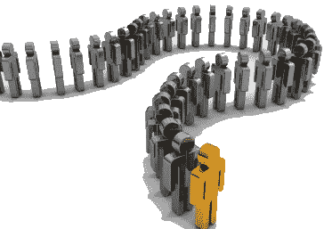
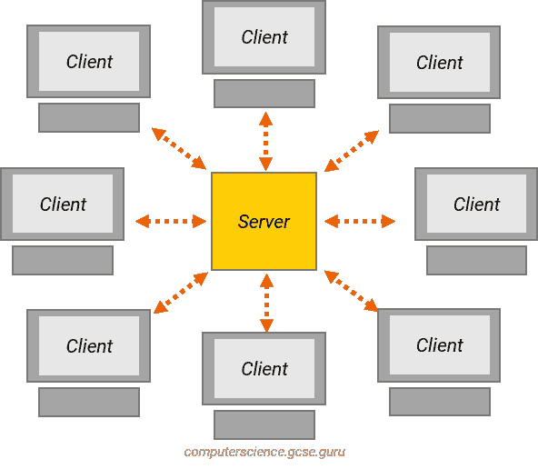
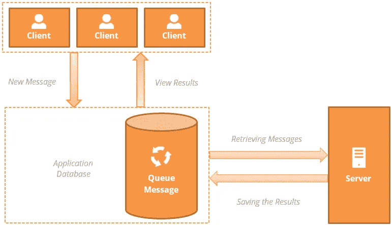
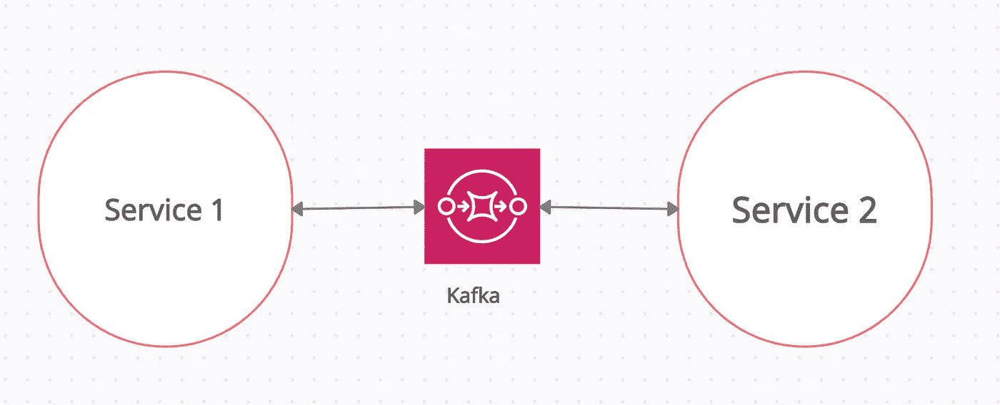

# 使用队列构建可伸缩系统

> 原文：<https://medium.com/analytics-vidhya/building-scalable-systems-using-queues-eeb52ec31751?source=collection_archive---------2----------------------->

可伸缩系统的定义可能因人而异，但是根据我的看法，可伸缩系统是

*   耐穗
*   水平可伸缩
*   负载平衡

今天我们将讨论如何使用队列和事件驱动编程来创建一个可伸缩的系统

# **队列**

队列是一种数据结构，它遵循

> 先进先出

在软件术语中，先进先出是什么意思？

想想你的打印机如何处理所有的请求。当不止一个人想要访问打印机时会发生什么。

它会交叉请求吗？

答案是**否**，打印机是高效使用队列数据结构的一个很好的例子。

它接收所有请求，并将它们放入打印机作业池，然后从作业池中挑选一个作业并启动任务。

这里需要补充的一点是，打印机将按照任务到达打印机的顺序来选择任务(FIFO)。

现在我们知道了什么是队列，让我们来讨论如何使用这个简单的东西来扩展巨大的系统。

# 何时使用队列

为了理解这一点，让我们以一台文鼎机器为例，该机器以 x 饼干/分钟的速率生产饼干，你是这些饼干的消费者，你可以以 y 饼干/分钟的速率消费饼干，其中

> x

In this scenario, you can consume all the biscuits which are produced by the machine.

What if the rate is increased by some amount z such that

> x+z> y

现在你不能吃掉所有机器生产的饼干。所有多余的农产品都洒在了地板上。

看着你的情况，一个聪明的人给你拿来一个托盘，放入你在机器生产率恢复正常之前无法食用的所有多余饼干，即 **x**

这个板块在软件术语中被称为**队列**

队列是一个存储额外产出的桶，用软件术语来说，就是向服务器发出的请求的数量，因为服务器响应这些响应的速率受到服务器容量的限制，但是产出的速率不受任何约束的限制。

# 有队列的系统设计

让我们看看我们之前讨论过的事情，这里我们的服务器一次可以处理 10 个请求，但是它被 20 个请求轰炸了。此时需要考虑一些有趣的问题

***我们的服务器会有什么行为？***

它将开始拒绝服务请求。

***如何处理这个问题？***

*   提高服务器的服务能力(纵向扩展)
*   增加服务器数量(横向可扩展)

如果负载是一致的，并且我们的服务器通常会收到比它们所能提供的更多的请求，那么这些解决方案会非常有效。此外，在我们了解这种情况之前，我们的服务器一直处于负载状态，这可能会导致拒绝请求。

但是，如果我们想让这个过程异步，就像你去银行存一张支票，出纳员收集所有的支票，并确认它将被处理，并在他从所有需要立即服务的客户那里获得空闲时处理它。

类似地，在客户机和服务器之间使用队列数据结构，它充当缓冲区，有助于保持向服务器发送请求的速率。

有多种类型的队列，基于拉的和基于推的，但是讨论它们超出了本文的范围。

让我们看看这将如何工作:

假设，15 个人想同时使用打印机，所以他们向打印机发送打印命令，但是打印机一次只能运行一个命令，打印机不会拒绝其他命令，但是这些额外的命令将被保存在队列中，当打印机完成当前命令时，这些命令将被选取。

使用队列的另一个好处是，我们可以多添加一台打印机，它可以从同一个队列中提取命令，这样一台打印机就可以从队列中选择一条命令。

# 真正的游戏

我们在 LambdaTest 严重依赖 Apache Kafka 进行服务间的通信。

没有两个服务直接相互通信。Kafka 充当通信媒介和缓冲服务间请求的媒介。

这样，通过使用事件驱动的编程，我们可以管理服务上的负载，并且在需要时，我们可以横向扩展我们的服务，以处理高峰时间增加的负载。

使用这种架构的优势在于:

*   易于扩展
*   系统变得能够容忍使用高峰
*   如果需要，我们可以重播这条消息
*   事件可以被多个服务监听(实际工作者服务和用于维护使用记录的分析服务)

这种方法的一些缺点:

*   开发一个功能的时间增加了
*   代码的可读性降低
*   新加入者加入该服务的时间会增加
*   服务的响应时间可能会增加

# **其他一些基于队列的系统包括**

*   兔子 q
*   ActiveMQ
*   亚马逊 SQS

还有很多现成的解决方案，但是你可以使用数据库创建自己的解决方案。

我希望这有助于您做出一些架构决策。

快乐学习

关注我的 YT 频道获取相关内容