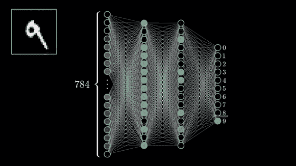
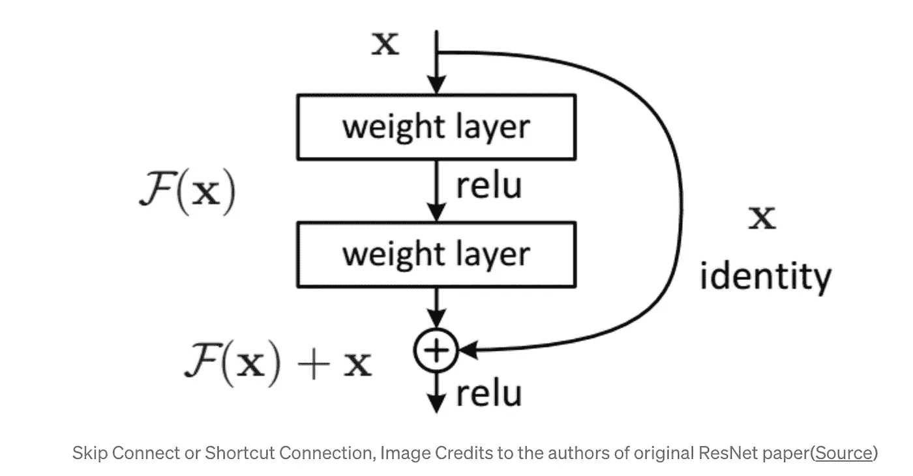
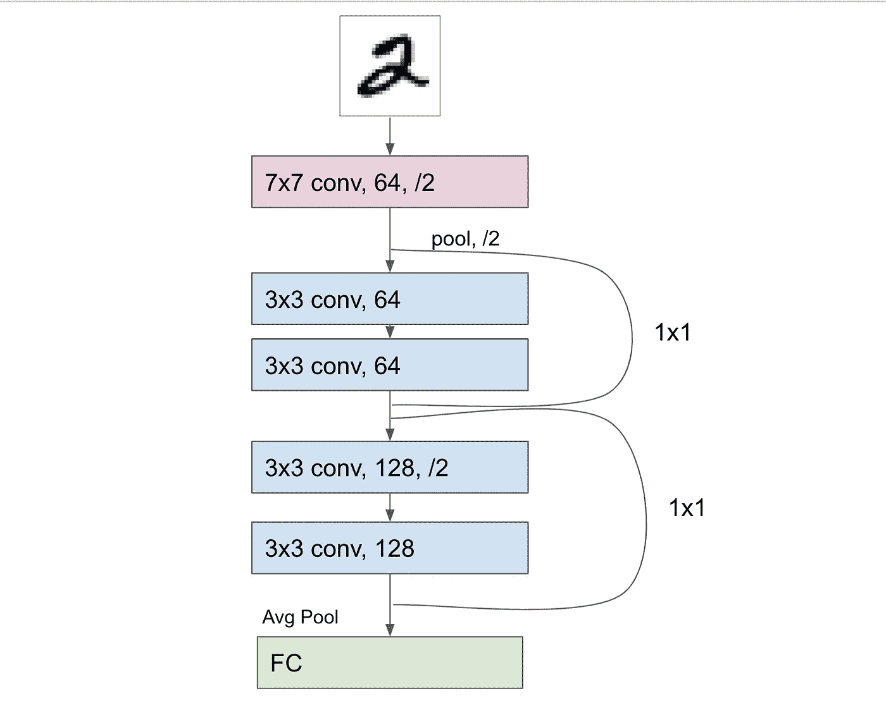
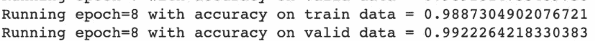

# 图像分类的 ResNet。

> 原文：<https://medium.com/analytics-vidhya/building-your-own-simple-resnets-with-0-99-accuracy-on-mnsit-2fd10d1955de?source=collection_archive---------1----------------------->



预测数字([来源](/analytics-vidhya/applying-ann-digit-and-fashion-mnist-13accfc44660))

ResNets 或剩余网络是由微软研究团队的、何、、任少勤、提出的([链接到论文](https://arxiv.org/pdf/1512.03385.pdf))。通过引入跳跃连接或快捷连接，解决了神经网络过深时的退化问题。

**退化问题—** 当一个模型越来越深，在某一点之后，模型的精度开始下降。发生这种情况是因为随着模型变得太深，各层从浅层传播信息变得困难，并且信息丢失。

摘自 [ResNet 论文](https://arxiv.org/pdf/1512.03385.pdf):

> 当更深的网络能够开始收敛时，退化问题就暴露出来了:随着网络深度的增加，精度达到饱和(这可能不足为奇)，然后迅速退化。出乎意料的是，这种退化不是由过度拟合引起的，并且向适当深度的模型添加更多的层会导致更高的训练误差。

**解决方案—** 使用跳过连接或快捷方式。它使用身份网络直接连接浅层和深层。这使得数据可以在两层之间轻松流动。如果一个层妨碍了模型的性能，该层将被跳过。因此得名跳过连接。



**残差网络—y = f(x)+x。**

这里+x 是跳过连接。f(x)表示要学习的残差映射。 **f(x) + x** 通过跳跃连接的元素相加得到。

现在让我们看看 ResNet 架构。



第一层是 7×7 内核，然后是 3×3 内核的重复块，在每个包括 2 个 3×3 卷积层的块之后有一个跳跃连接。每当特征图减半时，滤波器的数量加倍以保持每层的时间复杂度。

现在让我们来看看使 Resnets 与普通网络不同的部分——跳过连接。这些是内核大小为 1x1 的身份快捷方式。如果输入和输出维度相同，可以直接使用恒等式快捷方式。在输入和输出维度不同的情况下，我们有两种选择-

1.  我们可以添加零填充来保持尺寸
2.  投影快捷方式用于匹配尺寸。

两者都以步幅 2 使用。

现在让我们看一个例子。你可以在这里找到 MNSIT 数据集的完整代码[。](https://github.com/anki08?tab=overview&from=2021-05-01&to=2021-05-31)

[](https://github.com/anki08/MNSIT-using-ResNets) [## anki08/MNSIT-using-ResNets

### 这篇文章的代码——在 MNSIT 上构建您自己的精度约为 0.99 的简单结果以运行代码——进入…

github.com](https://github.com/anki08/MNSIT-using-ResNets) 

[MNSIT](https://en.wikipedia.org/wiki/MNIST_database)

让我们为我们的模型创建一个类。我们将分别定义每个模块，以便于理解和调试。

第一块——也就是我们自己。主块是一个 7x7 卷积层。我添加了 3 的填充和 2 的步幅来保持图像的尺寸。然后，我们添加一个非线性 ReLU，并根据本文的架构使用 maxpool 将图像的维度减少 2 倍。

接下来，我们有 3 个 2 卷积层的块，具有 3×3 的内核大小，使用 BatchNorm 和 ReLU 来稳定学习过程。自我缩减采样层是我们的**跳过连接。**如您所见，这些是 1x1 身份层。我们以线性层结束。在向前，在主层之后，在每一层，我们**添加**该层的结果和前一层通过身份跳过连接传递的结果。你也可以使用 **CONCAT** 代替加法来添加层。

现在我们有了模型，您可以继续加载和训练图像。我还添加了 tensorboard 日志。您可以使用以下命令运行 tensorboard

```
 tensorboard — logdir log_directory — reload_interval 1
```

火车文件由—

```
python train.py --log_dir=log_directory
```

运行训练文件应该可以在 10 个历元内得到 0.99 的精度:)

