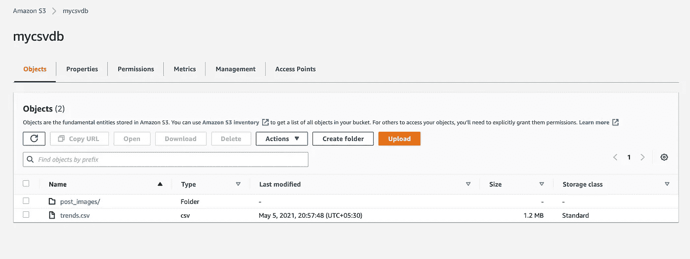
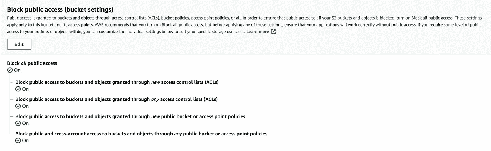
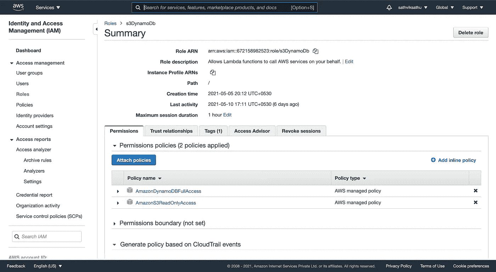
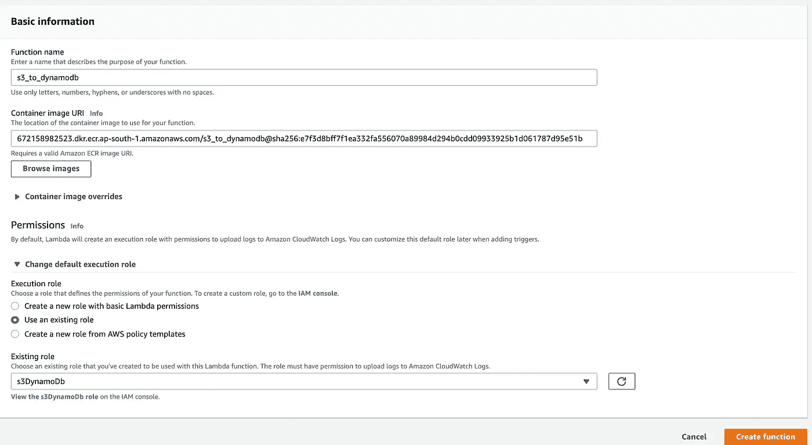
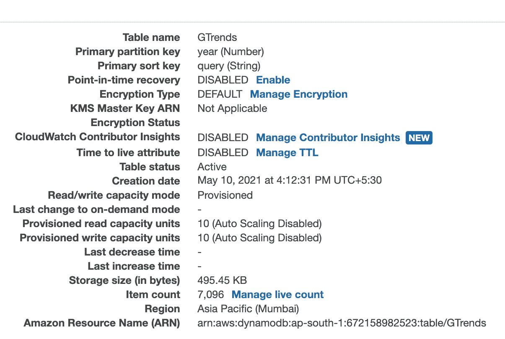

# 通过 AWS Lambda 将大量数据从 S3 接收到 DynamoDB

> 原文：<https://medium.com/analytics-vidhya/bulk-data-ingestion-from-s3-into-dynamodb-via-aws-lambda-b5bdc30bd5cd?source=collection_archive---------1----------------------->

假设我们有一个 excel 或 CSV 格式的大型数据库，我们希望通过将它加载到 DynamoDB 中来激活它。本文通过利用 AWS Lambda 服务提出了一种解决这个问题的简化方法。

本文的其余部分详细解释了这些步骤:

1.  创建一个存储桶并上传您的数据

2.创建具有所需权限的 IAM 角色

3.配置 Lambda 函数。

4.将代码添加到 Lambda 函数中

# 将您的数据上传到 S3

首先，将您的 CSV 数据放入 S3 存储桶。您可以通过编程或通过 AWS 帐户控制台来实现这一点。出于安全目的，您可以阻止对您的存储桶的所有公共访问。Lambda 函数将通过适当的 IAM 策略以编程方式访问您的 bucket 内容。我们将在下面的章节中讨论这一点。

**图一。创建存储桶和 CSV 文件**

**图二。阻止您的存储桶上的所有公共访问**

# 具有 S3 和 DynamoDB 访问权限的 IAM 策略

下一步是创建一个 IAM 角色，该角色具有访问 S3 存储桶和 DynamoDB 表所需的权限。出于我们的目的，亚马逊管理的两个策略是:

1.  亚马逊 3ReadOnlyAccess
2.  AmazonDynamoDBFullAccess

因为我们只会读取 S3 桶的内容，所以我添加了 AmazonS3ReadOnlyAccess。因为我们将创建它并将其插入 DynamoDB 表中，所以我添加了 AmazonDynamoDBFullAccess 策略并创建了一个 IAM 角色。

**图 3。创建一个 IAM 角色**

# 创建 Lambda 函数

既然我们的数据和权限已经准备好了，我们现在可以创建一个 Lambda 函数，它将执行从 S3 读取数据并将其接收到 DynamoDB 表中的任务。这里的关键步骤是将我们在上一步中创建的 IAM 角色附加到 permission 部分中的 Lambda 函数。这将允许我们的 lambda 函数代码以编程方式访问 S3 和 DynamoDB。

**图 4。λ函数创建**

大部分配置工作已经完成。现在让我们进入这项任务的代码部分。这个活动的代码可以在我的[**Github Repo:S3 _ To _ dynamo db**](https://github.com/sathviksathu/S3_To_DynamoDB)**中找到。**我已经将下图所示的代码作为 dockerized 图像添加到 Lambda 中。

首先，我们需要创建一个 boto3 会话，并使用它来启动一个 S3 客户端。这可以通过以下方式完成:

[创建 S3 客户端](https://gist.github.com/c22471ca280e9a5d3eada211336cabcc.git)

接下来，我们可以添加从我们的 S3 桶中读取 CSV 文件并返回从中创建的 pandas 数据帧的功能。不幸的是，Lambda 的默认 python 运行时环境没有随 Pandas 提供。查看我的另一篇进口熊猫的文章。

[将 CSV 加载到 pandas 数据帧中](https://gist.github.com/ed7582946f65e293005edc4b1d2f3861.git)

我们使用我们的 S3 客户端来`**get_object**` 并传递 Bucket 的名称和 CSV 文件名作为参数。CSV 文件内容将被提取到响应的`**Body**` 字段，随后被读入数据帧。

下一步，我们可以开始创建 DynamoDB 表，我们将在其中接收数据。我们再次开始创建 DynamoDB 资源，如下所示:

[创建 DynamoDB 资源](https://gist.github.com/231c663e4af8689be1bfbee23d6c84f4.git)

然后，我们使用上面的资源创建一个 DynamoDB 表。在[创建 DynamoDB 表](https://boto3.amazonaws.com/v1/documentation/api/latest/guide/dynamodb.html)时，必须提及`**TableName**`和`**KeySchema**` 细节。确保属性名称与 CSV 文件中的列标题名称匹配。

[创建一个 DynamoDB 表](https://gist.github.com/cfd530e2c2a1b42584343ca7a1eebb7a.git)

既然我们已经初始化并配置了 S3 和 DynamoDB 客户端，在下一步中，我们将尝试逐行读取数据帧并将其写入表中。

[将数据帧行摄取到表中](https://gist.github.com/14ef5fa002740d16c3a600eb1c44af25.git)

我们在表上初始化一个`**batch_writer()**`,并将每个数据帧行作为一个条目放入表中。

如果您正在将大量数据读入表格， [Boto3 文档](https://boto3.amazonaws.com/v1/documentation/api/latest/guide/dynamodb.html)建议使用`**batch_writer().**`

> 如果一次加载大量数据，可以利用 [DynamoDB。Table.batch_writer()](https://boto3.amazonaws.com/v1/documentation/api/latest/reference/services/dynamodb.html#DynamoDB.Table.batch_writer) 这样既可以加快处理速度，又可以减少对服务的写请求数量。

在测试超时为 10 分钟的 Lambda 函数时，它成功地将 7096 条记录吸收到表中。速度取决于调配的读/写容量单位。我们需要对它们进行配置，以允许更高的数据摄取率。

**图五。项目计数显示记录的数量**

***感谢阅读。我希望你今天学到了新东西。***