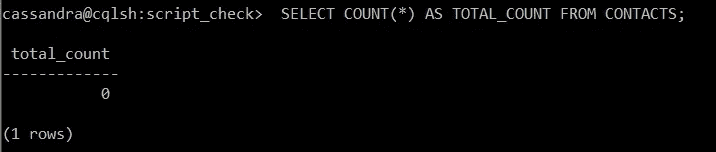

# "数据库中的大容量数据加载"

> 原文：<https://medium.com/analytics-vidhya/bulk-data-load-in-databases-c0b5bc53a63?source=collection_archive---------4----------------------->

一个 **CSV(逗号分隔值)**文件使用逗号分隔文件中的不同值。

CSV 文件是将数据导入表格或将数据导出到系统时的标准格式。

从 CSV 到数据库的数据

为了将 CSV 文件中的批量条目添加到 Mysql、Postgresql、SQL Server、Oracle 等数据库中，这需要两个步骤:

步骤 1:从系统中读取 CSV 文件。

步骤 2:将 CSV 数据加载到数据库表中。

**在本文中，我们将看到 Mysql、Postgresql、Cassandra 和 SQL Server 中的批量数据插入。**

1.  **SQL Server 数据库**

让我们考虑一个名为 contacts 的表，它有以下几列

> 创建表联系人(
> 域名 NVARCHAR(50)、
> 元标题文本、
> 元描述文本、
> SOCIALLINKSFACEBOOK 文本、
> SOCIALLINKSINSTAGRAM 文本、
> SOCIALLINKSTWITTER 文本、
> SOCIALLINKSLINKEDIN 文本、
> 电子邮件文本、
> EMAIL description NVARCHAR(50))；

对 contacts 表运行“选择计数”查询，以检查表中最初的行数

从联系人中选择 COUNT(*)作为 TOTAL _ COUNT

最初，表中没有记录。现在，让我们将 CSV 文件中的数据添加到数据库中。要使用的查询:-

> 从“文件路径\文件名”中批量插入联系人。CSV'
> WITH(格式= ' CSV ')；

现在检查表格中的计数

从联系人中选择 COUNT(*)作为 TOTAL _ COUNT

2. **PostgreSQL**

让我们考虑一个名为 contacts 的表，它有以下几列

> 创建表联系人(
> 域名 VARCHAR(50)，元标题文本，
> 元描述文本，SOCIALLINKSFACEBOOK 文本，
> SOCIALLINKSINSTAGRAM 文本，SOCIALLINKSTWITTER 文本，
> SOCIALLINKSLINKEDIN 文本，电子邮件文本，EMAIL description VARCHAR(50))；

对 contacts 表运行“选择计数”查询，检查表中最初的行数

从联系人中选择 COUNT(*)作为 TOTAL _ COUNT

最初，表中没有记录。现在，让我们将 CSV 文件中的数据添加到数据库中。要使用的查询:-

> 从“文件路径\文件名. csv”分隔符中复制联系人，“CSV

现在检查表格中的计数

从联系人中选择 COUNT(*)作为 TOTAL _ COUNT

3. **MySQL**

让我们考虑一个名为 contacts 的表，它有以下几列

> 创建表联系人
> (
> 域名 VARCHAR(50)
> 元标题文本、元描述文本、
> SOCIALLINKSFACEBOOK 文本、
> SOCIALLINKSINSTAGRAM 文本、
> SOCIALLINKSTWITTER 文本、
> SOCIALLINKSLINKEDIN 文本、
> 电子邮件文本、EMAIL description VARCHAR(50))；

对 contacts 表运行“选择计数”查询，以检查表中最初的行数

从联系人中选择 COUNT(*)作为 TOTAL _ COUNT

最初，表中没有记录。现在，让我们将 CSV 文件中的数据添加到数据库中。要使用的查询:-

> 将文件' file_path/file_name.csv'
> 中的数据加载到表 CONTACTS
> 字段中，以'，'
> 结尾，用' " '括起来；

从联系人中选择 COUNT(*)作为 TOTAL _ COUNT

> **注意:-为了在 MySQL 中导入或导出文件，我们通常会面临安全文件权限的问题。**
> 
> 错误:MySQL 服务器正在使用-secure-file-priv 选项运行，因此它无法执行此语句
> 
> 解决方案:-
> 
> 1)打开 my.ini 文件，添加 secure-file-priv = ' '并重启 mysql 服务器。
> 
> 2)在查询中加载数据后添加本地。

4.**卡珊德拉**

让我们考虑一个名为 contacts 的表，它有以下几列

> 创建表脚本 _CHECK。联系人(
> CONTACT_ID INT，
> CONTACT_NAME TEXT，
> CONTACT_DESCRIPTION TEXT，
> CREATED_AT BIGINT，
> PRIMARY KEY((CONTACT_ID)，CREATED_AT)
> )，聚类顺序为 BY(CREATED _ AT desc)；

对 contacts 表运行“选择计数”查询，以检查表中最初的行数

从联系人中选择 COUNT(*)作为 TOTAL _ COUNT

最初，表中没有记录。现在，让我们将 CSV 文件中的数据添加到数据库中。要使用的查询:-

> 从' file_path\file_name.csv'
> 中复制 script _ check . contacts(contact _ id，created_at，contact_description，contact_name)
> ，分隔符= '，'，头= TRUE

从联系人中选择 COUNT(*)作为 TOTAL _ COUNT

有时候，这些将数据加载到数据库中的小技巧会非常有用。

如果发现有用，就鼓掌🙂。