# COVID 疫情期间在家工作的员工的疲劳分析

> 原文：<https://medium.com/analytics-vidhya/burn-out-analysis-of-employees-working-from-home-during-covid-pandemic-36ea1813bed0?source=collection_archive---------1----------------------->


来源——unsplash.com

# 概观

COVID 19 疫情为整个世界买下了从未想过和无法想象的局面。虽然它影响了所有工作领域，但就交付预期成果而言，it 部门员工或白领员工受到的影响最小。相反，LinkedIn 上的许多文章和评论表明，WFH 提高了一个组织的生产率。许多人抱怨精疲力竭和精神压力，指责 WFH 在他们的个人和工作生活中没有留下任何界限。我们将分析来自 Kaggle 的公开可用的[数据，这是一个分数样本，绝对不能代表整个世界。](https://www.kaggle.com/blurredmachine/are-your-employees-burning-out)

# 期待结果

*   分析可用数据以回答数据中的统计数据

# 结论

以下是根据数据得出的一些结论。我先把它发表出来，把我的见解放在最上面。-

> **员工总数的 10 %极度疲惫**
> 
> **29 %的员工中度疲劳**
> 
> **员工总数的 54 %轻度疲劳**
> 
> **员工总数中只有 1 %没有筋疲力尽**
> 
> **较大团队的经理比较小团队的经理更加疲惫不堪——拥有较大团队(向其汇报的人越多)的员工比汇报人数较少的员工更加疲惫不堪**
> 
> **总体而言，男性比女性更加疲惫，因为大多数女性轻度疲惫，而大多数男性中度和极度疲惫**
> 
> **59 %的男性和 41 %的女性极度疲惫，这表明男性比女性更加疲惫**
> 
> **与在产品型公司工作的员工相比，在服务型公司工作的员工更加疲惫不堪**

# 我们有什么数据？

*   *员工 ID* **:** 分配给每个员工的唯一 ID(例如:fffe390032003000)
*   *入职日期:*员工加入组织的日期时间(例如:2008–12–30)
*   *性别:*员工的性别(男/女)
*   *公司类型:*员工工作的公司类型(服务/产品)
*   *WFH 设置是否可用:*员工是否可以在家工作(是/否)
*   *职务:*在组织中工作的员工的职务。在[0.0，5.0]范围内，更大是更高的指定值。
*   *资源分配:*分配给员工工作的资源量，即工作小时数。在[1.0，10.0]范围内(更高意味着更多资源)
*   *精神疲劳评分:*员工面临的精神疲劳程度。在[0.0，10.0]范围内，其中 0.0 表示无疲劳，10.0 表示完全疲劳。
*   *燃烧率:*我们需要为每个员工预测的值，告诉他们工作时的燃烧率。在[0.0，1.0]的范围内，该值越高，烧坏越严重。

# 主要步骤

*   设置开发环境— Google Colab、Python 库
*   使用 [Jovian](https://jovian.ai) 开发的 [opendatasets 库](https://github.com/JovianML/opendatasets)下载数据
*   对训练数据进行可视化，并显示一些统计数据
*   建立模型并预测

## 步骤 1 —安装开发环境设置所需的库并导入它们

```
!pip install opendatasets pandas numpy matplotlib seaborn sklearn — quiet# Commented out IPython magic to ensure Python compatibility.import pandas as pd
mport numpy as np
import matplotlib.pyplot as plt
import seaborn as sns%matplotlib inline
sns.set_theme(style = “darkgrid”)
sns.set_context(“paper”)plt.figure(figsize=(8,6))
pd.set_option(‘display.max_rows’, 50)
pd.set_option(‘display.max_columns’, 500)
pd.set_option(‘display.width’, 1000)
```

## 步骤 2 —从 Kaggle 下载数据

```
import opendatasets as od
import osdataset_url = "https://www.kaggle.com/blurredmachine/are-your-employees-burning-out"
od.download(dataset_url)
data_dir = os.listdir()[1]
file_list = os.listdir("./are-your-employees-burning-out")
print(file_list)
```

## 步骤 3 —将 train.csv 加载到 pandas 中

```
file_path = “./are-your-employees-burning-out/” + “train.csv”
raw_employee_df = pd.read_csv(file_path)
print(raw_employee_df)
```

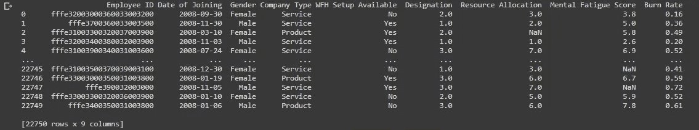

基于上述输出，我们可以看到我们有许多分类特征，如性别、WFH 设置可用性、加入日期、公司类型等。此外，我们有员工 Id，它只是员工的唯一标识，不会对我们的模型开发分析产生任何影响。我们可以去掉那个列，然后分析可用的数据

从数据框架中删除“员工 ID”列

```
raw_employee_df = raw_employee_df.drop(“Employee ID”, axis = 1)
print(raw_employee_df)
```

## 第 4 步—获取我们现有数据的基本统计数据

```
raw_employee_df.info()
```

如输出所示，我们可以看到-

*   数据集中有 22750 条记录
*   缺少资源分配、精神疲劳评分和燃烧率的值
*   数据类型是对象(字符串)和浮点
*   燃烧速率是目标值，需要预测

```
raw_employee_df.describe()
```

基于上面显示的输出，我们有以下推论-

*   我们 75%以上的记录都有 3 的标志(5 是最高的)
*   超过 75%的记录的资源分配值为 6 (10 最高)
*   精神疲劳评分也是如此

## **虽然所有特性都会对烧坏率产生影响？**

将会有像精神疲劳分数、资源分配、性别这样的关键特征，它们可能会影响耗尽率。

让我们试着想象一些关系

# 步骤 5 —数据的可视化

## ##计数图

让我们绘制一个计数图，以了解我们对每一列感兴趣的记录或样本的数量

```
sns.countplot(x = “Gender”, data = raw_employee_df);
```

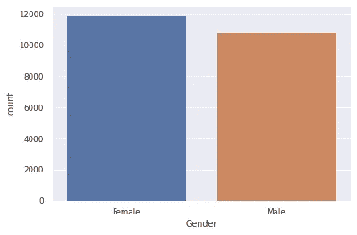

让我们为其他分类列绘制计数图，即公司类型、可用的 WFH 设置

```
sns.countplot(x = “Company Type”, data = raw_employee_df);
```

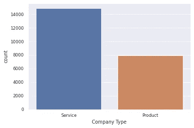

我们可以看到，几乎有两倍的员工在服务型公司工作。这真的会影响我们的分析

```
sns.countplot(x = “WFH Setup Available”, data = raw_employee_df);
```

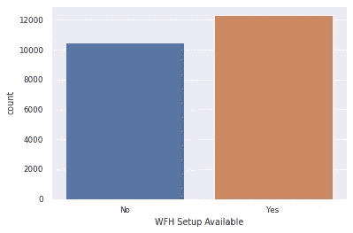

在我们的记录中，将近 12，000 名员工可以在家工作

```
sns.countplot(x = “Designation”, data = raw_employee_df);
sns.countplot(x = “Resource Allocation”, data = raw_employee_df);
```

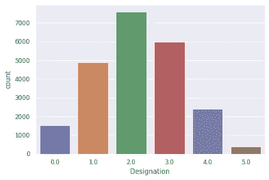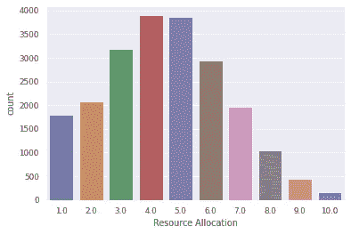

## **关系图**

关系图将帮助我们理解两个特性是如何相互影响的

```
sns.relplot(x = “Burn Rate”, y = “Resource Allocation”, data = raw_employee_df) ;
```

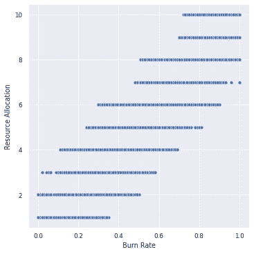

参见上图，我们可以看到，当分配的资源数量超过 8 时，消耗率要高得多(大于 0.6)。据此我们推断-

**分配给员工的资源数量会影响员工的工作热情。如果分配给员工更多的资源，他/她的倦怠率将比其他人高得多**

```
sns.relplot(x = “Burn Rate”, y = “Mental Fatigue Score”, data = raw_employee_df) ;
```

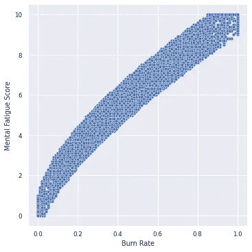

上述关系图清楚地表明，精神疲劳得分是影响疲劳的一个主要特征。我们推断-

**烧伤率随精神疲劳评分而增加。它们太相关了**

```
sns.relplot(x = “Burn Rate”, y = “Designation”, data = raw_employee_df) ;
```

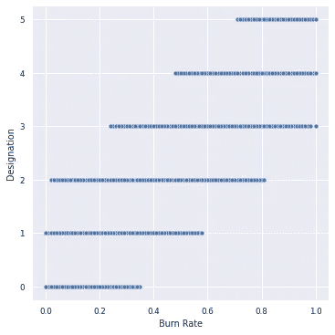

**称号似乎对职业倦怠没有太大影响**

```
sns.relplot(x = “Burn Rate”, y = “WFH Setup Available”, data = raw_employee_df) ;
```

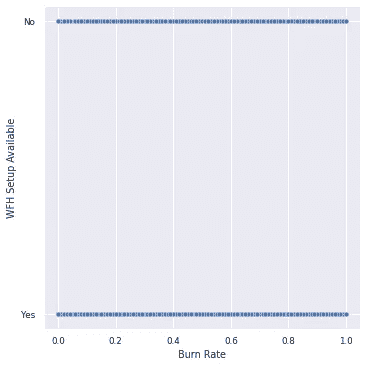

这一特征似乎对烧坏没有任何影响

## ##相关矩阵

让我们用相关矩阵来确定哪些特征相互影响。相关矩阵仅对数值数据有效，因此将排除所有分类列。

稍后，我们可以通过一些编码技术获得与分类列的相关性

```
raw_employee_df.corr()plt.figure(figsize = (15,8))sns.heatmap(raw_employee_df.corr(), annot=True);
```

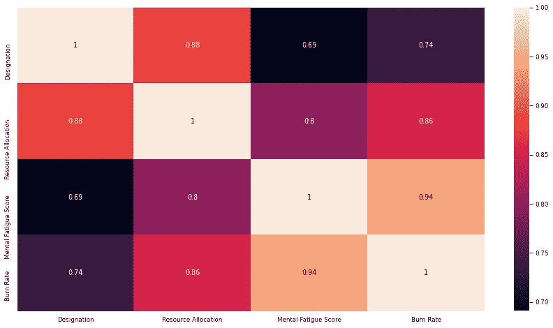

我们可以清楚地看到，精神疲劳评分和燃烧率是直接相互影响的。在资源分配、燃烧率、设计和资源分配等之间还有一些其他的良好的相关性。

# #第 6 步—根据数据回答下面的统计问题

## 有多少员工在以下几个方面筋疲力尽？

让我们试着得到这些数据

*   极度烧毁=燃烧率> = 0.7
*   中度燃尽=燃烧率在 0.5 和 0.7 之间
*   轻度烧尽=燃烧率小于 0.5
*   未燃尽=燃烧率= 0.0

## 有多少员工极度疲劳(燃烧率大于 0.7？

```
extream_burn_rate_df = raw_employee_df[raw_employee_df[“Burn Rate”] >= 0.7]extreamly_burned_out_count = extream_burn_rate_df[“Burn Rate”].count()print(“Number of employees who are extreamly burned out =”, extreamly_burned_out_count)percent = extreamly_burned_out_count / len(raw_employee_df)print(“Percentage of exmployees who fall under Extreamly burned out = “ , percent * 100, “ %”)
```

## 有多少员工中度疲劳(燃烧率大于 0.5 且小于 0.7)？

```
moderate_burn_rate_df = raw_employee_df[(raw_employee_df[“Burn Rate”] >= 0.5) & (raw_employee_df[“Burn Rate”] < 0.7)]moderately_burned_out_count = moderate_burn_rate_df[“Burn Rate”].count()print(“Number of employees who are moderately burned out =”, moderately_burned_out_count)percent = moderately_burned_out_count / len(raw_employee_df)print(“Percentage of exmployees who fall under Moderately burned out = “ , percent * 100, “ %”)
```

## #多少员工轻度烧伤(烧伤率低于 0.5)？

```
slightly_burn_rate_df = raw_employee_df[(raw_employee_df[“Burn Rate”] > 0.0) & (raw_employee_df[“Burn Rate”] < 0.5)]slightly_burned_out_count = slightly_burn_rate_df[“Burn Rate”].count()print(“Number of employees who are slightly burned out =”, slightly_burned_out_count)percent = slightly_burned_out_count / len(raw_employee_df)print(“Percentage of exmployees who fall under Slightly burned out = “ , percent * 100, “ %”)
```

## #有多少员工完全没有被累垮？

```
no_burn_rate_df = raw_employee_df[raw_employee_df[“Burn Rate”] == 0]no_burned_out_count = no_burn_rate_df[“Burn Rate”].count()print(“Number of employees who are not burned out =”, no_burned_out_count)percent = no_burned_out_count / len(raw_employee_df)print(“Percentage of exmployees who fall under No burned out = “ , percent * 100, “ %”)
```

## 按性别划分，以下哪几类人会筋疲力尽？

*   极度烧毁=燃烧率> = 0.7
*   中度燃尽=燃烧率在 0.5 和 0.7 之间
*   轻度烧尽=燃烧率小于 0.5
*   未燃尽=燃烧率= 0.0

## 让我们添加一个新的“倦怠类别”栏，条件如下-

*   当燃烧率> 0.7 时，极度烧尽
*   当燃烧率> = 0.5 且燃烧率< 0.7
*   Slight Burn out when Burn Rate < 0.5

```
raw_employee_df['Burnout Category'] = np.where(raw_employee_df['Burn Rate'] > 0.7, "Extreme", #Else belownp.where((raw_employee_df["Burn Rate"] >= 0.5) & (raw_employee_df["Burn Rate"] < 0.7), "Moderate", #else belownp.where(raw_employee_df['Burn Rate'] < 0.5, "Slight", "No Burnout"  )))
```

## Count for burnout categories — Male

```
males_count_extreme = raw_employee_df[(raw_employee_df['Burnout Category'] == "Extreme") & ((raw_employee_df['Gender'] == "Male"))]['Burnout Category'].count()males_count_moderate = raw_employee_df[(raw_employee_df['Burnout Category'] == "Moderate") & ((raw_employee_df['Gender'] == "Male"))]['Burnout Category'].count()males_count_slight = raw_employee_df[(raw_employee_df['Burnout Category'] == "Slight") & ((raw_employee_df['Gender'] == "Male"))]['Burnout Category'].count()print("Number of males with Extreme Burnout = ", males_count_extreme)
print("Number of males with Moderate Burnout = ", males_count_moderate)
print("Number of males with Slight Burnout = ", males_count_slight)
```

## Count for Burnout categories — Female

```
females_count_extreme = raw_employee_df[(raw_employee_df['Burnout Category'] == "Extreme") & ((raw_employee_df['Gender'] == "Female"))]['Burnout Category'].count()females_count_moderate = raw_employee_df[(raw_employee_df['Burnout Category'] == "Moderate") & ((raw_employee_df['Gender'] == "Female"))]['Burnout Category'].count()females_count_slight = raw_employee_df[(raw_employee_df['Burnout Category'] == "Slight") & ((raw_employee_df['Gender'] == "Female"))]['Burnout Category'].count()print("Number of females with Extreme Burnout = ", females_count_extreme)print("Number of females with Moderate Burnout = ", females_count_moderate)print("Number of females with Slight Burnout = ", females_count_slight)
```

Let us plot this for better visualization

```
sns.countplot(x = "Burnout Category", data = raw_employee_df, hue = "Gender");
```

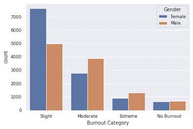

Count plot for male and female burnout categories

# **下载工作笔记本**时中度烧坏

要下载带有代码片段和输出的工作笔记本，[请访问这个 GitHub 链接。](https://github.com/AMMLRepos/predict-mental-burnout-of-employeesu/blob/main/Analyzing_and_predicting_employee_burnout_during_pandemic.ipynb)