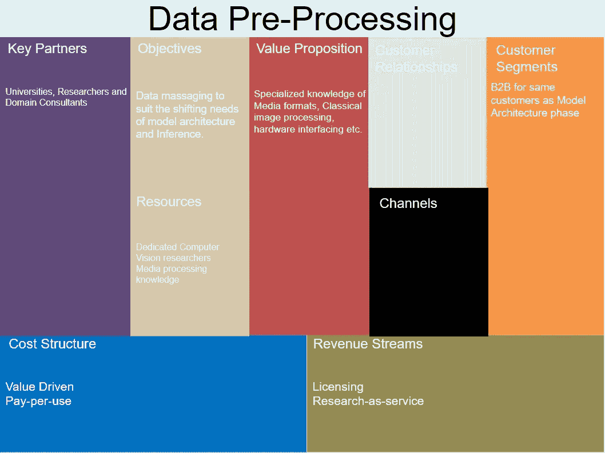

# 计算机视觉中的商业模式

> 原文：<https://medium.com/analytics-vidhya/business-models-in-computer-vision-41afc185c6f1?source=collection_archive---------8----------------------->

本文的目的是揭示机器学习术语中可能的创收选项。虽然机器学习被推销为解决 IT 行业面临的各种问题的灵丹妙药，但现实是 ML 就绪和采用是一个旅程，需要对组织的许多运营进行重大改造。这一旅程中开启的机遇意义重大，可以成为任何老牌 IT 服务提供商和/或初创企业的新收入来源。本文旨在阐明其中一些领域，并作为描述创收前景的起点。

**视频分析项目的生命周期**

任何视频分析项目通常都要经历以下几个阶段。这些是每个项目中不同的阶段，通常需要显著不同的技能来成功完成每个阶段。虽然一定量的快速跟踪是可能的，但这些阶段通常是连续的，没有太多重叠。

*   数据采集和注释
*   模型架构和培训
*   数据预处理
*   推理
*   后加工

**项目生命周期**

乍一看，视频分析项目生命周期类似于 SDLC 瀑布模型。然而，该模型与 IBM 提出并发布的 CRISP-DM 模型有着显著的相似性。特定于视频分析的标签和注释等阶段已添加到适当的位置。该模型本质上不能与软件开发的敏捷模型相比。尽管如此，敏捷机器学习是一个有趣的概念，需要有自己深入的观点。[(社 2017)](http://1)

ML 项目生命周期阶段

**业务需求**

这是项目的第一步。在这里，像视频分析软件的操作参数这样的所有信息都被识别。这包括但不限于软件环境、硬件要求、视频馈送质量、照明条件、可见/红外光谱、深度感应相机、遮挡等。这些需求进入后续阶段，对于确定项目的成败至关重要。建议在进入生命周期的后续阶段之前，尽可能最大程度地捕获业务需求。

**数据采集和标注**

这一阶段包括收集变革中的业务问题所需的数据。数据收集可以多种方式进行。数据可以是通用的，数据集可以从公共空间生成(如交通视频、人群数据等)，也可以是特定的，具体到单个公司，如制造装配线数据等。在数据收集之后，不可避免地需要对数据进行注释。所有已知的 ML 模型都需要对视频/图像数据进行注释，以便设计模型的计算机视觉科学家/研究人员可以将适当的数据提供给他们的模型。众所周知，对于任何系统来说，都是垃圾进垃圾出。数据注释是制定“输入”部分的地方，这个阶段非常重要，需要高度关注质量。当前用于数据收集和注释的方法大量依靠人工，并且需要专业知识。在本土培养这种知识并不容易，投资于视频分析的组织将从外包这一阶段中受益匪浅。

**模型架构和培训**

这个阶段是最终决定视频分析项目成败的“秘方”。这个阶段包括决定是使用现成的模型还是从头开始构建模型。各种微观和宏观因素影响这一决定，即。所需模型的商业可用性、对业务问题的适用性、业务可行性、受知识产权保护的解决方案的必要性等。这一决定涉及的一些关键因素是

*   **模型的可用性**:公司特定问题所需的模型可能有，也可能没有现成的。许多开源模型都过于肤浅，而且极其局限于特定的数据集。无论如何，它们都不是通用模型，需要大量的架构设计。“迁移学习”方法可能并不总是符合要求，必须小心评估此类模型的“适合度”。
*   **知识产权保护**:这种模式可能适用于另一家公司，在这种情况下，制造与购买成为一个关键的决策因素。“制造”和“购买”都有各自的挑战。在“购买”的情况下，确保解决方案受到充分的知识产权保护以保持优势是极其重要的。
*   **业务可行性**:如果决定在内部“制作”模型，那么确保内部资源得到适当配备以应对挑战是非常重要的。这不仅包括编程知识和计算资源，还包括深入的领域知识，从 CNN 到视频分析相关技术的最新进展。公司必须认识到，这个阶段涉及许多“高风险高回报”的活动。这个阶段涉及到使用专业知识，截至 2019 年，这些知识很难在市场上找到。还有，即使有好的资源，也不能保证结果。

**数据预处理**

这个阶段包括在视频输入到模型之前对其进行处理。虽然这被列为一个单独的阶段，但需要注意的是，数据预处理阶段与模型架构和推理阶段是并行的。数据预处理负责将现实世界的数据转换成最适合架构模型的格式。这方面的例子可以是简单的格式转换或编解码器转换为复杂的图像处理算法，如应用过滤器，执行卷积和掩蔽。

**推论**

这个阶段是理论与现实世界相遇的地方。如果用软件术语来说，推理就是模型投入生产的地方。架构模型被部署在商业级硬件上并被使用。模型架构可以在拥有同类最佳计算资源的实验室中完成。这里的成本通常属于资本支出类别。推论无论如何，这通常是一项运营支出，公司有充分的理由希望在这方面减少足迹。所有主要的 CPU 制造商都在扩展他们的产品线，为云、移动、SoC、FPGA、嵌入式等各种情况提供专门的推理引擎，以帮助降低运营支出数字。所有这些系统和组织都有自己的能力、局限性，更重要的是，它们有自己的实现。像 Open-CL 这样的框架还没有成熟。此外，Open-CL 中的实现不可能利用每个硬件平台的所有功能。在这种情况下，组织拥有将模型转换到各种硬件平台的知识是非常重要的。考虑到行业打赌推理是一个巨大的创收机会，在这一阶段对具有专门技能的玩家的必要性不能少强调。

**后处理**

这个阶段相对来说最不关心视频分析技术的内部工作。这个阶段涉及构建与处理从视频中提取的数据相关的业务逻辑。简单地说，人们可以认为视频分析的目的是量化非结构化数据中的信息。如果我们同意这个论点，后处理阶段的目的是使用量化的信息从数据中提取洞察力。例如，考虑一个交通监控系统。推断有助于量化道路上车辆的数量和类型。后处理可能涉及额外的 ML 算法，以从交通密度、交通灯等待时间分析、速度检测或事故检测等数据中提取洞察力。大多数 IT 系统集成商都有能力轻松应对这一阶段。一般来说，他们已经掌握了将视频分析系统集成到组织流程中的技术。

**脚注**

虽然本文试图对视频分析项目中的活动进行归纳和分类，但必须强调的是，各个阶段都涉及大量的握手。与瀑布模型阻止对前一阶段进行更改的软件开发生命周期不同，视频分析项目管道更类似于 CRISP-DM，其中各阶段之间有显著的来回。有许多论文认为，一个组织收集更好的数据几乎总是比投资更好的人力资源以获得更好的结果更好[(数据的不合理有效性)]。这个论点既有支持者，也有分散者。这份文件不支持任何一方。相反，我们想说的是，不管你的偏好如何，前面提到的阶段在视频分析项目中是不可避免的。你对论点的选择会影响你对每个阶段的重视程度。

# **商业模式画布**

业务模型画布是由 Alexander Osterwalder 提出的可视化管理模板，用于记录和交流组织的业务模型(产品服务系统的业务模型元素)。它直观地描述了组织的产品、价值主张、客户和财务状况。

**数据采集&标注**

从目标部分可以看出，该领域的业务活动即数据采集和图像标注都很有特色。数据收集可以简单到使用普通网络摄像头捕捉公共交通数据，也可以简单到使用高度复杂的设备收集复杂的医学成像数据或特定行业的数据。注释是一项劳动密集型的低技能工作，成本非常高，投资知识产权来自动化这项活动的公司可以获得巨大的收益。

数据获取和注释的业务模型

根据注释需求的本质，解决方案/服务需要构建多种多样的工作流。这里的工作性质类似于 BPO 或 KPO。(业务流程外包/知识流程外包)。市场上已经有一些解决方案可用于构建这些自定义工作流。AWS GroundTruth 和 Azure 的微软知识探索服务是两个比较受欢迎的解决方案。

# **模型架构**

模型架构是非常受价值驱动的。模型的知识产权保护解决方案的价值可以成为公司的差异化优势，因此，为客户提供这样的解决方案可以是一个重要的游戏规则改变者。一个很好的类比可以从制药业得出，在制药业中，某些公司只致力于研究新药并申请专利。(以研究为基础的制药业在美国医学进步中的作用。)

模型架构的业务模型

**数据预处理**

试图在这一领域工作的组织通过掌握保存图像/视频的不同数据格式的重要知识，为他们的客户增加价值。例如，医学成像格式的知识与卫星图像有很大不同。拥有从一种格式转换成另一种格式的“诀窍”对于模型架构团队来说是一个巨大的增值。

数据预处理的业务模型

**推论**

许多公司正在提供推理引擎，以允许分析模型以最佳方式运行。例如英伟达、英特尔的 OpenVINO、高通的 SNPE 等。为了操作这个阶段，组织需要具有各种推理引擎的专门知识，它们的特定能力和限制，以及在将模型转换到特定平台时的准确性权衡。这必须是一个细致入微的判断，以确保客户的钱有最大的价值。

用于推理的业务模型

**后处理**

在仔细分析后处理领域的工作性质后，作者认为这一阶段的商业模式与已经完善了这一技术的系统集成商的商业模式非常相似。因此，这里不构建单独的模式。

后处理需要大量的架构设计。请参阅我的文章[计算机视觉项目的解决方案架构](/analytics-vidhya/solution-architectures-for-computer-vision-projects-31754b4dad09?source=friends_link&sk=9731ab541dcae30bcd0c1c1a343bc6a1)

# 参考

1.  A.公共事务、公共事务、公共事务、媒体、组织和公共关系(2011 年)。*产品-服务体系的商业模式要素。*施普林格，柏林，海德堡。
2.  机构，Y. (2017 年 6 月 20 日)。*当敏捷遇上机器学习*。检索自 towards data science . com:[https://towards data science . com/when-agile-meets-machine-learning-2af 111 bddee](https://towardsdatascience.com/when-agile-meets-machine-learning-2af111bddeec)
3.  Halevy，a .，Norvig，p .，和 Pereira，F. (2009 年)。数据的不合理有效性。 *IEEE 智能系统，第 24 卷*，8–12 页
4.  凯廷，K. I .，布赖恩特，N. R .，&千层面，L. (1993 年)。基于研究的制药业在美国医学进步中的作用。*《临床药理学杂志》，33 期*，412–417 页。

你怎么想呢?请分享你对 ngopikrishna.public@gmail.com 和/或 vp@must.co.in 的想法