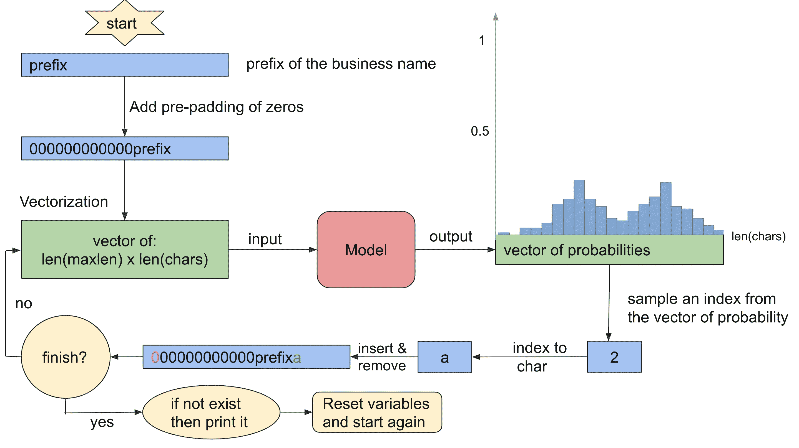

# 使用 TensorFlow 的企业名称生成器

> 原文：<https://medium.com/analytics-vidhya/business-name-generator-with-tensorflow-eba86c35d9cf?source=collection_archive---------6----------------------->

*再次成名*

## 动机

前几天，我在想给我正在开发的应用取个名字。但是我想到的都已经存在了，他们的域名不可用，或者很贵。我的想法用完了，我开始需要一个工具来获得可供选择的想法。我找到了许多关于这方面的有用网页，但它们仍然对我不起作用。所以，我决定用 Python 构建自己的企业名称生成器，并与大家分享，这样也许你会发现它很有帮助，或者至少你学到了一些你不知道的东西。

我认为一个网站、应用程序或企业的名称至关重要。即使在以前，我也不会因为名字而想去几个公司工作。创建一个简单、易记、易拼、可在互联网上使用的域名并不容易。这就是我创建这个项目的动机。而且，我认为如果你从递归神经网络和张量流开始，这是理想的。它还允许你将它扩展到更复杂的新内容，比如自动完成信息，就像 Gmail 在我们写电子邮件时所做的那样。

## 程序

要在给定空字符串、前缀或后缀的情况下创建名称生成器，我们必须用我们希望遵循的模式加载数据集。它可以是一本字典，许多不同语言的字典，一个公司名称，短语，混合的列表，等等。这取决于你，结果将取决于它；为了简单起见，我选择了字典。接下来，我们将处理 RNN 输入的数据。如果你不知道什么是 RNNs，我推荐吴恩达的 [deeplearning.ai](https://www.deeplearning.ai/) 课程。然后，我们将使用 TensorFlow 构建、编译和训练我们的模型，这将帮助我们进行预测。最后，我将向您展示我用来利用模型并生成新名称的算法。

## 要求

*   Python 3
*   张量流> = 2.0

## 导入包

```
from tensorflow.keras.callbacks import LambdaCallback
from tensorflow.keras.optimizers import RMSprop
from tensorflow.keras.models import Sequential
from tensorflow.keras.layers import Dense
from tensorflow.keras.layers import LSTM
import numpy as np
import random
import sys
import io
import os
```

## 加载数据

在接下来的几行中，您必须添加单词的路径以及您想要遵循的模式(或者句子，如果您想要开始玩自动完成消息的话)。在我的例子中，我将[英语词典](https://github.com/dwyl/english-words/blob/master/words_alpha.txt)添加到一个名为`data.txt`的空文件中。

```
path = 'data.txt'
with io.open(path, encoding='utf-8') as f:
    text = f.read().lower()
```

检查它的长度。

```
print('length:', len(text))Output:
length: 1908035
```

## 数据处理

列出数据中所有不同的字符。

```
chars = sorted(list(set(text)))
print('total chars:', len(chars))
print(chars)Output:
total chars: 28
['\n', "'", 'a', 'b', 'c', 'd', 'e', 'f', 'g', 'h', 'i', 'j', 'k', 'l', 'm', 'n', 'o', 'p', 'q', 'r', 's', 't', 'u', 'v', 'w', 'x', 'y', 'z']
```

替换或删除我们不想在名字中出现的字符。

```
text = text.replace("'", "")
```

为每个字符设置一个索引，并创建两个字典。这将有助于重建模型的输出。

*   从字符到索引(我们需要它来进行输入训练)
*   从索引到字符(我们需要它来重建模型的输出)

```
char_indices = dict((c, i) for i, c in enumerate(chars))
indices_char = dict((i, c) for i, c in enumerate(chars))

print(char_indices)Output:
{'\n': 0, "'": 1, 'a': 2, 'b': 3, 'c': 4, 'd': 5, 'e': 6, 'f': 7, 'g': 8, 'h': 9, 'i': 10, 'j': 11, 'k': 12, 'l': 13, 'm': 14, 'n': 15, 'o': 16, 'p': 17, 'q': 18, 'r': 19, 's': 20, 't': 21, 'u': 22, 'v': 23, 'w': 24, 'x': 25, 'y': 26, 'z': 27}
```

将文本分成几行并删除空行。

```
lines = text.split('\n')
lines = [line for line in lines if len(line)!=0]
print("number of lines:", len(lines))Output:
number of lines: 194433
```

获取最长一行的长度(在我的例子中是字典中最长的单词)。我们也可以检查最小尺寸。

```
maxlen = len(max(lines, key=len))
minlen = len(min(lines, key=len))

print("line with longest length: "+ str(maxlen))
print("line with shorter length: "+ str(minlen))Output:
line with longest length: 31
line with shorter length: 1
```

我们将把文本切割成半冗余的`maxlen`字符序列，添加零的预填充。例如，如果最大长度是 20，对于单词，`hello`，我们将创建下一个序列:`0000000000000000hello`。

你可能会问为什么我要固定所有的字的大小。事实证明，如果我们将固定大小传递给 TensorFlow 中的 LSTM，训练的速度会更快，因为它会创建固定形状的张量，在单个矩阵操作中实现许多操作。

你可能会问的另一个问题是:为什么我添加了一个前填充而不是后填充的零？由于 LSTM 基于数据序列进行学习，并试图找到与过去的关系，因此在输入中添加白噪声，即 LSTM 预填充，似乎是最佳选择。我发现一篇论文[1]表明，如果对数据应用后置填充而不是前置填充，性能会更差。在我的方法中，我认为不清楚什么是好的性能，因为我们想要生成遵循某种模式的随机字符串。

从代码开始，我们要完成两个列表。一个有序列的子序列，另一个有对应的下一个字符。在`hello`示例中，我们将在每个列表中获得五个字符串:

```
List of subsequence       | Next char
| --- | --- |
'000000000000000hello'    |  '\n'
'0000000000000000hell'    |  'o'
'00000000000000000hel'    |  'l'
'000000000000000000he'    |  'l'
'0000000000000000000h'    |  'e'
```

```
steps = 1
sequences = []
next_chars = []

for line in lines:
    # pre-padding with zeros
    s = (maxlen - len(line))*'0' + line
    sequences.append(s)
    next_chars.append('\n')
    for it,j in enumerate(line):
        if (it >= len(line)-1):
            continue
        s = (maxlen - len(line[:-1-it]))*'0' + line[:-1-it]
        sequences.append(s)
        next_chars.append(line[-1-it])
```

为了方便起见，我称`sequences`为子序列列表；我将使用这个列表作为模型的输入，使用`next_char`列表作为相同的输出。

检查我们有多少个序列，并查看我们创建的列表的几个示例。

```
print('total sequences:', len(sequences))
print(sequences[66], next_chars[66])
print(sequences[67], next_chars[67])
print(sequences[68], next_chars[68])Output:
total sequences: 1713551
00000000000000000000000aaronica l
000000000000000000000000aaronic a
0000000000000000000000000aaroni c
```

序列的数量大于单词的数量。如果可以的话，我们可以继续。

## …向量化…

现在我们必须向量化列表(T6 和 T7)。列表中的每个元素都将是一个`(maxlen)x(len(chars))`的 2D 矩阵。

```
x = np.zeros((len(sequences), maxlen, len(chars)), dtype=np.bool)
y = np.zeros((len(sequences), len(chars)), dtype=np.bool)
for i, seq in enumerate(sequences):
    for t, char in enumerate(seq):
        if char != '0':
            x[i, t, char_indices[char]] = 1
    y[i, char_indices[next_chars[i]]] = 1
```

查看矢量化的示例。

```
print(x[70][-5:]*1)Output:
[[0 0 0 0 0 0 0 0 0 0 0 0 0 0 0 0 0 0 0 0 0 0 0 0 0 0 0 0]
 [0 0 1 0 0 0 0 0 0 0 0 0 0 0 0 0 0 0 0 0 0 0 0 0 0 0 0 0]
 [0 0 1 0 0 0 0 0 0 0 0 0 0 0 0 0 0 0 0 0 0 0 0 0 0 0 0 0]
 [0 0 0 0 0 0 0 0 0 0 0 0 0 0 0 0 0 0 0 1 0 0 0 0 0 0 0 0]
 [0 0 0 0 0 0 0 0 0 0 0 0 0 0 0 0 1 0 0 0 0 0 0 0 0 0 0 0]]
```

注意到序列 70 是`000000000000000000000000000aaro`，它的矢量化在每最后四行中必须有一个不同于 0 的值。我们还可以看到`next_char`是`n`，所以它的矢量化必须在第 16 个位置有一个 1(索引 15):

```
print(y[70]*1)Output:
[0 0 0 0 0 0 0 0 0 0 0 0 0 0 0 1 0 0 0 0 0 0 0 0 0 0 0 0]
```

## 建立模型:单一的 LSTM

在建立模型之前，我将定义一些函数:`sample`和`generate_new_names`，稍后我将解释这些函数，但我需要它们作为火车的回调，以查看模型在每个时期的表现。大多数时候，人们将数据集分为训练集和测试集。但在这里，很难验证模型的性能。我们可以通过查看在每个 epoch 上生成的一些没有前缀或后缀集的随机名称来了解它的性能。我们还可以测量其中有多少是真正被发明的，或者只是我们数据集中的一个名字。

```
prefix = ""
max_names = 10

def sample(preds):
    """ function that sample an index from a probability array """
    preds = np.asarray(preds).astype('float64')
    preds = preds / np.sum(preds)
    probas = np.random.multinomial(1, preds, 1)
    return np.random.choice(range(len(chars)), p = probas.ravel())

def print_name_generated(name):
    print(name, flush=True)
def print_list_generated(lst):
    print(lst, flush=True)

def generate_new_names(*args):
    print("----------Generatinig names----------")

    # Add pre-padding of zeros in the input.
    sequence = ('{0:0>' + str(maxlen) + '}').format(prefix).lower()

    # tmp variables
    tmp_generated = prefix
    list_outputs = list()

    while (len(list_outputs) < max_names):

        # Vectorize the input of the model.
        x_pred = np.zeros((1, maxlen, len(chars)))
        for t, char in enumerate(sequence):
            if char != '0':
                x_pred[0, t, char_indices[char]] = 1

        # Predict the probabilities of the next char.
        preds = model.predict(x_pred, verbose=0)[0]

        # Chose one based on the distribution obtained in the output of the model.
        next_index = sample(preds)
        # Get the corresponding char.
        next_char = indices_char[next_index]

        # If the char is a new line character or the name start to be bigger than the longest word, 
        # try to add it to the list and reset temp variables.
        if next_char == '\n' or len(tmp_generated) > maxlen:

            # If the name generated is not in the list, append it and print it.
            if tmp_generated not in list_outputs:
                list_outputs.append(tmp_generated)
                print_name_generated(tmp_generated)
            # Reset tmp variables
            sequence = ('{0:0>' + str(maxlen) + '}').format(prefix).lower()
            tmp_generated = prefix
        else:

            # Append the char to the sequence that we're generating.
            tmp_generated += next_char
            # Add pre-padding of zeros to the sequence generated and continue.
            sequence = ('{0:0>' + str(maxlen) + '}').format(tmp_generated).lower()

    # Show the intersection of the words generated and your dataset. . 
    print("Set of words already in the dataset:")
    print_list_generated(set(lines).intersection(list_outputs))

    # Show the rate of how many repeated words you've created.
    total_repited = len(set(lines).intersection(list_outputs))
    total = len(list_outputs)
    print("Rate of total invented words: " + "{:.2f}".format((total-total_repited)/total))
    print("-----------------End-----------------")

# Function invoked at the end of each epoch. Prints generated names.
callback = LambdaCallback(on_epoch_end=generate_new_names)
```

我创建了一个 LSTM 模型，用 softmax 作为它的激活函数，因为我们想抽样概率。我使用`categorical_crossentropy`作为损失函数，因为它主要用于这类有分类输出的问题。我没有强有力的论据说明为什么我选择 128 和 RMSpror 作为批量大小和优化器；我在网上看了一些例子，把那些论点。最后，我使用的纪元数是 2，因为我开始看到生成了许多以相同字符开头的单词。

```
# build and train the model
model = Sequential()
model.add(LSTM(64, input_shape=(maxlen, len(chars))))
model.add(Dense(len(chars), activation='softmax'))
model.compile(loss='categorical_crossentropy', optimizer=RMSprop(lr=0.01))
history = model.fit(x, y, batch_size=128, epochs=2, verbose=2, callbacks=[callback])Output:
Epoch 1/2
----------Generatinig names----------
joysteer
jutted
intrancies
ylockress
jowrs
juity
jatesuperers
jascarfalc
hibamentarias
sheffing
Set of words already in the dataset:
{'jutted'}
Rate of total invented words: 0.90
-----------------End-----------------
 - 676s - loss: 1.9652
Epoch 2/2
----------Generatinig names----------
jecked
illofi
japolers
jurmanist
quoagall
hombiorns
walskins
jiallites
licking
revect
Set of words already in the dataset:
{'licking'}
Rate of total invented words: 0.90
-----------------End-----------------
 - 719s - loss: 1.8855
```

## 生成新名称功能的说明

最后，我们准备创造新的企业名称！我画了一个图来解释我的算法是做什么的，你可以走到函数前面，跟着它的代码和他们的注释。



## 给定前缀的名称生成

运行以下代码获取新名称。不要忘记填写您想要的`prefix`以及您想要在`max_names`中生成的总名称。每次运行代码，都会得到不同的结果，因为`sample`函数会根据概率任意选择下一个字符。

```
# Insert a prefix of the name you'd like to generate 
# (it could be empty)prefix = "deep"# Insert how many names you'd like to generate.max_names = 1000

generate_new_names()Output:
----------Generatinig names----------
deeper
deept
deepitic
deependtia
deepro
deepinations
deephisraric
deepa
deeprotized
deeperatis
...Set of words already in the dataset:
{'deepens', 'deeply', 'deeper', 'deepest', 'deepen', 'deeps', 'deep'}
Rate of total invented words: 0.99
-----------------End-----------------
```

我喜欢 *deepro* ，今天它的域名在互联网上是可用的！

## 给定后缀的名称生成

一种方法是反转字典的每一行，将其矢量化，然后再次训练模型。打印输出时，再次翻转。

```
# Reverse the text
lines = [line[::-1] for line in lines]

# Print the reversed names generated splited
def print_name_generated(name):
    print(name[::-1], flush=True)
def print_list_generated(lst):
    print([l[::-1] for l in lst], flush=True)
```

下一段代码只是之前工作的副本，但是没有注释。我什么都没改变。让我们执行它。

```
steps = 1
sequences = []
next_chars = []

for line in lines:
    # pre-padding with zeros
    s = (maxlen - len(line))*'0' + line
    sequences.append(s)
    next_chars.append('\n')
    for it,j in enumerate(line):
        if (it >= len(line)-1):
            continue
        s = (maxlen - len(line[:-1-it]))*'0' + line[:-1-it]
        sequences.append(s)
        next_chars.append(line[-1-it])

x = np.zeros((len(sequences), maxlen, len(chars)), dtype=np.bool)
y = np.zeros((len(sequences), len(chars)), dtype=np.bool)
for i, seq in enumerate(sequences):
    for t, char in enumerate(seq):
        if char != '0':
            x[i, t, char_indices[char]] = 1
    y[i, char_indices[next_chars[i]]] = 1

prefix = ""
max_names = 10

model = Sequential()
model.add(LSTM(64, input_shape=(maxlen, len(chars))))
model.add(Dense(len(chars), activation='softmax'))
model.compile(loss='categorical_crossentropy', optimizer=RMSprop(lr=0.01))
history = model.fit(x, y, batch_size=128, epochs=2, verbose=2, callbacks=[callback])Output:
Epoch 1/2
----------Generatinig names----------
shedaw
baj
kej
triperch
soilitiast
donlewdray
emperadow
kaj
daw
stask
Set of words already in the dataset:
['daw']
Rate of total invented words: 0.90
-----------------End-----------------
 - 716s - loss: 2.0443
Epoch 2/2
----------Generatinig names----------
vergial
uneroof
flaj
troomindax
gonagux
churbez
berbshatz
gornwook
carinax
genglaj
Set of words already in the dataset:
[]
Rate of total invented words: 1.00
-----------------End-----------------
 - 601s - loss: 1.9618
```

现在，在生成的名称中插入一个后缀，并执行下一段代码。

```
# Insert a suffix of your business name (could be empty):
suffix = "it"# Insert how many names you'd like to generate:
max_names = 10

# This reverse the prefix 
prefix = suffix[::-1]
generate_new_names()
# later, it will be reversed again in the print functionOutput:
----------Generatinig names----------
gallit
lammit
tosit
precabimit
unclelit
terlouemit
unfit
imbagmit
frocknanghit
bramit
Set of words already in the dataset:
['unfit']
Rate of total invented words: 0.90
-----------------End-----------------
```

## 结论

我们已经使用 TensorFlow 基于数据集成功创建了新的企业名称模式。他们中的许多人在互联网上有自己的域名，而且也很经济。我们还修改了代码，用后缀代替前缀来创建名字，得到了令人满意的结果。

查看结果，该模型学习如何组合单词或在旧术语中添加拼写错误，但保持单词的简单发音。此外，它有时添加，例如，副词功能，以非形容词性的条款，如" ly "在一个名词的结尾。

最后，根据我们问题的性质，我们可以通过使用回调来成功地定义时期的数量，并在训练期间查看每个时期的模型输出，在我们的模型中定义了两个时期的情况下获得了良好的结果。

## 参考

[1]Dwarampudi，m .和 Subba Reddy，N. V .，“填充对 LSTMs 和 CNN 的影响”， *arXiv 电子版*，2019 年。

我希望它是有帮助的，并且你和我一样喜欢它。如有疑问或建议，请评论。