# 给我买那个表情

> 原文：<https://medium.com/analytics-vidhya/buy-me-that-look-137c1e7030ec?source=collection_archive---------4----------------------->

这个博客是关于时尚推荐系统的。与其他系统相比，这是一个独特的推荐系统，因为这里基于提供的照片/图片，系统推荐照片中模特穿的类似衣服或物品。架构和设计组件的灵感来自一篇论文:[给我买那个样子:推荐类似时尚产品的方法](https://arxiv.org/pdf/2008.11638.pdf)。

# 议程

1.  商业问题
2.  ML/DL 公式
3.  业务限制
4.  数据采集和分析
5.  研究科
6.  我的方法
7.  最终结果
8.  未来的工作
9.  参考

# 1.业务问题:

简而言之，该研究论文指出，检测图像中的所有产品，并通过产品购买链接从数据库中检索相似的时尚服装。

在线商务已经成为每个人日常生活中的重要部分。虚拟商店允许人们在家里舒适地购物，没有售货员的压力。在本文中，作者关注于同时检索多个时尚商品，并提出了一种从图像中检测所有商品并推荐相似种类商品的体系结构。

在商店里，我们可以拿一块布，要求售货员给我们看颜色、图案、厚度等类似的产品；但是在网上搜索同类产品是不可能的，而且很费时间。所以，我们可以上传一张图片，用计算机视觉搜索相似的种类。

# 2.ML/DL 公式

让我们在本次会议中讨论模型的架构。将这个问题分成不同的阶段:

> ***阶段 1:(姿态估计)***
> 
> *在这个阶段，我们将检测图像是否是全正面姿态图像。所以这将是一个二元分类器(是/否)*
> 
> ***第二阶段:(本地化)***
> 
> *在这个阶段，我们检测所有的物品(衣服)以及物品被放置或定位的特定位置。这将是一个分类和回归问题。由于物品检测的分类和由于定位的回归(边界框坐标)*
> 
> ***第三阶段:(图像 _ 嵌入)***
> 
> *在这个阶段，我们将为图像生成嵌入(密集向量),如下所述。*
> 
> ***第四阶段:(获取相似图像)***
> 
> *在此阶段，我们将使用 Faiss 库根据搜索查询获取相似的服装。*

# 3.业务限制

*   我们的系统架构应该是可伸缩的，因为每天都有成千上万的新图片被添加到网站上。
*   **低延迟:**客户不会等待几分钟甚至超过 5-10 秒来获得建议。所以我们的架构应该能够在给定的时间框架内检索推荐。
*   因为它是一个离线推荐系统，所以必须记住实时限制。从客户的角度来看，可解释性是很重要的，它有助于说明提出建议的原因。当向用户推荐产品时，系统会添加一个链接到用户观看的产品，并触发推荐。

# 4.数据采集和分析

数据来自 Myntra。为此我用了硒。这个数据没有标注。

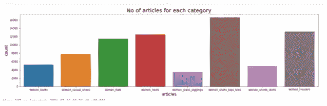

该数据包含不同类型的女士服装(上装、下装和鞋类)。由于这些数据来自 Myntra，所以我们有用于物品/衣服定位/检测的遮罩或边界框。所以，对于文章检测和定位部分，我是从 ka ggle competition:[imate rialist(Fashion)2019 在 FGVC6](https://www.kaggle.com/c/imaterialist-fashion-2019-FGVC6/data) 取的数据。该时尚数据大约有 45.2k 的文件，以带有 class_labels 的[编码像素格式](https://www.kaggle.com/c/data-science-bowl-2018/discussion/47699)输出。

# 5.研究科

1.  **主要论文:**[**https://arxiv.org/pdf/2008.11638.pdf**](https://arxiv.org/pdf/2008.11638.pdf)

我从一篇研究论文中截取了下面这张照片。

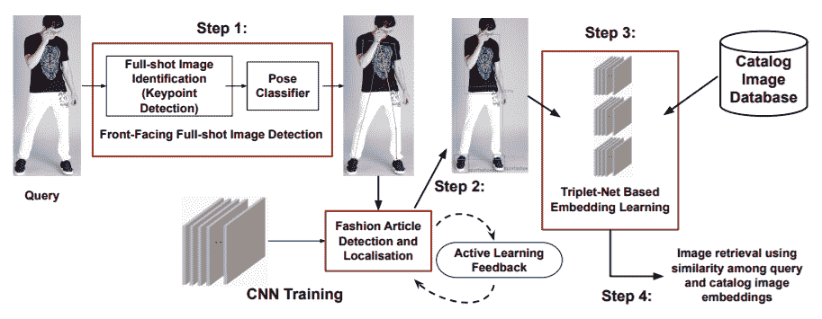

给我买那个 look，时尚推荐系统蓝图。

给我买那个 look，时尚推荐系统蓝图。

根据该论文，体系结构如下所述。

1.  通过使用姿态检测分类器，我们必须检测全镜头图像，并且基于 FFS，我们必须找到正面图像。
2.  正面图像通过主动学习传递到 CNN 网络，检测图像中的时尚对象并进行定位。
3.  为目录中所有可用的图像创建图像嵌入，并存储在数据库中。基于三元组网络的嵌入学习用于生成测试数据。我们也可以使用一个简单的基于 CNN 的自动编码器。
4.  传递一个查询图像，并从数据库中检索相似的图像。这里，他们使用余弦相似性从数据库中获得相似的度量。

**2。姿态检测:**[**https://nanonets.com/blog/human-pose-estimation-2d-guide/**](https://nanonets.com/blog/human-pose-estimation-2d-guide/)

在这个博客中，各种方法被用来提出检测问题。通过使用这些预先训练好的模型，我们可以节省大量的时间。选择最适合数据集的架构，然后微调或修改该架构以获得最佳结果。

**3。本地化/物品检测:**[**https://valo hai . com/blog/衣服检测-时尚-推荐/**](https://valohai.com/blog/clothes-detection-for-fashion-recommendation/)

在这篇博客中，用户解释了用于时尚物体检测的不同标记数据集。这种预先训练的数据集可以用在我们的数据之上，以提高模型的准确性。该博客详细解释了如何使用 Tensorflow 的对象检测 API，并提供了良好的代码片段，这将有助于首先作为黑盒尝试上述模型，然后选择在我们的数据集上提供最佳结果的架构。

Tensorflow 的对象检测 API 提供了几个预实现的架构，并在 COCO(上下文中的公共对象)数据集上预先训练了权重，例如

> *带移动网络的 SSD(单次多盒探测器)*
> 
> *采用 Inception V2 的固态硬盘。*
> 
> *带 Resnet 101 的 R-FCN(基于区域的全卷积网络)。*
> 
> *使用 Resnet 101 实现更快的 RCNN(基于区域的卷积神经网络)。*
> 
> *采用 Inception Resnet v2 的更快 RCNN*

**4。三重损失:**[**https://towards data science . com/image-similarity-using-trip % 20 let-Loss-3744 c0f 67973**](https://towardsdatascience.com/image-similarity-using-trip%20let-loss-3744c0f67973)

这篇博客很好地解释了如何使用三重损失来解决图像相似性问题。所以，我对三重损失结构的理解帮助我们通过相似和相异的概念来学习分布式嵌入。这是一种神经网络架构，其中多个并行网络被训练，彼此共享权重。在预测期间，输入数据通过一个网络来计算输入数据的分布式嵌入表示。

损失函数:三重损失的成本函数如下:

L(a，p，n) = max(0，D(a，p) — D(a，n) +边距)

其中 D(x，y):x 和 y 的学习向量表示之间的距离。可以使用 L2 距离或(1-余弦相似性)作为距离度量。该功能的目的是保持锚点和正极之间的距离小于锚点和负极之间的距离。

# 6.我的方法

在这里，我将解释我的业务问题的实现。

**模块 1:**

在模块 1 中，对于姿势检测，我尝试使用 HRNet 和 TensorFlow lite 模型。两个模型的输出几乎相似。于是，我拿起了 HRNet。从下面的片段可以清楚地看出，两个模型有相似的结果。

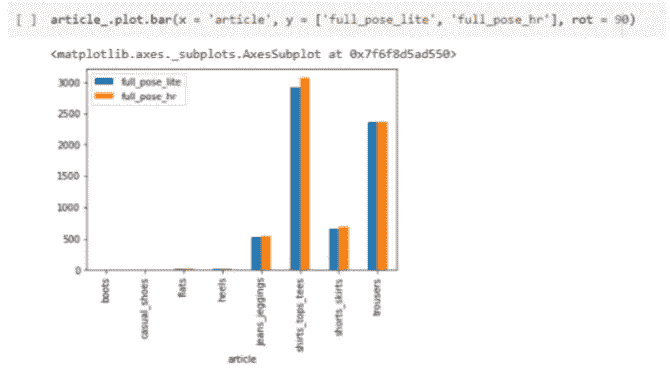

所以，在这里，我使用了我的研究部分的 HRNet，从我的语料库中找到所有完整的姿势和正面姿势图像。

**结果:**

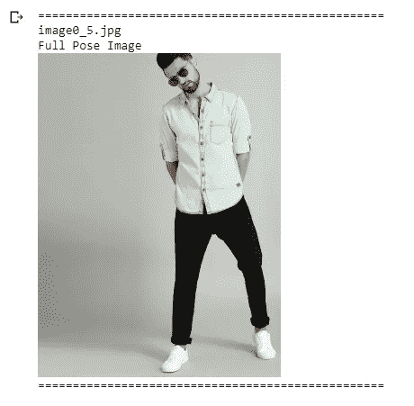

模块 1 的结果

如果图像被发现是全姿态的，则该图像被发送到模块 2

**模块 2:**

在模块 2 中，我们必须检测所有文章并对其进行定位。为此，我使用了 MaskRcnn 模型。我从 Kaggle 大赛“FGVC6 上的 iMaterialist (Fashion) 2019”中取的数据。定位后，我们必须裁剪图像，并将其传递给模块 3 以生成嵌入。

【MaskRCNN 是如何工作的？

Mask R-CNN(区域卷积神经网络)是一个两阶段框架:第一阶段扫描图像并生成建议(可能包含某个对象的区域)。第二阶段对提议进行分类并生成边界框和遮罩。Mask R-CNN 论文是其前身 fast R-CNN 的扩展，由同一作者完成。更快的 R-CNN 是一个流行的对象检测框架，Mask R-CNN 用实例分割等扩展了它。

本教程需要 TensorFlow 版本 1.15.3 和 Keras 2.2.4。它不能与 TensorFlow 2.0+或 Keras 2.2.5+一起使用，因为在撰写本文时第三方库尚未更新。

！pip 安装—无深度张量流==1.15.3

！pip 安装—无 deps keras==2.2.4

Mask R-CNN 基本上是更快的 R-CNN 的扩展。更快的 R-CNN 广泛用于对象检测任务。Mask R-CNN 框架建立在更快的 R-CNN 之上。因此，对于给定的图像，除了每个对象的类标签和边界框坐标之外，Mask R-CNN 还将返回对象遮罩。

1.  更快的 R-CNN 首先使用 ConvNet 从图像中提取特征地图
2.  这些特征图然后通过区域提议网络(RPN)传递，该网络返回候选边界框
3.  然后，我们在这些候选边界框上应用 RoI(感兴趣区域)池层，以使所有候选对象具有相同的大小
4.  最后，建议被传递到完全连接的层，以分类和输出对象的包围盒

类似于我们在更快的 R-CNN 中使用的从图像中提取特征映射的 ConvNet，我们在 Mask R-CNN 中使用 ResNet 101 架构从图像中提取特征。因此，第一步是拍摄图像，并使用 ResNet 101 架构提取特征。这些特征作为下一层的输入。

现在，我们采用上一步中获得的特征地图，并应用区域建议网络(RPM)。这基本上预测了该区域中是否存在物体。在这一步中，我们获得模型预测包含一些对象的那些区域或特征地图。

从 RPN 获得的区域可能具有不同的形状，对吗？因此，我们应用一个池层，并将所有区域转换为相同的形状。接下来，这些区域通过完全连接的网络，以便预测类别标签和边界框。

到目前为止，这些步骤几乎和 R-CNN 的工作速度一样快。现在来看两个框架之间的区别。除此之外，掩模 R-CNN 还产生分段掩模。

为此，我们首先计算感兴趣区域，以便可以减少计算时间。对于所有预测的区域，我们用基础真值盒计算并集上的交集(IoU)。我们可以这样计算借据:

IoU =交叉点面积/并集面积

现在，只有当 IoU 大于或等于 0.7+时，我们才将其视为目标区域。否则，我们就会忽视该地区。我们对所有区域都这样做，然后只选择 IoU 大于 0.7+的一组区域。

**结果:**

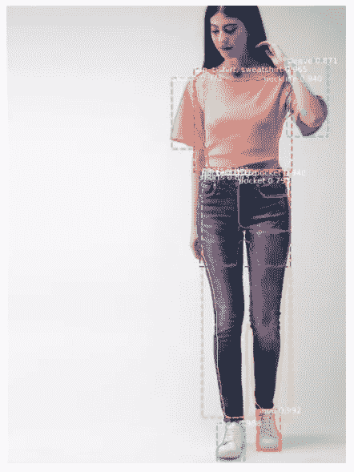

定位/物品检测

**模块 3:**

在模块 3 中，我尝试了 DenseNet121、ResNet50、ResNet101、MobileNet 和 InceptionV3。在所有这些中。DenseNet121 给出了良好的结果。

DenseNet121 与其他相比稀疏性较低。我选择 Densenet121。

DenseNet 生成了低稀疏度的 1024 维嵌入。

正如我们看到的，我们有 8 类数据，我将它们分为 3 个超级类别进行索引，如下所示。

**上 _ 穿**:女 _ 衬衫 _ 上衣 _ 苔丝
**下 _ 穿**:女牛仔裤、女裙子、女长裤
**脚 _ 穿**:女休闲鞋、平底鞋、高跟鞋

**模块 4:**

在模块 4 中，我使用了 FAISS(脸书人工智能相似性搜索)库来检索相似的文章。

Faiss 仅适用于 float32 型 ndarray。所以，首先，我们把嵌入转换成 ndarray 类型的 float32。

用 faiss 为上层器皿、下层器皿和鞋类创建了 3 个索引。

 [## facebookresearch/faiss

### 下面给出了基本的索引:索引可以用类构造函数显式地构造，或者用…

github.com](https://github.com/facebookresearch/faiss/wiki/Faiss-indexes) 

从上面提供的脸书 Github 页面来看，与其他使用欧几里德距离计算最近距离的方法相比，IndexFlatL2 是一种蛮力方法。所以，我用了。为了降低空间复杂度，还使用了 **IndexIVFPQ** 量化器。我们也可以使用余弦，但是在使用余弦之前，我们必须将向量归一化。通常余弦距离用于文本相似度。

索引只接受一个参数，它只是一个任意形状的向量，但是如果我们传递多个向量，要确保所有的向量都是相同的形状。

我们有一个 Faiss 的搜索方法，它依赖于索引值来检索相似的文章。在搜索方法中，我们也必须传递形状与索引向量相匹配的向量。

因为模块 3 中的生成嵌入返回长度为 2014 的列表，形状(行向量)和类型(浮点 32 ndarray)不同。在搜索之前，我们必须先转换它。

# 7.最终结果

所以我们有一个最终的解决方案。模型能够从给定的图像中检测和检索时尚对象。所以有一些错误的对象检测和错误的检索，但这是因为模型被训练了更少的时期。一些错误的检索是因为嵌入的是整个图像，而不是对象。此外，数据库的大小也很小。但总的来说，我们有一个可以进一步扩展和优化的首选解决方案。请在 Github 链接中查看。

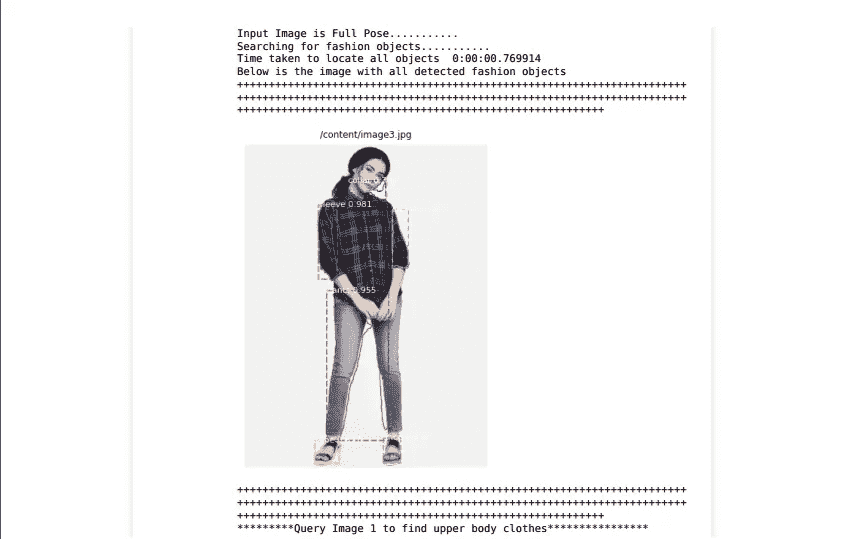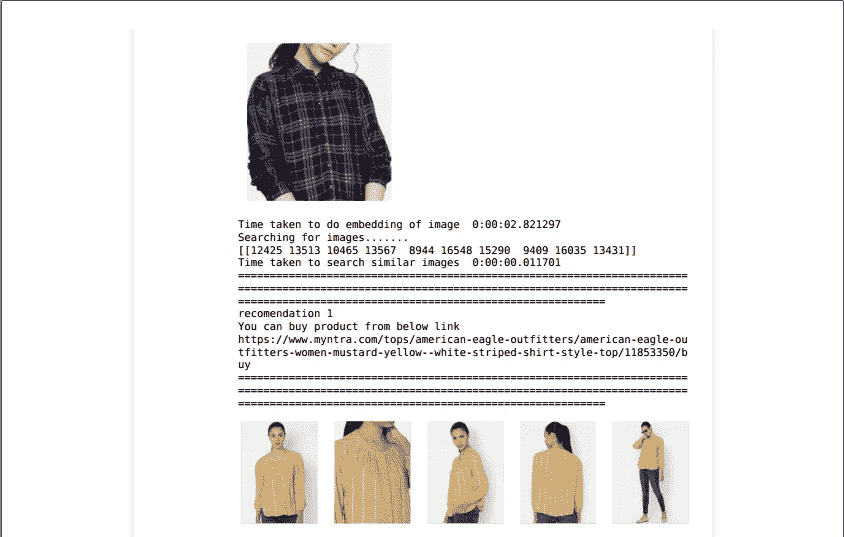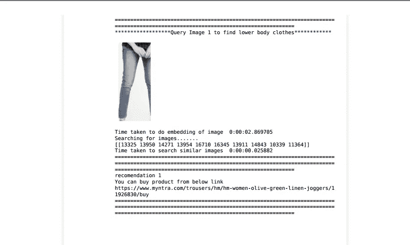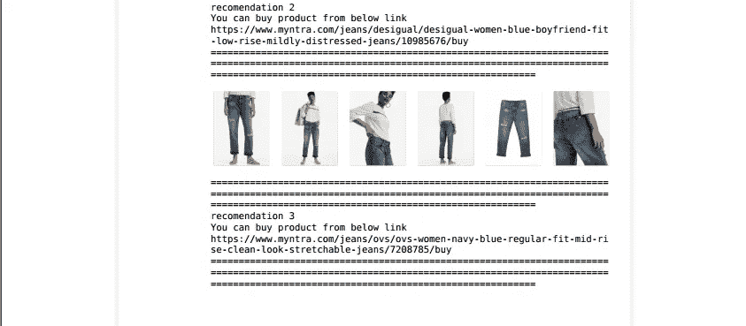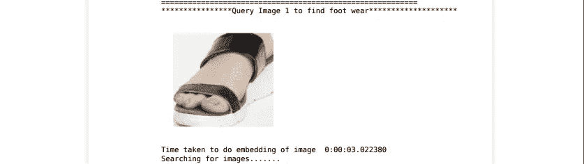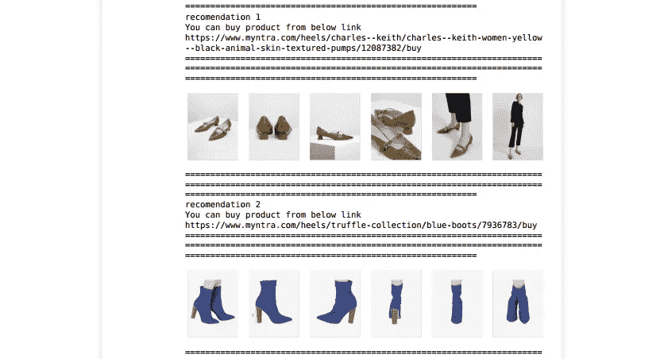

# 8.未来的工作

1.  减少端到端应用程序的延迟。
2.  对于嵌入，尝试不同的方法，比如构建自己的模型，并取得一些好成绩。
3.  为对象检测收集更多数据，并使用最新的分割方法，而不是掩模 RCNN。
4.  根据研究论文，训练基于三元组网络的嵌入层网络，以获得相似的图像。
5.  将模型部署到生产环境中进行实时推荐

# 9.参考

1.  [https://arxiv.org/pdf/2008.11638.pdf](https://arxiv.org/pdf/2008.11638.pdf)
2.  [https://www . tensor flow . org/lite/examples/pose _ estimation/overview](https://www.tensorflow.org/lite/examples/pose_estimation/overview)
3.  [https://programmer . group/analysis-of-official-post-energy-model-of-tensor flow . html](https://programmer.group/analysis-of-official-post-energy-model-of-tensorflow.html)
4.  [https://github.com/matterport/Mask_RCNN](https://github.com/matterport/Mask_RCNN)
5.  [https://towardsdatascience . com/mask-rcnn-implementation-on-a-custom-dataset-fd9a 878123d 4](https://towardsdatascience.com/mask-rcnn-implementation-on-a-custom-dataset-fd9a878123d4)
6.  [https://www . tensor flow . org/API _ docs/python/TF/keras/applications](https://www.tensorflow.org/api_docs/python/tf/keras/applications)
7.  [https://github.com/facebookresearch/faiss/wiki](https://github.com/facebookresearch/faiss/wiki)
8.  [https://www.appliedaicourse.com/](https://www.appliedaicourse.com/)

如果您有任何疑问，请随时发表评论，或者您也可以通过 [Linkedin](https://www.linkedin.com/in/naman-gupta-ds/) 联系我。你可以在这里找到我的完整项目。