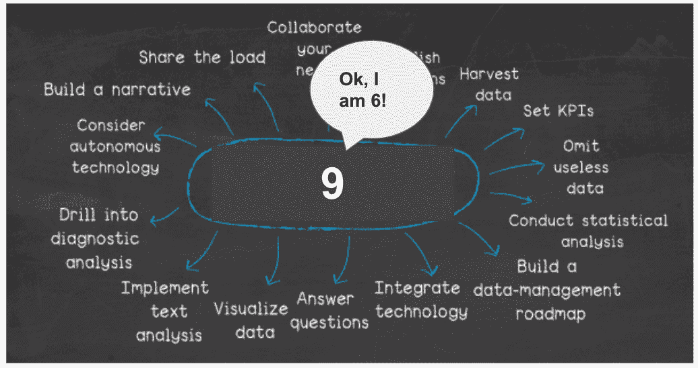
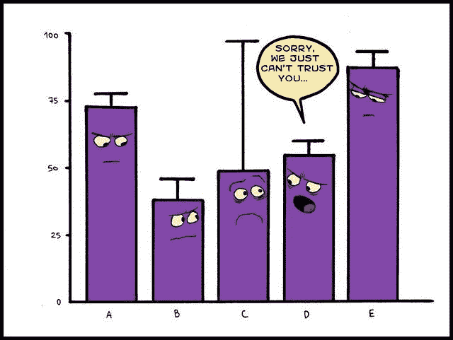

# 希波克拉底，图灵

> 原文：<https://medium.com/analytics-vidhya/by-hippocrates-turing-fa26f0a7a110?source=collection_archive---------22----------------------->

> 我将履行这个誓言和契约

“如果你折磨你的数据足够长的时间，它会承认任何事情。”—罗纳德·科斯

数据洞察就像埋藏的黄金。如果你以正确的方式开采它，它就会发光，否则它就是一种矿石，可能有用，但如果处理不当就没用了。关键是，任何数据洞察都与它所寻求实现的目标和它所推动的结果一样有价值。在这篇文章中，我将讨论医疗保健分析中的数据分析应该如何是一种有意而谨慎的做法，因为我们需要意识到数据偏差和局限性。

**调查数据的局限性**

越来越多的医疗保健提供组织正投入到他们多年来建立的自己的数据仓库中，希望将其组织成一个全面的架构。 [Gartner 表示](https://www.gartner.com/document/3889060?ref=solrAll&refval=280306604)这将使他们能够利用数据和相关分析来推动变革。在我和我的团队作为 MSBA 课程的一部分正在进行的实习项目中，我们的客户同样希望利用他们的数据来获得与他们的战略目标更加一致的结果。我们团队合作的 HDO 是加州大学戴维斯分校医疗中心。他们是北加州最著名和最受信任的医疗中心之一。他们的三个战略之一是病人护理部分，其目标是通过学术和研究项目优化服务。他们实现这一目标的指标是临床护理质量的评估，如病人满意度和社区认知的调查。

**需要外部反馈**

作为数据分析师，他们对我们的期望是使用调查数据来收集关于患者体验的见解。仅由 22%的患者完成的调查所收集的见解并不完全具有代表性，因此也不可靠。好消息是我们都意识到了这种局限性。医疗保健行业分析师需要更有创造性地利用他们拥有的数据来衡量消费者体验的决定因素。打破传统的分析方法，跳出思维定势是时代的需要。按照这些思路，我们开始收集患者发布的在线评论。Google、Twitter、脸书评论，甚至 WebMD 上的评论可以共同为商业洞察提供更多的统计意义，而这些在早期是缺失的。它引入了实时医疗保健的概念。

**观察研究**

由于医疗保健不再完全依赖数据的回顾性分析，而是越来越注重预测性分析，因此引入客户的外部反馈可以为计划带来奇迹。它还将消除内部数据收集技术可能存在的隐性和显性偏见。大多数时候，算法代表了我们自己的偏见和心态。他们可以同时做好事和坏事。处理偏差和不完整数据集的另一个想法是获得[专家的意见](https://www.pnas.org/content/117/9/4571)，并用机器学习算法对其进行补充，这些算法是根据多年的自举数据样本进行训练的。

**平庸的缺陷**

追求医疗保健分析时要记住的最后一个想法是平均值的缺陷。很多分析结果都是基于平均分析结果。虽然这似乎是一件公平的事情，但它实际上是一个潜在的敌人。萨姆·萨维奇深入探究了一个不确定量的平均值是如何扭曲现实的。它迫使我们忽略随后出现的变化的影响。医疗保健有太多的统计不确定性，永远无法量化为一个数字或一个观点。因此，最好的做法是探索多种分析途径，如向下钻取的可视化、展现数据集不同部分的洞察力的聚合，以及由可以对其采取行动的部门细分的结果。

总之，对于任何医疗保健组织来说，在以患者为中心的领域进行竞争时，更多地了解患者的声音可能是一个关键的差异化因素。数据分析与自然语言处理工具相结合，开辟了一个全新的洞察世界，等待挖掘其最大潜力。消费者未经过滤的声音渗透到企业的见解中，可能是天作之合。医疗保健是时候接受这个想法并反思他们的数据了。但是要小心行事，永远不要完全相信数据告诉你的。*始终挑战你的见解，重做它们，再次挑战，履行数据公平的誓言。*