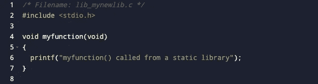

# c 静态库

> 原文：<https://medium.com/analytics-vidhya/c-static-libraries-da439d9afc09?source=collection_archive---------27----------------------->


你可能看过这篇文章的标题就问过自己了。对于编程语言，库必须做些什么？事实上，它们是语言运作的重要部分。当我们编写程序时，源代码本身可能不足以让我们的编译器解释它。当我们写它的时候，我们可能需要引用一些早期的函数，这些函数是在语言最初被创建的时候创建的。我们可以把它们想象成单词，赋予我们的程序以意义。然而，编译器不需要知道我们引用的所有单词，所以这里是我们的伙伴库出现的地方。他们有我们试图在源代码中引用的内容定义。我们可以把它想象成一个公共图书馆，里面有字典和百科全书，收集我们的程序用来做陈述的单词的信息。

当我们谈论编程语言中的库时，我们需要知道主要存在两种类型，静态库和共享库。出于本文的目的，我们将探讨第一个概念。然而，为了更好地理解它，理解这两者是很有用的，这样我们就能确切地知道静态库是如何工作的。

闲话少说，让我们深入探讨这个令人惊奇的话题。我们世界的图书馆包含许多不同类型和主题的书籍，为我们提供不同的概念和有用的信息。想象一下，我们必须就一个特定的主题写一篇文章，但我们头脑中没有理解和写作所需的所有概念。如果我们去公共图书馆(我知道现在没人去公共图书馆。我们只是谷歌一下，但是跟着我看这个例子来获得这个概念)我们可能有机会找到一些书来解决我们在文章中试图解释的那个主题。也许其他人已经就同一主题写了另一篇文章。有了这些信息，我们就有可能写出自己的论文，或许还能得出自己的结论。

更接近这一点的是，我们的编译器如何获得它所需要的信息来赋予我们的源代码以意义。请记住，链接器负责获取我们需要的所有库，这些库将在我们的代码中引用(有关编译器如何工作的更多信息，您可以查看之前的[文章](https://rmgallino.medium.com/the-process-of-compilation-with-c-6b9e97b9596a))。我们参考的图书馆是那些有我们写文章(代码)所需要的概念的书。到目前为止，我们知道为了让我们的代码如我们所愿地工作，我们需要使用库。更具体地说，是对库中保存的函数的描述。


像 C 这样的编程语言大多提供了我们开始编写项目所需的基本特性。这个库被称为标准库，它实现了多种功能来执行数学运算 *-abs()、sqrt()-* 、打印消息 *-printf()-* 、处理字符串- *strlen()、strcat()-* 处理数据结构等等。但在大多数情况下，这是不够的。随着我们项目的增长，我们可能需要编写更多特定的功能，并将我们的程序分成更小的部分，以使它更具可读性，更易于调试。这使得我们的项目变得更加复杂，因此将其中一些功能保存在库中是一个很好的实践，可以减少我们项目的重复性。此外，当我们与其他开发人员合作时，从您的项目的一个模块到另一个模块共享功能扩展了我们的合作可能性。

# 让我们创造一个！

那么现在，我们如何创建我们正在谈论的那些静态库呢？第一步是创建一个 C 文件，其中包含库将要调用的函数及其描述。



接下来，我们需要用之前定义的函数原型创建一个头文件。请注意，文件的扩展名是“”。h”。当我们在程序中包含这个文件时，这种类型的文件包含了我们想要处理的所有函数的信息。


保存文件后，我们将运行下面的-gcc-命令将文件编译成目标代码。当程序被编译成可执行文件时，库必须在目标代码上，以便链接器添加文件的内容。该命令将创建一个"。o”文件。

```
gcc -c lib_mynewlib.c -o lib_mynewlib.o
```

现在我们有了关于目标代码的库文件，是时候用这个文件创建一个静态库了。为此，我们需要运行以下命令。

```
ar rcs lib_mynewlib.a lib_mynewlib.o
```

如果我们现在遵循这些步骤，您将有一个可以使用的静态库，包含前面描述的函数。此时，我们可以将 lib_mynewlib.a 复制到其他地方来使用它。但是对于这个例子，我们将把它保存在当前目录中。

# 静态库在运行

那么现在，我们如何使用它呢？让我们创建一个 example.c 文件来测试我们的库并检查它是如何工作的。


当我们#include 包含先前添加到库中的函数原型的头文件时，我们为编译器提供了添加程序中使用的函数描述所需的信息。这发生在链接器上，也就是编译的最后一步，当我们有了可执行文件，它就有了所有的信息。这不是很神奇吗？让我们编译我们的文件。

```
gcc -c example.c -o example.o
```

现在我们需要将编译后的程序(example.o)链接到静态库。请注意，标志-L .用于告知静态库在当前目录中。

```
gcc -o example example.o -L. -l_mynewlib
```

L 在目录和“.”中查找库文件表明文件在当前目录中。然后-l 表示将它与下面的文件链接。注意前缀“lib”和扩展名“.省略了一个“。链接器将这些部分附加回库的名称，以创建要查找的文件名。前面命令的输出将是一个可执行文件。如果我们运行它，我们将能够看到这个结果。

```
./example 

myfunction() called from a static library
```


之后，了解如何使用我们的自定义静态库也是有用的，因为使用了 C 默认库。首先，我们需要复制”。h "文件到(在 Linux 上)/usr/local/include，以及"。o "文件到/usr/local/lib。这是最简单的方法，因为默认情况下编译器会在这些位置搜索库文件，所以这就是你需要做的。但是，如果您当前正在开发和更新库文件，这将是不方便的。因为你做的每一个改变都需要复制文件并重新编译。因此，如果您要将文件移动到该位置，请确保您已经完成了对它的处理。包含头部的语法如下。记得加“<filename.h>”</filename.h>

```
#include <lib_mynewlib.h>
```

正如我之前提到的，将文件复制到位置的过程并不总是很方便。有了”。h”和”。o "文件放在当前项目目录或其他与项目相关的目录中在某些情况下会是更好的选择。为了做到这一点，我们需要指定我们愿意使用的头文件的位置。

```
#include “/projectlibrary/lib_mynewlib.h”
```

在这种情况下，我们将与库相关的文件放在不同的目录中。我们需要在引号内指定位置的路径，因为我们已经在本地文件上使用了。

到目前为止，我们应该能够创建自己的静态库，并使它们适应我们正在进行的项目。这是一个非常强大的工具，它提供了这种语言，如果不在大型项目中使用它，会很不方便。

可能有帮助的以前的文章---！>[用 C 编译的过程](https://rmgallino.medium.com/the-process-of-compilation-with-c-6b9e97b9596a)