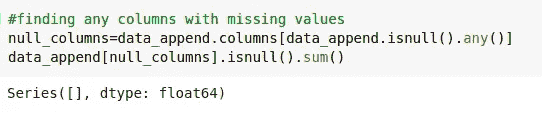

# 基于机器学习算法的出租车预约预测

> 原文：<https://medium.com/analytics-vidhya/cab-booking-prediction-by-using-machine-learning-algorithms-f6a8346772b0?source=collection_archive---------5----------------------->

出租车预订通常是一个过程，在这个过程中，整个城市的租赁都是通过电话/应用程序自动完成的。使用该应用程序更简单，因为人们可以通过选择目的地来预订从一个地点到另一个地点的出租车，并且管理预订也很方便。对于出租车预订应用公司来说，了解出租车的供应和需求可以通过最大限度地减少等待时间来提高服务效率和改善用户体验。

让我们努力实现项目目标，将历史使用模式与开放数据源(如天气数据)结合起来，预测城市中的出租车预订需求。

让我们看看这些步骤。

1.  读取数据。

可以看到，数据中有 4 个文件

2.导入列车数据

列车数据中列的概述

3.导入测试数据

测试数据列概述。

4.在训练和测试中检查标签数据

使用 Total_booking 列重命名 train_label 数据

带有 Total_booking 列的测试标签数据

5)将该数据附加到训练和测试中

可以看出，Total_booking 列现在从 train_label 添加到 train 数据集

在测试数据中，我们可以看到 Total_booking 有 NaN 值

6)日期时间列同时给出了日期和时间的信息，让我们将其分为日期和时间列

火车用

用于测试

7)数据分析和可视化

训练集中没有缺失值

特征之间的相关性

多重共线性混淆矩阵

Total_booking 列的测试数据中有空值，我们需要填充 NaN 值

从 Total_booking 中的其他值中选择的值

让我们对一些列使用标签编码器，因为它们是将它们转换成数值的对象

通过使用标注转换为数字要素

可以看出，这些值现在已经被编码

适用于模型的所有整数数据

搜索缺少的值

找出特征之间的相关性

天气图

季节图

查找异常值(如果有)

没有这样的离群值

使用 train_test_split 将模型拆分为训练和测试

x，y 定义

拆分数据

要测试的各种分类器

来自分类器的分数

各种分类的精度

执行 GridSearchCV

对于线性回归

定义参数

GridSearchCV 列出的最佳参数

可以看出，精确度略有提高

XGBRegressor 上的 GridSearchCV

**结论**

可以看出，精确度并不是很高，它的范围在 12%到 99%之间，最大平均值为 19%。

**参考文献:**

1.  如何使用 grid search CV-[https://www . datatechnotes . com/2019/09/how-to-use-gridsearchcv-in-python . html](https://www.datatechnotes.com/2019/09/how-to-use-gridsearchcv-in-python.html)
2.  什么是离群值-[https://www . aquare . la/en/what-are-outliers-and-how-treat-them-thes-in-data-analytics/](https://www.aquare.la/en/what-are-outliers-and-how-to-treat-them-in-data-analytics/)
3.  关于各种模型-[https://towards data science . com/predictive-modeling-picking-the-best-model-69ad 407 E1 ee 7](https://towardsdatascience.com/predictive-modeling-picking-the-best-model-69ad407e1ee7)
4.  Github commit 获取这里解释的完整代码——[https://github . com/saish 15/Machine-Learning/blob/master/Cab _ booking . ipynb](https://github.com/saish15/Machine-Learning/blob/master/Cab_Booking.ipynb)