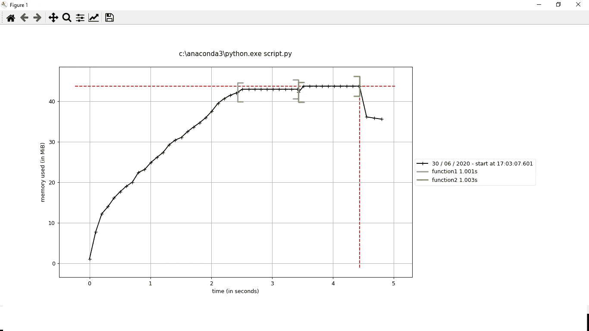
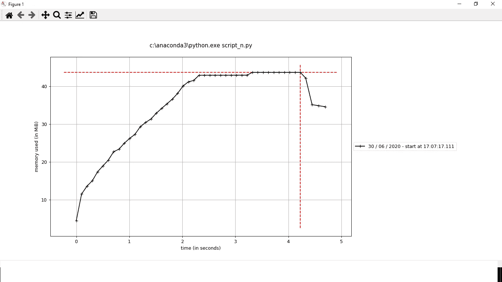

# 计算 Python 代码的内存消耗

> 原文：<https://medium.com/analytics-vidhya/calculate-memory-consumption-of-python-code-2a38c274dab4?source=collection_archive---------0----------------------->

Python 开发人员应该意识到他们正在编写的代码的内存消耗。这将在多个方面有所帮助。无论是决定硬件还是决定优化的需求或者查找内存泄漏等等。

我们将讨论一个非常简单但非常有用的 python 库 memory_profiler。

```
pip install memory_profiler#Load its magic function
%load_ext memory_profiler
from memory_profiler import profile
```

我们可以想象以下列方式使用内存分析器:
1。求一行的内存消耗
2。求一个函数的内存消耗
3。逐行查找一个函数的内存消耗
4。查找完整 python 脚本的内存消耗

现在，让我们讨论所有这些场景

1.  找出一行的内存消耗

只需在行首添加神奇函数%memit

```
%memit x = 10+5
#Output
peak memory: 54.01 MiB, increment: 0.27 MiB
```

这里，峰值内存是运行这段代码的进程消耗的内存。增量只不过是由于添加这行代码而需要/消耗的内存。同样的逻辑也适用于以下选项。

2.查找函数的内存消耗

在调用函数的行首添加神奇函数。

```
def addition():
    a = [1] * (10 ** 1)
    b = [2] * (3 * 10 ** 2)
    sum = a+b
    return sum%memit addition()
#Output
peak memory: 36.36 MiB, increment: 0.01 MiB
```

3.逐行查找函数的内存消耗

对于内存使用的逐行描述，我们可以使用@profile 装饰器。不幸的是，这只适用于单独模块中定义的函数，而不适用于笔记本本身，所以我们将从使用% %文件魔术创建一个名为 demo.py 的简单模块开始，该模块包含我们的函数

```
%%file demo.py
from memory_profiler import profile
[@profile](http://twitter.com/profile)
def addition():
    a = [1] * (10 ** 1)
    b = [2] * (3 * 10 ** 2)
    sum = a+b
    return sum
```

现在，调用与选项 2 中相同的函数。

```
from demo import addition
%memit addition()#Output Line #    Mem usage    Increment   Line Contents
================================================
     2     36.4 MiB     36.4 MiB   @profile
     3                             def addition():
     4     36.4 MiB      0.0 MiB       a = [1] * (10 ** 1)
     5   3851.1 MiB   3814.7 MiB       b = [2] * (3 * 10 ** 2)
     6   7665.9 MiB   3814.8 MiB       sum = a+b
     7   7665.9 MiB      0.0 MiB       return sum peak memory: 7665.88 MiB, increment: 7629.52 MiB
```

4.查找完整 python 脚本的内存消耗

这个选项不能在笔记本上尝试。我们必须创建一个 python 脚本，并通过命令行运行它。

```
#create script.py
import time[@profile](http://twitter.com/profile)
def function1():
    n = 100000
    a = [1] * n
    time.sleep(1)
    return a[@profile](http://twitter.com/profile)
def function2():
    n = 200000
    b = [1] * n
    time.sleep(1)
    return bif __name__ == "__main__":
    function1()
    function2()
```

之后运行脚本，看看情节

```
#On command line
mprof run script.py
#To generate plot 
mprof plot
```

我们可以看到内存消耗与时间的关系图



时间与记忆

请注意，没有必要将@profile decorator 放在函数之上，如果我们不保留它，我们不会看到函数级的内存消耗，但是我们会看到整个脚本的消耗



完整的代码可以在 [git-hub](https://github.com/sarang0909/Memory-Profiler) 获得

如果你喜欢这篇文章或有任何建议/意见，请在下面分享！

在 [LinkedIn](https://www.linkedin.com/in/sarang-mete-6797065a/) 上联系讨论吧