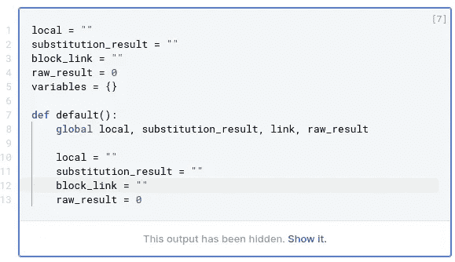

# 只需点击一下鼠标，就能计算出你的财务计划

> 原文：<https://medium.com/analytics-vidhya/calculate-your-financial-plan-with-one-click-in-notion-4983c9d2c6ff?source=collection_archive---------16----------------------->

## 向导

## 为数学模块提供变量和自动计算

丹尼斯·希洛夫的照片(就是我)

这个故事开始于几个月前，当时我开始努力为我的初创公司制定一份精确的商业计划。

要知道，有时候计算太多了。有时你甚至应该在第二页上重复使用第一页的计算结果，然后在第三页上重复使用。太复杂了…

出错的可能性越来越大:你可能会忘记在某个地方更正数字。

这就是我如何想出一个主意的:**如果我只需点击一个按钮就能完成所有这些计算(和重新计算)会怎么样？**

我做到了！

对于那些不想再浪费时间的人，我欢迎你把这篇文章读到最后，因为有一个到 Deepnote 笔记本的链接，里面有代码。

# 它是如何工作的？

这里有一个叫做“重新计算”的页面。

丹尼斯·希洛夫的照片(就是我)

**它由三个模块组成:**

1.  一些全局变量(例如，美元汇率)。
2.  链接到我们需要重新计算的页面。这些页面的内页(等等)也将被重新计算，因为该算法是递归的。
3.  计算中出现错误时的日志表

这里是“图例”页面，它的存在只是为了通知用户:

丹尼斯·希洛夫的照片(就是我)

该算法将遍历页面的所有块，并搜索$recalculate 以显示。如果他发现了这一点，他将严格地在旗帜下重新计算数学块，直到一些非数学块出现在那里。

让我们举一个例子来说明我们在计算什么:

丹尼斯·希洛夫的照片(就是我)

你可以看到我们会用`\$`对变量进行转义:那是因为`$`是 Latex 中的一个特殊字符。

# 我们将使用什么

丹尼斯·希洛夫的照片(就是我)

让我们看看我们在这里使用什么:

1.  SymPy :符号计算库。因为概念中的数学模型使用 Latex，那么我们将从那里得到这个 Latex，我们将使用 SymPy 来计算方程
2.  [opinion-py](https://github.com/jamalex/notion-py):opinion API 的非官方库。概念官方 API 马上就要来了，期待。
3.  操作系统:只是一个与你的系统交互的包

# 定义常数

丹尼斯·希洛夫的照片(就是我)

1.  `RECALCULATION_KEY`是一个会引起数学块重算的东西
2.  是我们计算的精确性:例如，如果我们有一个像 0.8483482884 这样的值，它会把它四舍五入
3.  `TOKEN`是一个让 API 工作的东西:要获得它，在 Chrome 中进入你的开发者控制台的应用标签，从那里复制`token_v2`
4.  `BASE_PAGE`是我们之前讨论过的“重新计算”页面的链接
5.  `LOG_LINK`是存储日志的数据库的链接

# 初始概念

丹尼斯·希洛夫的照片(就是我)

1.  我们用令牌初始化概念 API
2.  然后我们得到我们的基页的所有块

# 一些基本功能

丹尼斯·希洛夫的照片(就是我)

`MATH`这里代表所有的数学符号:`\\`在我们的数学块中用于对变量进行转义。

丹尼斯·希洛夫的照片(就是我)

接下来就是更新区块了。想象下面这个等式: `$HAHA = $LOL + $ROFL = 100500`

我们在这里做的是从这里去掉 100500，然后添加一个新的结果(假设它是 100501): `$HAHA = $LOL + $ROFL = 100501`

# 处理全局变量

丹尼斯·希洛夫的照片(就是我)

1.  我们需要存储所有这些`local`、`substitution_result`等，以便进行日志记录
2.  `variables`将存储所有的全局变量
3.  `default()`将删除除`variables`以外的所有内容

丹尼斯·希洛夫的照片(就是我)

这里有一件事要执行设置一个全局变量。

我们用索引和子索引执行这样奇怪的移动是因为`SymPy`对 Latex 的解释存在问题:它认为如果等式中有类似`HELLO`的东西，那么它就不是变量，而是`H*E*L*L*O`(即以单个字母命名的变量的乘法)。

# 记录

丹尼斯·希洛夫的照片(就是我)

在这里，我们连接到一个数据库，并清除它。然后有一个函数在表中创建新行并设置其内容。

# 复杂部分#1:处理页面

丹尼斯·希洛夫的照片(就是我)

`is_recalculating_next`只是重新计算下一块的标志。在两种情况下应该是`True`:要么是前一个块包含`$recalculate`,要么是前一个块是数学块，其顶部的块包含`$recalculate`

我们遍历一个页面的子页面，为每个块获取一些链接，并遍历子页面的块(因为这个块可以是一个页面或一个页面的链接)。

如果没有孩子，那么就是一个孤独的街区，我们可以去下一个。

# 复杂部分#2:处理块

丹尼斯·希洛夫的照片(就是我)

1.  我们检查它是否是一个数学块:如果它的类型是`equation`，那么它就是数学
2.  如果没有`title`(其实那只是一个区块的文字)，那我们就无事可做了
3.  如果有一个标题，那么我们检查它是否是一个标记为要重新计算的数学块
4.  如果有一个像`$HGHGHG =`一样没有任何结果的方程，那么我们应该跳过它
5.  然后我们表演一些奇怪的动作，以便被 SymPy 正确地解释
6.  之后，我们解析我们的方程
7.  如果方程中有一些变量(即方程看起来像`$HEHE = $HOHO / $HIHI = )`，那么我们计算它，然后重置全局变量`$HEHE`
8.  如果没有其他全局变量(也就是说，方程看起来像`$HAHA = 3`，那么我们只需设置`$HAHA`

# 密码

正如我告诉你的那样，这是有准则的，我是一个诚实的人，所以是这样的:

[https://deep note . com/publish/2837130 e-dd3e-47fb-80fa-ee 1 ff 8 f 27 f 88](https://deepnote.com/publish/2837130e-dd3e-47fb-80fa-ee1ff8f27f88)

你可以复制那里的笔记本，让计算器在 30 秒内工作！

顺便说一下，Deepnote 是一个非常有用的工具，可以用来进行这样的实验和其他事情。我建议你用这个工具完全取代 Jupyter，因为与其他解决方案相比，它有很好的 UX。

# 关于我

这个问题是在我的名为 [Facel](http://facel.tech/) 的项目开发过程中出现的。

我们开发了一种设备，用于监控健康参数(机体疲劳、眼睛疲劳、压力、有效性和注意力水平)，并根据耳后 2 个点的信号控制小工具(例如，眨眼 3 次并停止音乐)。

我们以 98%的准确率检测 12 种面部表情(眨眼、动眉毛等)。

我们已经展示了 2020 年人工智能之旅的项目，这是世界上最大的人工智能会议之一，来自脸书和其他大型技术的人在这里发表了演讲。

我们在迪拜设计周的主要节目之一 [GlobalGradShow](https://globalgradshow.com/?project=facel) 上展出。全世界毕业生的 100 个最具创新性的项目在那里展示，所以很酷。

我们还赢得了阿里巴巴全球创业挑战赛的俄罗斯赛段，并参加了詹姆斯·戴森奖的世界赛段(世界上主要的工业设计竞赛之一)。

请随时通过 [LinkedIn](https://www.linkedin.com/in/mixeden) 、 [Email](mailto:mixeden@facel.tech) 或[电报](http://t.me/mixedenn):)联系我