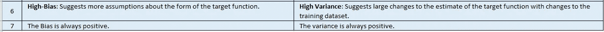
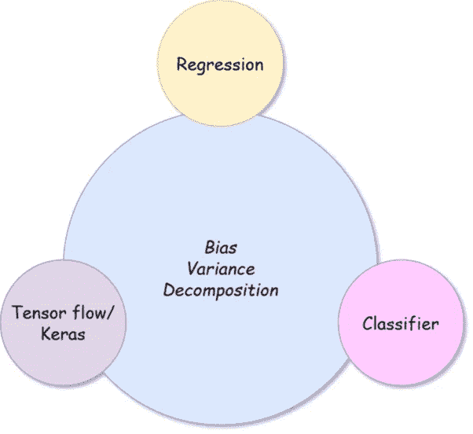
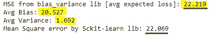

# python 中偏差和方差的计算

> 原文：<https://medium.com/analytics-vidhya/calculation-of-bias-variance-in-python-8f96463c8942?source=collection_archive---------2----------------------->

去神秘化的偏差-方差分解

来源:图片由 G T 在 [Unsplash](https://unsplash.com/photos/cdZROYxsPt8) 上拍摄

对于任何机器学习，模型的性能可以根据*偏差*和*方差*来确定和表征。

> 在监督机器学习中，算法从训练数据中学习模型。
> **Y=f(X) + E**
> 任何有监督的机器学习算法的目标都是在给定输入数据(X)的情况下，对输出变量(Y)的映射函数(f)进行最佳估计。
> 映射函数通常被称为目标函数，因为它是给定的监督机器学习算法旨在逼近的函数。
> 除了 f(X)之外，我们还有一个误差项分量，用“E”表示。

任何机器学习算法的预测误差(E)都可以分解为三部分:

> 1.模型偏差
> 2。型号差异
> 3。不可约误差

无论使用何种算法，都无法减少**不可约误差**。它是从问题的选择框架中引入的误差，并且可能由诸如影响输入变量到输出变量的映射的未知变量等因素引起。

概括地说，

## 误差(模型)=方差+偏差+不可约误差

作者图片

首先让我们试着理解这些是什么，然后我们将借助一个样本数据集来检查偏差和方差，以理解实时计算。

让我试着用一个简单的例子来说明，在深入这个概念之前先打个比方。

考虑一个学生参加数学考试的例子。

来源:javier trueba 在 [Unsplash](https://unsplash.com/photos/iQPr1XkF5F0) 上拍摄的照片

现在的任务是**为考试学习书本**或**相关章节**s**/模块**。

如果学生只是略读题目和章节，而不是真正地学习，那么同一个学生将无法在考试中表现良好，因为他/她只是略读了题目。

考虑另一种情况，其中学生*记住*章节和问题中的所有内容，而不是实际学习/理解概念、理论及其含义——在这种情况下，如果任何问题来自书但基于概念，学生将无法处理或解决问题。

所以在上面的例子中，研究这本书就是任务(模型期望)

不合适-作者提供的图像

过度拟合—作者提供的图像

> 那么模型的理想场景应该是什么样的呢？

最理想的是，我们必须 ***能够*** ***概括模型*** 。在上述情况下，我们必须能够通过研究问题的概念、理论和方法来解决任何问题，而不是略读或记忆问题。

上面的例子只是外行人用来解释的术语。

让我们试着实时了解模型的细节

区分偏差和方差

**不可约误差:**

简言之，

*模型误差=可约误差+不可约误差*

可减少的错误只是我们可以改进的因素。这是当模型在训练数据集上学习时我们减少的数量，我们试图让这个数字尽可能接近零。

不可约误差是我们无法控制的误差，就像上文开始提到的那样——这可能是由于各种原因，如统计元素[噪声]。这不是我们能控制的。

这也表明没有一种模式是完美的。

# 偏差与方差的权衡

模型的偏差和方差总是联系在一起的。

我们通常更喜欢低偏差和低方差的模型，但在实时环境中，这将是最大的挑战——这也可以被视为任何机器学习问题的具体目标。

偏差和方差成反比

偏差∝1/方差

上述关系被称为权衡。这有助于选择型号和型号配置。

> 如何在给定数据集上计算任何算法的偏差-方差权衡？

如果我们考虑计算，对于预测建模问题，计算实际偏差和方差是相当困难的。这是因为我们不知道预测建模问题的真实映射函数。

尽管偏差-方差权衡更概念化，但在某些情况下，我们实际上可以计算偏差-方差权衡。

有一个由[定义的库](https://sebastianraschka.com/)[mlx tend](http://rasbt.github.io/mlxtend/)Sebastian 博士提供了一个名为 [bias_variance_decomp()](http://rasbt.github.io/mlxtend/user_guide/evaluate/bias_variance_decomp/) 的函数，帮助我们在许多 bootstrap 样本上估计各种模型的偏差与方差。

这个库 *mlxtend* 具有最近引入的巨大功能。偏差和方差的计算就是其中之一。

我们将看一个回归模型和分类模型的例子，用于偏差和方差的权衡。

请注意，我们现在有能力找出 Tensorflow/Keras 支持的模型偏差和方差，这也将在本文中讨论。

图片来源:沃尔夫冈·罗特曼在 [Unsplash](https://unsplash.com/photos/ArP8LTekkDw)

为此，我们必须 pip 安装 mlxtend 库

安装 mlxtend 库

为了支持张量流/keras，mlxtend 和 tf 的预期版本为:

1.  *mlxtend v0.18.0 或更高版本*
2.  *tf.version ≥ 2.4.1*

概述我们将在这篇文章中看到的内容。

作者图片

让我们也试着理解一下库内部使用的*函数*

该函数对于上述图表中的所有存储桶都是相同的

## 我们将看看函数 bias_varaince_decomp

> bias_variance_decomp(estimator，X_train，y_train，X_test，y_test，loss='mse '，num_rounds=200，random_seed=None)

**估计器** : *分类器或回归器*实现类似于 scikit-learn API 的`fit` `predict`方法的对象或类。

`X_train`:期望一个数组，shape=(数量 _ 示例，数量 _ 特征)

一个**训练**数据集，用于抽取 bootstrap 样本以执行偏差-方差分解。

`y_train`:需要一个数组，shape=(num_examples)

与`X_train`示例相关的目标(类别标签，回归情况下的连续值)。

`X_test`:需要一个数组，shape=(数量 _ 示例，数量 _ 特征)

用于计算平均损失、偏差和方差的测试数据集。

`y_test`:需要一个数组，shape=(num_examples)

与`X_test`示例相关的目标(类别标签，回归情况下的连续值)。

`loss` : str(默认值='0-1_loss ')

执行偏差-方差分解的损失函数。当前允许的值是'**MSE**'[在*回归*的情况下]和'**0–1 _ 损失**'[在*分类器*的情况下]。

`num_rounds` : int ( **默认** =200)

执行偏差-方差分解的引导轮数。

`random_seed` : int(默认值=无)

用于偏差方差分解的 bootstrap 抽样的随机种子。

`fit_params`:附加参数

要传递给。当估计量适合 bootstrap 样本时，它的 fit()函数(这是最新 mlxtend 版本的一部分)

**退货**

`avg_expected_loss, avg_bias, avg_var`:返回预期的平均值

平均偏差和平均偏差(所有浮点)，其中平均值是在**测试**集中的数据点上计算的。

## 一、偏差和方差的计算(用于回归):

让我们考虑波士顿数据集的回归问题。

从上面我们的计算结果可以明显看出，总误差=偏差+方差，我们还可以看到，从 sckit-library 计算的 MSE 几乎等于平均预期损失。

修剪后——使用套索，

可以观察到，在正则化之后偏差已经减小，并且方差略有增加，并且总的平均误差也降低了

尽管我们实际上已经理解了，让我们也看看它的一些数学部分。

对于回归模型，偏差-方差分解可以看作是平方损失函数，基本上分为三项——方差、偏差和噪声[这一部分对于分类器也是如此]。

忽略噪声项，

让我们看看偏差和方差的价值

目标函数，y = f(x)；
预测目标函数，ŷ=*f*^(x)=h(x)；
平方损失 s=(y−ŷ)2；
期望(e[ŷ)——这超过了训练集。对于平方误差损失的主要预测仅仅是预测 E[ŷ的平均值(期望是在训练集上)

上表参考自 [mlxtend](http://rasbt.github.io/mlxtend/user_guide/evaluate/bias_variance_decomp/) github

## **二。**偏差&方差的计算(分类器**):**

对于分类器，我们将使用相同的库——唯一的区别是损失函数。这里我们将使用-0–1 损失函数。

> **什么是 0–1 损失？**

假设您有一个分类问题(0 或 1)，假设您的数据集有 20 行。在用任何算法分类后，例如:naive baye 算法——如果我们发现它正确预测了 15 个，而 5 个被错误分类，这被识别出来并被称为 0–1 损失。[所有正确预测的项目 15 将被标记为“0”，所有错误分类的项目将被标记为“1”]。

在上述情况下，0–1 损失为((5/20)* 100)-25%

作者图片

*注:*对于 0–1 损失，**模式**用于定义 0–1 损失的主要预测=>*【e[ŷ】*

0–1 损失的偏差和方差如下。

如果主预测与真实标签 *y* 不一致，偏差为 1，否则为 0；

图片取自 [mlxtend](http://rasbt.github.io/mlxtend/user_guide/evaluate/bias_variance_decomp/)

0–1 损失的*方差*定义为预测标签与主预测不匹配的概率:

*方差=p(ŷ≠e[ŷ】)*

> 损失=偏差+方差

让我们看一个例子来说明——考虑虹膜数据集，

加载数据集后，让我们尝试使用 mlxtend 库找出错误(损失),我们还将看到某些模型(例如:RandomForest)如何具有减少方差的能力。

首先让我们用决策树来试试，

如果你在这里观察，修剪后模型的方差在某种程度上减少了，但偏差仍然相同。

在上面，我们观察到总的期望损失=偏差+方差之和&修剪对方差的减少有一些影响。

我们听说随机森林模型通常有助于减少方差(减少过度拟合)。让我们也试着看看 RF 模型的结果。

方差有显著差异，它已经急剧减少。

> 从上面可以观察到， **RF** 实际上有助于**减少数据集的方差。**

如果我们尝试使用 GridSearchCV 或 K-fold 调整或超调整参数，我们最终可能会减少更多的方差。

从上面可以清楚地证明，RF 有助于减少过拟合，或者换句话说，有助于减少模型的方差。

让我们也试着去了解一下 ***KNN***

众所周知，低 k 值的 KNN 模型通常具有高方差和低偏差，但是随着 k 值的增加，方差减小，偏差增大。

让我们通过使用相同的虹膜数据集来检验这一点。

可以观察到，与方差相比，偏差相对较高[对于 k=3]。并且预期损失比 RF 模型更多。

现在让我们看看对于不同的 k 值，什么是训练和测试图

关于该数据集，我们可以观察到，对于低 K 值，训练的测试分数更多，而测试数据集低。另一方面，对于较高 K 值，测试结果比训练好。在选择最佳 k 值时，要权衡偏差方差。

对于 kNN 中 k 的各种值，让我们也来看看我们的损失，偏差和方差会是怎样的。

可以看出，对于这个特定的数据集，随着 k 的增加，偏差也在增加。

## 三。偏差和方差的计算(以张量流/角为单位):

如前所述，这个库只在 mlxtend 的最新版本( *v0.18.0* &以上)和 tf (≥ *2.4.1* )中支持 keras/tf。

让我们看一下我们案例中的同一个波士顿住房数据集，

针对上述内容计算的 MSE 值

让我们使用 mlxtend 计算损失、偏差和方差。

运行模型后，上面列出了损失、偏差和方差。

此外，绝对建议使用与原始训练集中相同数量的训练历元，以确保实现适当的收敛。

> *需要记住的要点*

> **参数或线性机器学习算法**通常有一个**高偏差**但有一个**低方差**。参数算法的一些例子是线性、逻辑和 LDA。这里对目标函数的形式做了更多的假设。**较高的偏置**经常导致到**欠拟合**的模型。****

## 克服拟合不足的方法:

a.尝试更复杂的模型(不做任何假设)

b.添加具有更高预测能力的功能(执行功能工程)。

c.如果可能，添加更多培训数据。

d.去除数据中的噪声。

> **非参数或非线性机器学习算法**通常具有**低偏差**但具有**高方差**。非参数算法的一些例子是 SVM kNN 的决策树。高方差模型非常重视训练数据，不会对以前没有见过的数据进行归纳。**高方差**往往导致**模型**的**过拟合**。

## 克服过度拟合的方法:

a.在决策树的情况下，如果树长得很大，尝试修剪树。

b.对于 SVM，尝试修改 C 值，使用线性核来代替 RBF。

c.对于 kNN，尝试获得最佳 k 值(低 k 值意味着过拟合，非常高的 k 值导致欠拟合)。

d.尝试正则化技术。

e.尝试添加更多功能(交叉验证，保留一个验证集)。

## 摘要

总而言之，在这篇文章中，我们已经看到了什么是模型偏差；什么是方差，什么是不可约误差。

> 在**偏差&方差**之间的**权衡**是什么，以及如何在某些模型的帮助下实现这一点。我们还看到了如何使用 **mlxtend** 库计算回归模型和分类器的偏差和方差。

使用的代码库可以在[这里](https://github.com/NallaperumalK/Data-science-Projects/tree/master/Bias%20Variance%20Decomposition)找到。

## *参考文献:*

 [## 偏差-方差分解

### 不同损失函数下机器学习算法的偏差方差分解。从 mlxtend.evaluate 导入…

rasbt.github.io](http://rasbt.github.io/mlxtend/user_guide/evaluate/bias_variance_decomp/)  [## 如何通过 Python -机器学习掌握计算偏差-方差权衡

### 机器学习模型的性能可以根据模型的偏差和方差来表征。一个…

机器学习掌握。](https://machinelearningmastery.com/calculate-the-bias-variance-trade-off/)