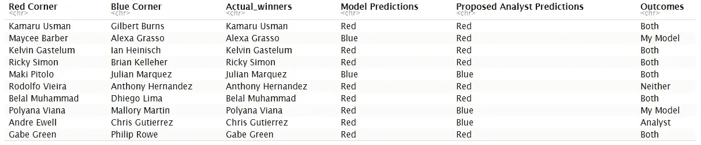

# 一个 MMA 粉丝用机器学习能比“MMA 分析师”做得更好吗？

> 原文：<https://medium.com/analytics-vidhya/can-an-mma-fan-use-machine-learning-to-do-a-better-job-than-the-mma-analysts-d1404c309ac6?source=collection_archive---------2----------------------->

提示:考虑到他们的记录，我对自己感觉很好。


“**女士们先生们，简而言之这就是 MMA**”——任何在 ESPN 报道 MMA 的人

成长于 90 年代末到 21 世纪初，职业摔跤是有史以来最重要的事情之一。这是一个令人敬畏的时代，作为一个粉丝，周一晚上的战争似乎有无限的摔跤内容，是 90 年代和 00 年代文化的化身，在故事情节，摔跤个性和比赛方面都达到了极致。虽然看到这些夸张的场景和更前卫的内容很棒，但它也开始让幻想和现实之间的实现在产品中变得更加明显。虽然看起来仍然很愉快，但我还是想要一些真实的感觉。这就是综合武术(MMA)的由来。


MMA 似乎是两个世界中最好的。它提供了竞技体育的合法性，但也有我喜欢的职业摔跤的东西，比如:

*   展示一系列技术技能和策略的平台，以解决具有可怕后果的复杂问题
*   不断增长的热情粉丝群
*   产生故事情节的能力，导致对比赛的情感投入
*   最真实地展示人类意志胜利的能力

自从我看了我的第一场 MMA 赛事，我就成了一个死忠粉。


由[弗拉迪斯拉夫·比契科夫](https://unsplash.com/@huzkky?utm_source=medium&utm_medium=referral)在 [Unsplash](https://unsplash.com?utm_source=medium&utm_medium=referral) 上拍摄的照片

然而，作为一个狂热的粉丝，最令人沮丧的事情之一是意识到现有的“休闲”和“铁杆”之间的二分法。虽然我知道“我们”铁杆粉丝占绝大多数，但面对普通大众，仍然有一些代表性的期望。然而，每次我碰巧看到一些关于即将到来的比赛或某场比赛的评论，我都会对这些 MMA 分析师对那些你经常看到的体育节目所做的一些分析感到困惑。

在他们对战斗的看法中，没有比他们的战斗结果选择更让我沮丧的了，因为似乎每一个正确的战斗选择都有一个意外发生。事实上，这种情况如此频繁，以至于这些分析师/专家将其归因于这项运动的不稳定性已经变得司空见惯。虽然这是一个公平的评论，但它似乎仍然是一个主要的逃避，我想我可以比这些“MMA 专家”做得更好。

现在，在我被贴上“*键盘战士百事通”*的标签之前，我先声明我将使用一种更加数据驱动的方法。具体来说，我将分析最大的 MMA 组织 [UFC](http://www.ufc.com) 以前比赛中赢家和输家之间的数据，并建立一些预测模型，看看我在预测赢家方面能有多准确，我在预测结果方面能做得更好。

此外，考虑到这个项目的性质，让我们看看我是否可以从我的机器学习模型中赚更多的钱，而不是仅仅使用投注线。

_________________________________________________________________

**免责声明:**本文中使用的所有内容完全出于教育和娱乐目的。**不要用它来谋取经济利益**。你最好在 Reddit 上投资 r/WallStreetBets，或者投资加密货币，而不是像这里显示的那样。

_________________________________________________________________

# 数据

为了完成这项任务，我使用了以前从 UFC 统计网站[废弃的数据，并在](http://www.ufcstats.com/statistics/events/completed) [Kaggle](https://www.kaggle.com/mdabbert/ultimate-ufc-dataset) 上提供。这些数据被分成两个独立数据集

1.  包含从 2010 年 3 月 21 日到 2021 年 2 月 10 日已完成战斗信息的历史数据。
2.  在 2021 年 2 月 13 日举行的“即将到来的 UFC 卡”中，竞争者的统计数据，在本例中为 [UFC 258](https://en.wikipedia.org/wiki/UFC_258) 。

这些数据集中的信息包括:

●比赛的赢家和输家

●比赛条件，包括回合长度和是否是冠军回合

●官方比赛结果

●参加比赛的每位选手的比赛历史

●赢-输-平记录

●每架战斗机的打击精度

●每架战斗机的记录和提交历史

在这两个数据集中，都需要进行大量的处理，例如缺失变量的处理、变量类型的重新分类和变量工程。最值得注意的是，列在红色角落和蓝色角落的战士之间的差异。考虑到这个过程非常密集，我将在本文中省略这一部分。如果你想看到整个过程，你可以在这里看到代码。

# 数据怎么说？

检查过去 11 年 UFC 中过去比赛的历史，发现大多数时候，被指定在红色角落的拳手(又名。“最受欢迎的”)通常在比赛中胜出。然而，当进一步观察投注赔率的情况时，似乎这只是在他们被大量看好时才出现的情况。


使用相关矩阵，与赢家结果有关系的其他变量包括

1.  战斗机之间当前连胜的差异
2.  战斗机之间 UFC 总损失的差异
3.  拳手之间的年龄差异
4.  战斗机之间的距离差异
5.  战斗人员之间重大打击次数的差异
6.  战斗机之间击落次数的差异
7.  战斗机之间重大打击着陆平均精度的差异
8.  战斗机之间平均起飞着陆精度的差异


**注意:**差值分数是通过从红色角落分数中减去蓝色角落分数来计算的，其中负分数实际上有利于红色角落的战士。

# 建立一些模型

在建立参考模型时，我将假设这些 MMA 分析师主要依靠赔率来确定他们的战斗选择。由于这个数据集依赖于[美国赔率](https://www.actionnetwork.com/education/american-odds)，负的分数将表示投注最受欢迎。

```
UFC = UFC %>% 
  mutate(analyst_pick = as.factor(ifelse(R_odds > 0, "underdog", ifelse(R_odds < 0, "favorite", NA)))) %>% 
  mutate(analyst_pick = relevel(analyst_pick, ref = "underdog"))

*# Create a training/testing data split (75% training, 25% testing)*

set.seed(1234) 

indexing = createDataPartition(UFC$Winner, p = 0.75, list = F)

training_set = UFC[indexing, ]
testing_set = UFC[-indexing, ] 
```

有五种建议的监督机器学习算法将用于预测战斗结果:

**方法# 1**:K-最近邻([见此处代码](https://github.com/Vibe1990/UFC_Model.Prediction/blob/main/kNN_approach))

**方法# 2** :逻辑回归([参见此处的代码](https://github.com/Vibe1990/UFC_Model.Prediction/blob/main/logistic_regression))

关于选择包含在模型中的变量，**使用了四种不同的方法:**

●包含所有变量

●利用基于上述相关矩阵的相关滤波

●利用双向逐步回归方法

●只选择赢家之间有显著差异的变量

**方法# 3:** 决策树([参见此处的代码](https://github.com/Vibe1990/UFC_Model.Prediction/blob/main/decision_tree))

**方法四:**随机森林([参见此处代码](https://github.com/Vibe1990/UFC_Model.Prediction/blob/main/random_forest))

**方法# 5:** 极端梯度推进([见此处代码](https://github.com/Vibe1990/UFC_Model.Prediction/blob/main/XGBoost))

关于更“黑盒”的机器学习算法，依赖于更详尽的参数优化方法(即网格搜索)的决定是由于任务的目标是找到预测结果的最佳可能模型。因此，虽然与其他方法相比，它的计算量相当大，但它为我获得最佳结果提供了更多的保证。

由于这个过程的计算量非常大，我建议使用并行计算来稍微加快这个过程。这是使用[并行封装](https://nceas.github.io/oss-lessons/parallel-computing-in-r/parallel-computing-in-r.html)完成的。

```
library(parallel)
no_cores = detectCores() - 1 *# Find out the number of CPU processors you have in your device and use 1 less so as to avoid having R crash* 
cl = makePSOCKcluster(no_cores)
registerDoParallel(cl)
```

# 那么，我做得怎么样？

观察所使用的各种模型的性能，似乎唯一优于所提出的 MMA 分析方法的模型是逻辑回归模型。虽然看到如此多的努力投入到优化一个更复杂的算法上有点令人恼火，但我想这证明了老爱因斯坦的格言是正确的，“一切都应该尽可能地简单**，但没有更简单的**”。**

****

****“天哪，运行 XGBoost 模型花了一天时间，而且它的表现比仅仅使用投注线还要糟糕。”****

```
***# Make predictions using the proposed method*
prediction.UFC_258.log_reg_cor = ifelse(predict(log.reg_cor, UFC_258_clean, type = 'response') > 0.5, "Red", "Blue")
UFC_258_clean = UFC_258_clean %>% mutate(analyst_pick = as.factor(ifelse(R_odds > 0, "underdog", ifelse(R_odds < 0, "favorite", NA)))) %>% mutate(analyst_pick = ifelse(analyst_pick=="favorite", "Red", "Blue"))
Baseline_picks = UFC_258_clean$analyst_pick**
```

****

**当将一个性能较好的模型(相关过滤-逻辑回归模型)与建议的 MMA 分析方法和“即将到来的”战斗数据集进行比较时，看起来我们的模型做得稍微好一些(8 次正确选择对 7 次正确选择)。**

**不是最好的胜利，但我接受！**

****

# **我的模型能赚钱吗？**

**虽然我不宽恕它，但让我们看看如果我用我的模型来打赌会发生什么。使用从我的预测模型得出的选择快速查看一下支出，似乎如果我为每场比赛下注 100 美元，我将从下注 1000 美元中获得 269.07 美元的净利润。虽然我赚了钱很好，特别是当你比较依靠 MMA 分析师方法(净利润为 53.13 美元)进行同等赌注时，这根本不是最佳方法。**

****

**一个更好的方法显然是通过在给定的比赛中运行拳手之间的胜利概率来进行更有选择性的下注。这可以通过建立截止标准来实现，即如果计划中的拳击手没有 __ %的胜算，那么就不要下注。虽然有许多方法可以得到这个标准，但我们可以使用一个常用的方法:**

****

**因为赢或输有一个二元的结果，任何一个事件发生的概率就是任何一个概率的总和。因此，该公式可以重写为:**

****

**在数据集中，我们知道支出是多少，盈亏平衡意味着净值为 0，我们可以使用这个公式找到截止概率，以决定是否下注。**

```
***#Evaluation that's is referred to here is the above data frame that compares my projected fight picks against proposed MMA analyst picks.* 

*# Function need to find probability cutoff to make a wager or not*
prob_to_win = **function**(ev) {

  p_value = 100/(ev+100)
  p_value = p_value * 100
  p_value = round(p_value, 2)
  **return**(p_value)
}

*# The payouts for my projected picks* 
projected_winner_payouts = **list**(35.97, 93.48, 48.78, 39.53, 56.50, 20.53, 23.37, 100, 112, 72.46) 

min.prob.to.make.bet = unlist(lapply(projected_winner_payouts, prob_to_win))

making.money = cbind(making.money, "Min probability to bet" = **as**.data.frame(cbind(min.prob.to.make.bet)))
making.money$`probability to bet` = making.money[, 7]**
```

****

```
**# **Using** the logistic regression model **to** **get** the probability **of** fighter winning 

red_corner_probability_to_win = round(predict(log.reg_cor, UFC_258_clean, type = *'response')*100, 3)*

# Since our picks does include those **in** the blue corner **to** be favored, just subtract them **from** 100 **to** **get** their probability 

prob_pick.**to**.win = c(75.51, (100-47.55), 60.28, 72.14, (100-47.41), 82.68, 77.10, 54.18, 57.61, 51.56)

picks = c("Kamaru Usman", "Alexa Grasso", "Kelvin Gastelum", "Ricky Simon", "Julian Marquez", "Roldofo Vieira", "Belal Muhammad", "Polyana Viana", "Andre Ewell", "Gabe Green")

should_bet_or_not = **as**.data.frame(cbind("Actual Winner" = making.money$`Actual Winner`, "My picks" = picks, "Probability to win" = prob_pick.**to**.win, "Probability to bet" = making.money$`probability **to** bet`))

should_bet_or_not = should_bet_or_not %>% mutate(
    `Place bet` = **as**.factor(ifelse(`Probability **to** win` > `Probability **to** bet`, "Yes", "No")), 
    `Wager payouts` = c(35.97, 93.46, 48.78, 39.53, 56.50, 20.53, 22.37, 100, 112, 72.46)
    )**
```

****

**使用这种方法，看起来我会下 5 注，而不是 10 注，并从 500 美元的赌注中赚 168.96 美元(假设我下了相当于 100 美元的赌注)。那可是净赚 **33.79%** 的利润！**

****

# **你知道了…**

**通过一些准备工作和一些机器学习知识，我成功地建立了一个模型，最终比一些 MMA 分析师做得更好。这是否意味着我们应该完全怀疑这些支持机器学习算法的人？绝对不行！如果有什么不同的话，这表明数据是对现有基础知识的极大补充。**

**MMA 分析师通过提供某些在数据分析方面可能不完全充实的观点，肯定有他们的位置。此外，虽然预测是他们角色的一部分，但他们本质上是为了提高对即将到来的战斗的兴趣，他们在这方面做得很好。那些碰巧在战斗预测方面做得很差的人，在激发兴趣方面做得更好。然而，在 MMA 分析方面，我最喜欢的一些人来自像[罗宾·布莱克](https://www.instagram.com/robinblackmartialarts/)、[布雷特·奥科莫托](https://www.instagram.com/bokamotoespn/?hl=en)和[卢克·托马斯](https://www.instagram.com/lukethomasnews/)这样的人。如果你有兴趣了解这项运动，我一定会推荐他们。**

**现在，我在这里展示的是非常基础的东西，你肯定可以在此基础上进一步发展。与显示的内容相比，像附加数据或使用深度神经网络等其他黑盒机器学习模型这样的事情可能会提供更好、更一致的性能。所以，最好不要辞掉我的日常工作，去 MMA 赌博，找一份全职工作。**

**如果有任何矛盾或问题，请在评论中告诉我。如果你想联系我，请在 LinkedIn 上联系我。您可以查看我的[库](https://github.com/Vibe1990/UFC_Model.Prediction)来查看这个项目中使用的所有代码，以及我参与的一些其他项目。**

**感谢阅读。**