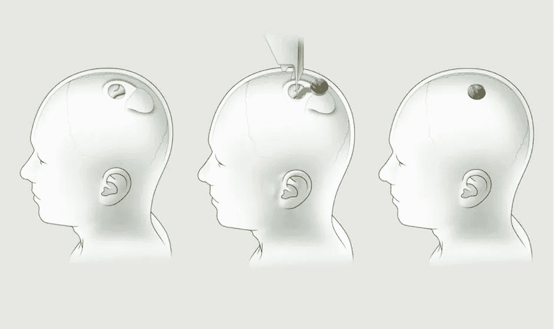

# 人工智能能终结人类吗？

> 原文：<https://medium.com/analytics-vidhya/can-artificial-intelligence-end-humanity-d7bff0e57e5f?source=collection_archive---------14----------------------->

## 人工智能发展如此之快，以至于如上图所示的技术并不像人们认为的那么遥远。

作者 Zachary Galante——Bryant 大学数据科学专业的大四学生

照片由 [Maximalfocus](https://unsplash.com/@maximalfocus?utm_source=medium&utm_medium=referral) 在 [Unsplash](https://unsplash.com?utm_source=medium&utm_medium=referral) 上拍摄

人工智能发展如此之快，以至于如上图所示的技术并不像人们认为的那么遥远。它带来了以积极和消极的方式影响人类的机会。回顾 20 年前，全自动驾驶汽车的想法似乎很疯狂，但我们比以往任何时候都更接近这一成就。这并不是最终会对人类产生巨大影响的唯一领域。

埃隆·马斯克是当今最具创新精神的人之一，他质疑世界上几乎所有的事情，从我们如何旅行到我们如何思考。大多数人知道马斯克是因为他的电动汽车公司特斯拉。但他也经营其他极具创新性的公司，如 Neuralink 和 the Boring Company。都有能力永远改变人类。

照片由[奥斯丁·拉姆齐](https://unsplash.com/@austin__ramsey?utm_source=medium&utm_medium=referral)在 [Unsplash](https://unsplash.com?utm_source=medium&utm_medium=referral) 上拍摄

## 无聊的公司

除了马斯克的许多其他公司，他还经营着一家名为“The Boring Company”的高速隧道公司。这些隧道旨在消除燃烧城市(如洛杉矶)的交通堵塞时间，并允许汽车(仅特斯拉)以高达 120+英里/小时的速度行驶。马斯克还试图通过给他的汽车添加自动驾驶功能来减少在交通中驾驶的时间。允许司机在汽车自动驾驶时靠在椅背上。考虑到人们花在上下班路上的时间，这可能会给人们带来大量的休闲时间。

当人们有更多的时间，这最终也会导致更多的创新。一个极端的例子是古罗马和希腊帝国。一旦他们不再经常打仗，有了更多的时间，他们就能够显著增加发明的数量。随着越来越多的人工智能在我们的生活中发挥越来越大的作用，这种影响也将会出现。作为回报，给予人们更多的闲暇时间去做这些活动。

## **Neuralink**

马斯克的下一家公司 Neuralink 已经在将人工智能与大脑配对。Neuralink 利用人工智能制造了 23 毫米的芯片植入大脑，初始功能是恢复部分或全部运动功能。在未来，马斯克计划通过增加更多智能的能力来推动设备的极限。此外，这将允许人类增加大脑容量，甚至能够“下载”某些语言。这可能看起来像是科幻电影中的一个特征，但它现在就在这里，并且已经有了关于猪的工作演示。显然，一旦产品面向大众，人们开始会犹豫不决。但是一旦它成为主流，它将永远改变人类。

下面展示了将芯片植入大脑的步骤。马斯克在莱克斯·弗里德曼和乔·罗根的播客上解释了芯片将如何被插入。他设想了一个过程，在这个过程中，病人能够完成手术并在当天离开。这是一个大胆的说法，但程序将由人工智能几乎 100%完成极端游行。

## **调节 AI**

在听埃隆·马斯克演讲时，他经常谈到必须以某种方式监管人工智能，就像汽车和其他技术一样。他担心，如果监管不当，人工智能可能会产生一些极其负面的后果。人工智能的一个危险水平是将它发展到学习如此之多，以至于它在没有任何人类输入或理解的情况下创建自己的模型。

关于人工智能，要问的其他重要问题是伦理和它在困难情况下做出的决定。一个例子是自动驾驶汽车，必须在瞬间做出重要的决定，让这些机器做出正确的决定至关重要。一个极端的例子是，如果汽车需要决定要么急停，导致后面的汽车发生事故，要么继续行驶，可能撞上行人。那么这些决定将如何做出呢？这将完全通过学习算法来实现，还是我们会对车辆决定做什么进行某种干预？在这一点上，人工智能有能力带来致命的后果。

另一点对人类来说可能非常危险的是，当 AI 开始有自我意识，并开始意识到我们如何利用它们来进行预测等。这最终需要大量的创新才能实现，尽管这是可能的。那么，我们如何才能试图阻止这种毁灭性的结局呢？埃隆·马斯克多次在乔·罗根的播客上讨论这些问题，并提出了几种解决方案。一是政府监管人工智能，就像监管食品和药品生产一样。这将确保公司与人类的道德保持一致，并且在创造这些产品时不会受到伤害。

总之，重要的是，作为一个社会，我们要适当地监管人工智能，并确保许多科幻电影和书籍中看到的末日场景都不会避免。

**参考文献**

[https://www . CNET . com/news/elon-musk-shows-neural ink-brain-implant-work-in-a-pig/](https://www.cnet.com/news/elon-musk-shows-neuralink-brain-implant-working-in-a-pig/)

[https://interesting engineering . com/11-希腊的发明永远改变了世界](https://interestingengineering.com/11-greek-inventions-that-changed-the-world-for-good)