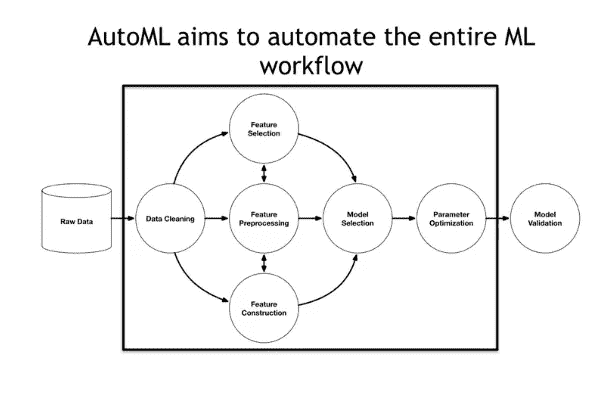
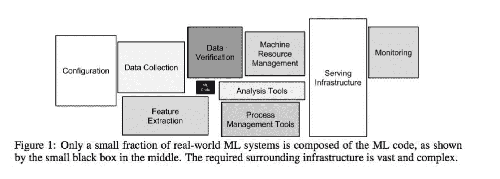

# AutoML 能取代数据科学家吗？

> 原文：<https://medium.com/analytics-vidhya/can-automl-replace-data-scientists-cf1f939a82ba?source=collection_archive---------7----------------------->

## 了解自动化机器学习的主要优势

# **简介**

自动化机器学习，也称为 AutoML，是将机器学习应用于现实世界问题的端到端过程自动化的过程。典型的机器学习过程由几个步骤组成，包括摄取和预处理数据、特征工程、模型训练和部署。在传统的机器学习中，这个管道中的每一步都由人类监控和执行。[自动机器学习工具(AutoML)旨在自动化这些机器学习管道的一个或多个阶段](https://arxiv.org/abs/2002.04803)，使非专家更容易建立机器学习模型，同时消除重复任务，使经验丰富的机器学习工程师能够更快地建立更好的模型。

来源:Randal S. Olson 等人[对基于树的自动化数据科学管道优化工具的评估](https://arxiv.org/pdf/1603.06212.pdf) (2016)

# AutoML 有什么好处？

随着数据科学越来越成为我们生活的一部分，企业需要该领域的更多解决方案，并要求更多的数据科学家来构建这些解决方案。如果没有数据科学方法，公司可能无法了解其流程、监控绩效水平或采取某些措施来防止巨大损失。

对数据科学家的需求逐年增加。同一份报告还指出，填补一个数据科学家职位平均需要 43–51 天。考虑到数据科学家的稀缺和构建数据科学解决方案的时间量， **AutoML 可以帮助企业满足对数据科学家的需求，并提高机器学习项目的投资回报。**

AutoML 解决方案对高级数据科学家和非专家都很有用:

*   对于有经验的数据科学家来说:如果没有 AutoML，就要花费大量时间来完成必要的手动任务，如选择功能和调整超参数，而不是进行更深层次的分析。AutoML 试图通过让自动化流程在后台运行来消除这些障碍，同时数据科学家可以专注于更复杂的问题。因此，通过消除或最大限度地减少繁琐的任务，数据科学家不会被取代，而是能够做只有他们才能做的事情。
*   对于机器学习方面的非专家:AutoML 允许他们轻松地创建快速而有用的项目，并在没有工程支持的情况下将其投入生产。通过这种方式，我们可以显著增加推出的项目数量，并更好地利用我们的所有数据。

**AutoML 的优势可以总结为三大点:**

1.降低成本

*   通过自动化重复性任务提高数据科学家的工作效率。
*   机器学习的民主化减少了对数据科学家的需求。

2.ML 管道的自动化也有助于避免人工操作中可能出现的错误。

3.生产速度。能够比数据科学家更快地部署准确的模型。因此，推出更多项目的可能性。

# AutoML 能取代数据科学家吗？

在 2015 年发表的一篇[独特论文中，谷歌工程师研究了“技术债务”，即与 ML 解决方案相关的长期成本&复杂性。一个关键的观察结果是，只有一小部分 ML 解决方案是实际的学习算法，这对于该领域的大多数从业者来说并不奇怪。](https://papers.nips.cc/paper/5656-hidden-technical-debt-in-machine-learning-systems)

随着时间的推移而积累的技术债务是由于需要大量的“粘合代码”。“粘合代码”被定义为将数据输入和输出 ML 学习算法所必需的代码。**谷歌估计粘合代码占总代码库的 95%,而实际的 ML 学习代码仅占 5%。**

看一下论文中的下图，了解一下实际 ML 解决方案中的功能模块及其相对大小。

来源:谷歌公司[机器学习系统中隐藏的技术债务](https://papers.nips.cc/paper/2015/file/86df7dcfd896fcaf2674f757a2463eba-Paper.pdf) (2015)

**虽然 AutoML 越来越多地覆盖了 glue 代码的大部分，但它仍然只是整个解决方案的一小部分。**

即使我们只看一下模型构建，与当前的 AutoML 方法相比，数据科学家也有许多优势:

1.大多数 AutoML 工具都针对模型性能进行了优化，然而这只是现实生活中机器学习项目的规范之一。例如:

*   如果一个模型需要嵌入到边缘设备中，计算和存储要求迫使公司选择更简单的模型。
*   如果可解释性是可取的，只有某些类型的模型可以使用。

2.在最大的机器学习竞赛社区 Kaggle 上，人类仍然可以轻松击败 AutoML 工具生成的模型。AutoML 解决方案尚未赢得任何数据科学竞赛。

3.现在的 AutoML 只能处理有限类型的问题。

> **AutoML 不是数据科学家的替代品。**

*对 AutoML 好奇？我推荐你阅读我的第二篇文章***，在那里我讲述了我比较 AutoML 解决方案的经验。**