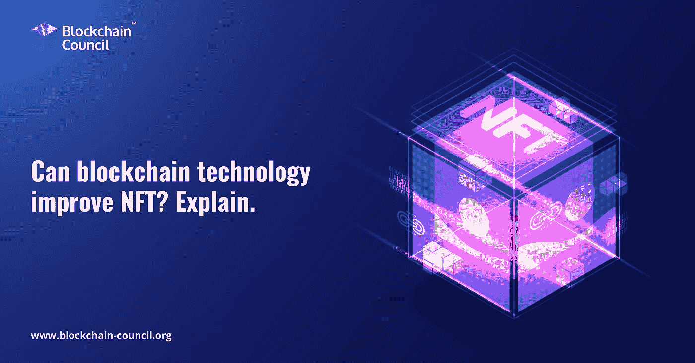

# 区块链技术能改善 NFT 吗？解释一下。

> 原文：<https://medium.com/analytics-vidhya/can-blockchain-technology-improve-nft-explain-9d0e90ac5038?source=collection_archive---------8----------------------->

不可替换令牌是一个新概念，已经在市场上出现了一段时间。尽管如此，它们在建筑工业中的潜力仍然没有得到最佳利用。许多人都知道像比特币或以太坊这样的加密货币，它们越来越受欢迎，主导着技术和商业新闻。不可替代的代币或 NFT 对许多人来说是陌生的。

在过去的一年里，许多传统艺术家和创意人士现在都可以接受非传统艺术，他们对区块链的内部工作方式兴趣不大，但认识到它对人们和整个行业的潜力。新兴市场现在可以为艺术家提供与人直接接触的直接途径，在某些情况下，给边缘创作者一个声音和平台。更重要的是，适当奖励个人的努力。

# 区块链技术如何改善 NFTs？

[**区块链技术**](https://www.blockchain-council.org/blockchain/what-is-blockchain-technology-and-how-does-it-work/) 提供单一版本的信息，对所有节点开放访问。由于它的分类帐结构，它可以被选定的或一般的观众确认。每一次修改都可以通过分类账的记录进行追踪。尽管我们目前在企业界使用区块链创新还为时过早，但它的好处是显而易见的。在一个数据快速增长的时代，以及敏感信息在闲置或移动时所需的安全性，真实性、身份和出处的价值有多大？它关系到信息隐私、信息的完整性，以及企业追求的几乎所有东西。

据 **NFT 专家** s 介绍，用户可以使用 NFTs 正确捕捉建筑物的结构和构造；这是区块链技术服务于一个目的的另一种方式，而通过数字艺术是不可能的。这是至关重要的，因为现在他们可以利用 NFTs 提供高质量的布局文书工作，以协助建筑的整个生命周期，从制定计划到建筑合同和最终的最终建设。

此外，这些数据可以与其他设计师相互交换，这样，他们就可以在其他地方复制最佳实践。因此，生产率可能会提高，甚至可以全面降低总体二氧化碳排放量。虚拟记录有可能作为建筑物所有权的法律确认，或者作为特定布局方法的建筑布局的元素。利用这一技术，还可以实现作为财产所有人登记册的全球创新协议。开发者还可以通过区块链在账户之间简单地交换数字化代币来简化大量的交易。区块链平台有潜力创造一个无失误的方法来创建和跟踪合同。

# 谈论区块链的其他一些特色-

# 强大的安全性-

每一步，区块链都使用加密验证。与此同时，在一个拥有闪电般速度的互联网、移动设备和网络安全问题的世界里，日常计算正在发生。如今，说每个在线交易操作都应该被监控、验证和保护听起来有些夸张。

# 权力下放-

分散的权力，像分布式云存储、边缘云存储和多源化，是直接类比的。在这个领域中，健壮性、恢复计划(包括连续可用性)的优点是可能的。

共识是平台主动节点的决策程序。在这种情况下，这些节点可以快速或相反快速地达成一致。很明显，当大量节点验证交易时，这个空间需要一种技术的共识才能顺利运行。

# 共识技术-

共识是平台主动节点的决策程序。在这种情况下，这些节点可以快速或相反快速地达成一致。当大量节点正在验证交易时，共识对于技术的顺利运行非常重要。

# 零信任的概念-

开发人员可以在区块链操作系统中不可磨灭地验证修改的每个方面。这类似于零信任的概念，即每一个事务都是一次违规。

# 快速交易-

传统金融体系运行缓慢。毕竟，协议已经完成，处理一笔交易可能需要几天时间。它也很容易被篡改。与传统金融部门相比，区块链允许更快的清算。这使得客户可以更快地转移现金，从长远来看，这节省了时间。

不需要中间人——区块链提供了一个端到端的网络。按照 [**区块链专家**](https://www.blockchain-council.org/certifications/certified-blockchain-professional-expert/) **s** 的说法，区块链的这个特点，支付可能只包括两方:给予者和接受者。因此，不需要中间人授权，因为网络中的每个人都可以自己授权支付。

# 结论

这就是今天的帖子。简而言之，我们可以说这些想法是区块链运作的核心，对于寻求保护他们的创造力并将其货币化的艺术家来说，它们是无价的。人们也可以把艺术当作财富，尤其是那些不择手段隐藏钱财的人。在区块链领域有几个风险，其中大部分与人为干扰有关。我们已经看到整个加密市场消失，以及 ICO，加密钱包欺诈。尽管如此，在 NFTs 中实现区块链还是有好处的。