# DALL-E 能帮助作家将他们的思想带入生活吗？

> 原文：<https://medium.com/analytics-vidhya/can-dall-e-help-writers-bring-their-thoughts-to-life-4bb052f0382a?source=collection_archive---------25----------------------->

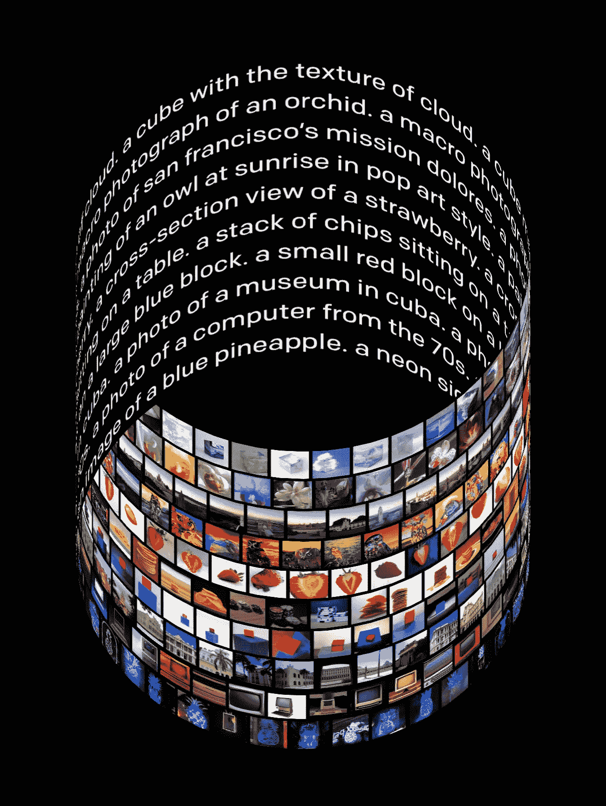

[https://openai.com/blog/dall-e/](https://openai.com/blog/dall-e/)

OpenAI 最近发布了关于其名为 DALL-E 的新模型的消息(论文尚未发表)。朋友们给我发信息，说 DALL-E 有多棒。我的一个朋友和他 5 岁的女儿坐在一起，让她玩 DALL-E 演示界面，他们开心地玩了一个小时，用薯条做刺猬和其他奇怪的动物。

DALL-E 是 GPT-3 的扩展，可以从文本中生成图像。GPT-3 和其他型号，如 BERT、T5 和其他型号都是基于变形金刚。[变形金刚](https://arxiv.org/abs/1706.03762)是可以根据大量数据训练的神经网络。海量的数据确保了优秀的模型。DALL-E 与 GPT-3 等模型之间的唯一区别是，DALL-E 是在文本和像素数据上进行训练的。

DALL-E 是一个强大的模型，可以:

1.  修改对象的属性及其在图像中出现的次数

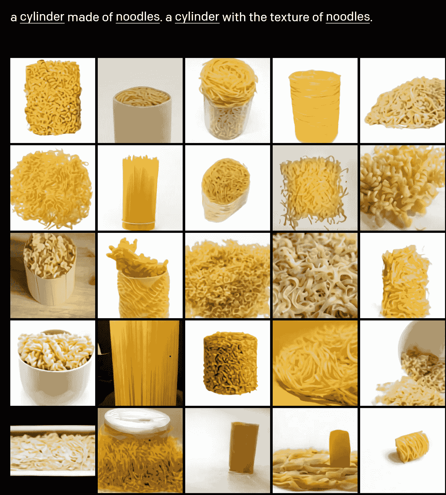

【https://openai.com/blog/dall-e/ 

2.创建具有多种属性的多个对象，并正确描绘它们的物理关系

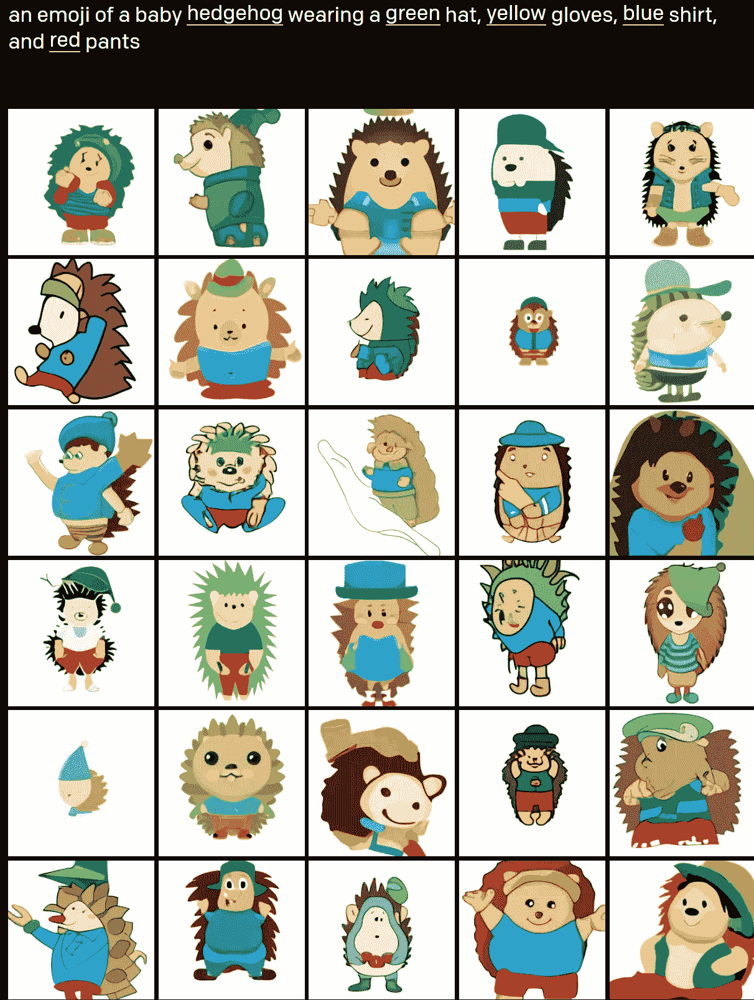

[https://openai.com/blog/dall-e/](https://openai.com/blog/dall-e/)

3.创建具有不同视点和纹理的对象

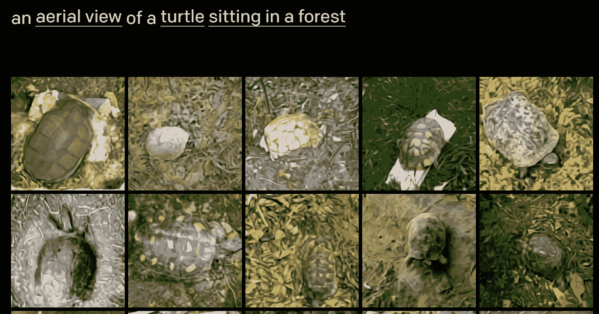

[https://openai.com/blog/dall-e/](https://openai.com/blog/dall-e/)

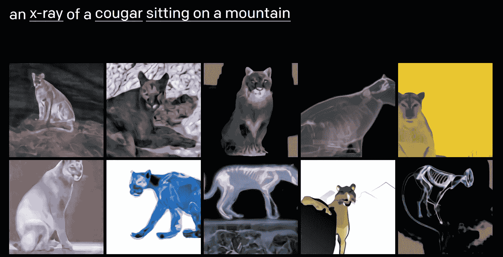

[https://openai.com/blog/dall-e/](https://openai.com/blog/dall-e/)

4.创建对象的内部和外部结构

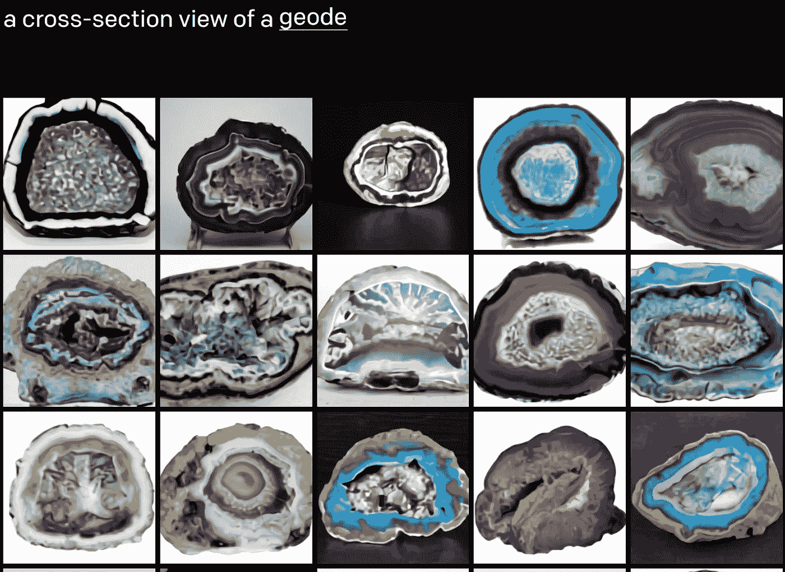

[https://openai.com/blog/dall-e/](https://openai.com/blog/dall-e/)

5.理解标题中包含的上下文

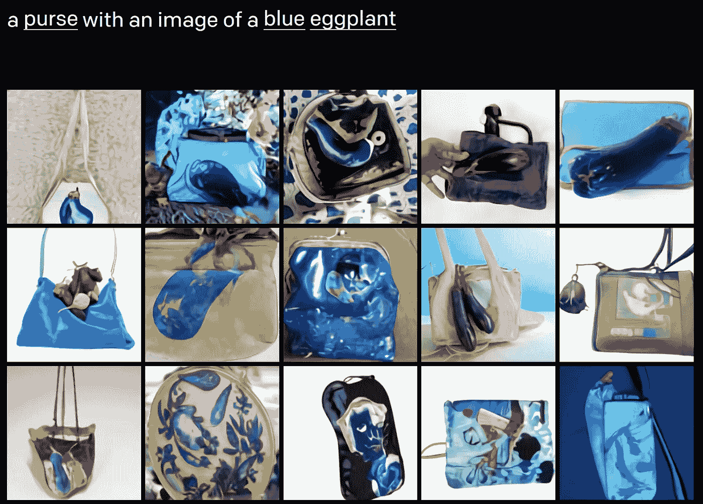

[https://openai.com/blog/dall-e/](https://openai.com/blog/dall-e/)

6.在对象之间传递和混合概念

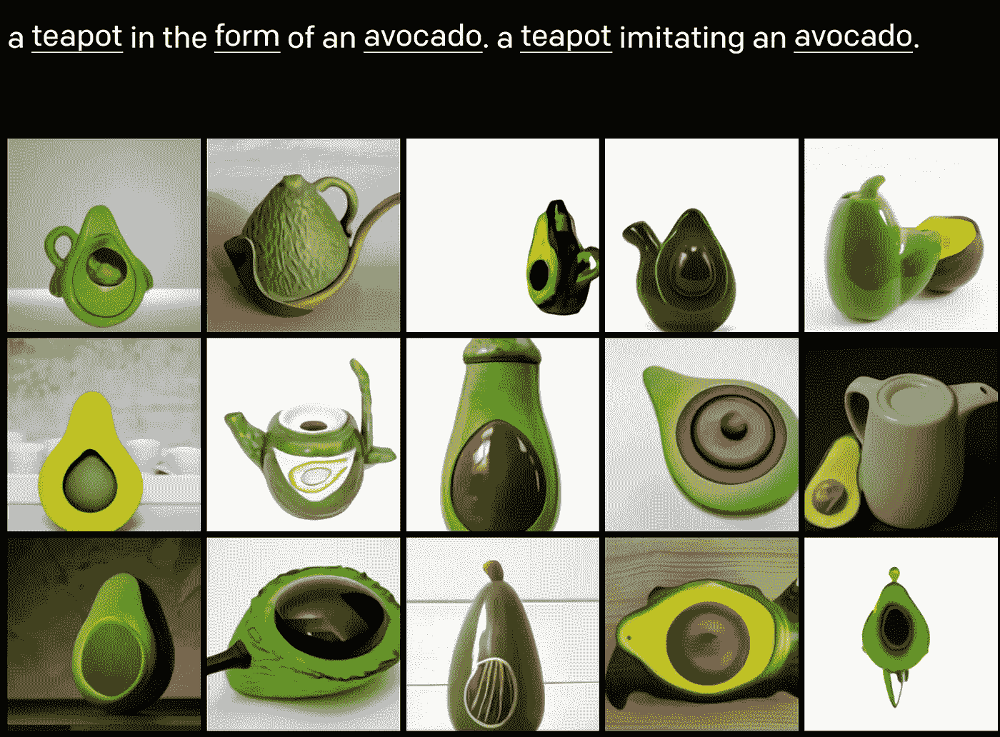

[https://openai.com/blog/dall-e/](https://openai.com/blog/dall-e/)

7.创作各种动物插图

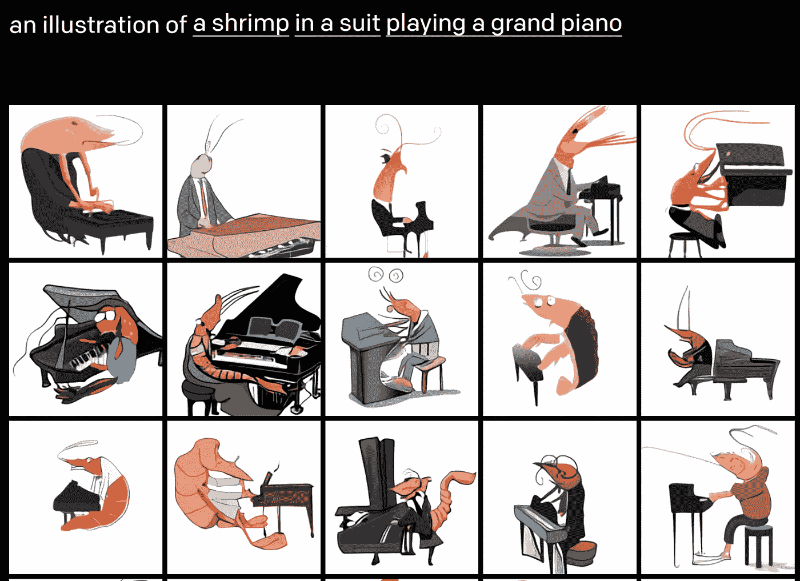

[https://openai.com/blog/dall-e/](https://openai.com/blog/dall-e/)

8.将零镜头视觉推理应用于图像

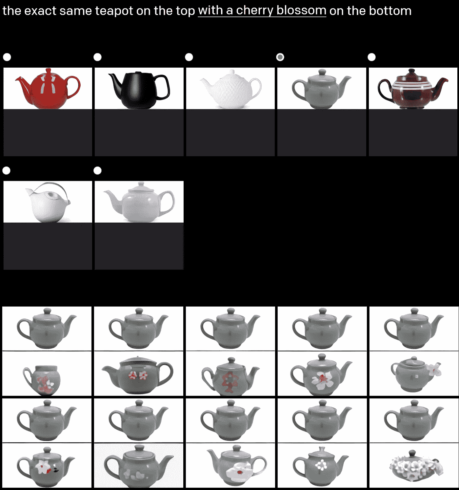

[https://openai.com/blog/dall-e/](https://openai.com/blog/dall-e/)

9.理解并创建地理上和时间上正确的图像

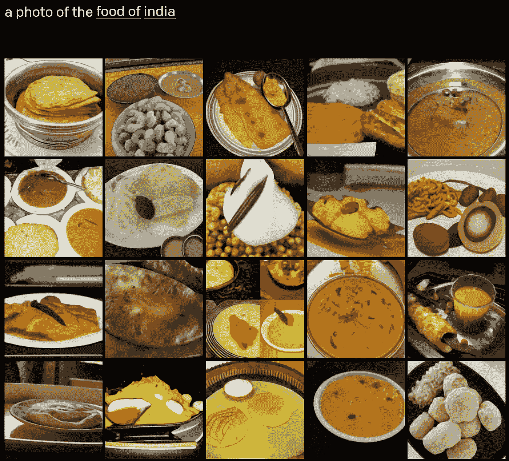

[https://openai.com/blog/dall-e/](https://openai.com/blog/dall-e/)

如上图所示，DALL-E 对设计师来说有很多应用。但是这个模型可以帮助作家更好地将他们的情节可视化。作为一名作家，我有时无法完全想象我的角色周围的风景中的物体。像 DALL-E 这样的工具可以帮助我在脑海中构建这些对象。例如，我的角色的衣服，他们住的房子，他们的宠物，时间设置和角色的身体特征，可以用 DALL-E 这样的工具更好地建模。人们可以对这些属性进行渐进的更改，并选择其中的一个包含在他们的叙述中。

我迫不及待地想在未来利用 DALL-E API 来创造工具，帮助作家为他们的故事创造视觉景观。