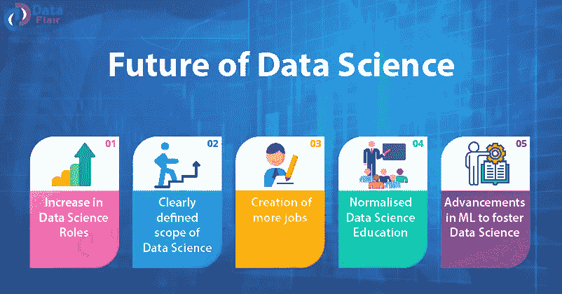

# 数据科学能提升你的职业生涯吗？

> 原文：<https://medium.com/analytics-vidhya/can-data-science-boost-up-your-career-c43e8bdf7be5?source=collection_archive---------1----------------------->

是的，数据科学课程当然可以提升你的职业生涯。如果我告诉你数据科学的范围和未来在世界上非常高，数据科学家是当今最受欢迎的职业，我肯定你不会相信。

如果一个伟大的领袖这么说。*据* ***蒂姆·伯纳斯·李*** *，环球网的发明者*—

> ***“数据是一种珍贵的东西，会比系统本身持续更久。”***

还有， ***、*** *、*美国亿万富商、*太阳微系统*联合创始人**—**

> “未来 10 年，数据科学和软件对医药的贡献将超过所有生物科学的总和。”

# **数据科学导论**

数据科学利用几种统计程序。这些过程包括数据转换、数据建模、统计操作(描述性和推断性统计)和机器学习建模。统计是每个数据科学家的主要资产。

为了从模型中获得预测性响应，理解数据模型的底层模式是一项基本要求。此外，可以利用优化技术来满足用户的业务需求。

# ***转行做数据科学的理由***

我们每天产生的数据量真是令人难以置信！。以我们目前的速度，每天都有 **2.5 万亿** *(即 1018)* 字节的数据产生，而且随着物联网的发展，这一速度还在不断加快。

组织需要能够理解每天产生的海量数据的数据科学专业人员。

根据一项研究，2019 年，由于缺乏合格的人才，与分析和数据科学相关的近 97，000 个职位空缺**。**

不同的公司有很多与数据科学相关的不同职位的空缺，这一定会帮助你在数据科学领域获得一个完美的职业生涯。

以下是你应该转行到数据科学的三大理由

# **1。技能差距**

**将职业生涯转向数据科学领域的第一个原因是…** 虽然对数据科学的需求非常高，但由于缺乏所需的技能，供应并不多。

这一部门的教育系统仍然缺乏。很多想在这个行业找工作的人没有找到工作的必要技能。

学习任何新技能的最佳方式是向已经比你领先**10-20 步的人学习，也就是说，在这种情况下，某人已经在数据科学领域工作。在这里可以做的是找到一个机构，它能够让你具备在这个行业就业的必要技能。**

# 2.提高采用率

越来越多的组织开始将数据集成到他们的流程中。他们正在转变为采取更多数据驱动的决策。

它使公司能够创造新的业务机会，创造更多收入，预测未来趋势，优化当前的运营工作，并产生可操作的见解。这样，你就能随着时间的推移发展壮大你的帝国，从而使你的组织更具适应性。

数字世界处于不断变化的状态，为了适应您周围不断变化的环境，您必须利用数据做出更明智、更强大的数据驱动型业务决策。

# 3.各种工作简介

数据科学领域有很多机会。不同的公司在这个职业中有不同的职位名称。

数据科学永远不会限制你。它的领域很广，给了你很多选择的余地。您可以选择多种专业，例如:

*   数据科学家
*   数据工程师
*   数据架构师
*   数据分析师
*   统计员
*   机器学习工程师
*   大数据工程师
*   商业分析员
*   误报
*   研究分析师
*   数据可视化开发人员
*   数据库管理员
*   商务智能分析师
*   等等…

在过去的几年里，人们已经远离了数据科学家这个笼统的术语。公司现在刊登广告招聘各种各样的工作角色。

具有分析技能的专业人员可以掌握数据科学的海洋，并成为组织的重要资产，促进业务和职业发展。

**以下六件事应该会让你意识到数据科学是未来的职业。**

# 1.公司努力管理他们的数据

企业有机会从客户那里收集有关交易、网站互动等方面的数据。65%的受访企业表示，他们无法对存储的所有数据进行分析或分类。此外，89%的人知道，如果他们能够正确地分析信息，他们将拥有竞争优势。

作为一名数据科学家，您可以帮助公司利用他们收集的数据取得进展，让这些数据在短时间内为他们带来回报。

# 2.新的数据隐私法规

在今天的社会中，可以理解的是，人们比过去几代人更担心将数据交给企业。人们知道数据泄露会发生，而且会有严重的后果。

公司再也不能不负责任地对待他们的数据了。而且，GDPR 和加州的数据隐私规则可能只是开始。数据科学家可以帮助企业以符合隐私规定的有益方式使用数据。

# 3.数据科学家拥有抢手的技能

研究显示，自 2011 年以来，94%的数据科学毕业生已经在该领域找到了工作。数据科学职业非常适合未来的一个指标是数据科学职位的大幅增加。

更具体地说，自 2013 年以来，他们的人数增加了 256%，这表明公司认识到了数据科学家的价值，并希望将他们加入他们的团队。

# 4.职业发展机会

LinkedIn 最近将数据科学家选为 2019 年最有前途的职业。它荣登榜首的原因之一是这个职位的平均工资是 13 万美元。LinkedIn 的研究还考察了人们作为数据科学家获得晋升的可能性，并给职业发展打了 9 分(满分 10 分)。

当然，员工必须表现出主动性，抓住机会在数据科学职位上脱颖而出，但 LinkedIn 的结论表明，公司打算将数据科学家长期留在他们的团队中。如果企业认为数据科学家不适合他们未来的竞争力和繁荣，他们可能不会提供晋升。

# 结论

我希望你喜欢看我在上面提到的话题上的文章。你在数据科学领域开始职业生涯的旅程肯定会很长。

祝你未来一切顺利。随时更新我的帖子。注意安全。