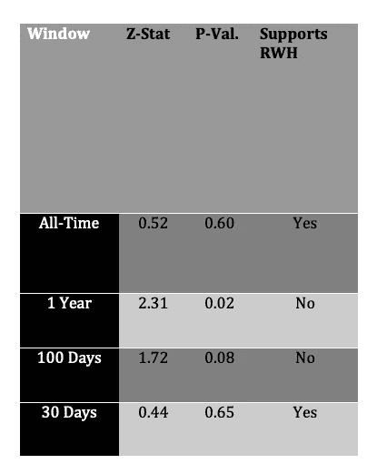

# LSTMs 能预测股价吗？—完整的分析(第一部分)

> 原文：<https://medium.com/analytics-vidhya/can-lstms-predict-stock-prices-a-complete-analysis-part-1-d9409451216d?source=collection_archive---------0----------------------->

对随机游走理论的透彻分析以及随后使用 LSTMs 进行股票价格预测的有效性。


[信用](https://earlyretirementnow.com/2018/01/24/random-walk/)

我在[之前的一篇文章](/analytics-vidhya/no-lstms-cant-predict-stock-prices-11f10dcb35d6)是关于由于市场价格随时间的随机游走特性，试图使用 LSTMs 进行股票预测的常见做法是徒劳的。对于这篇文章的深度和论点有一些批评，因此这个计划的 3 部分系列致力于给出一个相对完整和更深入的主题。

该系列将涵盖:

*   **第一部分:**对股票市场价格性质的单独统计分析。我们将使用各种测试进行彻底和无偏见的统计分析，这些测试将用于支持或拒绝股票价格的零假设。
*   **第二部分:**与附加数据相关的股票市场价格性质的统计分析。我们将使用各种测试进行彻底和公正的统计分析，这些测试将支持或拒绝使用与股票价格相关的额外数据的有效性。
*   **第 3 部分:**基于经验的分析，将使用和测试各种不同的模型实现，目标是实现高于基线的显著回报百分比。

# 随机行走假设

股票在很大程度上是随机的这一信念被称为 r *和随机游走理论*，它声称股票价格的变化具有相同的分布，并且相互独立。随机游走理论认为，股票采取随机和不可预测的路径，使得所有持续预测股价的方法都无效。因此，任何以前的股票价格、趋势或信息都不能用来预测未来的走势。

# 问题是

长短期记忆(LSTM)网络是一种非常流行的递归神经网络，主要用于学习序列和顺序依赖性。

使用 LSTMs 的大多数股票价格预测问题似乎是这样建立的，即模型仅使用孤立的股票价格作为进行预测的唯一信息来源。通过这种方式，LSTM 试图仅在与它们自身相关的过去价格的背景下学习任何形式的结构和/或序列相关性。然而在理论上，如果每天的股票市场价格遵循随机游走，那么它们将完全相互独立，显然，试图使用 LSTM 来学习任何类型的结构都是完全徒劳的。

# 第一部分的目标

这种分析的目的是在孤立的资产价格背景下找到支持或反对 RWH 的证据。如果有大量证据表明，股票数据中不存在相关性、依赖性或结构，我们就可以得出结论，弱市场假说是正确的。

**弱市假说:**弱市假说认为，今天的股票价格反映了过去价格的所有数据，对过去资产价格或趋势的任何形式的技术分析都不能有效地用来帮助投资者做出交易决策。

# 统计分析

我们将试图确定股票价格是否遵循随机游走。如果一个时间序列的*第一差*是*平稳*和*随机*，则称该时间序列遵循随机游走过程。我们将应用各种统计测试来支持或拒绝随机漫步假说。

将对 4 个测试窗口进行相同的统计测试:

*   空前:统计测试将使用历史上每一天的每日收盘价。
*   1 年:统计测试将使用最近 1 年窗口中每天的每日收盘价。
*   100 天:统计测试将使用最近 100 天窗口中每天的每日收盘价
*   1 个月:统计测试将使用最近 1 个月内每天的每日收盘价。出于一致性目的，“1 个月”窗口将被视为 30 天。

## 评估过程

评估过程如下:

对于每个测试窗口，总共进行 6 次统计测试，以收集支持或拒绝随机漫步假设(RWH)的证据。

出于可视化、教育性和解释性的目的，我们将遵循 IBM 股票数据的整个统计过程。

IBM 股票的 4 个测试窗口如下所示:


左上角和右上角窗口分别是完整的历史价格和最近 1 年的价格。左下角和右下角的窗口分别是最近 100 天和 30 天的价格。

## **重要提示**

尽管统计演练仅以 IBM 股票为例，但评估过程将适用于标准普尔 500 指数中的每只股票。

然后将结果汇编成最终报告。

## 额外信息

几乎所有的统计实现和后续测试都将使用 Python 中的 [statsmodels](https://www.statsmodels.org/stable/index.html) 库进行，而可视化将使用 [matplotlib](https://matplotlib.org/stable/index.html) 。数据加载将通过[熊猫](https://pandas.pydata.org/)进行，并保存在[熊猫*数据帧*](https://pandas.pydata.org/pandas-docs/stable/reference/api/pandas.DataFrame.html) 中。假设您熟悉以上所有内容和 Python 语言。

```
import pandas as pd

import matplotlib.pyplot as plt
```

statsmodels 函数和类将在需要时导入。

因为大多数统计概念在每个窗口中都是相同的，所以解释和可视化只能在完整的历史股票价格窗口中进行。所有窗口的结果仍将显示在最后。

假设 IBM 股票数据保存在这个变量中:

```
data = pd.read_csv('../data/IBM.csv')['Close']
```

所有 matplotlib 图形也将使用尺寸 *(16，10)* :

```
plt.figure(
    figsize=(16, 10)
)
```

## 平稳性

时间序列平稳性是指时间序列的*统计特性*不随时间变化。这不要与更一般意义上的“变化”相混淆，因为许多静态时间序列事实上确实表现出某种程度的视觉变化。相反，这个系列本身的变化方式不会随着时间的推移而改变。换句话说，给定时间序列的均值、方差和自相关结构必须保持不变。

平稳性在时间序列统计领域非常重要，因为许多统计测试和过程只处理平稳数据。因此，任何非平稳数据必须首先通过称为*差分的过程转换为平稳数据。*

**求差:**求差是寻找一个时间序列中两个连续观测值之间变化的过程。差异消除了趋势和季节性成分，并将时间序列转换为平稳序列。

一些时间序列必须被差分多次，以便完全成为平稳的。这就是所谓的*积分顺序*，表示为 *I(d)* ，其中 *d* 是时间序列稳定之前的差值数量。值得注意的是，时间序列 *d* 时间的差值是通过计算 *d* 时间差值的差值来计算的。

随机游走是不稳定的，必须加以区分。随机游走的积分顺序是*I(1)*——在一轮差分后它变得稳定。推而广之，如果一个时间序列遵循一个随机游走过程，那么它的积分阶也一定是 *I(1)。*有多种统计测试可以帮助识别时间序列是否是平稳的。

回想一下我们的 IBM 股票数据，我们可以看到下面的 Python 代码实现和示例:

```
plt.plot(data.diff().dropna())  # Computing first differences
plt.show()
```

以下是 IBM 有史以来的股票数据:


以下是第一个区别:


现在的目标是评估订单整合，以及第一个差异是否是一个随机过程。

## 扩充迪基-富勒试验

增强的 Dickey-Fuller 测试(ADF)可以说是识别平稳性最流行的测试。它的工作原理是试图测试一个*单位根的存在。*

**单位根:**单位根是随机过程的一个特征。去除单位根是通过差分实现的，并使时间序列平稳。如果一个时间序列有 *d* 个单位根，那么它必须被微分 *d* 次，直到序列稳定。因此，任何具有 1 个单位根的时间序列都可能遵循随机游走过程。

首先，我们将获取每个测试窗口的原始股票数据。如果原始时间序列是非平稳的，并且有一个单位根，我们将差分时间序列。测试和差分将不断重复，直到时间序列达到平稳状态。这将帮助我们确定整合的顺序，并评估我们是否支持零假设。

回想一下 IBM 的数据，我们将首先确定原始价格是否是稳定的:

```
from statsmodels.tsa.stattools import adfulleradfuller_results = adfuller(data)
```

ADF 测试将返回以下结果:

```
(-1.0702735595579473, 0.7267797486383903, 39, 14846){
     '1%': -3.4307905517334856, 
     '5%': -2.861734704659594, 
     '10%': -2.566873636616544
}(49428.8527942435)
```

根据 statsmodels 文档，前 4 个值分别是 ADF 统计、p 值、使用的滞后数和 nob。最后两个数字可以忽略不计。

为了便于分析，可以忽略最后一个数字(49428.8……)。

括号中的值称为*临界值*。临界值代表 ADF 统计量必须至少达到的值，以便获得时间序列不包含单位根的某种置信度。在这种情况下，ADF 统计值必须小于或等于-2.566，以表明我们有 90%的把握不包含单位根。

如果 ADF 统计量低于任何临界值，我们可以拒绝这个时间序列的零假设，并且不存在单位根的可能性更大。本质上，ADF 统计值越负，我们就越确定时间序列不包含单位根。如果 ADF 高于临界值，时间序列有单位根的概率——因此不是平稳的——会增加，因此我们可以*而不是*拒绝零假设。

在这个例子中，ADF 根本没有那么负，甚至比 10%的临界值高得多。因此，单位根存在的可能性很大，因此这个时间序列不是平稳的，不能拒绝零假设。

我们将对时间序列进行区分，并对差异进行重新测试:

```
adfuller_results = adfuller(data.diff().dropna())
```

对差异数据的 ADF 测试将返回以下结果:

```
(-21.367408355579464, 0.0, 38, 14846)

{
     '1%': -3.4307905517334856, 
     '5%': -2.861734704659594, 
     '10%': -2.566873636616544
} (49425.674742881965)
```

差分时间序列的 ADF 统计量是令人难以置信的负值，其值为-21.367，远远低于任何临界值。因此，这种差分时间序列包含单位根的可能性极低。IBM 股票数据的一阶差分时间序列是平稳的。

**重要提示:**通常最常用的临界值是 5%(无单位根 95%置信)，然而，我们将使用更自由的 10%临界值，以尽可能有利于替代假设。

由于使 IBM 股票数据稳定需要 1 个差值，我们可以得出结论，它的积分顺序为 *I(1)* 。这支持了随机漫步假说。

**结果:**在这里可以看到所有 4 个测试窗口的 ADF 结果:


**结论:**原始时间序列只有 1 个单位根，因此有一个 *I(1)的积分阶。*尽管使用了 10%的临界值，ADF 测试仍支持除 1 年窗口之外的所有 RWH*。*

## WALD-沃尔福威茨试验

Wald-Wolfowitz 测试(WW)是 RWH 的完美测试，因为它是专门设计来测试序列中的元素是否相互独立，以及是否独立地来自同一分布。这实际上是 RWH 的字面定义。

WW 测试只接受二进制值，因此“运行”将由一系列的回报是正还是负组成。因此，WW 将测试各个返回值之间是否存在任何顺序相关性。

回想 IBM 数据，我们需要首先计算系列的百分比变化，然后根据它们的符号将它们二进制化。

这可以在 Python 中实现为:

```
from statsmodels.sandbox.stats.runs import runstest_1samp pct_change = data.pct_change().dropna()binarized = list(map(lambda x: 1.0 if x > 0.0 else 0.0, pct_change))

ww_results = runstest_1samp(binarized)
```

WW 测试将返回以下结果:

```
(0.5207017802858459, 0.6025745340209065)
```

这些数字分别称为 *z-stat* 和 *p-value* 。

如果 p 值低于 0.05 的α值(5%误差)，我们拒绝零假设。

**Alpha:**Alpha 表示当零假设为真时，错误拒绝零假设的概率。

在这种情况下，p 值是 alpha 值的 12 倍，因此有 60%的可能性我们会错误地拒绝零假设。因此，我们绝对不能拒绝零假设。然而，我们将在测试中使用更宽松的 10%。

**结果:**这里可以看到所有 4 个测试窗口的 WW 结果:



**结论:**IBM 股票的百分比变化只支持一半窗口的 RWH。然而，100 天的窗口是有争议的，因为 p 值低于 10%，但仍然在更普遍使用的 5% alpha 之外。1 年的测试窗口具有更低的 p 值，因此我们可以更安全地拒绝零假设。

## ACF 和 PACF 图

ACF(自相关函数)和 PACF(偏自相关函数)图是时间序列分析中最常用的工具。

*   **ACF:** 自相关函数计算给定时间序列的自相关。自相关是由 *k* 时间步长分隔的时间序列的观测值之间的相关性。
*   **PACF:** 偏相关函数计算关系的强度，同时考虑任何中间滞后。

随机漫步通常有一些颇具象征性的 ACF 和 PACF 图。举例来说，我们将首先为 Python 生成的随机游走绘制 ACF 和 PACF:


上面是初始值为零的随机行走，每一步都是均匀分布[-2.5 和 2.5]之间的随机百分比变化。行走进行了 1000 个时间步。

我们现在将绘制 ACF 和 PACF 的随机游走图:


在这里，我们可以观察到具有单位根的时间序列的一些关键特征:

*   ACF 图中的相关性随着滞后次数的减少而慢慢衰减。
*   PACF 具有突然和/或立即的截止。

如果我们对随机游走求差，我们应该期待一个随机过程，因此无论如何都没有序列自相关:


差分随机游走的 ACF 和 PACF 图；


正如预期的那样，在随机漫步的第一个差异中不存在显著的相关性。

我们现在来看看 IBM 数据示例的相应的 ACF 和 PACF 图。在 Python 中，这被实现为:

```
from statsmodels.graphics.tsaplots import plot_acf
from statsmodels.graphics.tsaplots import plot_pacf plt.plot(data.pct_change().dropna())
plt.plot(data.pct_change().dropna())plt.show()
```

以下是原始的 IBM 示例股票数据图:


这些图清楚地显示了与原始随机行走时间序列相同的行为，当然，两者都有一个单位根。

IBM 股票的第一个差异图:


IBM 股票的第一个差异没有显著的相关性。

这同样适用于股票的百分比变化。下面是 IBM 股票收益的 ACF 和 PACF 图:


ACF 和 PACF 图:


**结论:**返回值的任何滞后之间没有显著的相关性，这反过来支持 RWH。

## 德宾-沃森试验

Durbin-Watson 检验(DW)是一种统计检验，用于识别回归模型残差中是否存在自相关。在拟合回归模型之后，残差项之间相关性的存在将指示回归模型中未考虑的附加数据的存在。随机过程应该在误差项之间没有相关性，因为序列当然是随机的，因此不存在可以帮助更好地模拟序列的剩余额外数据。

我们将使用*普通最小二乘法*作为我们的回归模型。然后，将使用 DW 测试评估滞后-1 时的残差序列相关性。

DW 测试可以实现为:

```
from statsmodels.regression.linear_model import OLS
from statsmodels.stats.stattools import durbin_watson model = OLS(data.diff().dropna(), list(range(len(data.values) - 1)))
fitted = model.fit()

dw_results = durbin_watson(fitted.resid)
```

DW 测试将返回以下结果:

```
2.060815605898576
```

这被称为德宾-沃森统计，它在 0-4 的范围内测量系列相关性。统计值越接近 0，正序列相关的证据就越多。越接近 4，负序列相关性的证据越多。约为 2 的 DW 统计值将表明根本没有相关性。由于我们的测试返回的 DW 统计值实际上为 2，我们可以得出结论，OLS 残差之间没有序列相关性，因此时间序列很可能遵循随机游走。此外，我们将尝试评估实际的每日百分比变化本身是否有随机的证据。

**结果:**这里可以看到所有 4 个测试窗口的 DW 结果:


**结论:**在 4 个测试窗口中的每一个的第一差异和回报上训练的回归模型的残差都具有接近 2 的 DW 统计量，因此没有相关性的证据。我们可以结束对 RWH 的支持。

## 永盒试验

Ljung-Box 检验(LB)类似于 Durbin-Watson 检验，它检验来自拟合回归模型的残差的 *n* 自相关。这里，在将 *ARMA(p，q)* 模型拟合到数据之后，将测试应用于时间序列的残差。

LB 测试可以实施为:

```
from statsmodels.stats.diagnostic import acorr_ljungboxmodel = ARMA(data.pct_change().dropna(), (1, 1))
fitted = model.fit()# p-values for every lag up to 20
lb_results = acorr_ljungbox(fitted.resid, 
                            lags=min(20, len(fitted.resid) - 1))[1]
```

LB 测试将返回以下结果:

```
[9.13195073e-01 7.97214509e-01 7.07961633e-01 8.38881515e-01
 2.72909791e-01 6.68844143e-02 1.37431528e-02 3.41379708e-04
 2.55141455e-06 3.49588704e-08 4.69947324e-08 6.53618880e-08
 1.07531420e-07 6.86744750e-10 6.00615669e-10 1.25531032e-09
 8.04833275e-10 2.92999778e-11 8.71485315e-12 1.11609206e-11]
```

虽然它看起来很复杂，但它只是每个滞后时间步长的一个 *p 值*列表。在这种情况下，我们调查多达 20 个滞后。

在这里，我们看到每个相应滞后的许多 *p 值*都远低于所需的 5% alpha，这意味着我们可以拒绝 IBM 有史以来数据的零假设。

**结果:**这里可以看到所有 4 个测试窗口的 LB 测试结果:


由于 LB 测试返回了所有滞后值的 *p 值*直到 20，它们没有全部包含在最终结果的图表中。相反，如果任何一个滞后的 p 值低于 alpha 值(0.05)，那么我们将拒绝该窗口的零假设。

**结论:**ARMA(1，1)模型的残差对 4 个测试窗口中的每一个的百分比收益率进行训练，主要显示了反对 RWH 的证据。除了 30 天之外，所有的 RWH 都被拒绝。

## 布-戈二氏试验

与 Ljung-Box 检验类似，Breusch-Godfrey 检验(BG)评估回归模型残差之间的自相关性。通常，它被认为比永盒或德宾-沃森测试更有效。

在 Python 中，这可以实现为:

```
from statsmodels.regression.linear_model import OLS
from statsmodels.stats.diagnostic import acorr_breusch_godfrey# Fitting OLS model
model = OLS(data.pct_change().dropna(), list(range(len(data) - 1)))
fitted = model.fit()bg_results = accor_breusch_godfrey(fitted)
```

血糖测试将返回以下结果:

```
(
      79.18848606710982,
      0.0003179577084246699, 
      1.9362777484912146, 
      0.000310375595822454
)
```

第一个值是拉格朗日乘数检验统计量，第二个值是拉格朗日乘数检验统计量的相应 p 值，最后两个值分别是 F 检验的 F 统计量和 F 检验的 p 值。

这里，我们看到拉格朗日乘数统计的 p 值远低于 0.05 的 alpha 值，因此，我们拒绝了 IBM 历史数据的零假设。

**结果:**这里可以看到所有 4 个窗口的血糖测试结果:


**结论:**在对每个测试窗口的百分比回报进行训练后，对 OLS 模型残差进行的 BG 测试产生了大于 alpha 的 p 值，这表明我们不能*而不是*拒绝零假设。因此，血糖测试提供了支持 RWH 的证据。

## 单尾检验

为了使 RWH 是真实的，给定股票的百分比变化应该在两个方向上大致相等地波动。从本质上讲，负回报和正回报的数量之间应该有一个大约一半一半的比率。

给定一个返回次数为 *n* 的序列，正负返回次数应该大致为 n/2，标准差为√n/2。

通常，通过使用 5%的常用临界值来建立一些偏差，这意味着每组运行的数量不应偏离 n/2 平均值超过 1.64 (z 得分为 0.05)的标准偏差。

在 Python 中，这可以实现为:

```
pct_changes = data.pct_change().dropna()critical_value = 1.64 * (np.sqrt(len(pct_changes) / 2))

num_positive = len([
    *filter(lambda x: x > 0.0, pct_changes)
])
```

这将产生以下结果:

```
141.4874298303563  # Critical value7287  # Number of positive runs
```

IBM 历史数据中的总回报数是 14886，这意味着 7287 次正运行非常接近预期的一半。然而，它实际上偏离一半(14886/2)比 141.48 允许的临界偏差更大，因此我们拒绝了 IBM 有史以来数据的随机游走假设。

**结果:**在这里可以看到所有 4 个测试窗口的结果:


**结论:**对于 3 个测试窗口，正回报的数量大约是所有回报的一半，因此我们无法拒绝这 3 个窗口的零假设。因此，小于历史数据的所有 3 个窗口都支持 RWH。这些观察确实反映了一件有趣的事情:

*   对于 RWH 在发达市场(如美国)的有效性，人们有着相当强烈的共识。然而，一些研究发现，新兴市场或不完全有效，至少在弱式意义上。将此与 IBM 的数据联系起来，我们看到空前是唯一不支持 RWH 的窗口，因为它的正运行与负运行的比率更高。作为前所未有的数据，这当然反映了 IBM 历史初期的最初增长和发展时期。这样一个时期可能具有发展中市场的“非随机漫步”性质。然而，正如我们将看到的，这不一定是所有公司的客观事实。

# 统计分析结果

前面提到的统计“评估过程”的结果可以在下面看到。该表包括股票的名称，以及对给定股票执行的每个测试是否支持 RWH:


FALSE 表示不支持 RWH，而 TRUE 表示支持 RWH

我们是否认为某一特定股票是随机游走的决定因素如下:

*   确定所有测试窗口的特定测试是否显示随机游走的有力证据。在这种情况下，如果特定统计测试的 2(半)个或更多测试窗口为假，那么我们将该测试视为一个整体，拒绝该特定股票的 RWH。对每一个测试都重复这一过程，直到我们对每一个测试的整体都有一个大致的真或假。
*   如果每个测试中有 3(一半)或更多的一般结论是错误的，则该股票不被视为随机游走。

> **每只股票都是按照随机漫步的方式成交的**

至少，我们可以得出这样的结论，任何一只被分析的股票的 4 个测试窗口，1 年，100 天和 30 天，都有强有力的证据支持 RWH。

# 结论

仅基于统计分析，我们就有强有力的证据得出结论，股票市场价格遵循随机游走。因此，在数据中找不到顺序相关性或可学习的结构。因此，我们证明了弱市场假说是正确的。