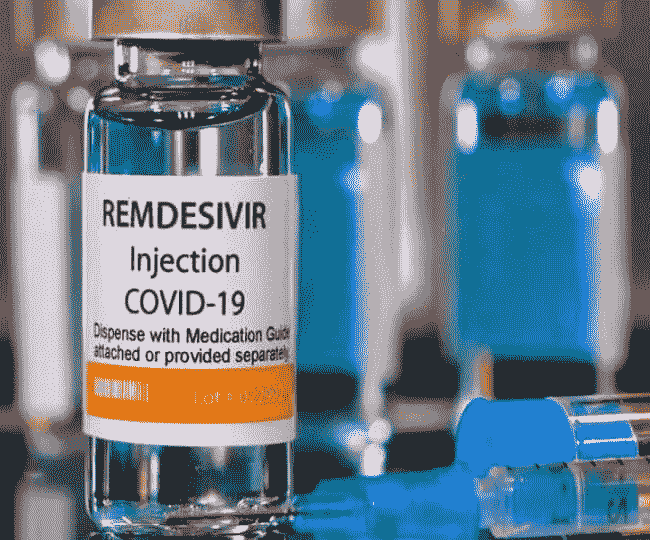
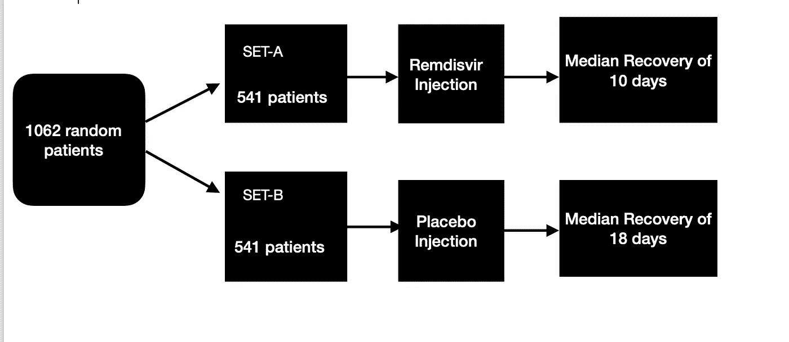
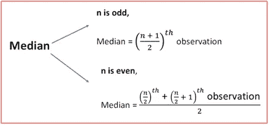
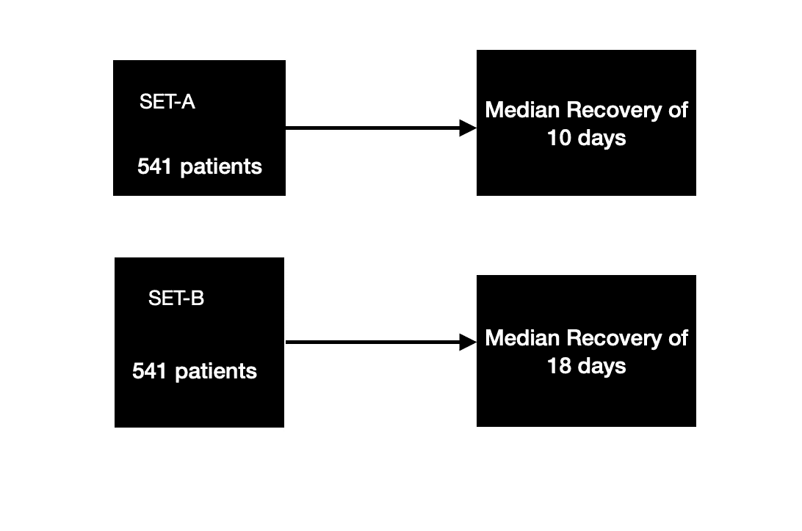
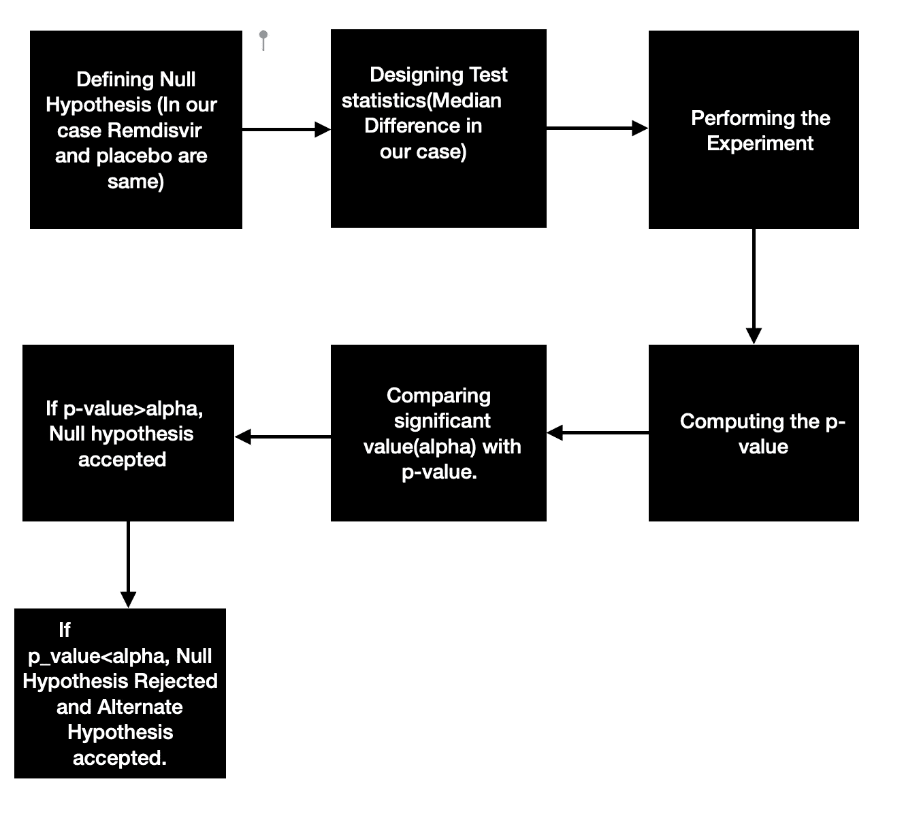
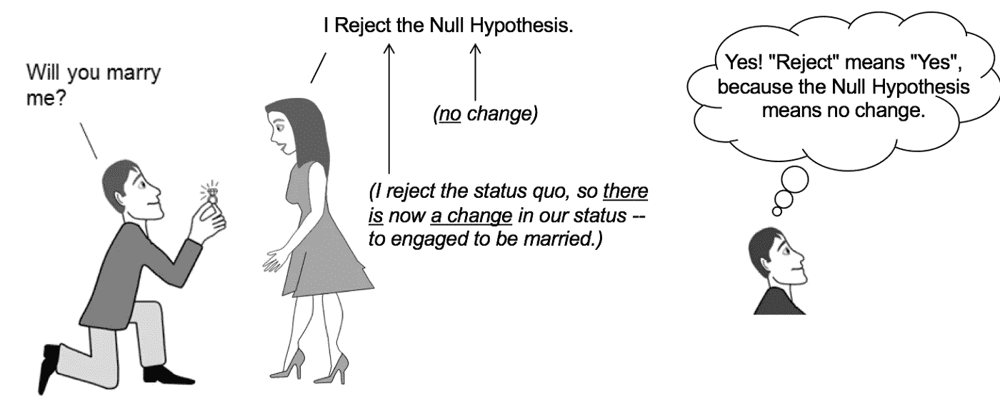

# 如何在数据科学面试中解释假设检验？(新冠肺炎案例研究)

> 原文：<https://medium.com/analytics-vidhya/can-remidesivir-prove-to-be-superior-to-placebo-a-statistical-understanding-f5ac50ec09a6?source=collection_archive---------3----------------------->

在数据科学面试中，与假设检验相关的问题非常常见，最好直观而深入地理解这些话题。

**假设检验的问题可以是-:**

1.  **什么是假设检验？**
2.  **我们为什么要这么做？**
3.  **什么是 p 值？**
4.  **如何求 p 值？**
5.  **什么是显著值？**
6.  **什么是点估计和置信区间？**

让我们看看新冠肺炎的案例研究…

让我们从统计上来看为什么雷米地昔韦注射在第二波治疗中如此有效。

在印度，我们遇到了致命的第二次浪潮，我们这一代人以前从未见过这样的事情，但医学科学和与医学科学相关的人没有留下任何隐患。

首先，我想通过这个博客来感谢所有的一线工作者，所有的医生，护士，社会工作者等等。

非常感谢你冒着生命危险来救我们…

我们都听说过雷米地昔韦注射液，我们都看到了这种注射液在我国的短缺，这让我很好奇想知道**“为什么雷米地昔韦被证明是如此有效，对人们进行了哪些统计测试？”**

在研究雷米地昔韦注射液时，我发现一篇非常有趣的论文发表在**国家医学图书馆**上，这是**国家过敏和传染病研究所关于这种注射液的最终报告。**

我已经发布了这个最终报告的链接。

 [## Remdesivir 治疗新冠肺炎-最终报告- PubMed

### 我们的数据显示，在缩短成年人康复时间方面，雷地昔韦优于安慰剂。

pubmed.ncbi.nlm.nih.gov](https://pubmed.ncbi.nlm.nih.gov/32445440/) 

所以我们来详细讨论一下他们到底做了什么。

# 目标

## **对于因新冠肺炎住院并有下呼吸道感染证据的成年患者，在缩短恢复时间方面，能否证明雷地昔韦优于安慰剂？？**

最初，他们随机选择 1082 名患者，显然他们同意进行某些测试，让我向你描述一下这个简单的测试。

从上表中，您可以看到总共有 1082 名患者，首先我们将这些人分为两组。

## A 组有 541 名患者接受了雷米地韦注射

## B 组有 541 名接受安慰剂注射的患者。

在倒下之前，安慰剂注射是简单的装满水的注射，所以那些病人认为他们已经被给药了。这只是为了给病人制造一种心理安慰。

现在，对于两组中的每 541 名患者，观察他们的恢复时间。

**Xr(随机变量，由患者的恢复时间组成，属于 A 组或给予 remdisvir 的人)**

**Yp(随机变量，由属于 B 组或服用安慰剂的患者的恢复时间组成)**

Xr=[x1，x2，x3，x4，X5……x541]

这里 x1 是患者 1 的恢复时间，x2 是患者 2 的恢复时间，以此类推…

例如，如果组 A 中的患者 1 用了 6 天恢复，那么 x1 是 6，如果组 A 中的患者 2 用了 9 天恢复，那么 x2 是 7。

不幸的是，会有人永远无法康复或死去，所以对他们来说，xi 将是无限的。

x1、x2 也是接受雷米地韦治疗的患者。

Yp=[y1，y2，y3，y4…………y541]

这里 y1 是患者 1 的恢复时间，y2 是患者 2 的恢复时间，依此类推…

例如，如果组 B 中的患者 1 花了 16 天恢复，则 y1 是 16，如果组 B 中的患者 2 花了 19 天恢复，则 y2 是 19。

现在，我们将对 Xr 中的所有值取中值，对 Yp 中的所有值取中值，以了解分布的中心趋势，或者说，它将告诉我们两组的平均恢复时间。

## 一个问题是，为什么我们不取平均值？

现在你需要理解均值的本质，简单地总结所有的观察，然后除以观察的数量。

MeanR=x1+x2+x3……..x541/541(用于组件 A)

MeanP=y1+y2+y3……y541/541(用于 B 组)

现在让我们说，不幸的是，一个人无法从电晕中恢复并死亡，现在对他来说，恢复时间将是无限的。

这个人的平均值将是无限的，因为我们只是取观察值的总和。因此，中位数被证明是一个很好的指标。

对于这个问题，也可能有其他度量或测试统计。

现在正如你在上面看到的，当 n 是奇数时，中位数是第(n+1)/2 次观察，这里 n 是观察的次数。

例如- a=[1，2，3，4，5]，中间值将是第((5+1)/2)次观察值(第三次观察值)，即 3，a 的中间值是 3

通过同样的方法，我们可以找到偶数个观察值的中位数。

现在他们发现 A 组的中位数是 10 天，也就是说服用雷米地韦的人平均在 10 天内康复。

B 组的中位数是 18 天，这意味着服用安慰剂的人平均在 18 天内康复。

现在可能有一个结论，remdisvir 的中值时间更短，这意味着它实际上对人体起作用，减少了人体的恢复时间。

但答案将是“不”。因为仅仅通过这么小的样本量，我们不能断定 remdisvir 对整个人群都有效，如果样本到处都是，这个结果很容易被篡改。

## 现在该怎么办呢？？？

可能有多种测试来解决这个问题，但一种常见的技术是假设测试。

我们先来了解一下假设检验的基本直觉。

假设检验基本上有四个部分:

1.  定义零假设。
2.  设计测试统计。
3.  实验。
4.  计算 p 值。

我将举一个 Remdisvir 的例子来让你们理解假设检验。

让我们理解什么是零假设，在我们的运行示例中，我们可以说零假设是**“人群中值没有差异，这意味着 remdisvir 和安慰剂具有几乎相同的恢复时间，并且 Remdisvir 没有帮助患者快速恢复。”**

**零假设是一种典型的统计理论，认为在一组给定的单个观察变量中，两组观察数据和测量现象之间不存在统计关系和显著性。**

与此相反，我们有一个叫做**的替代假设**，在我们的案例中，替代假设将是**“雷米地韦和安慰剂不同，雷米地韦缩短了新冠肺炎患者的康复时间”**

现在过程非常简单…

让我们逐一讨论这个大难题的每一部分…

## 1.定义零假设(用 Ho 表示)

让我们再次定义我们的零假设…

**“人群中位数没有差异，意味着雷米地韦和安慰剂具有几乎相同的恢复时间，或者简单地说，雷米地韦和安慰剂具有相同的分布，并且雷米地韦没有帮助患者快速恢复。”**

所以我们假设 Remdisvir 和安慰剂之间没有区别。

## 2.设计测试统计

为了检查 Remdisvir 和安慰剂是否具有相同的分布，我们需要一个度量/公式，在我们的情况下，Remdisvir 和安慰剂之间的中值差异(我们之前看到过)是我们的测试统计数据。假设(Mr)是 Remdisvir 的中值,( Mp)是安慰剂的中值，我们的测试统计是 Mr 和 Mp 之间的差异，

测试统计=|Mr-Mp|

假设从我们的观察中，我们发现 Mr(Remdisvir 观察的中值)为 8 天，Mp(安慰剂观察的中值)为 15 天，结果差异为 7 天。

## 3.**P 值**

让我们来理解 p 值的含义，

**P(x = 7 | Ho)P 值就是这么写的。**

P(x=7|Ho)表示如果零假设为真，观察到样本量为 541 人的 7 天样本中位数差异的概率是多少。

**这里 Ho(零假设)是，“集合 A 和集合 B 的分布相同”**

或者我们可以说，如果中位天数没有人群差异，它是观察到 A 组(Remdisvir)和 B 组(安慰剂)之间中位天数差异为 7 天的概率。

当我说“如果中位数身高没有人口差异”，这仅仅意味着我在谈论零假设。

计算 p 值本身需要一个不同的博客，我稍后会谈到，但现在让我们看看我们已经计算了相同的 p 值。

**4。比较 p 值和显著性值**

让我们理解显著性值(α),通常取 5%,

**案例一**

**如果 P(x=7|Ho)=0.2 →表示在没有人群中位数差异的情况下，有 20%的几率观察到 7 天的差异。**

**p 值>α(5%)，意味着 Ho 被接受，意味着我们将说没有显著证据告诉我们 remdisvir 在减少患者恢复时间方面优于安慰剂。**

**案例二**

**如果 P(x=7|Ho)=0.03→表示在没有人群中位数差异的情况下，有 3%的几率观察到 7 天的差异。**

**p 值<α(5%)，意味着 Ho 被拒绝，ha(替代假设)被接受，意味着我们将说已有重要证据告诉我们，remdisvir 在缩短患者恢复时间方面优于安慰剂。**

这就是测试的结局。

国家研究所可能会进行多种类似的测试，假设检验是其中之一。

**还有一个有趣的话题，我们将在以后的博客中讨论，叫做置信区间。**

就这些了，谢谢你的阅读…

# 尼舍什·戈吉亚

*   ***如果你喜欢这个，*** [***跟我来这里***](/@nishesh.kumar) ***了解更多***
*   ***有兴趣合作吗？下面就来连线一下***[***insta gram***](https://www.instagram.com/nishesh_gogia/)