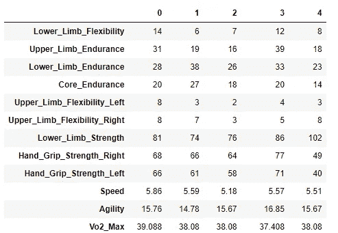
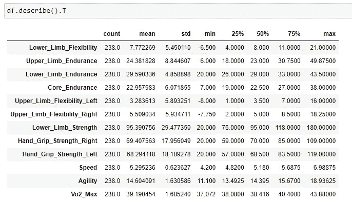
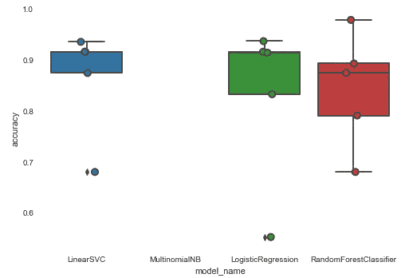
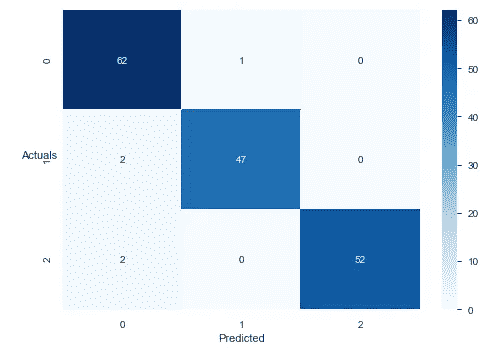
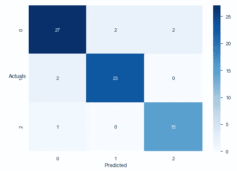
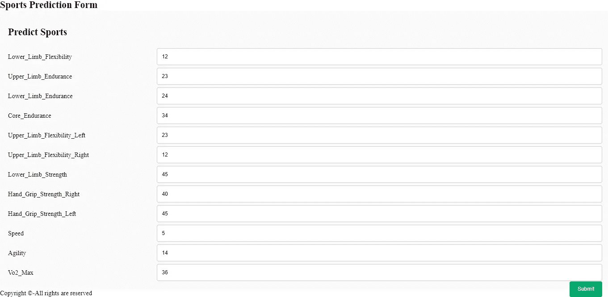
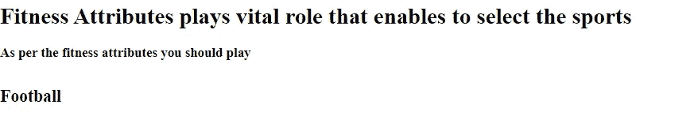

# 我们可以选择运动吗？端到端的机器学习过程

> 原文：<https://medium.com/analytics-vidhya/can-we-choose-sport-an-end-to-end-machine-learning-process-172989404eed?source=collection_archive---------14----------------------->

当我们在学校的时候，我们会拿到成绩单，根据各科的表现，我们会选择未来的科目。一个人的科目成绩对我们未来的努力有着巨大的影响。如果你可以根据身体健康参数来选择运动，这不是很有趣吗？成为 Virat Kohli 或者 L 梅西或者 c 罗，让国家骄傲，是每个孩子的梦想。

**方法:**

人体包括各种系统，例如肌肉骨骼系统、神经系统、心血管系统、呼吸系统以及更多，在这些系统上通过酶和催化剂的作用发生许多复杂的机制，从而产生海量数据。这种机制在没有任何解释的情况下继续，所以现在你可以想象每秒钟有多少数据来自人体。

作为一门体育科学，如果你能理性地思考对特定运动至关重要的数据，那么你就能把这些数据与特定的运动需求联系起来。

体育领域的技术进步使我们能够获得各种形式的数据，无论是内在数据(人体内部)，如血液测试。DNA 测试、激素、体能测试、脂肪百分比、心率、et Cetra 和外在因素(人体外)如气候条件、地面类型、跑了多少次？进了几个球？等等。他们希望将主题专家纳入通过预测为运动选择构建机器学习模型的过程中。

**ML 模型需求:**

这里出现了一个问题，为什么我们要预测孩子们的运动？根据运动员的长期发展；在 LTAD，从儿童早期开始有七个阶段来培养运动员成为冠军。所以，如果在儿童早期，我们可以知道哪些运动适合你的孩子；是不是会对运动参与产生巨大的影响。

**我们怎样才能做到呢？**

正如前面讨论的运动技术和各种测试的含义，我们将能够获得数据。让我们看看数据会是什么样子:



我们可以联系到一个数据组中的 12 个属性，其中如果灵活性越大，运动员就越灵活，耐力意味着在更长的时间内进行任何活动的能力，耐力值越高，力量意味着克服阻力的能力，耐力值越高，运动员就能克服阻力，速度意味着跑得越快，所以速度值越低越好， 敏捷性意味着随着方向的改变而快速奔跑的能力，因此该值越小，结果越好，而最大摄氧量意味着活动期间的最大耗氧量，因此该值越好，耐力越好。

描述性统计:通过五点汇总、均值和标准差对每个属性进行汇总。



**描述性统计**

在体育运动中，每个属性都有其自身的重要性，因此，如果运动员与同龄人相比，具有更高比例的特定属性，那么他们就具有优势。比如说；与其他运动相比，手眼协调或敏捷性在羽毛球运动中具有重要影响，因此，如果运动员在这两个特定属性上表现更好，他可能比其他运动更适合羽毛球运动，尽管我们也可以考虑其他参数。

**对体育项目进行分类**

在数据中实现了无监督的机器学习模型，以形成三个体育聚类，例如羽毛球、足球和篮球。对于该博客，实现了相同的 K- Means 算法。

**应用 K 表示**

```
from sklearn.cluster import KMeans
k_means = KMeans(n_clusters= 3)
k_means.fit_transform(scaled_df)
```

**组的提法**

```
group.T
```

通过分析局限于该组的每个属性的平均值，我们能够创建如下所述的目标变量。

**运动分类**

```
sns.countplot(df.Sports)
```

**预测体育项目**

实现了像逻辑回归、随机森林等监督学习模型来预测运动类别。

```
from sklearn.linear_model import LogisticRegression
from sklearn.ensemble import RandomForestClassifier
from sklearn.svm import LinearSVC
from sklearn.naive_bayes import MultinomialNB
from sklearn.model_selection import cross_val_score
models = [
 LinearSVC(),
 MultinomialNB(),
 LogisticRegression(random_state=0),
 RandomForestClassifier(n_estimators=200, max_depth=3, random_state=0)
]
CV = 5
cv_df = pd.DataFrame(index=range(CV * len(models)))
entries = []
for model in models:
 model_name = model.__class__.__name__
 accuracies = cross_val_score(model, X, y, scoring=’accuracy’, cv=CV)
 for fold_idx, accuracy in enumerate(accuracies):
 entries.append((model_name, fold_idx, accuracy))
cv_df = pd.DataFrame(entries, columns=[‘model_name’, ‘fold_idx’, ‘accuracy’])
import seaborn as sns
sns.boxplot(x=’model_name’, y=’accuracy’, data=cv_df)
sns.stripplot(x=’model_name’, y=’accuracy’, data=cv_df, 
 size=8, jitter=True, edgecolor=”gray”, linewidth=2)
plt.show()
```



**精度**

```
model_name
LinearSVC                 0.865071
LogisticRegression        0.831117
MultinomialNB                  NaN
RandomForestClassifier    0.844060
```

**分类报告**

```
precision    recall  f1-score   support0      0.939     0.984     0.961        63
           1      0.979     0.959     0.969        49
           2      1.000     0.963     0.981        54accuracy                          0.970       166
   macro avg      0.973     0.969     0.970       166
weighted avg      0.971     0.970     0.970       166precision    recall  f1-score   support0      0.900     0.871     0.885        31
           1      0.920     0.920     0.920        25
           2      0.882     0.938     0.909        16accuracy                          0.903        72
   macro avg      0.901     0.909     0.905        72
weighted avg      0.903     0.903     0.903        72
```

**混淆矩阵**



**列车数据**



**测试数据**

让我们建立一个函数来预测结果:

```
def predict_sports(Lower_Limb_Flexibility,Upper_Limb_Endurance, Lower_Limb_Endurance,Core_Endurance,
 Upper_Limb_Flexibility_Left, Upper_Limb_Flexibility_Right, Lower_Limb_Strength,
 Hand_Grip_Strength_Right, Hand_Grip_Strength_Left, Speed, Agility, Vo2_Max):
a=np.zeros(len(X.columns))
 a[0] = Lower_Limb_Flexibility
 a[1] = Upper_Limb_Endurance
 a[2] = Lower_Limb_Endurance 
 a[3] = Core_Endurance
 a[4] = Upper_Limb_Flexibility_Left
 a[5] = Upper_Limb_Flexibility_Right
 a[6] = Lower_Limb_Strength
 a[7] = Hand_Grip_Strength_Right
 a[8] = Hand_Grip_Strength_Left
 a[9] = Speed 
 a[10] = Agility
 a[11] = Vo2_Max
 return (model.predict([a]))
```

结果:

```
predict_sports(12,12,12,12,21,12,40,25,24,4,8,15)
```

**部署**

模型的部署是使用烧瓶完成的；最初，创建一个 pickle 文件来转储模型，然后创建一个列 JSON 文件。

```
import pickle
with open('sports.pickle','wb') as f:
    pickle.dump(model,f)import json
columns = {
    'data_columns' : [col.lower() for col in X.columns]
}
with open("columns.json","w") as f:
    f.write(json.dumps(columns))**A HTML and CSS was used to create a Graphic User Interface as mentioned below:**
```



**点击提交后:**



**结论**

创建机器学习端到端流程的目标是:

a)以统计方式提供该特定运动所需的最重要的属性。

b)通过整合属性在基层识别人才。

从未来的角度来看，这种端到端的体育人才识别模型可以为体育科学家、教练和体育利益相关者提供帮助。