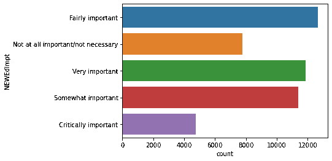
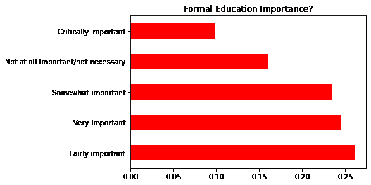
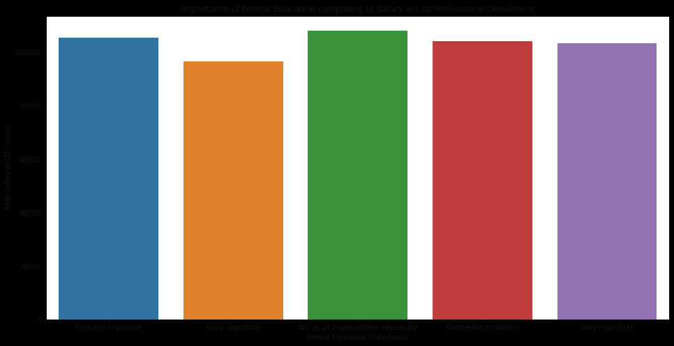
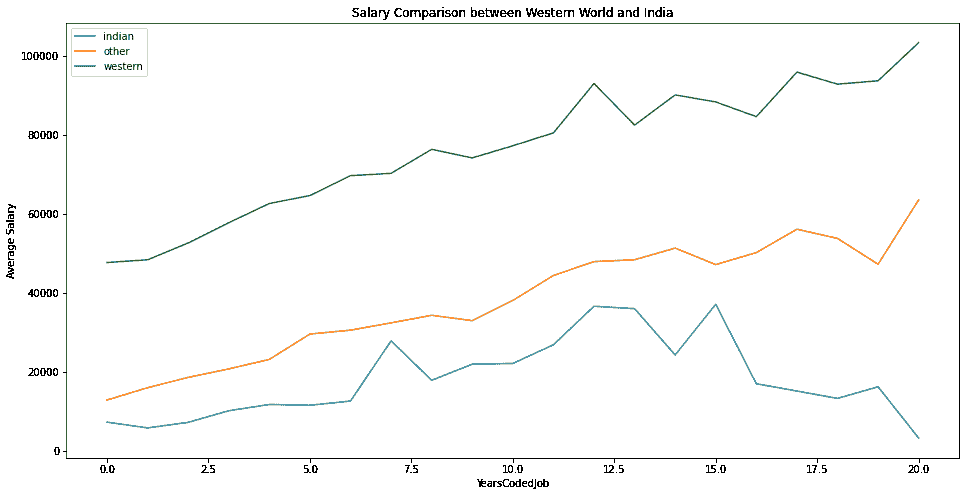
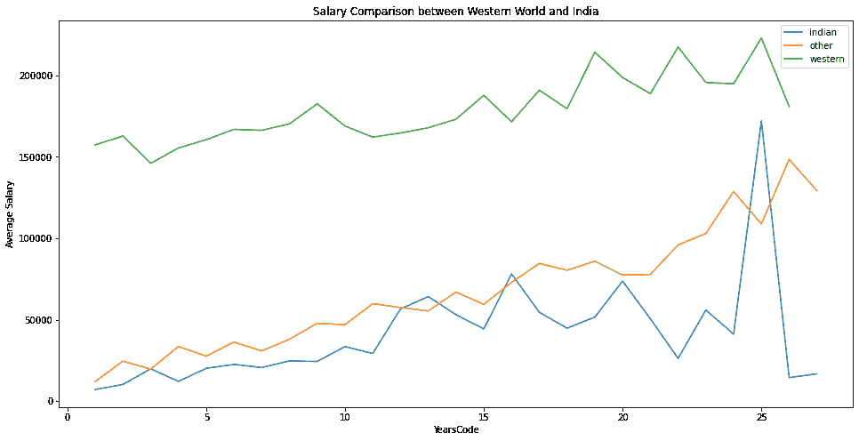
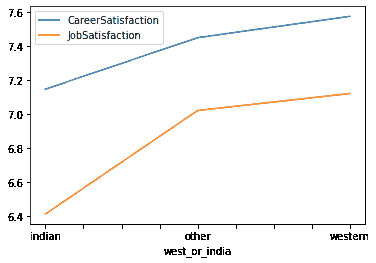
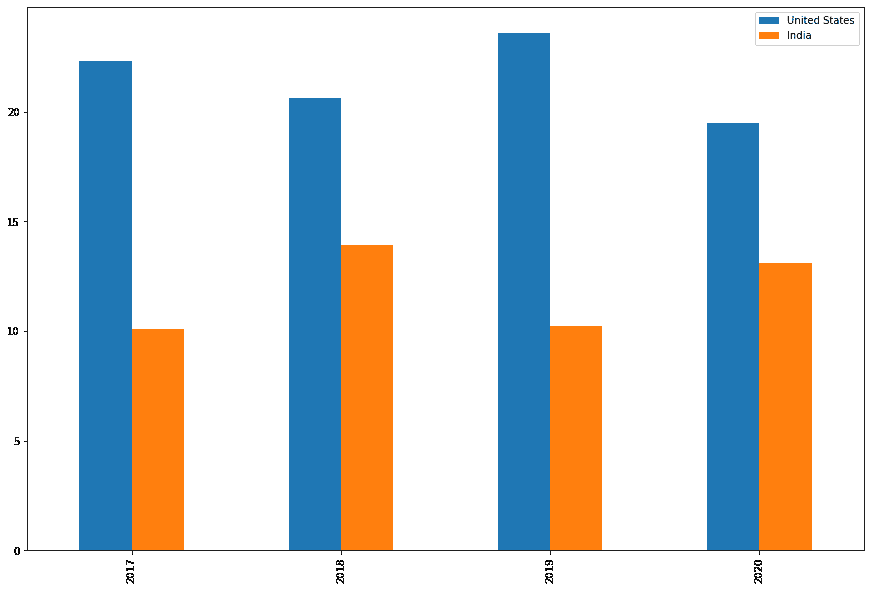
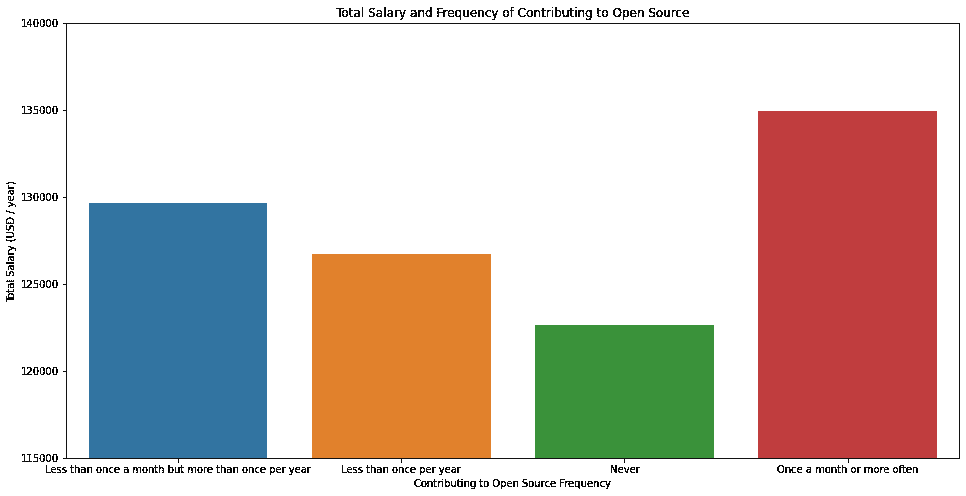

# 我们能猜到是正规教育、为开源软件做贡献还是在世界的哪个地方工作能给我们带来更多的薪水吗？

> 原文：<https://medium.com/analytics-vidhya/can-we-guess-if-formal-education-or-contributing-to-opensource-or-working-in-which-part-of-the-2de04fcf8097?source=collection_archive---------24----------------------->

我用的是 2017 年到 2020 年的 Stack overflow 年度开发者调查数据。这里可以找到[。
如果你正在使用 kaggle，那么你可以在这里](https://insights.stackoverflow.com/survey)找到数据[。
这篇博客基于我在 kaggle 上的笔记本。可以点击](https://www.kaggle.com/haakakak/stack-overflow-developer-surveys-20152020)[这里](https://www.kaggle.com/kirankamat/stack-overflow-annual-developer-survey-analysis)获取代码。
项目[的 Github 回购](https://github.com/kirankamatmgm/Stack-Overflow-Developer-Survey)

在这个分析中，我想集中/提出 4 个问题，并尝试用我掌握的数据找到解决方案。
数据- >问题- >解决方案。

有问题吗？

1.  正规教育是成为专业开发人员的必要条件吗？
2.  作为一名软件工程师，在印度工作好还是去西方国家工作好？
3.  在过去 4 年中，哪个国家拥有最多的开发人员？就开发者总数而言，印度处于什么位置？
4.  给开源做贡献会挣更多工资吗？

# 数据理解

我们每年有 2 个数据集。
考虑例如 2020 年，
df_2020:它包括整个数据集 df_2020_Schema:它包括来自 df_2020 列名和为该列询问的问题，以填充调查中的细节

让我们看看我们从相应部分的每个问题的数据中了解到了什么。

# 1.正规教育是成为专业开发人员的必要条件吗？

为了进行这种分析，必需列只出现在 2020 年的数据集中，所以我只考虑 2020 年的数据集。
使用‘new edimpt’列绘制柱状图，说明正规教育的重要性，并检查每个答案的计数。

从上面的图可以理解

*   几乎 85%的专业开发人员认为正规教育至少有些重要，
*   这与流行的习语观点相反，即成为一名开发人员不需要正规教育。
*   然而，几乎 16%的人认为这根本不重要或没有必要。

为了达到目的，我们将比较正规教育的重要性和他们的工资。此外，我们不想操纵我们的决定与每个人的意见，所以我只考虑专业开发人员。

为了处理丢失的值，我删除了所有没有新的 empt 和 Salary 的行。
放弃的两个原因

*   我负担得起这样做，因为在这之后我还有大量的数据
*   估算工资数据可能会操纵对正规教育的看法。

# 估价

*   这意味着对正规教育有不同看法的专业开发人员挣得差不多。
*   认为不需要正规教育的专业开发人员的收入相对高于认为正规教育很重要的专业开发人员，但他们只有 16%。
*   其余 85%的专业开发人员认为正规教育至少有些重要，并且收入相对相同。
*   这并不意味着人们不能成为专业的开发人员并获得有竞争力的薪水，这当然是可能的，但可能性只有 16%
*   该图旨在观察受过正规教育和没有受过正规教育的专业开发人员的工资是否存在巨大差异。

由于没有巨大的差别，我和大多数人一样得出结论，要成为专业开发人员并获得有竞争力的薪水，最好是完成正规教育。

# 2.作为一名软件工程师，在印度工作好还是去西方国家工作好？

为了对此问题进行分析，必填列仅出现在 2017 和 2019 数据集中，因此我考虑将 2017、2019 数据集用于此问题。

我正在考虑只雇用全职专业开发人员。

# 估价

在这里你可以看到，无论你编码多少年，印度程序员的工资都比西方低得多。由于职业满意度和工作满意度只出现在 2017 年，我只根据 2017 年的数据进行分析

在比较了基于年数的工资后，印度和西方世界的程序员被编入了代码。

*   我发现一个印度程序员无论编码多少年，工资都比西方人低很多。
*   西方程序员的职业和工作满意度远高于印度程序员。
*   因此，如果你想在积累经验的同时获得良好的职业和工作满意度，那么最好去西方国家。

# 3.在过去 4 年中，哪个国家拥有最多的开发人员？就开发者总数而言，印度处于什么位置

你能猜到从 2017 年到 2020 年，你在哪里找到了世界上最多的开发者吗？

我们编写了一个函数来获取一个包含前 2 个国家详细信息的元组

绘制开发商数量最多的前 2 个国家。

# 估价

从上面的图可以理解

*   根据 Stackoverflow 的说法，每年其平台上的大多数开发者都来自美国。美国贡献了世界上大约 20%的开发者。
*   根据 Stackoverflow 的数据，印度拥有世界上第二多的开发者。印度贡献了世界上大约 10%的开发者

# 4.给开源做贡献会挣更多工资吗？

为了对这个问题进行分析，必填列只出现在 2019 年的数据集中，所以我考虑这个问题的 2019 年数据集。

# 估价

*   正如我们所看到的，你对开源贡献越多，总收入也在增加。
*   所以为开源做贡献是个好主意。

*最初发布于*[*https://kirankamath . hash node . dev*](https://kirankamath.hashnode.dev/can-we-guess-if-formal-education-or-contributing-to-opensource-or-working-in-which-part-of-the-world-earns-us-more-salary)*。*