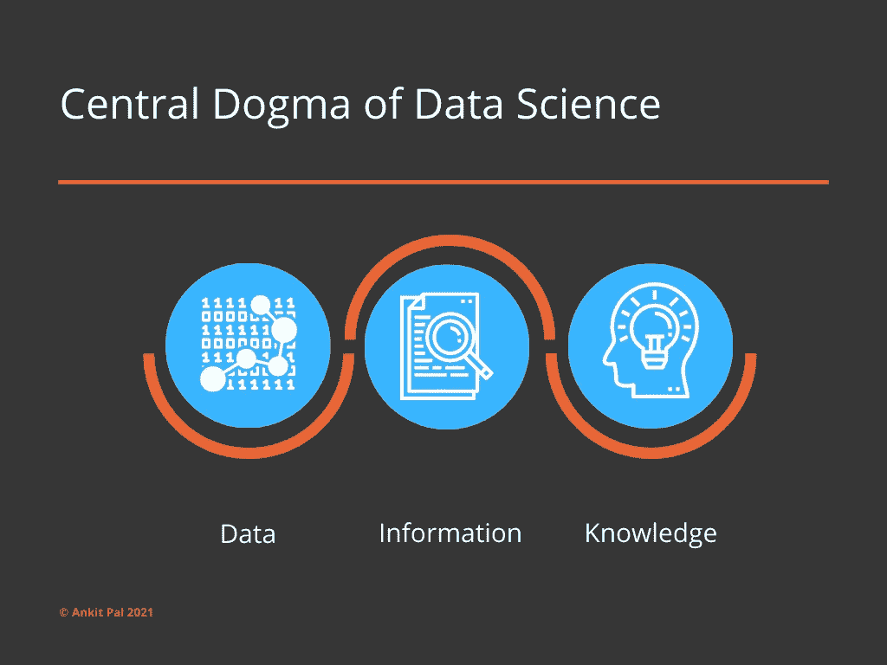

# 任何人都可以成为数据科学家吗？

> 原文：<https://medium.com/analytics-vidhya/can-you-become-a-data-scientist-20ec506116a8?source=collection_archive---------18----------------------->

> 当你第一次开始研究一个领域时，似乎你必须记住无数的东西。你不知道。你需要的是确定管理这个领域的核心原则——通常是三到十二条。你认为你必须记住的数百万件事情只是核心原则的各种组合。
> 
> ——约翰·里德(在《成功》一书中)

您是否曾经觉得您的整个专业网络似乎都在追赶数据科学的潮流，而您却错过了这项未来的技术？

有人会做数据科学吗？这是我在 90 天的数据科学家课程中多次被问到的问题。我用这篇文章来帮助那些没有听过我回答的人回答这个问题。

简短的回答是肯定的！任何人都可以做数据科学。在纯粹主义者和数据科学势利者开始讨论这个问题之前，让我根据我在这个领域 20 多年的经验提出我的观点。

首先，我们必须理解什么是数据科学的概念。然后，我们将看看数据科学家做什么，以及任何人都可以如何做数据科学。

数据科学:《剑桥词典》对数据科学的定义是:利用科学方法从计算机数据中获取有用信息，尤其是大量数据。

现在，看看这个定义，你可能在你各自的职业中做着类似的工作，无论是分析 P&L、资产负债表、整理研究论文、销售跟踪、定义流程，甚至是查看体育赛事数据等等。你正在以某种形式做数据科学。

那么，为什么称之为数据科学而不仅仅是工作呢？

为了回答这个问题，我想在下图中提出数据科学的中心法则:

数据科学的中心法则

在上面的图像数据指的是从各种来源收集的原始数据。信息来自组织从大型数据集中选择的数据。然后，使用各种技巧和技术来挖掘这些信息，以获得洞察力和知识。由于降低了云存储和计算成本，使个人和公司能够学习和实施关于极大量数据的解决方案，这些技术已经获得了主流牵引力。

上面提到的每个步骤都对应于数据科学中的功能，因此由数据科学家来完成。我确信您在日常工作(尤其是知识工作者)中看到了相关性，在这些工作中，您使用了数据科学中心法则的部分或全部组件。

我们经常被问到的一个问题是，编程是成为数据科学家的必要条件吗？简而言之，没有，但是如果你花时间学习编程，它可以让你的职业生涯更上一层楼。更具体地说，用 Python 编程。为什么是 Python？当涉及到编程语言时，它是一种非常简单的语言，并且有大量由慷慨的开源贡献者社区创建的库，当涉及到执行复杂任务时，这些库使您的生活非常简单。

你需要问自己的问题是——你不编码的决定是基于恐惧还是基于你不够聪明去学习编码的假设，还是仅仅是一个心理障碍？一点点的自我反省大有帮助。消除这种心理障碍的一个方法是阅读那些鼓舞人心的非编码人员的故事，他们学会了如何编码，然后重新创造了他们自己和他们的职业。

然而，有几个数据科学角色不需要编码，包括涉及数据可视化、数据准备(需要一些编码)、销售数据产品等工作。你明白我的意思了！

您需要理解的基本概念是，归根结底，数据科学是关于解决问题的，这涉及到提出正确的问题。

你对自己工作领域的了解使你有资格提出正确的问题，假设潜在的答案在哪里，并收集正确的数据以找到解决方案。

所缺少的是解决这些问题的最新工具和技术，给你洞察力，这将有助于推动你所在领域的下一步，无论是商业还是科学研究。这些工具和技术可以在几个月内从你所掌握的大量学习资源中学习到。那么为什么要等呢？

这篇文章的目的是启发你考虑学习数据科学来提升技能，从而让自己适应未来。正如他们所说，这不容易，但值得努力！

那么为什么要等呢？

迈出这一大步，加入数据革命！