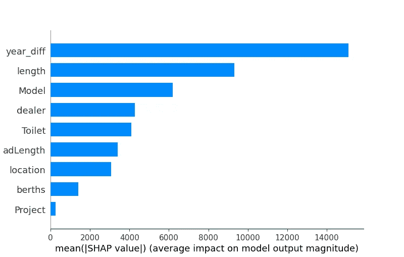
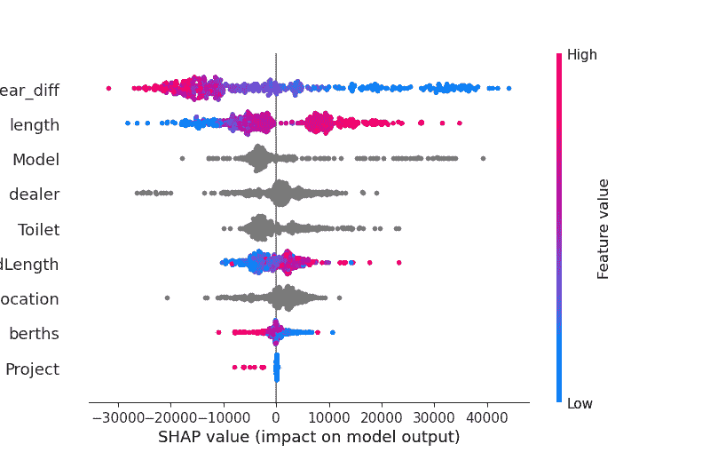
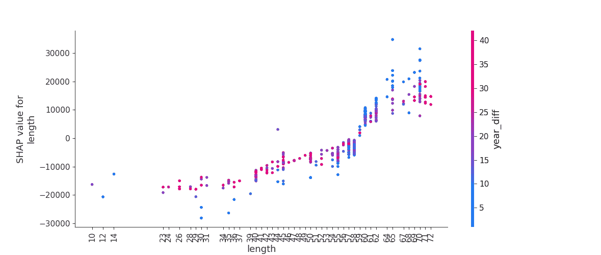
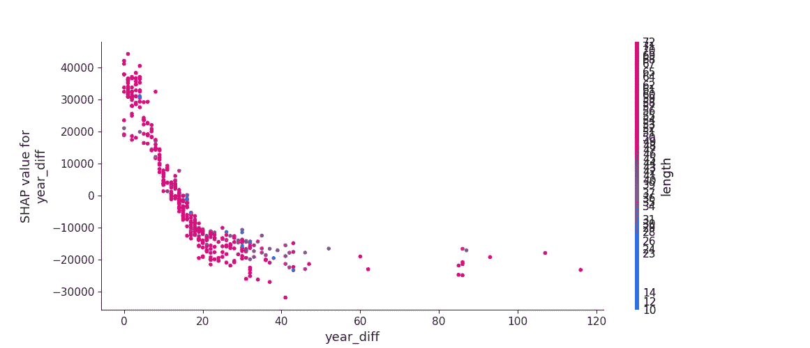

# 基于 Catboost 机器学习的运河船定价

> 原文：<https://medium.com/analytics-vidhya/canal-boat-pricing-with-catboost-machine-learning-5b2389999116?source=collection_archive---------10----------------------->


来自 YouTube 推荐引擎的一个更有趣的建议，结合完全远程工作，让我和许多其他人似乎开始考虑在水路上过游牧生活。众所周知，运河船很难定价，因此理解推动定价的经济杠杆似乎是一个必要的先决条件。

该项目将包括以下内容。

1.  使用来自站点[阿波罗鸭](https://narrowboats.apolloduck.co.uk/)的[硒](https://selenium-python.readthedocs.io/)进行数据挖掘
2.  使用 [Catboost](https://catboost.ai/) 进行特征提取和模型训练
3.  使用 SHAP 值的模型解释
4.  使用[砂箱](https://flask.palletsprojects.com/en/2.0.x/)和[对接器](https://www.docker.com/)展开模型

这个项目的代码可以在我的 Git repo 中看到:

[](https://github.com/lewisExternal/apolloDuckCanalBoatPricing) [## GitHub-Lewis external/apolloduckcanalboat 定价

### 这种回购挖掘运河船数据，训练机器学习模型来估计价格，并部署到一个简单的烧瓶…

github.com](https://github.com/lewisExternal/apolloDuckCanalBoatPricing) 

1.  使用来自站点[阿波罗鸭](https://narrowboats.apolloduck.co.uk/)的[硒](https://selenium-python.readthedocs.io/)进行数据挖掘

bash 脚本最初是通过我的 Raspberry Pi 运行的，它会将任何依赖项下载到虚拟环境中，然后循环浏览阿波罗鸭网站上的页面，以收集船只广告。这方面的代码如下所示。

该脚本将从每个广告中提取数据，并将结果保存到 SQLite 数据库中。下面可以看到该脚本的摘录，但完整代码请参见[回购](https://github.com/lewisExternal/apolloDuckCanalBoatPricing/tree/main/src/scraping)的这一部分。

2.使用 [Catboost](https://catboost.ai/) 进行特征提取和模型训练

脚本的特征提取部分出现在下面的代码片段中。它利用正则表达式来提取模型特征。

选择 Catboost 进行回归，利用网格搜索功能进行参数选择。模型训练的完整代码可以在[这里](https://github.com/lewisExternal/apolloDuckCanalBoatPricing/blob/main/src/modeling/createModel.py)找到。

3.使用 SHAP 值的模型解释

该模型最重要特性的排名如下所示。这可以解释为船龄和长度对船价的影响最大。

有关 SHAP 值的更多信息，请点击此处:

[](https://christophm.github.io/interpretable-ml-book/shap.html) [## 5.10 SHAP (SHapley 附加解释)|可解释的机器学习

### 本章目前仅在此网络版本中可用。电子书和印刷品将紧随其后。SHAP(沙普利添加剂…

christophm.github.io](https://christophm.github.io/interpretable-ml-book/shap.html) 

简要总结如下:

“第一个是全局可解释性-集体 SHAP 值可以显示每个预测因子对目标变量的贡献大小，无论是积极的还是消极的。这类似于变量重要性图，但它能够显示每个变量与目标的正或负关系(参见下面的 SHAP 值图)”

参考:

[](https://towardsdatascience.com/explain-your-model-with-the-shap-values-bc36aac4de3d) [## 用 SHAP 价值观解释你的模型

### 使用 SHAP 值来解释任何复杂的 ML 模型

towardsdatascience.com](https://towardsdatascience.com/explain-your-model-with-the-shap-values-bc36aac4de3d) 

因此，简单地将你的船移到另一个位置不会对价格产生重大影响，也不会创造更多的泊位。



该脚本还会将蜂群图保存到 src/modeling/beesworm . png



绘制形状值图表的代码可以在下面找到。

Shap 值也可用于解释单个特征和目标变量之间的关系。

按船龄划分的船价和船长之间的关系表明，船价越高，船价越高(下图)。



按长度划分的船价和船龄之间的关系也可以在下面看到。在最初的 20 年里，船价贬值的性质似乎迅速下降，此后不久就趋于平稳。



# 日志输出

模型创建的日志输出示例包括在内，以供参考。

数据在所提供的数据库中，并且是从运行挖掘脚本时开始的。

其细节使我们对数据集和特征提取的性能有了一些了解。

```
21-08-2021 19:46:40 - INFO - model has been trained
#################################################
Testing model performance
21-08-2021 19:46:40 RMSE: 30120.49
21-08-2021 19:46:40 R2: 0.47
Feature importance
year_diff: 32.52778381846008
length: 16.421931782753646
Model: 13.767382273520658
adLength: 8.796854243890277
location: 8.515559656287708
Toilet: 7.880168318411312
dealer: 6.624350436844077
berths: 5.0657144985342235
Project: 0.400254971298003
21-08-2021 19:46:41 - INFO - file has been moved: 21082021185144cat_boost_model
21-08-2021 19:46:41 - df # of records - 787
21-08-2021 19:46:41 - df_pre_cleansed # of records - 787
21-08-2021 19:46:41 - df_cleansed # of records - 787
21-08-2021 19:46:41 - df_final # of records - 518
Processing categorical variables.
#################################################
21-08-2021 19:46:41 - INFO - processing dealer
dealer
Error                                             107
Lakeland Leisure Boat Sales                        52
Rugby Boat Sales                                   52
Boatfinder Brokerage Services                      42
New and Used Boat Co Derby                         27
David Mawby Ltd                                    22
ABNB Ltd                                           20
Virginia Currer Marine Ltd                         16
ABC Leisure Group Ltd                              14
BC Boat Management Ltd                             14
Castle Boat Sales                                  14
Braunston Marina Ltd                               12
Narrowboats LTD                                    11
Blue Water Marina Ltd                              10
Venetian Marina                                     9
Swanley Bridge Marina                               7
Musk Marine Sales                                   5
Tollhouse Boat Sales                                5
Norbury Wharf Limited                               5
Aqueduct Brokerage                                  5
ABC Boats                                           5
Ashwood Marina                                      4
Houseboats at London                                4
West London Boat Brokerage                          4
NarrowCraft Brokerage                               4
Stewart Marine                                      3
RIVERHOMES Central London                           3
Premier Houseboats                                  3
Marine Services (Chirk) Ltd                         3
Midway Boats Limited                                3
Boat Showrooms of London                            3
Frouds Bridge Marina                                3
Ely Marine Ltd                                      2
Alan G Pease                                        2
Victoria Quay Marina Ltd                            2
TBS Boats Bray Ltd                                  2
Fish & Duck Leisure Ltd                             1
Tingdene Boat Sales - Upton Marina                  1
Liverpool Boat Sales                                1
Weltonfield Narrowboats Ltd                         1
Aquavista Ltd                                       1
Homesafloat                                         1
Great Haywood Boat Sales Ltd                        1
Boatinland                                          1
Tingdene Narrowboats                                1
Tingdene Boat Sales - Thames and Kennet Marina      1
Roydon Boat Sales                                   1
Tingdene Boat Sales - Stourport Marina              1
TBS Boats Penton Hook                               1
Longport Brokerage                                  1
Classic Yacht Brokerage                             1
Premier Marine Ltd.                                 1
Sirius Marine Services ltd                          1
First Peninsula Marine                              1
York Marina                                         1
Name: id, dtype: int64
#################################################
#################################################
21-08-2021 19:46:41 - INFO - processing berths
berths
4    184
2    145
1     86
6     52
3     29
5     15
8      6
7      1
Name: id, dtype: int64
#################################################
#################################################
21-08-2021 19:46:41 - INFO - processing Model
Model
cruiser       183
trad          177
semitrad       86
widebeam       53
none           10
tug             5
dutchbarge      4
Name: id, dtype: int64
#################################################
#################################################
21-08-2021 19:46:41 - INFO - processing Project
Project
False    508
True      10
Name: id, dtype: int64
#################################################
#################################################
21-08-2021 19:46:41 - INFO - processing Toilet
Toilet
none         224
cassette     140
pumpout       93
macerator     37
compost       22
sealand        2
Name: id, dtype: int64
#################################################
#################################################
21-08-2021 19:46:41 - INFO - processing location
location
Northamptonshire    85
Cheshire            74
London              56
Staffordshire       38
Midlands            28
Essex               28
Gloucestershire     28
Leicestershire      26
Yorkshire           22
Derbyshire          16
Surrey              14
Worcestershire      13
Warwickshire        11
Berkshire           11
Buckinghamshire      9
Oxfordshire          9
Lancashire           8
Lincolnshire         7
Wiltshire            6
Kent                 4
Hertfordshire        4
Cambridgeshire       4
Wrexham              3
Bristol              3
Merseyside           2
Somerset             2
Shropshire           2
Nottinghamshire      1
Monmouthshire        1
Manchester           1
Cumbria              1
location.            1
Name: id, dtype: int64
#################################################
Processing numerical variables.
#################################################
21-08-2021 19:46:41 - INFO - processing length
21-08-2021 19:46:41 - INFO - max value is: 75
21-08-2021 19:46:41 - INFO - min value is: 10
21-08-2021 19:46:41 - INFO - mean value is: inf
21-08-2021 19:46:41 - INFO - median value is: 58.0
#################################################
#################################################
21-08-2021 19:46:42 - INFO - processing year_diff
21-08-2021 19:46:42 - INFO - max value is: 116
21-08-2021 19:46:42 - INFO - min value is: 0
21-08-2021 19:46:42 - INFO - mean value is: 19.231660231660232
21-08-2021 19:46:42 - INFO - median value is: 17.0
#################################################
#################################################
21-08-2021 19:46:42 - INFO - processing adLength
21-08-2021 19:46:42 - INFO - max value is: 9351
21-08-2021 19:46:42 - INFO - min value is: 245
21-08-2021 19:46:42 - INFO - mean value is: 1685.915057915058
21-08-2021 19:46:42 - INFO - median value is: 1431.0
#################################################
```

4.使用[砂箱](https://flask.palletsprojects.com/en/2.0.x/)和[码头](https://www.docker.com/)展开模型

该脚本还将创建一个包含在 Docker 映像中的 Flask 端点来部署模型。

下面是一个请求示例。

```
[http://localhost:5000/v1/api?length=45&berths=2&age=30&model=trad&toilet=cassette](http://localhost:5000/v1/api?length=45&berths=2&age=30&model=trad&toilet=cassette)
```

JSON 响应示例如下所示，包括为方便起见而假设的一些参数，但最重要的是价格估计:

```
{"Model": "trad","Project": false,"Toilet": "cassette","adLength": 1431,"age": 30,"berths": 2,"dealer": "Error","length": 45,"location": "London","price": 35238.87188879248}
```

flask 端点的代码片段如下:

同样，Docker 文件也在这里。

但是请参考下面的目录以获得完整的工作解决方案。

[](https://github.com/lewisExternal/apolloDuckCanalBoatPricing/tree/main/src/modeling/flask) [## apolloduckcanalboat pricing/src/modeling/flask at main Lewis external/apolloduckcanalboat pricing

### 在 GitHub 上创建一个帐户，为 lewisExternal/apolloduckcanabaotpricing 的发展做出贡献。

github.com](https://github.com/lewisExternal/apolloDuckCanalBoatPricing/tree/main/src/modeling/flask) 

在这个项目中当然有更多功能工程的空间，尽管因为我现在已经决定追求在陆地上的生活，我认为这个问题已经变得不那么相关了。机器学习的又一个有趣的应用！