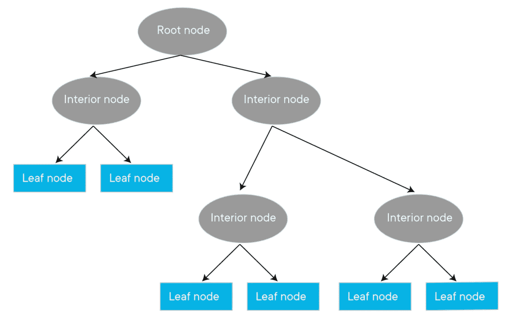

# 看不到决策树的随机森林

> 原文：<https://medium.com/analytics-vidhya/cant-see-the-random-forest-for-the-decision-trees-5184a5482fe1?source=collection_archive---------31----------------------->

照片由[卡丹&彼得](https://unsplash.com/@dankapeter?utm_source=medium&utm_medium=referral)在 [Unsplash](https://unsplash.com?utm_source=medium&utm_medium=referral)

“只见树木不见森林”这句谚语通常用来形容某人过于专注于一小部分或细节，以至于错过了全局。习语在许多不同的场景中都很有用，但是在讨论随机森林和决策树时尤其合适。

不讨论决策树就不可能解释随机森林。

决策树是随机森林的构建块。树由根节点、内部节点和叶节点组成。从根节点开始，树将在称为内部节点的不同特征处进行一系列分割。每个内部节点检查条件(如不确定性或杂质)并执行决策，直到它在叶节点处结束。叶节点代表一个离散的类或一个预定的停止点。

决策树可以比作在街上拦住某人，问他们一系列是或否的问题。也许你想看看投资某种股票是不是一个好主意。你可以问他们一系列问题，比如“现在是购买的好时机吗？”，或者“我应该多样化吗？”，直到你得出一些结论。你可以想象这不是一个非常有效的解决方案。你怎么知道那个人是否确定？

这就是随机森林的好处。如果你问五个人、五十个人或五百个人，而不是一个人，会发生什么？你问的人越多，你就越有可能收到一些准确而有帮助的信息。

随机森林构建指定数量的决策树，记录响应，然后接受最频繁的响应作为获胜者。这背后的过程类似于中心极限定理——当独立变量加在一起时，它们的归一化总和往往类似于钟形曲线。随机森林依靠组来识别正确的结果。

> 也许你在想，“好吧。如果我能做出一棵决策树，或者用一堆决策树做出一个随机森林，那这个随机森林不就被一模一样的树填满了吗？”
> 
> 对此我要说，“你真精明！”

事实上，那是真的。决策树是一种“贪婪”算法——给定相同的数据，算法会试图在每一步获得最大的信息增益。然而，为了防止出现一个完全相同的树的森林，随机森林使用 Bootstrap 聚合(或 Bagging)和子空间采样。

照片由 [Siora 摄影](https://unsplash.com/@siora18?utm_source=medium&utm_medium=referral)在 [Unsplash](https://unsplash.com?utm_source=medium&utm_medium=referral) 上拍摄

Bootstrap 聚合用于通过替换抽样获得一部分数据。每个树仅使用三分之二的带有替换的训练数据来构建。剩下的三分之一用于检查林中每棵树的整体树性能。剩下的三分之一称为袋外数据和袋外误差，即如何量化采油树性能。因为数据是随机选择的，并且有替换，所以很可能有些数据是重复的，有些数据可能没有包括在内。

另一种用来增加随机森林可变性的方法叫做子空间抽样。子空间采样*随机*选择将被用作每个节点的预测器的特征子集。因为不是所有的特征都被使用，不是所有的树看起来都一样。

一旦创建了整个林，如果计算回归，该算法将取所有单个树的平均值，如果预测分类，该算法将获得多数投票。

使用随机林比使用决策树有明显的优势:

*   可用于回归和分类任务
*   可以处理高维的大型数据集
*   通过抵抗噪声和变化来提高精度和防止过度拟合

然而，没有什么是完美的。随机森林的缺点包括:

*   不太适合回归任务
*   计算成本高-运行模型可能需要很长时间，并且可能需要大量计算机内存，尤其是大型数据集
*   每棵树都是独立训练的——不像其他算法那样从训练很差的树中学习

虽然有许多不同的算法用于机器学习，但随机森林确实是表现更好的模型之一。借助可调谐和调整的多个参数，它们可以执行更复杂和耗时的算法。随机森林能很好地看到全局，而不是专注于单棵树。

穿过树林的散步将不再一样。

*查看我做过的项目(包括使用随机森林)* [*请访问我的 GitHub*](https://github.com/cassnutt)